# AGENTS.md map

Generated by `.github/scripts/build_agents_map.py` from the `related_files` headers of every AGENTS.md.
Don't edit it by hand; rebuild it as described in `.agents/skills/agents-map/SKILL.md`.

41 AGENTS.md file(s) listing 926 related path(s), 0 of them missing.

## AGENTS.md links

A line joins two AGENTS.md files when either lists the other.

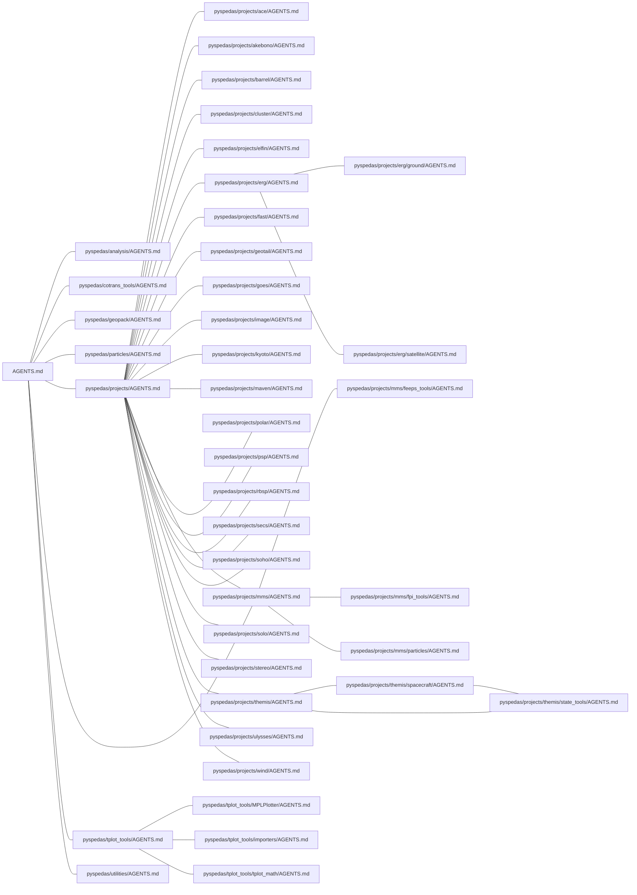

## Paths listed by more than one AGENTS.md

| Path | Listed by |
| --- | --- |
| `.github/workflows/full_coverage.yml` | `pyspedas/geopack/AGENTS.md`, `pyspedas/particles/AGENTS.md`, `pyspedas/projects/akebono/AGENTS.md`, `pyspedas/projects/barrel/AGENTS.md`, `pyspedas/projects/cluster/AGENTS.md`, `pyspedas/projects/elfin/AGENTS.md`, `pyspedas/projects/fast/AGENTS.md`, `pyspedas/projects/geotail/AGENTS.md`, `pyspedas/projects/goes/AGENTS.md`, `pyspedas/projects/image/AGENTS.md`, `pyspedas/projects/maven/AGENTS.md`, `pyspedas/projects/secs/AGENTS.md`, `pyspedas/projects/soho/AGENTS.md`, `pyspedas/projects/solo/AGENTS.md`, `pyspedas/projects/ulysses/AGENTS.md`, `pyspedas/projects/wind/AGENTS.md` |
| `.github/workflows/quick_tests.yml` | `AGENTS.md`, `pyspedas/projects/ace/AGENTS.md`, `pyspedas/projects/kyoto/AGENTS.md`, `pyspedas/projects/polar/AGENTS.md`, `pyspedas/projects/psp/AGENTS.md`, `pyspedas/projects/rbsp/AGENTS.md`, `pyspedas/projects/stereo/AGENTS.md`, `pyspedas/tplot_tools/MPLPlotter/AGENTS.md`, `pyspedas/utilities/AGENTS.md` |
| `pyproject.toml` | `AGENTS.md`, `pyspedas/geopack/AGENTS.md`, `pyspedas/projects/elfin/AGENTS.md`, `pyspedas/projects/secs/AGENTS.md`, `pyspedas/tplot_tools/MPLPlotter/AGENTS.md` |
| `pyspedas/__init__.py` | `AGENTS.md`, `pyspedas/analysis/AGENTS.md`, `pyspedas/cotrans_tools/AGENTS.md`, `pyspedas/geopack/AGENTS.md`, `pyspedas/particles/AGENTS.md`, `pyspedas/projects/AGENTS.md`, `pyspedas/projects/mms/AGENTS.md`, `pyspedas/tplot_tools/AGENTS.md`, `pyspedas/utilities/AGENTS.md` |
| `pyspedas/analysis/tests/test_analysis.py` | `pyspedas/analysis/AGENTS.md`, `pyspedas/tplot_tools/tplot_math/AGENTS.md` |
| `pyspedas/analysis/tinterpol.py` | `pyspedas/analysis/AGENTS.md`, `pyspedas/tplot_tools/tplot_math/AGENTS.md` |
| `pyspedas/config.py` | `pyspedas/analysis/AGENTS.md`, `pyspedas/tplot_tools/MPLPlotter/AGENTS.md`, `pyspedas/utilities/AGENTS.md` |
| `pyspedas/cotrans_tools/cotrans.py` | `pyspedas/cotrans_tools/AGENTS.md`, `pyspedas/geopack/AGENTS.md`, `pyspedas/projects/erg/satellite/AGENTS.md` |
| `pyspedas/cotrans_tools/igrf.py` | `pyspedas/cotrans_tools/AGENTS.md`, `pyspedas/geopack/AGENTS.md` |
| `pyspedas/cotrans_tools/quaternions.py` | `pyspedas/cotrans_tools/AGENTS.md`, `pyspedas/particles/AGENTS.md` |
| `pyspedas/cotrans_tools/xyz_to_polar.py` | `pyspedas/cotrans_tools/AGENTS.md`, `pyspedas/projects/akebono/AGENTS.md` |
| `pyspedas/geopack/igrf.py` | `pyspedas/cotrans_tools/AGENTS.md`, `pyspedas/geopack/AGENTS.md` |
| `pyspedas/particles/moments/spd_pgs_moments.py` | `pyspedas/particles/AGENTS.md`, `pyspedas/projects/erg/satellite/AGENTS.md` |
| `pyspedas/particles/spd_part_products/spd_pgs_regrid.py` | `pyspedas/particles/AGENTS.md`, `pyspedas/projects/erg/satellite/AGENTS.md` |
| `pyspedas/particles/spd_slice2d` | `pyspedas/projects/mms/fpi_tools/AGENTS.md`, `pyspedas/projects/mms/particles/AGENTS.md` |
| `pyspedas/particles/spd_slice2d/quaternions.py` | `pyspedas/cotrans_tools/AGENTS.md`, `pyspedas/particles/AGENTS.md` |
| `pyspedas/preferences.py` | `pyspedas/projects/AGENTS.md`, `pyspedas/projects/ace/AGENTS.md`, `pyspedas/projects/cluster/AGENTS.md`, `pyspedas/projects/elfin/AGENTS.md`, `pyspedas/projects/erg/AGENTS.md`, `pyspedas/projects/maven/AGENTS.md`, `pyspedas/projects/mms/AGENTS.md`, `pyspedas/projects/polar/AGENTS.md`, `pyspedas/projects/psp/AGENTS.md`, `pyspedas/projects/rbsp/AGENTS.md`, `pyspedas/projects/secs/AGENTS.md`, `pyspedas/projects/stereo/AGENTS.md` |
| `pyspedas/projects/cluster/load_csa.py` | `pyspedas/projects/AGENTS.md`, `pyspedas/projects/cluster/AGENTS.md` |
| `pyspedas/projects/erg/__init__.py` | `pyspedas/projects/erg/AGENTS.md`, `pyspedas/projects/erg/ground/AGENTS.md`, `pyspedas/projects/erg/satellite/AGENTS.md` |
| `pyspedas/projects/erg/ground/geomag/gmag_isee_fluxgate.py` | `pyspedas/projects/erg/AGENTS.md`, `pyspedas/projects/erg/ground/AGENTS.md` |
| `pyspedas/projects/erg/satellite/erg/common/cotrans/erg_cotrans.py` | `pyspedas/cotrans_tools/AGENTS.md`, `pyspedas/projects/erg/satellite/AGENTS.md` |
| `pyspedas/projects/erg/satellite/erg/get_gatt_ror.py` | `pyspedas/projects/erg/AGENTS.md`, `pyspedas/projects/erg/ground/AGENTS.md`, `pyspedas/projects/erg/satellite/AGENTS.md` |
| `pyspedas/projects/erg/satellite/erg/load.py` | `pyspedas/projects/erg/AGENTS.md`, `pyspedas/projects/erg/ground/AGENTS.md`, `pyspedas/projects/erg/satellite/AGENTS.md` |
| `pyspedas/projects/erg/satellite/erg/mgf/mgf.py` | `pyspedas/projects/erg/AGENTS.md`, `pyspedas/projects/erg/satellite/AGENTS.md` |
| `pyspedas/projects/erg/satellite/erg/particle/erg_lep_part_products.py` | `pyspedas/particles/AGENTS.md`, `pyspedas/projects/erg/satellite/AGENTS.md` |
| `pyspedas/projects/erg/tests/test_erg_ground.py` | `pyspedas/projects/erg/AGENTS.md`, `pyspedas/projects/erg/ground/AGENTS.md` |
| `pyspedas/projects/goes/load.py` | `pyspedas/projects/goes/AGENTS.md`, `pyspedas/tplot_tools/importers/AGENTS.md` |
| `pyspedas/projects/kyoto/load_dst.py` | `pyspedas/geopack/AGENTS.md`, `pyspedas/projects/kyoto/AGENTS.md` |
| `pyspedas/projects/maven/download_files_utilities.py` | `pyspedas/projects/AGENTS.md`, `pyspedas/projects/maven/AGENTS.md` |
| `pyspedas/projects/maven/maven_load.py` | `pyspedas/projects/maven/AGENTS.md`, `pyspedas/tplot_tools/importers/AGENTS.md` |
| `pyspedas/projects/mms/__init__.py` | `AGENTS.md`, `pyspedas/projects/mms/AGENTS.md` |
| `pyspedas/projects/mms/fpi_tools/mms_get_fpi_dist.py` | `pyspedas/projects/mms/fpi_tools/AGENTS.md`, `pyspedas/projects/mms/particles/AGENTS.md` |
| `pyspedas/projects/mms/fpi_tools/mms_pad_fpi.py` | `pyspedas/particles/AGENTS.md`, `pyspedas/projects/mms/fpi_tools/AGENTS.md`, `pyspedas/projects/mms/particles/AGENTS.md` |
| `pyspedas/projects/mms/mms_load_data.py` | `AGENTS.md`, `pyspedas/projects/AGENTS.md`, `pyspedas/projects/mms/AGENTS.md`, `pyspedas/projects/mms/feeps_tools/AGENTS.md`, `pyspedas/projects/mms/fpi_tools/AGENTS.md` |
| `pyspedas/projects/mms/particles/mms_part_des_photoelectrons.py` | `pyspedas/projects/mms/fpi_tools/AGENTS.md`, `pyspedas/projects/mms/particles/AGENTS.md` |
| `pyspedas/projects/mms/particles/mms_part_products.py` | `pyspedas/particles/AGENTS.md`, `pyspedas/projects/mms/fpi_tools/AGENTS.md`, `pyspedas/projects/mms/particles/AGENTS.md` |
| `pyspedas/projects/mms/particles/mms_part_slice2d.py` | `pyspedas/particles/AGENTS.md`, `pyspedas/projects/mms/fpi_tools/AGENTS.md`, `pyspedas/projects/mms/particles/AGENTS.md` |
| `pyspedas/projects/mms/particles/moka_mms_clean_data.py` | `pyspedas/projects/mms/fpi_tools/AGENTS.md`, `pyspedas/projects/mms/particles/AGENTS.md` |
| `pyspedas/projects/noaa/noaa_load_kp.py` | `pyspedas/geopack/AGENTS.md`, `pyspedas/projects/AGENTS.md`, `pyspedas/projects/kyoto/AGENTS.md` |
| `pyspedas/projects/omni/load.py` | `pyspedas/geopack/AGENTS.md`, `pyspedas/projects/AGENTS.md`, `pyspedas/projects/kyoto/AGENTS.md` |
| `pyspedas/projects/omni/omni_solarwind_load.py` | `pyspedas/cotrans_tools/AGENTS.md`, `pyspedas/projects/AGENTS.md` |
| `pyspedas/projects/poes/load.py` | `pyspedas/projects/AGENTS.md`, `pyspedas/tplot_tools/importers/AGENTS.md` |
| `pyspedas/projects/themis/__init__.py` | `pyspedas/projects/themis/AGENTS.md`, `pyspedas/projects/themis/spacecraft/AGENTS.md`, `pyspedas/projects/themis/state_tools/AGENTS.md` |
| `pyspedas/projects/themis/cotrans/dsl2gse.py` | `pyspedas/projects/themis/spacecraft/AGENTS.md`, `pyspedas/projects/themis/state_tools/AGENTS.md` |
| `pyspedas/projects/themis/load.py` | `AGENTS.md`, `pyspedas/projects/themis/AGENTS.md`, `pyspedas/projects/themis/spacecraft/AGENTS.md`, `pyspedas/projects/themis/state_tools/AGENTS.md` |
| `pyspedas/projects/themis/spacecraft/fields/fgm.py` | `AGENTS.md`, `pyspedas/projects/themis/AGENTS.md`, `pyspedas/projects/themis/spacecraft/AGENTS.md` |
| `pyspedas/projects/themis/state_tools/autoload_support.py` | `pyspedas/projects/themis/spacecraft/AGENTS.md`, `pyspedas/projects/themis/state_tools/AGENTS.md` |
| `pyspedas/projects/themis/state_tools/spinmodel/eclipse_spinmodel_corrections_tensor.py` | `pyspedas/projects/themis/spacecraft/AGENTS.md`, `pyspedas/projects/themis/state_tools/AGENTS.md` |
| `pyspedas/projects/themis/state_tools/spinmodel/eclipse_spinmodel_corrections_vector.py` | `pyspedas/projects/themis/spacecraft/AGENTS.md`, `pyspedas/projects/themis/state_tools/AGENTS.md` |
| `pyspedas/tplot_tools/MPLPlotter/tplot_map.py` | `pyspedas/geopack/AGENTS.md`, `pyspedas/tplot_tools/MPLPlotter/AGENTS.md` |
| `pyspedas/tplot_tools/__init__.py` | `AGENTS.md`, `pyspedas/tplot_tools/AGENTS.md`, `pyspedas/tplot_tools/MPLPlotter/AGENTS.md`, `pyspedas/tplot_tools/tplot_math/AGENTS.md` |
| `pyspedas/tplot_tools/data_att_getters_setters.py` | `pyspedas/cotrans_tools/AGENTS.md`, `pyspedas/tplot_tools/AGENTS.md`, `pyspedas/tplot_tools/importers/AGENTS.md` |
| `pyspedas/tplot_tools/exporters/tplot_save.py` | `pyspedas/tplot_tools/AGENTS.md`, `pyspedas/tplot_tools/importers/AGENTS.md` |
| `pyspedas/tplot_tools/get_data.py` | `AGENTS.md`, `pyspedas/tplot_tools/AGENTS.md` |
| `pyspedas/tplot_tools/importers/cdf_to_tplot.py` | `AGENTS.md`, `pyspedas/projects/AGENTS.md`, `pyspedas/projects/erg/AGENTS.md`, `pyspedas/projects/mms/AGENTS.md`, `pyspedas/projects/themis/AGENTS.md`, `pyspedas/projects/themis/spacecraft/AGENTS.md`, `pyspedas/tplot_tools/importers/AGENTS.md` |
| `pyspedas/tplot_tools/importers/netcdf_to_tplot.py` | `pyspedas/projects/AGENTS.md`, `pyspedas/projects/goes/AGENTS.md`, `pyspedas/tplot_tools/importers/AGENTS.md` |
| `pyspedas/tplot_tools/importers/sts_to_tplot.py` | `pyspedas/projects/AGENTS.md`, `pyspedas/tplot_tools/importers/AGENTS.md` |
| `pyspedas/tplot_tools/importers/tplot_restore.py` | `pyspedas/tplot_tools/AGENTS.md`, `pyspedas/tplot_tools/importers/AGENTS.md` |
| `pyspedas/tplot_tools/options.py` | `pyspedas/tplot_tools/AGENTS.md`, `pyspedas/tplot_tools/importers/AGENTS.md` |
| `pyspedas/tplot_tools/spedas_colorbar.py` | `pyspedas/tplot_tools/AGENTS.md`, `pyspedas/tplot_tools/MPLPlotter/AGENTS.md` |
| `pyspedas/tplot_tools/store_data.py` | `AGENTS.md`, `pyspedas/tplot_tools/AGENTS.md`, `pyspedas/tplot_tools/importers/AGENTS.md` |
| `pyspedas/tplot_tools/time_double.py` | `pyspedas/tplot_tools/AGENTS.md`, `pyspedas/utilities/AGENTS.md` |
| `pyspedas/tplot_tools/time_string.py` | `pyspedas/tplot_tools/AGENTS.md`, `pyspedas/utilities/AGENTS.md` |
| `pyspedas/tplot_tools/timebar.py` | `pyspedas/tplot_tools/AGENTS.md`, `pyspedas/tplot_tools/MPLPlotter/AGENTS.md` |
| `pyspedas/tplot_tools/tplot_math/makegap.py` | `pyspedas/tplot_tools/MPLPlotter/AGENTS.md`, `pyspedas/tplot_tools/tplot_math/AGENTS.md` |
| `pyspedas/tplot_tools/tplot_math/time_clip.py` | `pyspedas/projects/AGENTS.md`, `pyspedas/tplot_tools/tplot_math/AGENTS.md` |
| `pyspedas/tplot_tools/tplot_rename.py` | `AGENTS.md`, `pyspedas/tplot_tools/AGENTS.md` |
| `pyspedas/utilities/config_testing.py` | `pyspedas/analysis/AGENTS.md`, `pyspedas/utilities/AGENTS.md` |
| `pyspedas/utilities/dailynames.py` | `AGENTS.md`, `pyspedas/projects/AGENTS.md`, `pyspedas/projects/erg/AGENTS.md`, `pyspedas/projects/mms/AGENTS.md`, `pyspedas/projects/themis/AGENTS.md`, `pyspedas/utilities/AGENTS.md` |
| `pyspedas/utilities/datasets.py` | `pyspedas/projects/AGENTS.md`, `pyspedas/projects/ace/AGENTS.md`, `pyspedas/projects/cluster/AGENTS.md`, `pyspedas/projects/fast/AGENTS.md`, `pyspedas/projects/geotail/AGENTS.md`, `pyspedas/projects/image/AGENTS.md`, `pyspedas/projects/polar/AGENTS.md`, `pyspedas/projects/rbsp/AGENTS.md`, `pyspedas/projects/solo/AGENTS.md`, `pyspedas/projects/stereo/AGENTS.md`, `pyspedas/projects/ulysses/AGENTS.md`, `pyspedas/projects/wind/AGENTS.md`, `pyspedas/utilities/AGENTS.md` |
| `pyspedas/utilities/download.py` | `AGENTS.md`, `pyspedas/projects/AGENTS.md`, `pyspedas/projects/cluster/AGENTS.md`, `pyspedas/projects/erg/AGENTS.md`, `pyspedas/projects/kyoto/AGENTS.md`, `pyspedas/projects/mms/AGENTS.md`, `pyspedas/projects/psp/AGENTS.md`, `pyspedas/projects/themis/AGENTS.md`, `pyspedas/projects/wind/AGENTS.md`, `pyspedas/utilities/AGENTS.md` |
| `pyspedas/utilities/pyspedas_functools.py` | `pyspedas/projects/AGENTS.md`, `pyspedas/projects/fast/AGENTS.md`, `pyspedas/projects/goes/AGENTS.md`, `pyspedas/utilities/AGENTS.md` |
| `pyspedas/utilities/tcopy.py` | `pyspedas/tplot_tools/AGENTS.md`, `pyspedas/utilities/AGENTS.md` |
| `pyspedas/utilities/tests/test_math.py` | `pyspedas/tplot_tools/AGENTS.md`, `pyspedas/tplot_tools/tplot_math/AGENTS.md` |
| `pyspedas/utilities/tests/test_utilities_plot.py` | `pyspedas/tplot_tools/AGENTS.md`, `pyspedas/tplot_tools/MPLPlotter/AGENTS.md` |
| `pyspedas/utilities/time_interpolate.py` | `pyspedas/analysis/AGENTS.md`, `pyspedas/tplot_tools/tplot_math/AGENTS.md`, `pyspedas/utilities/AGENTS.md` |

## `AGENTS.md`

Parent: none. Children: `pyspedas/analysis/AGENTS.md`, `pyspedas/cotrans_tools/AGENTS.md`, `pyspedas/geopack/AGENTS.md`, `pyspedas/particles/AGENTS.md`, `pyspedas/projects/AGENTS.md`, `pyspedas/tplot_tools/AGENTS.md`, `pyspedas/utilities/AGENTS.md`.

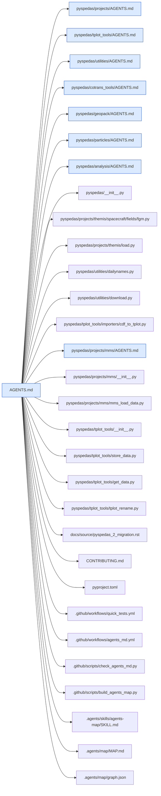

## `pyspedas/analysis/AGENTS.md`

Parent: `AGENTS.md`. Children: none.

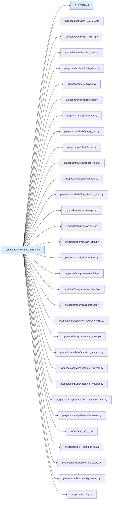

## `pyspedas/cotrans_tools/AGENTS.md`

Parent: `AGENTS.md`. Children: none.

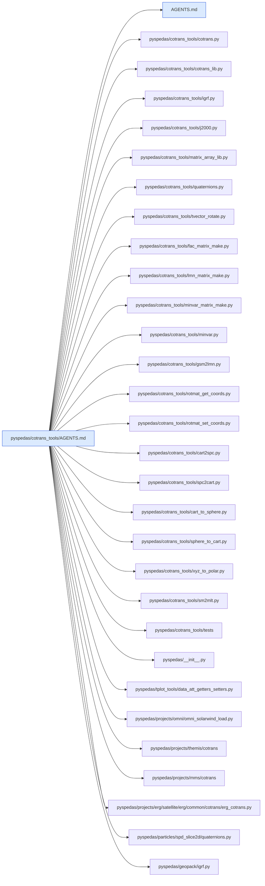

## `pyspedas/geopack/AGENTS.md`

Parent: `AGENTS.md`. Children: none.

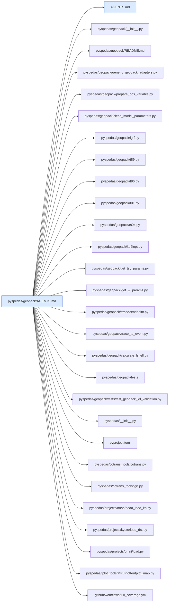

## `pyspedas/particles/AGENTS.md`

Parent: `AGENTS.md`. Children: none.

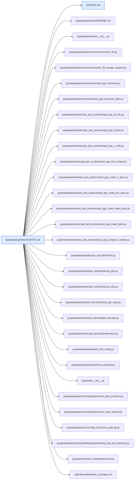

## `pyspedas/projects/AGENTS.md`

Parent: `AGENTS.md`. Children: `pyspedas/projects/ace/AGENTS.md`, `pyspedas/projects/akebono/AGENTS.md`, `pyspedas/projects/barrel/AGENTS.md`, `pyspedas/projects/cluster/AGENTS.md`, `pyspedas/projects/elfin/AGENTS.md`, `pyspedas/projects/erg/AGENTS.md`, `pyspedas/projects/fast/AGENTS.md`, `pyspedas/projects/geotail/AGENTS.md`, `pyspedas/projects/goes/AGENTS.md`, `pyspedas/projects/image/AGENTS.md`, `pyspedas/projects/kyoto/AGENTS.md`, `pyspedas/projects/maven/AGENTS.md`, `pyspedas/projects/mms/AGENTS.md`, `pyspedas/projects/polar/AGENTS.md`, `pyspedas/projects/psp/AGENTS.md`, `pyspedas/projects/rbsp/AGENTS.md`, `pyspedas/projects/secs/AGENTS.md`, `pyspedas/projects/soho/AGENTS.md`, `pyspedas/projects/solo/AGENTS.md`, `pyspedas/projects/stereo/AGENTS.md`, `pyspedas/projects/themis/AGENTS.md`, `pyspedas/projects/ulysses/AGENTS.md`, `pyspedas/projects/wind/AGENTS.md`.

```mermaid
graph LR
  classDef agents fill:#dbeafe,stroke:#1d4ed8
  classDef missing fill:#fee2e2,stroke:#b91c1c,stroke-dasharray:4
  self["pyspedas/projects/AGENTS.md"]:::agents
  self --> r0["AGENTS.md"]:::agents
  self --> r1["pyspedas/projects/ace/AGENTS.md"]:::agents
  self --> r2["pyspedas/projects/akebono/AGENTS.md"]:::agents
  self --> r3["pyspedas/projects/barrel/AGENTS.md"]:::agents
  self --> r4["pyspedas/projects/cluster/AGENTS.md"]:::agents
  self --> r5["pyspedas/projects/elfin/AGENTS.md"]:::agents
  self --> r6["pyspedas/projects/erg/AGENTS.md"]:::agents
  self --> r7["pyspedas/projects/fast/AGENTS.md"]:::agents
  self --> r8["pyspedas/projects/geotail/AGENTS.md"]:::agents
  self --> r9["pyspedas/projects/goes/AGENTS.md"]:::agents
  self --> r10["pyspedas/projects/image/AGENTS.md"]:::agents
  self --> r11["pyspedas/projects/kyoto/AGENTS.md"]:::agents
  self --> r12["pyspedas/projects/maven/AGENTS.md"]:::agents
  self --> r13["pyspedas/projects/mms/AGENTS.md"]:::agents
  self --> r14["pyspedas/projects/polar/AGENTS.md"]:::agents
  self --> r15["pyspedas/projects/psp/AGENTS.md"]:::agents
  self --> r16["pyspedas/projects/rbsp/AGENTS.md"]:::agents
  self --> r17["pyspedas/projects/secs/AGENTS.md"]:::agents
  self --> r18["pyspedas/projects/soho/AGENTS.md"]:::agents
  self --> r19["pyspedas/projects/solo/AGENTS.md"]:::agents
  self --> r20["pyspedas/projects/stereo/AGENTS.md"]:::agents
  self --> r21["pyspedas/projects/themis/AGENTS.md"]:::agents
  self --> r22["pyspedas/projects/ulysses/AGENTS.md"]:::agents
  self --> r23["pyspedas/projects/wind/AGENTS.md"]:::agents
  self --> r24["pyspedas/projects/swfo/load.py"]
  self --> r25["pyspedas/projects/swfo/config.py"]
  self --> r26["pyspedas/projects/swfo/__init__.py"]
  self --> r27["pyspedas/projects/swfo/README.md"]
  self --> r28["pyspedas/projects/__init__.py"]
  self --> r29["pyspedas/projects/cnofs/load.py"]
  self --> r30["pyspedas/projects/de2/__init__.py"]
  self --> r31["pyspedas/projects/galileo/load.py"]
  self --> r32["pyspedas/projects/juno/load.py"]
  self --> r33["pyspedas/projects/kompsat/load.py"]
  self --> r34["pyspedas/projects/kompsat/esa_hapi_data.py"]
  self --> r35["pyspedas/projects/mica/load.py"]
  self --> r36["pyspedas/projects/noaa/noaa_load_kp.py"]
  self --> r37["pyspedas/projects/omni/load.py"]
  self --> r38["pyspedas/projects/omni/omni_solarwind_load.py"]
  self --> r39["pyspedas/projects/poes/load.py"]
  self --> r40["pyspedas/projects/swarm/load.py"]
  self --> r41["pyspedas/projects/mms/mms_load_data.py"]
  self --> r42["pyspedas/projects/maven/download_files_utilities.py"]
  self --> r43["pyspedas/projects/cluster/load_csa.py"]
  self --> r44["pyspedas/preferences.py"]
  self --> r45["pyspedas/__init__.py"]
  self --> r46["pyspedas/utilities/dailynames.py"]
  self --> r47["pyspedas/utilities/download.py"]
  self --> r48["pyspedas/utilities/datasets.py"]
  self --> r49["pyspedas/utilities/pyspedas_functools.py"]
  self --> r50["pyspedas/utilities/das2"]
  self --> r51["pyspedas/hapi_tools/hapi.py"]
  self --> r52["pyspedas/tplot_tools/importers/cdf_to_tplot.py"]
  self --> r53["pyspedas/tplot_tools/importers/netcdf_to_tplot.py"]
  self --> r54["pyspedas/tplot_tools/importers/sts_to_tplot.py"]
  self --> r55["pyspedas/tplot_tools/tplot_math/time_clip.py"]
```

## `pyspedas/projects/ace/AGENTS.md`

Parent: `pyspedas/projects/AGENTS.md`. Children: none.

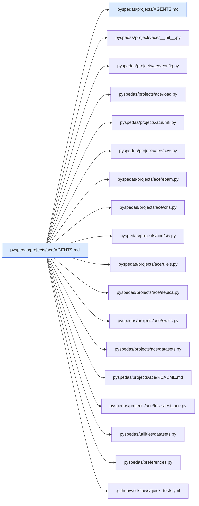

## `pyspedas/projects/akebono/AGENTS.md`

Parent: `pyspedas/projects/AGENTS.md`. Children: none.

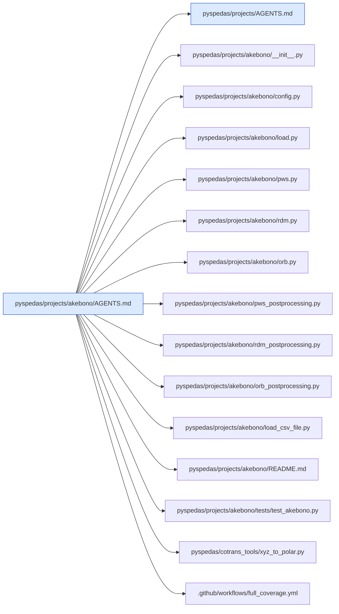

## `pyspedas/projects/barrel/AGENTS.md`

Parent: `pyspedas/projects/AGENTS.md`. Children: none.

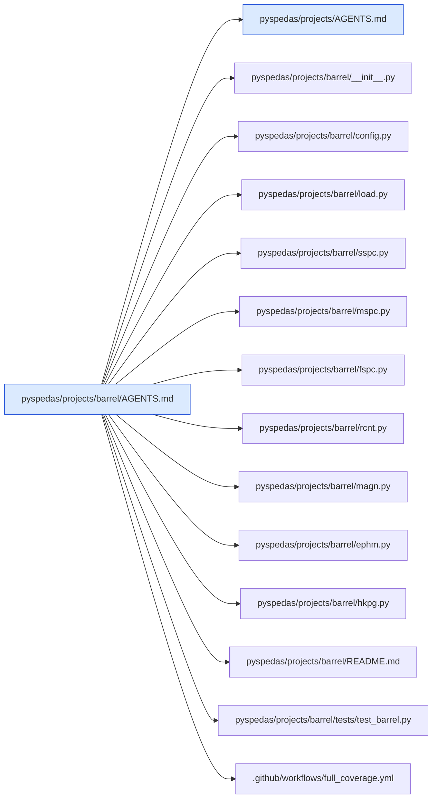

## `pyspedas/projects/cluster/AGENTS.md`

Parent: `pyspedas/projects/AGENTS.md`. Children: none.

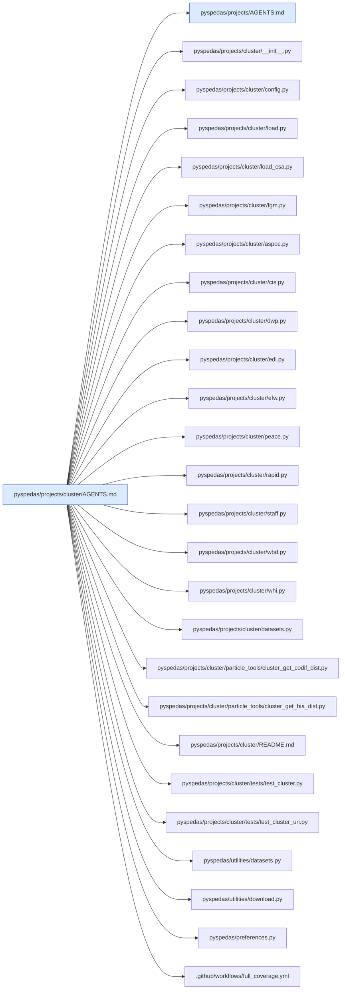

## `pyspedas/projects/elfin/AGENTS.md`

Parent: `pyspedas/projects/AGENTS.md`. Children: none.

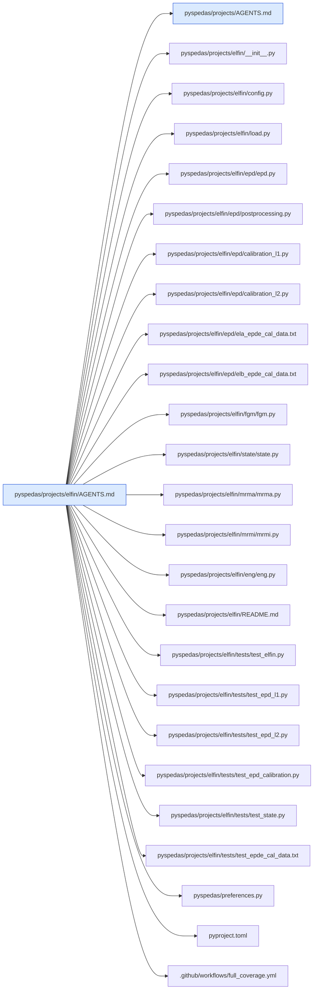

## `pyspedas/projects/erg/AGENTS.md`

Parent: `pyspedas/projects/AGENTS.md`. Children: `pyspedas/projects/erg/ground/AGENTS.md`, `pyspedas/projects/erg/satellite/AGENTS.md`.

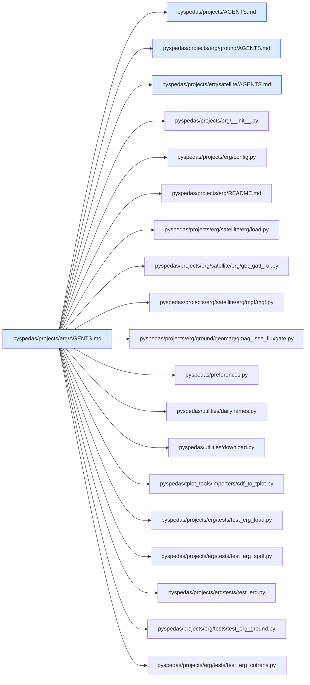

## `pyspedas/projects/erg/ground/AGENTS.md`

Parent: `pyspedas/projects/erg/AGENTS.md`. Children: none.

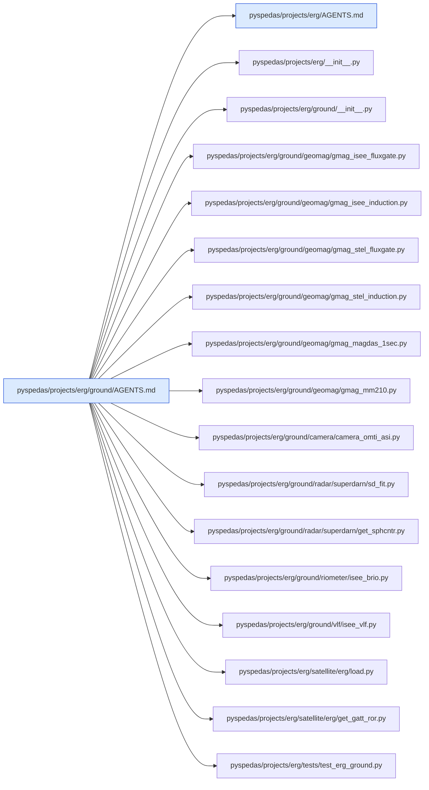

## `pyspedas/projects/erg/satellite/AGENTS.md`

Parent: `pyspedas/projects/erg/AGENTS.md`. Children: none.

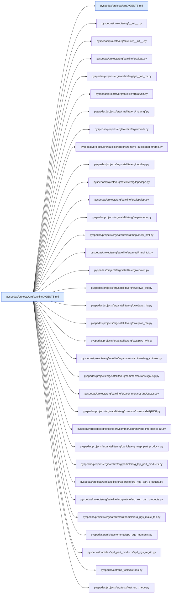

## `pyspedas/projects/fast/AGENTS.md`

Parent: `pyspedas/projects/AGENTS.md`. Children: none.

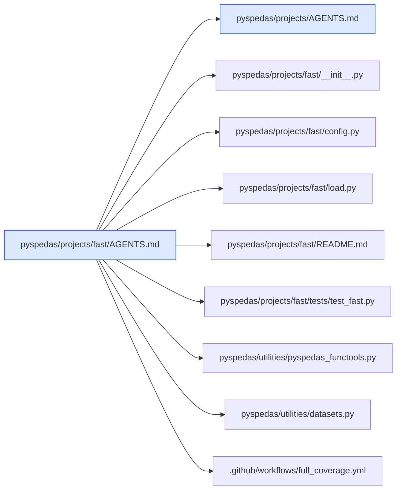

## `pyspedas/projects/geotail/AGENTS.md`

Parent: `pyspedas/projects/AGENTS.md`. Children: none.

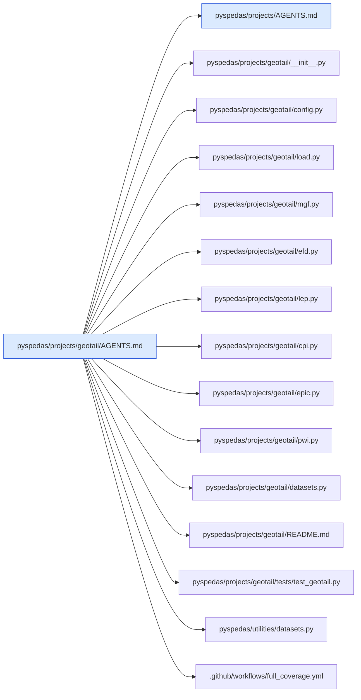

## `pyspedas/projects/goes/AGENTS.md`

Parent: `pyspedas/projects/AGENTS.md`. Children: none.

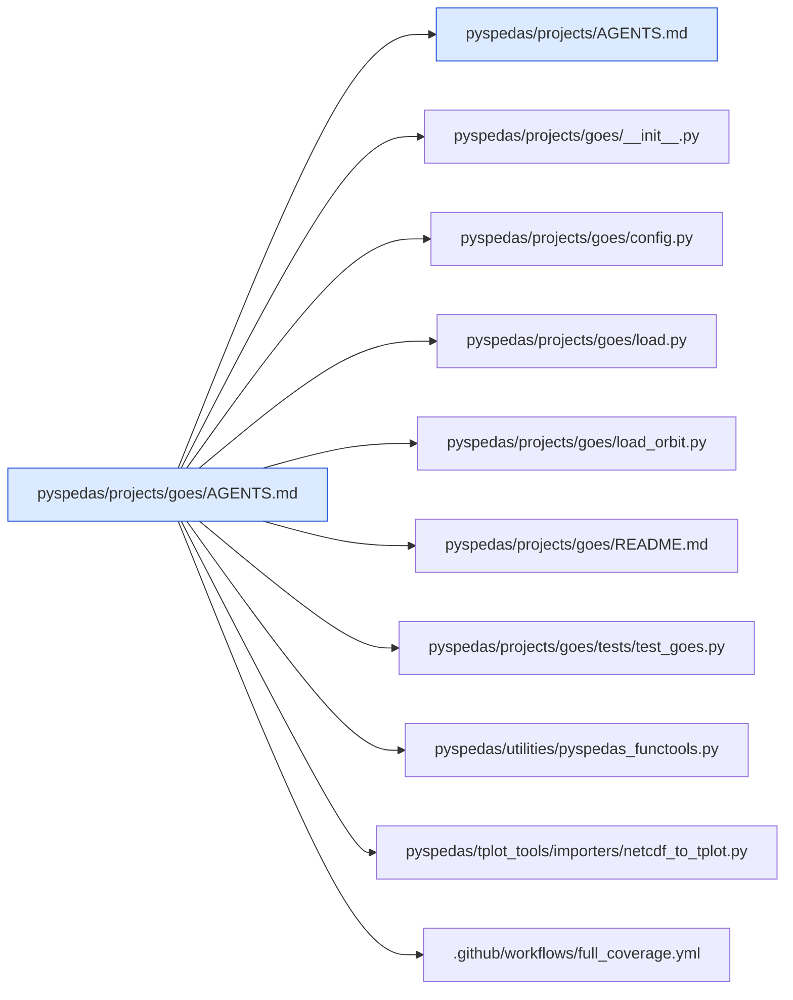

## `pyspedas/projects/image/AGENTS.md`

Parent: `pyspedas/projects/AGENTS.md`. Children: none.

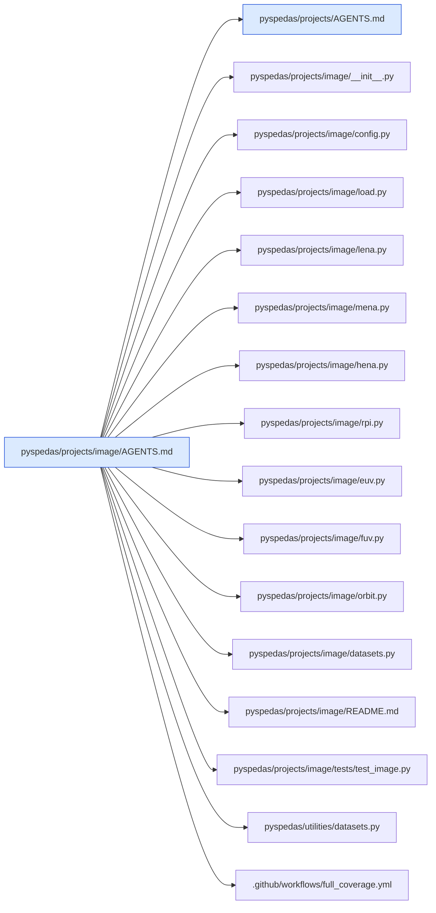

## `pyspedas/projects/kyoto/AGENTS.md`

Parent: `pyspedas/projects/AGENTS.md`. Children: none.

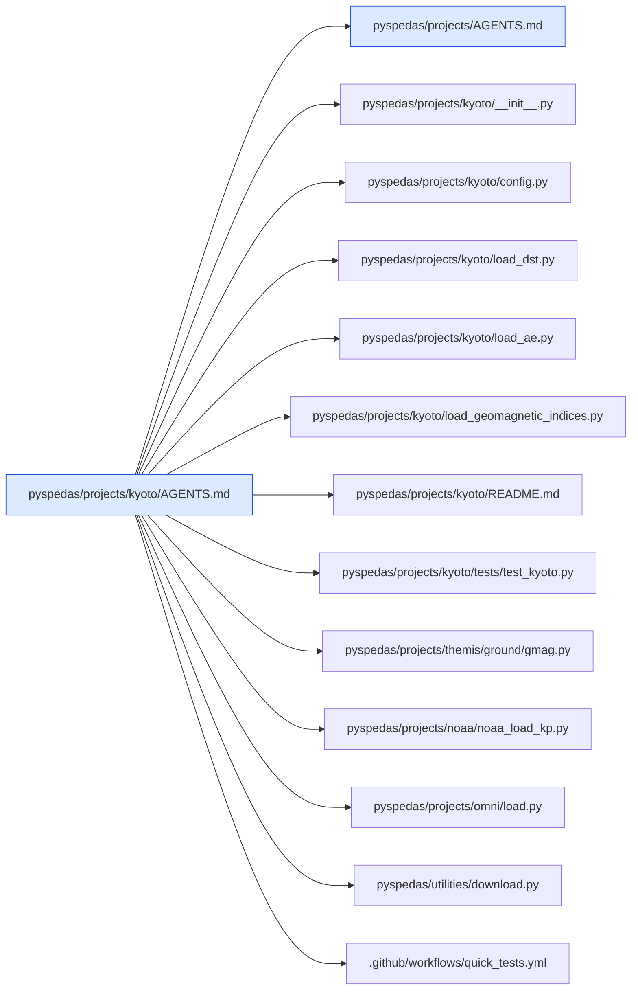

## `pyspedas/projects/maven/AGENTS.md`

Parent: `pyspedas/projects/AGENTS.md`. Children: none.

```mermaid
graph LR
  classDef agents fill:#dbeafe,stroke:#1d4ed8
  classDef missing fill:#fee2e2,stroke:#b91c1c,stroke-dasharray:4
  self["pyspedas/projects/maven/AGENTS.md"]:::agents
  self --> r0["pyspedas/projects/AGENTS.md"]:::agents
  self --> r1["pyspedas/projects/maven/__init__.py"]
  self --> r2["pyspedas/projects/maven/config.py"]
  self --> r3["pyspedas/projects/maven/maven_load.py"]
  self --> r4["pyspedas/projects/maven/download_files_utilities.py"]
  self --> r5["pyspedas/projects/maven/file_regex.py"]
  self --> r6["pyspedas/projects/maven/orbit_time.py"]
  self --> r7["pyspedas/projects/maven/maven_kp_to_tplot.py"]
  self --> r8["pyspedas/projects/maven/read_iuvs_file.py"]
  self --> r9["pyspedas/projects/maven/read_iuvs_file_unused_modes.py"]
  self --> r10["pyspedas/projects/maven/utilities.py"]
  self --> r11["pyspedas/projects/maven/kp_utilities.py"]
  self --> r12["pyspedas/projects/maven/interp_utilities.py"]
  self --> r13["pyspedas/projects/maven/list_utilities.py"]
  self --> r14["pyspedas/projects/maven/access.txt"]
  self --> r15["pyspedas/projects/maven/mag.py"]
  self --> r16["pyspedas/projects/maven/swea.py"]
  self --> r17["pyspedas/projects/maven/swia.py"]
  self --> r18["pyspedas/projects/maven/sta.py"]
  self --> r19["pyspedas/projects/maven/sep.py"]
  self --> r20["pyspedas/projects/maven/lpw.py"]
  self --> r21["pyspedas/projects/maven/euv.py"]
  self --> r22["pyspedas/projects/maven/iuv.py"]
  self --> r23["pyspedas/projects/maven/ngi.py"]
  self --> r24["pyspedas/projects/maven/rse.py"]
  self --> r25["pyspedas/projects/maven/kp.py"]
  self --> r26["pyspedas/projects/maven/spdf/__init__.py"]
  self --> r27["pyspedas/projects/maven/spdf/load.py"]
  self --> r28["pyspedas/projects/maven/spdf/config.py"]
  self --> r29["pyspedas/projects/maven/spdf/README.md"]
  self --> r30["pyspedas/projects/maven/README.md"]
  self --> r31["pyspedas/projects/maven/tests/test_maven.py"]
  self --> r32["pyspedas/projects/maven/tests/test_maven_uri.py"]
  self --> r33["pyspedas/preferences.py"]
  self --> r34[".github/workflows/full_coverage.yml"]
```

## `pyspedas/projects/mms/AGENTS.md`

Parent: `pyspedas/projects/AGENTS.md`. Children: `pyspedas/projects/mms/feeps_tools/AGENTS.md`, `pyspedas/projects/mms/fpi_tools/AGENTS.md`, `pyspedas/projects/mms/particles/AGENTS.md`.

```mermaid
graph LR
  classDef agents fill:#dbeafe,stroke:#1d4ed8
  classDef missing fill:#fee2e2,stroke:#b91c1c,stroke-dasharray:4
  self["pyspedas/projects/mms/AGENTS.md"]:::agents
  self --> r0["pyspedas/projects/AGENTS.md"]:::agents
  self --> r1["pyspedas/projects/mms/feeps_tools/AGENTS.md"]:::agents
  self --> r2["pyspedas/projects/mms/fpi_tools/AGENTS.md"]:::agents
  self --> r3["pyspedas/projects/mms/particles/AGENTS.md"]:::agents
  self --> r4["pyspedas/projects/mms/__init__.py"]
  self --> r5["pyspedas/projects/mms/config.py"]
  self --> r6["pyspedas/projects/mms/mms_load_data.py"]
  self --> r7["pyspedas/projects/mms/mms_load_data_spdf.py"]
  self --> r8["pyspedas/projects/mms/mms_login_lasp.py"]
  self --> r9["pyspedas/projects/mms/mms_files_in_interval.py"]
  self --> r10["pyspedas/projects/mms/mms_get_local_files.py"]
  self --> r11["pyspedas/projects/mms/mms_file_filter.py"]
  self --> r12["pyspedas/projects/mms/fgm_tools/fgm.py"]
  self --> r13["pyspedas/projects/mms/mec_ascii/state.py"]
  self --> r14["pyspedas/projects/mms/databar_tools/spd_mms_load_bss.py"]
  self --> r15["pyspedas/projects/mms/deprecated/mms_load_fast_segments.py"]
  self --> r16["pyspedas/projects/mms/mms_orbit_plot.py"]
  self --> r17["pyspedas/projects/mms/mms_events.py"]
  self --> r18["pyspedas/projects/mms/print_vars.py"]
  self --> r19["pyspedas/projects/mms/mms_python_startup.py"]
  self --> r20["pyspedas/projects/mms/README.md"]
  self --> r21["pyspedas/projects/mms/tests/test_mms_login_lasp.py"]
  self --> r22["pyspedas/__init__.py"]
  self --> r23["pyspedas/preferences.py"]
  self --> r24["pyspedas/utilities/dailynames.py"]
  self --> r25["pyspedas/utilities/download.py"]
  self --> r26["pyspedas/tplot_tools/importers/cdf_to_tplot.py"]
```

## `pyspedas/projects/mms/feeps_tools/AGENTS.md`

Parent: `pyspedas/projects/mms/AGENTS.md`. Children: none.

```mermaid
graph LR
  classDef agents fill:#dbeafe,stroke:#1d4ed8
  classDef missing fill:#fee2e2,stroke:#b91c1c,stroke-dasharray:4
  self["pyspedas/projects/mms/feeps_tools/AGENTS.md"]:::agents
  self --> r0["pyspedas/projects/mms/AGENTS.md"]:::agents
  self --> r1["pyspedas/projects/mms/feeps_tools/feeps.py"]
  self --> r2["pyspedas/projects/mms/feeps_tools/mms_feeps_correct_energies.py"]
  self --> r3["pyspedas/projects/mms/feeps_tools/mms_feeps_energy_table.py"]
  self --> r4["pyspedas/projects/mms/feeps_tools/mms_feeps_flat_field_corrections.py"]
  self --> r5["pyspedas/projects/mms/feeps_tools/mms_feeps_remove_bad_data.py"]
  self --> r6["pyspedas/projects/mms/feeps_tools/mms_feeps_active_eyes.py"]
  self --> r7["pyspedas/projects/mms/feeps_tools/mms_feeps_split_integral_ch.py"]
  self --> r8["pyspedas/projects/mms/feeps_tools/mms_feeps_remove_sun.py"]
  self --> r9["pyspedas/projects/mms/feeps_tools/mms_read_feeps_sector_masks_csv.py"]
  self --> r10["pyspedas/projects/mms/feeps_tools/mms_feeps_omni.py"]
  self --> r11["pyspedas/projects/mms/feeps_tools/mms_feeps_spin_avg.py"]
  self --> r12["pyspedas/projects/mms/feeps_tools/mms_feeps_pad.py"]
  self --> r13["pyspedas/projects/mms/feeps_tools/mms_feeps_pad_spinavg.py"]
  self --> r14["pyspedas/projects/mms/feeps_tools/mms_feeps_pitch_angles.py"]
  self --> r15["pyspedas/projects/mms/feeps_tools/mms_feeps_gpd.py"]
  self --> r16["pyspedas/projects/mms/feeps_tools/mms_feeps_getgyrophase.py"]
  self --> r17["pyspedas/projects/mms/feeps_tools/sun"]
  self --> r18["pyspedas/projects/mms/mms_load_data.py"]
  self --> r19["pyspedas/projects/mms/tests/test_mms_feeps.py"]
```

## `pyspedas/projects/mms/fpi_tools/AGENTS.md`

Parent: `pyspedas/projects/mms/AGENTS.md`. Children: none.

```mermaid
graph LR
  classDef agents fill:#dbeafe,stroke:#1d4ed8
  classDef missing fill:#fee2e2,stroke:#b91c1c,stroke-dasharray:4
  self["pyspedas/projects/mms/fpi_tools/AGENTS.md"]:::agents
  self --> r0["pyspedas/projects/mms/AGENTS.md"]:::agents
  self --> r1["pyspedas/projects/mms/fpi_tools/fpi.py"]
  self --> r2["pyspedas/projects/mms/fpi_tools/mms_fpi_set_metadata.py"]
  self --> r3["pyspedas/projects/mms/fpi_tools/mms_load_fpi_calc_pad.py"]
  self --> r4["pyspedas/projects/mms/fpi_tools/mms_fpi_make_errorflagbars.py"]
  self --> r5["pyspedas/projects/mms/fpi_tools/mms_fpi_make_compressionlossbars.py"]
  self --> r6["pyspedas/projects/mms/fpi_tools/mms_get_fpi_dist.py"]
  self --> r7["pyspedas/projects/mms/fpi_tools/mms_pad_fpi.py"]
  self --> r8["pyspedas/projects/mms/fpi_tools/mms_fpi_ang_ang.py"]
  self --> r9["pyspedas/projects/mms/fpi_tools/mms_fpi_split_tensor.py"]
  self --> r10["pyspedas/projects/mms/mms_load_data.py"]
  self --> r11["pyspedas/projects/mms/particles/mms_part_products.py"]
  self --> r12["pyspedas/projects/mms/particles/mms_part_slice2d.py"]
  self --> r13["pyspedas/projects/mms/particles/moka_mms_clean_data.py"]
  self --> r14["pyspedas/projects/mms/particles/mms_part_des_photoelectrons.py"]
  self --> r15["pyspedas/particles/spd_slice2d"]
  self --> r16["pyspedas/projects/mms/tests/test_mms_fpi.py"]
```

## `pyspedas/projects/mms/particles/AGENTS.md`

Parent: `pyspedas/projects/mms/AGENTS.md`. Children: none.

```mermaid
graph LR
  classDef agents fill:#dbeafe,stroke:#1d4ed8
  classDef missing fill:#fee2e2,stroke:#b91c1c,stroke-dasharray:4
  self["pyspedas/projects/mms/particles/AGENTS.md"]:::agents
  self --> r0["pyspedas/projects/mms/AGENTS.md"]:::agents
  self --> r1["pyspedas/projects/mms/particles/__init__.py"]
  self --> r2["pyspedas/projects/mms/particles/mms_part_getspec.py"]
  self --> r3["pyspedas/projects/mms/particles/mms_part_products.py"]
  self --> r4["pyspedas/projects/mms/particles/mms_part_slice2d.py"]
  self --> r5["pyspedas/projects/mms/particles/mms_convert_flux_units.py"]
  self --> r6["pyspedas/projects/mms/particles/mms_pgs_clean_data.py"]
  self --> r7["pyspedas/projects/mms/particles/mms_pgs_clean_support.py"]
  self --> r8["pyspedas/projects/mms/particles/mms_pgs_make_e_spec.py"]
  self --> r9["pyspedas/projects/mms/particles/mms_pgs_make_theta_spec.py"]
  self --> r10["pyspedas/projects/mms/particles/mms_pgs_make_phi_spec.py"]
  self --> r11["pyspedas/projects/mms/particles/mms_pgs_make_fac.py"]
  self --> r12["pyspedas/projects/mms/particles/mms_pgs_split_hpca.py"]
  self --> r13["pyspedas/projects/mms/particles/mms_part_des_photoelectrons.py"]
  self --> r14["pyspedas/projects/mms/particles/moka_mms_clean_data.py"]
  self --> r15["pyspedas/projects/mms/fpi_tools/mms_get_fpi_dist.py"]
  self --> r16["pyspedas/projects/mms/fpi_tools/mms_pad_fpi.py"]
  self --> r17["pyspedas/projects/mms/hpca_tools/mms_get_hpca_dist.py"]
  self --> r18["pyspedas/particles/spd_part_products"]
  self --> r19["pyspedas/particles/moments"]
  self --> r20["pyspedas/particles/spd_slice2d"]
  self --> r21["pyspedas/projects/mms/tests/test_mms_part_getspec.py"]
  self --> r22["pyspedas/projects/mms/tests/test_mms_getspec_bulkv.py"]
  self --> r23["pyspedas/projects/mms/tests/test_mms_slice2d.py"]
```

## `pyspedas/projects/polar/AGENTS.md`

Parent: `pyspedas/projects/AGENTS.md`. Children: none.

```mermaid
graph LR
  classDef agents fill:#dbeafe,stroke:#1d4ed8
  classDef missing fill:#fee2e2,stroke:#b91c1c,stroke-dasharray:4
  self["pyspedas/projects/polar/AGENTS.md"]:::agents
  self --> r0["pyspedas/projects/AGENTS.md"]:::agents
  self --> r1["pyspedas/projects/polar/__init__.py"]
  self --> r2["pyspedas/projects/polar/config.py"]
  self --> r3["pyspedas/projects/polar/load.py"]
  self --> r4["pyspedas/projects/polar/mfe.py"]
  self --> r5["pyspedas/projects/polar/efi.py"]
  self --> r6["pyspedas/projects/polar/pwi.py"]
  self --> r7["pyspedas/projects/polar/hydra.py"]
  self --> r8["pyspedas/projects/polar/tide.py"]
  self --> r9["pyspedas/projects/polar/timas.py"]
  self --> r10["pyspedas/projects/polar/cammice.py"]
  self --> r11["pyspedas/projects/polar/ceppad.py"]
  self --> r12["pyspedas/projects/polar/uvi.py"]
  self --> r13["pyspedas/projects/polar/vis.py"]
  self --> r14["pyspedas/projects/polar/pixie.py"]
  self --> r15["pyspedas/projects/polar/orbit.py"]
  self --> r16["pyspedas/projects/polar/datasets.py"]
  self --> r17["pyspedas/projects/polar/README.md"]
  self --> r18["pyspedas/projects/polar/tests/test_polar.py"]
  self --> r19["pyspedas/utilities/datasets.py"]
  self --> r20["pyspedas/preferences.py"]
  self --> r21[".github/workflows/quick_tests.yml"]
```

## `pyspedas/projects/psp/AGENTS.md`

Parent: `pyspedas/projects/AGENTS.md`. Children: none.

```mermaid
graph LR
  classDef agents fill:#dbeafe,stroke:#1d4ed8
  classDef missing fill:#fee2e2,stroke:#b91c1c,stroke-dasharray:4
  self["pyspedas/projects/psp/AGENTS.md"]:::agents
  self --> r0["pyspedas/projects/AGENTS.md"]:::agents
  self --> r1["pyspedas/projects/psp/__init__.py"]
  self --> r2["pyspedas/projects/psp/config.py"]
  self --> r3["pyspedas/projects/psp/load.py"]
  self --> r4["pyspedas/projects/psp/fields.py"]
  self --> r5["pyspedas/projects/psp/spc.py"]
  self --> r6["pyspedas/projects/psp/spe.py"]
  self --> r7["pyspedas/projects/psp/spi.py"]
  self --> r8["pyspedas/projects/psp/epihi.py"]
  self --> r9["pyspedas/projects/psp/epilo.py"]
  self --> r10["pyspedas/projects/psp/epi.py"]
  self --> r11["pyspedas/projects/psp/rfs.py"]
  self --> r12["pyspedas/projects/psp/filter.py"]
  self --> r13["pyspedas/projects/psp/README.md"]
  self --> r14["pyspedas/projects/psp/tests/test_psp.py"]
  self --> r15["pyspedas/utilities/download.py"]
  self --> r16["pyspedas/preferences.py"]
  self --> r17[".github/workflows/quick_tests.yml"]
```

## `pyspedas/projects/rbsp/AGENTS.md`

Parent: `pyspedas/projects/AGENTS.md`. Children: none.

```mermaid
graph LR
  classDef agents fill:#dbeafe,stroke:#1d4ed8
  classDef missing fill:#fee2e2,stroke:#b91c1c,stroke-dasharray:4
  self["pyspedas/projects/rbsp/AGENTS.md"]:::agents
  self --> r0["pyspedas/projects/AGENTS.md"]:::agents
  self --> r1["pyspedas/projects/rbsp/__init__.py"]
  self --> r2["pyspedas/projects/rbsp/config.py"]
  self --> r3["pyspedas/projects/rbsp/load.py"]
  self --> r4["pyspedas/projects/rbsp/emfisis.py"]
  self --> r5["pyspedas/projects/rbsp/efw.py"]
  self --> r6["pyspedas/projects/rbsp/rbspice.py"]
  self --> r7["pyspedas/projects/rbsp/mageis.py"]
  self --> r8["pyspedas/projects/rbsp/hope.py"]
  self --> r9["pyspedas/projects/rbsp/rept.py"]
  self --> r10["pyspedas/projects/rbsp/rps.py"]
  self --> r11["pyspedas/projects/rbsp/magephem.py"]
  self --> r12["pyspedas/projects/rbsp/datasets.py"]
  self --> r13["pyspedas/projects/rbsp/rbspice_lib/rbsp_load_rbspice_read.py"]
  self --> r14["pyspedas/projects/rbsp/rbspice_lib/rbsp_rbspice_omni.py"]
  self --> r15["pyspedas/projects/rbsp/rbspice_lib/rbsp_rbspice_spin_avg.py"]
  self --> r16["pyspedas/projects/rbsp/rbspice_lib/rbsp_rbspice_pad.py"]
  self --> r17["pyspedas/projects/rbsp/rbspice_lib/rbsp_rbspice_pad_spinavg.py"]
  self --> r18["pyspedas/projects/rbsp/README.md"]
  self --> r19["pyspedas/projects/rbsp/tests/test_rbsp.py"]
  self --> r20["pyspedas/utilities/datasets.py"]
  self --> r21["pyspedas/preferences.py"]
  self --> r22[".github/workflows/quick_tests.yml"]
```

## `pyspedas/projects/secs/AGENTS.md`

Parent: `pyspedas/projects/AGENTS.md`. Children: none.

```mermaid
graph LR
  classDef agents fill:#dbeafe,stroke:#1d4ed8
  classDef missing fill:#fee2e2,stroke:#b91c1c,stroke-dasharray:4
  self["pyspedas/projects/secs/AGENTS.md"]:::agents
  self --> r0["pyspedas/projects/AGENTS.md"]:::agents
  self --> r1["pyspedas/projects/secs/__init__.py"]
  self --> r2["pyspedas/projects/secs/config.py"]
  self --> r3["pyspedas/projects/secs/load.py"]
  self --> r4["pyspedas/projects/secs/read_data_files.py"]
  self --> r5["pyspedas/projects/secs/makeplots.py"]
  self --> r6["pyspedas/projects/secs/README.md"]
  self --> r7["pyspedas/projects/secs/tests/test_secs.py"]
  self --> r8["pyspedas/preferences.py"]
  self --> r9["pyproject.toml"]
  self --> r10[".github/workflows/full_coverage.yml"]
```

## `pyspedas/projects/soho/AGENTS.md`

Parent: `pyspedas/projects/AGENTS.md`. Children: none.

```mermaid
graph LR
  classDef agents fill:#dbeafe,stroke:#1d4ed8
  classDef missing fill:#fee2e2,stroke:#b91c1c,stroke-dasharray:4
  self["pyspedas/projects/soho/AGENTS.md"]:::agents
  self --> r0["pyspedas/projects/AGENTS.md"]:::agents
  self --> r1["pyspedas/projects/soho/__init__.py"]
  self --> r2["pyspedas/projects/soho/config.py"]
  self --> r3["pyspedas/projects/soho/load.py"]
  self --> r4["pyspedas/projects/soho/celias.py"]
  self --> r5["pyspedas/projects/soho/costep.py"]
  self --> r6["pyspedas/projects/soho/erne.py"]
  self --> r7["pyspedas/projects/soho/orbit.py"]
  self --> r8["pyspedas/projects/soho/celias_postprocessing.py"]
  self --> r9["pyspedas/projects/soho/costep_postprocessing.py"]
  self --> r10["pyspedas/projects/soho/erne_postprocessing.py"]
  self --> r11["pyspedas/projects/soho/orbit_postprocessing.py"]
  self --> r12["pyspedas/projects/soho/README.md"]
  self --> r13["pyspedas/projects/soho/tests/test_soho.py"]
  self --> r14[".github/workflows/full_coverage.yml"]
```

## `pyspedas/projects/solo/AGENTS.md`

Parent: `pyspedas/projects/AGENTS.md`. Children: none.

```mermaid
graph LR
  classDef agents fill:#dbeafe,stroke:#1d4ed8
  classDef missing fill:#fee2e2,stroke:#b91c1c,stroke-dasharray:4
  self["pyspedas/projects/solo/AGENTS.md"]:::agents
  self --> r0["pyspedas/projects/AGENTS.md"]:::agents
  self --> r1["pyspedas/projects/solo/__init__.py"]
  self --> r2["pyspedas/projects/solo/config.py"]
  self --> r3["pyspedas/projects/solo/load.py"]
  self --> r4["pyspedas/projects/solo/mag.py"]
  self --> r5["pyspedas/projects/solo/rpw.py"]
  self --> r6["pyspedas/projects/solo/swa.py"]
  self --> r7["pyspedas/projects/solo/epd.py"]
  self --> r8["pyspedas/projects/solo/datasets.py"]
  self --> r9["pyspedas/projects/solo/README.md"]
  self --> r10["pyspedas/projects/solo/tests/test_solo.py"]
  self --> r11["pyspedas/utilities/datasets.py"]
  self --> r12[".github/workflows/full_coverage.yml"]
```

## `pyspedas/projects/stereo/AGENTS.md`

Parent: `pyspedas/projects/AGENTS.md`. Children: none.

```mermaid
graph LR
  classDef agents fill:#dbeafe,stroke:#1d4ed8
  classDef missing fill:#fee2e2,stroke:#b91c1c,stroke-dasharray:4
  self["pyspedas/projects/stereo/AGENTS.md"]:::agents
  self --> r0["pyspedas/projects/AGENTS.md"]:::agents
  self --> r1["pyspedas/projects/stereo/__init__.py"]
  self --> r2["pyspedas/projects/stereo/config.py"]
  self --> r3["pyspedas/projects/stereo/load.py"]
  self --> r4["pyspedas/projects/stereo/mag.py"]
  self --> r5["pyspedas/projects/stereo/plastic.py"]
  self --> r6["pyspedas/projects/stereo/swea.py"]
  self --> r7["pyspedas/projects/stereo/ste.py"]
  self --> r8["pyspedas/projects/stereo/sept.py"]
  self --> r9["pyspedas/projects/stereo/sit.py"]
  self --> r10["pyspedas/projects/stereo/let.py"]
  self --> r11["pyspedas/projects/stereo/het.py"]
  self --> r12["pyspedas/projects/stereo/waves.py"]
  self --> r13["pyspedas/projects/stereo/beacon.py"]
  self --> r14["pyspedas/projects/stereo/datasets.py"]
  self --> r15["pyspedas/projects/stereo/README.md"]
  self --> r16["pyspedas/projects/stereo/tests/test_stereo.py"]
  self --> r17["pyspedas/utilities/datasets.py"]
  self --> r18["pyspedas/preferences.py"]
  self --> r19[".github/workflows/quick_tests.yml"]
```

## `pyspedas/projects/themis/AGENTS.md`

Parent: `pyspedas/projects/AGENTS.md`. Children: `pyspedas/projects/themis/spacecraft/AGENTS.md`, `pyspedas/projects/themis/state_tools/AGENTS.md`.

```mermaid
graph LR
  classDef agents fill:#dbeafe,stroke:#1d4ed8
  classDef missing fill:#fee2e2,stroke:#b91c1c,stroke-dasharray:4
  self["pyspedas/projects/themis/AGENTS.md"]:::agents
  self --> r0["pyspedas/projects/AGENTS.md"]:::agents
  self --> r1["pyspedas/projects/themis/spacecraft/AGENTS.md"]:::agents
  self --> r2["pyspedas/projects/themis/state_tools/AGENTS.md"]:::agents
  self --> r3["pyspedas/projects/themis/__init__.py"]
  self --> r4["pyspedas/projects/themis/config.py"]
  self --> r5["pyspedas/projects/themis/load.py"]
  self --> r6["pyspedas/projects/themis/common/check_args.py"]
  self --> r7["pyspedas/projects/themis/spacecraft/fields/fgm.py"]
  self --> r8["pyspedas/projects/themis/README.md"]
  self --> r9["pyspedas/utilities/dailynames.py"]
  self --> r10["pyspedas/utilities/download.py"]
  self --> r11["pyspedas/tplot_tools/importers/cdf_to_tplot.py"]
```

## `pyspedas/projects/themis/spacecraft/AGENTS.md`

Parent: `pyspedas/projects/themis/AGENTS.md`. Children: none.

```mermaid
graph LR
  classDef agents fill:#dbeafe,stroke:#1d4ed8
  classDef missing fill:#fee2e2,stroke:#b91c1c,stroke-dasharray:4
  self["pyspedas/projects/themis/spacecraft/AGENTS.md"]:::agents
  self --> r0["pyspedas/projects/themis/AGENTS.md"]:::agents
  self --> r1["pyspedas/projects/themis/__init__.py"]
  self --> r2["pyspedas/projects/themis/spacecraft/__init__.py"]
  self --> r3["pyspedas/projects/themis/load.py"]
  self --> r4["pyspedas/projects/themis/spacecraft/fields/fgm.py"]
  self --> r5["pyspedas/projects/themis/spacecraft/fields/fit.py"]
  self --> r6["pyspedas/projects/themis/spacecraft/fields/efi.py"]
  self --> r7["pyspedas/projects/themis/spacecraft/fields/scm.py"]
  self --> r8["pyspedas/projects/themis/spacecraft/fields/fft.py"]
  self --> r9["pyspedas/projects/themis/spacecraft/fields/fbk.py"]
  self --> r10["pyspedas/projects/themis/spacecraft/particles/esa.py"]
  self --> r11["pyspedas/projects/themis/spacecraft/particles/esd.py"]
  self --> r12["pyspedas/projects/themis/spacecraft/particles/sst.py"]
  self --> r13["pyspedas/projects/themis/spacecraft/particles/mom.py"]
  self --> r14["pyspedas/projects/themis/spacecraft/particles/gmom.py"]
  self --> r15["pyspedas/projects/themis/state_tools/AGENTS.md"]:::agents
  self --> r16["pyspedas/projects/themis/state_tools/autoload_support.py"]
  self --> r17["pyspedas/projects/themis/state_tools/spinmodel/eclipse_spinmodel_corrections_vector.py"]
  self --> r18["pyspedas/projects/themis/state_tools/spinmodel/eclipse_spinmodel_corrections_tensor.py"]
  self --> r19["pyspedas/projects/themis/cotrans/dsl2gse.py"]
  self --> r20["pyspedas/tplot_tools/importers/cdf_to_tplot.py"]
  self --> r21["pyspedas/projects/themis/tests/test_themis.py"]
  self --> r22["pyspedas/projects/themis/tests/test_themis_cal_fit.py"]
```

## `pyspedas/projects/themis/state_tools/AGENTS.md`

Parent: `pyspedas/projects/themis/AGENTS.md`. Children: none.

```mermaid
graph LR
  classDef agents fill:#dbeafe,stroke:#1d4ed8
  classDef missing fill:#fee2e2,stroke:#b91c1c,stroke-dasharray:4
  self["pyspedas/projects/themis/state_tools/AGENTS.md"]:::agents
  self --> r0["pyspedas/projects/themis/AGENTS.md"]:::agents
  self --> r1["pyspedas/projects/themis/spacecraft/AGENTS.md"]:::agents
  self --> r2["pyspedas/projects/themis/__init__.py"]
  self --> r3["pyspedas/projects/themis/load.py"]
  self --> r4["pyspedas/projects/themis/state_tools/__init__.py"]
  self --> r5["pyspedas/projects/themis/state_tools/state.py"]
  self --> r6["pyspedas/projects/themis/state_tools/apply_spinaxis_corrections.py"]
  self --> r7["pyspedas/projects/themis/state_tools/autoload_support.py"]
  self --> r8["pyspedas/projects/themis/state_tools/slp.py"]
  self --> r9["pyspedas/projects/themis/state_tools/ssc.py"]
  self --> r10["pyspedas/projects/themis/state_tools/ssc_pre.py"]
  self --> r11["pyspedas/projects/themis/state_tools/spinmodel/spinmodel.py"]
  self --> r12["pyspedas/projects/themis/state_tools/spinmodel/spinmodel_segment.py"]
  self --> r13["pyspedas/projects/themis/state_tools/spinmodel/spinmodel_postprocess.py"]
  self --> r14["pyspedas/projects/themis/state_tools/spinmodel/eclipse_spinmodel_corrections_vector.py"]
  self --> r15["pyspedas/projects/themis/state_tools/spinmodel/eclipse_spinmodel_corrections_tensor.py"]
  self --> r16["pyspedas/projects/themis/cotrans/ssl2dsl.py"]
  self --> r17["pyspedas/projects/themis/cotrans/dsl2gse.py"]
  self --> r18["pyspedas/projects/themis/cotrans/gse2sse.py"]
  self --> r19["pyspedas/projects/themis/cotrans/sse2sel.py"]
  self --> r20["pyspedas/projects/themis/tests/test_themis_state.py"]
  self --> r21["pyspedas/projects/themis/tests/test_themis_spinmodel.py"]
  self --> r22["pyspedas/projects/themis/tests/test_themis_autoload_support.py"]
  self --> r23["pyspedas/projects/themis/tests/test_themis_lunar_cotrans.py"]
```

## `pyspedas/projects/ulysses/AGENTS.md`

Parent: `pyspedas/projects/AGENTS.md`. Children: none.

```mermaid
graph LR
  classDef agents fill:#dbeafe,stroke:#1d4ed8
  classDef missing fill:#fee2e2,stroke:#b91c1c,stroke-dasharray:4
  self["pyspedas/projects/ulysses/AGENTS.md"]:::agents
  self --> r0["pyspedas/projects/AGENTS.md"]:::agents
  self --> r1["pyspedas/projects/ulysses/__init__.py"]
  self --> r2["pyspedas/projects/ulysses/config.py"]
  self --> r3["pyspedas/projects/ulysses/load.py"]
  self --> r4["pyspedas/projects/ulysses/vhm.py"]
  self --> r5["pyspedas/projects/ulysses/swoops.py"]
  self --> r6["pyspedas/projects/ulysses/swics.py"]
  self --> r7["pyspedas/projects/ulysses/urap.py"]
  self --> r8["pyspedas/projects/ulysses/epac.py"]
  self --> r9["pyspedas/projects/ulysses/hiscale.py"]
  self --> r10["pyspedas/projects/ulysses/cospin.py"]
  self --> r11["pyspedas/projects/ulysses/grb.py"]
  self --> r12["pyspedas/projects/ulysses/datasets.py"]
  self --> r13["pyspedas/projects/ulysses/README.md"]
  self --> r14["pyspedas/projects/ulysses/tests/test_ulysses.py"]
  self --> r15["pyspedas/utilities/datasets.py"]
  self --> r16[".github/workflows/full_coverage.yml"]
```

## `pyspedas/projects/wind/AGENTS.md`

Parent: `pyspedas/projects/AGENTS.md`. Children: none.

```mermaid
graph LR
  classDef agents fill:#dbeafe,stroke:#1d4ed8
  classDef missing fill:#fee2e2,stroke:#b91c1c,stroke-dasharray:4
  self["pyspedas/projects/wind/AGENTS.md"]:::agents
  self --> r0["pyspedas/projects/AGENTS.md"]:::agents
  self --> r1["pyspedas/projects/wind/__init__.py"]
  self --> r2["pyspedas/projects/wind/config.py"]
  self --> r3["pyspedas/projects/wind/load.py"]
  self --> r4["pyspedas/projects/wind/mfi.py"]
  self --> r5["pyspedas/projects/wind/swe.py"]
  self --> r6["pyspedas/projects/wind/sms.py"]
  self --> r7["pyspedas/projects/wind/waves.py"]
  self --> r8["pyspedas/projects/wind/threedp.py"]
  self --> r9["pyspedas/projects/wind/orbit.py"]
  self --> r10["pyspedas/projects/wind/datasets.py"]
  self --> r11["pyspedas/projects/wind/README.md"]
  self --> r12["pyspedas/projects/wind/tests/test_wind.py"]
  self --> r13["pyspedas/utilities/datasets.py"]
  self --> r14["pyspedas/utilities/download.py"]
  self --> r15[".github/workflows/full_coverage.yml"]
```

## `pyspedas/tplot_tools/AGENTS.md`

Parent: `AGENTS.md`. Children: `pyspedas/tplot_tools/MPLPlotter/AGENTS.md`, `pyspedas/tplot_tools/importers/AGENTS.md`, `pyspedas/tplot_tools/tplot_math/AGENTS.md`.

```mermaid
graph LR
  classDef agents fill:#dbeafe,stroke:#1d4ed8
  classDef missing fill:#fee2e2,stroke:#b91c1c,stroke-dasharray:4
  self["pyspedas/tplot_tools/AGENTS.md"]:::agents
  self --> r0["AGENTS.md"]:::agents
  self --> r1["pyspedas/tplot_tools/MPLPlotter/AGENTS.md"]:::agents
  self --> r2["pyspedas/tplot_tools/importers/AGENTS.md"]:::agents
  self --> r3["pyspedas/tplot_tools/tplot_math/AGENTS.md"]:::agents
  self --> r4["pyspedas/tplot_tools/__init__.py"]
  self --> r5["pyspedas/tplot_tools/store_data.py"]
  self --> r6["pyspedas/tplot_tools/get_data.py"]
  self --> r7["pyspedas/tplot_tools/del_data.py"]
  self --> r8["pyspedas/tplot_tools/tplot_rename.py"]
  self --> r9["pyspedas/tplot_tools/tplot_copy.py"]
  self --> r10["pyspedas/tplot_tools/replace_data.py"]
  self --> r11["pyspedas/tplot_tools/tnames.py"]
  self --> r12["pyspedas/tplot_tools/wildcard_routines.py"]
  self --> r13["pyspedas/tplot_tools/is_pseudovariable.py"]
  self --> r14["pyspedas/tplot_tools/options.py"]
  self --> r15["pyspedas/tplot_tools/tplot_options.py"]
  self --> r16["pyspedas/tplot_tools/timespan.py"]
  self --> r17["pyspedas/tplot_tools/xlim.py"]
  self --> r18["pyspedas/tplot_tools/tlimit.py"]
  self --> r19["pyspedas/tplot_tools/ylim.py"]
  self --> r20["pyspedas/tplot_tools/zlim.py"]
  self --> r21["pyspedas/tplot_tools/timebar.py"]
  self --> r22["pyspedas/tplot_tools/databar.py"]
  self --> r23["pyspedas/tplot_tools/link.py"]
  self --> r24["pyspedas/tplot_tools/spedas_colorbar.py"]
  self --> r25["pyspedas/tplot_tools/rgb_color.py"]
  self --> r26["pyspedas/tplot_tools/data_att_getters_setters.py"]
  self --> r27["pyspedas/tplot_tools/time_double.py"]
  self --> r28["pyspedas/tplot_tools/time_string.py"]
  self --> r29["pyspedas/tplot_tools/exporters/tplot_save.py"]
  self --> r30["pyspedas/tplot_tools/exporters/tplot_ascii.py"]
  self --> r31["pyspedas/tplot_tools/importers/tplot_restore.py"]
  self --> r32["pyspedas/__init__.py"]
  self --> r33["pyspedas/utilities/tcopy.py"]
  self --> r34["pyspedas/utilities/tests/test_math.py"]
  self --> r35["pyspedas/utilities/tests/test_utilities_plot.py"]
  self --> r36["pyspedas/utilities/tests/test_utilities_tplot_wildcard.py"]
  self --> r37["pyspedas/utilities/tests/test_utilities_time.py"]
```

## `pyspedas/tplot_tools/MPLPlotter/AGENTS.md`

Parent: `pyspedas/tplot_tools/AGENTS.md`. Children: none.

```mermaid
graph LR
  classDef agents fill:#dbeafe,stroke:#1d4ed8
  classDef missing fill:#fee2e2,stroke:#b91c1c,stroke-dasharray:4
  self["pyspedas/tplot_tools/MPLPlotter/AGENTS.md"]:::agents
  self --> r0["pyspedas/tplot_tools/AGENTS.md"]:::agents
  self --> r1["pyspedas/tplot_tools/MPLPlotter/tplot.py"]
  self --> r2["pyspedas/tplot_tools/MPLPlotter/lineplot.py"]
  self --> r3["pyspedas/tplot_tools/MPLPlotter/specplot.py"]
  self --> r4["pyspedas/tplot_tools/MPLPlotter/var_labels.py"]
  self --> r5["pyspedas/tplot_tools/MPLPlotter/get_var_label_ticks.py"]
  self --> r6["pyspedas/tplot_tools/MPLPlotter/save_plot.py"]
  self --> r7["pyspedas/tplot_tools/MPLPlotter/label_wrap.py"]
  self --> r8["pyspedas/tplot_tools/MPLPlotter/_plot_range.py"]
  self --> r9["pyspedas/tplot_tools/MPLPlotter/annotate.py"]
  self --> r10["pyspedas/tplot_tools/MPLPlotter/highlight.py"]
  self --> r11["pyspedas/tplot_tools/MPLPlotter/ctime.py"]
  self --> r12["pyspedas/tplot_tools/MPLPlotter/tplotxy.py"]
  self --> r13["pyspedas/tplot_tools/MPLPlotter/tplotxy3.py"]
  self --> r14["pyspedas/tplot_tools/MPLPlotter/tplot_map.py"]
  self --> r15["pyspedas/tplot_tools/MPLPlotter/plot_tests"]
  self --> r16["pyspedas/tplot_tools/__init__.py"]
  self --> r17["pyspedas/tplot_tools/reduce_spec_dataset.py"]
  self --> r18["pyspedas/tplot_tools/timebar.py"]
  self --> r19["pyspedas/tplot_tools/spedas_colorbar.py"]
  self --> r20["pyspedas/tplot_tools/tplot_math/makegap.py"]
  self --> r21["pyspedas/config.py"]
  self --> r22["pyproject.toml"]
  self --> r23["pyspedas/utilities/tests/test_utilities_plot.py"]
  self --> r24["pyspedas/utilities/tests/test_utilities_tplotxy.py"]
  self --> r25[".github/workflows/quick_tests.yml"]
```

## `pyspedas/tplot_tools/importers/AGENTS.md`

Parent: `pyspedas/tplot_tools/AGENTS.md`. Children: none.

```mermaid
graph LR
  classDef agents fill:#dbeafe,stroke:#1d4ed8
  classDef missing fill:#fee2e2,stroke:#b91c1c,stroke-dasharray:4
  self["pyspedas/tplot_tools/importers/AGENTS.md"]:::agents
  self --> r0["pyspedas/tplot_tools/AGENTS.md"]:::agents
  self --> r1["pyspedas/tplot_tools/importers/cdf_to_tplot.py"]
  self --> r2["pyspedas/tplot_tools/importers/netcdf_to_tplot.py"]
  self --> r3["pyspedas/tplot_tools/importers/sts_to_tplot.py"]
  self --> r4["pyspedas/tplot_tools/importers/tplot_restore.py"]
  self --> r5["pyspedas/tplot_tools/exporters/tplot_save.py"]
  self --> r6["pyspedas/tplot_tools/store_data.py"]
  self --> r7["pyspedas/tplot_tools/options.py"]
  self --> r8["pyspedas/tplot_tools/data_att_getters_setters.py"]
  self --> r9["pyspedas/projects/goes/load.py"]
  self --> r10["pyspedas/projects/poes/load.py"]
  self --> r11["pyspedas/projects/maven/maven_load.py"]
```

## `pyspedas/tplot_tools/tplot_math/AGENTS.md`

Parent: `pyspedas/tplot_tools/AGENTS.md`. Children: none.

```mermaid
graph LR
  classDef agents fill:#dbeafe,stroke:#1d4ed8
  classDef missing fill:#fee2e2,stroke:#b91c1c,stroke-dasharray:4
  self["pyspedas/tplot_tools/tplot_math/AGENTS.md"]:::agents
  self --> r0["pyspedas/tplot_tools/AGENTS.md"]:::agents
  self --> r1["pyspedas/tplot_tools/tplot_math/add.py"]
  self --> r2["pyspedas/tplot_tools/tplot_math/subtract.py"]
  self --> r3["pyspedas/tplot_tools/tplot_math/multiply.py"]
  self --> r4["pyspedas/tplot_tools/tplot_math/divide.py"]
  self --> r5["pyspedas/tplot_tools/tplot_math/tinterp.py"]
  self --> r6["pyspedas/tplot_tools/tplot_math/tdotp.py"]
  self --> r7["pyspedas/tplot_tools/tplot_math/tcrossp.py"]
  self --> r8["pyspedas/tplot_tools/tplot_math/crop.py"]
  self --> r9["pyspedas/tplot_tools/tplot_math/add_across.py"]
  self --> r10["pyspedas/tplot_tools/tplot_math/avg_res_data.py"]
  self --> r11["pyspedas/tplot_tools/tplot_math/clip.py"]
  self --> r12["pyspedas/tplot_tools/tplot_math/derive.py"]
  self --> r13["pyspedas/tplot_tools/tplot_math/tnormalize.py"]
  self --> r14["pyspedas/tplot_tools/tplot_math/tkm2re.py"]
  self --> r15["pyspedas/tplot_tools/tplot_math/spec_mult.py"]
  self --> r16["pyspedas/tplot_tools/tplot_math/split_vec.py"]
  self --> r17["pyspedas/tplot_tools/tplot_math/join_vec.py"]
  self --> r18["pyspedas/tplot_tools/tplot_math/deflag.py"]
  self --> r19["pyspedas/tplot_tools/tplot_math/tdeflag.py"]
  self --> r20["pyspedas/tplot_tools/tplot_math/degap.py"]
  self --> r21["pyspedas/tplot_tools/tplot_math/makegap.py"]
  self --> r22["pyspedas/tplot_tools/tplot_math/interp_nan.py"]
  self --> r23["pyspedas/tplot_tools/tplot_math/clean_spikes.py"]
  self --> r24["pyspedas/tplot_tools/tplot_math/tsmooth.py"]
  self --> r25["pyspedas/tplot_tools/tplot_math/subtract_average.py"]
  self --> r26["pyspedas/tplot_tools/tplot_math/subtract_median.py"]
  self --> r27["pyspedas/tplot_tools/tplot_math/time_clip.py"]
  self --> r28["pyspedas/tplot_tools/tplot_math/pwrspc.py"]
  self --> r29["pyspedas/tplot_tools/tplot_math/dpwrspc.py"]
  self --> r30["pyspedas/tplot_tools/tplot_math/tpwrspc.py"]
  self --> r31["pyspedas/tplot_tools/tplot_math/tdpwrspc.py"]
  self --> r32["pyspedas/tplot_tools/tplot_math/pwr_spec.py"]
  self --> r33["pyspedas/tplot_tools/__init__.py"]
  self --> r34["pyspedas/analysis/tinterpol.py"]
  self --> r35["pyspedas/utilities/time_interpolate.py"]
  self --> r36["pyspedas/utilities/tests/test_math.py"]
  self --> r37["pyspedas/utilities/tests/test_interp_nan.py"]
  self --> r38["pyspedas/analysis/tests/test_analysis.py"]
```

## `pyspedas/utilities/AGENTS.md`

Parent: `AGENTS.md`. Children: none.

```mermaid
graph LR
  classDef agents fill:#dbeafe,stroke:#1d4ed8
  classDef missing fill:#fee2e2,stroke:#b91c1c,stroke-dasharray:4
  self["pyspedas/utilities/AGENTS.md"]:::agents
  self --> r0["AGENTS.md"]:::agents
  self --> r1["pyspedas/utilities/download.py"]
  self --> r2["pyspedas/utilities/download_ftp.py"]
  self --> r3["pyspedas/utilities/dailynames.py"]
  self --> r4["pyspedas/utilities/datasets.py"]
  self --> r5["pyspedas/utilities/pyspedas_functools.py"]
  self --> r6["pyspedas/utilities/time_interpolate.py"]
  self --> r7["pyspedas/utilities/interpolate_rotation.py"]
  self --> r8["pyspedas/utilities/tinterpol_mxn.py"]
  self --> r9["pyspedas/utilities/interpol.py"]
  self --> r10["pyspedas/utilities/xdegap.py"]
  self --> r11["pyspedas/utilities/tcopy.py"]
  self --> r12["pyspedas/utilities/leap_seconds.py"]
  self --> r13["pyspedas/utilities/unix2tai.py"]
  self --> r14["pyspedas/utilities/tai2unix.py"]
  self --> r15["pyspedas/utilities/month_intervals.py"]
  self --> r16["pyspedas/utilities/is_timezone_aware.py"]
  self --> r17["pyspedas/utilities/spice/time_ephemeris.py"]
  self --> r18["pyspedas/utilities/mpause_2.py"]
  self --> r19["pyspedas/utilities/mpause_t96.py"]
  self --> r20["pyspedas/utilities/bshock_2.py"]
  self --> r21["pyspedas/utilities/libs.py"]
  self --> r22["pyspedas/utilities/doi.py"]
  self --> r23["pyspedas/utilities/is_gzip.py"]
  self --> r24["pyspedas/utilities/find_ip_address.py"]
  self --> r25["pyspedas/utilities/rate_connection_quality.py"]
  self --> r26["pyspedas/utilities/config_testing.py"]
  self --> r27["pyspedas/utilities/zenodo_draft.py"]
  self --> r28["pyspedas/utilities/das2/README.md"]
  self --> r29["pyspedas/utilities/tests"]
  self --> r30["pyspedas/__init__.py"]
  self --> r31["pyspedas/config.py"]
  self --> r32["pyspedas/tplot_tools/time_double.py"]
  self --> r33["pyspedas/tplot_tools/time_string.py"]
  self --> r34[".github/workflows/quick_tests.yml"]
  self --> r35[".github/workflows/zenodo_draft.yml"]
```
