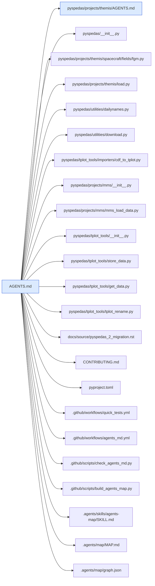
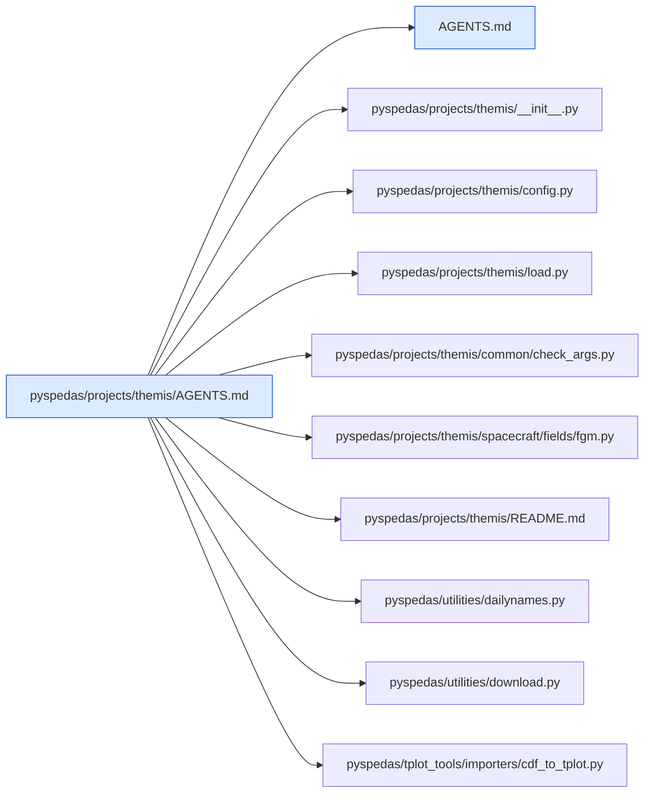

# AGENTS.md map

Generated by `.github/scripts/build_agents_map.py` from the `related_files` headers of every AGENTS.md.
Don't edit it by hand; rebuild it as described in `.agents/skills/agents-map/SKILL.md`.

2 AGENTS.md file(s) listing 33 related path(s), 0 of them missing.

## AGENTS.md links

A line joins two AGENTS.md files when either lists the other.

## Paths listed by more than one AGENTS.md

| Path | Listed by |
| --- | --- |
| `pyspedas/projects/themis/load.py` | `AGENTS.md`, `pyspedas/projects/themis/AGENTS.md` |
| `pyspedas/projects/themis/spacecraft/fields/fgm.py` | `AGENTS.md`, `pyspedas/projects/themis/AGENTS.md` |
| `pyspedas/tplot_tools/importers/cdf_to_tplot.py` | `AGENTS.md`, `pyspedas/projects/themis/AGENTS.md` |
| `pyspedas/utilities/dailynames.py` | `AGENTS.md`, `pyspedas/projects/themis/AGENTS.md` |
| `pyspedas/utilities/download.py` | `AGENTS.md`, `pyspedas/projects/themis/AGENTS.md` |

## `AGENTS.md`

Parent: none. Children: `pyspedas/projects/themis/AGENTS.md`.

## `pyspedas/projects/themis/AGENTS.md`

Parent: `AGENTS.md`. Children: none.

