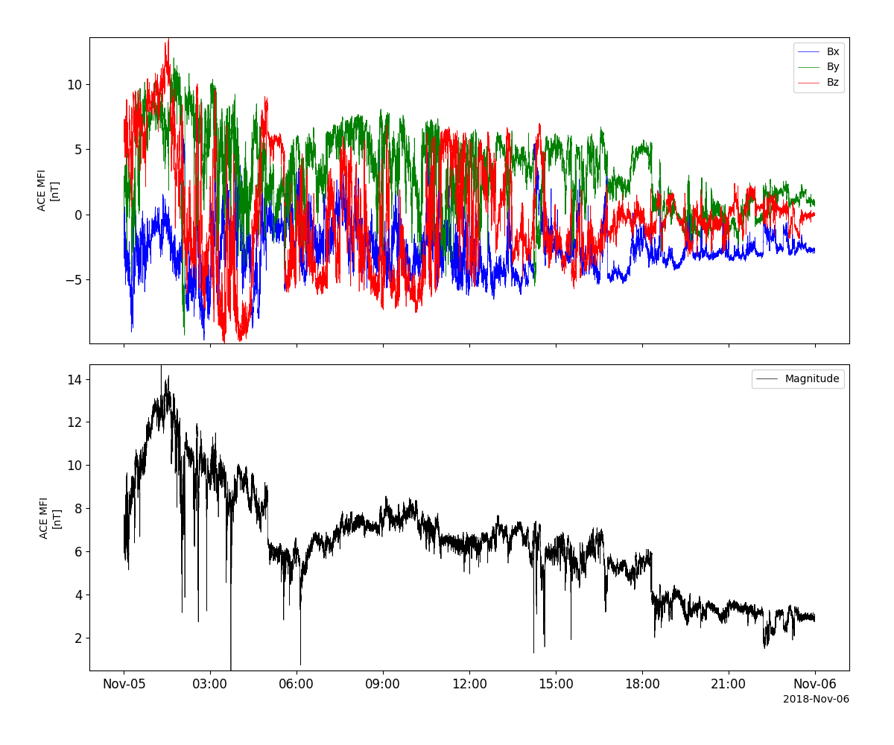
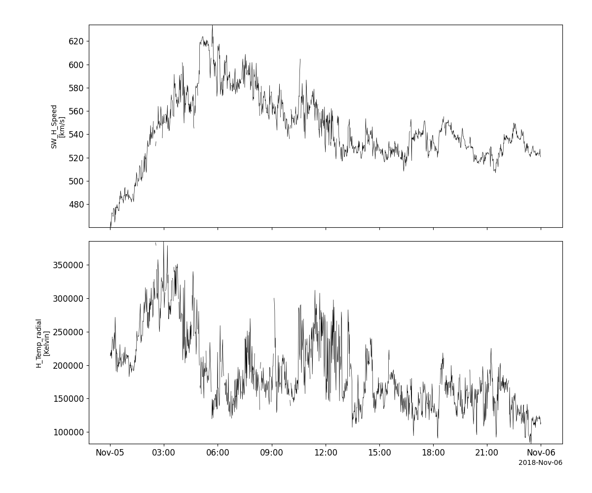
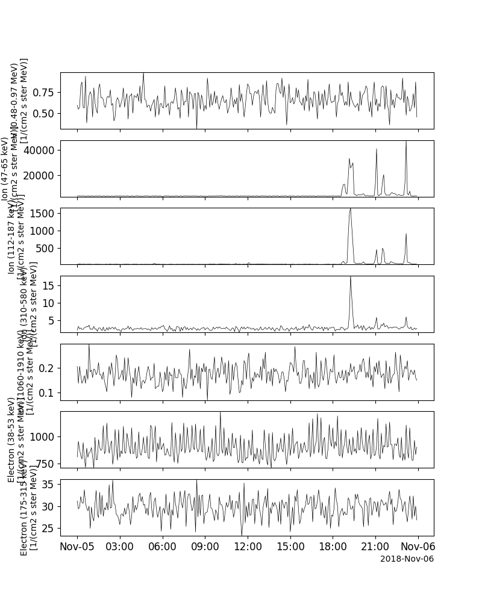
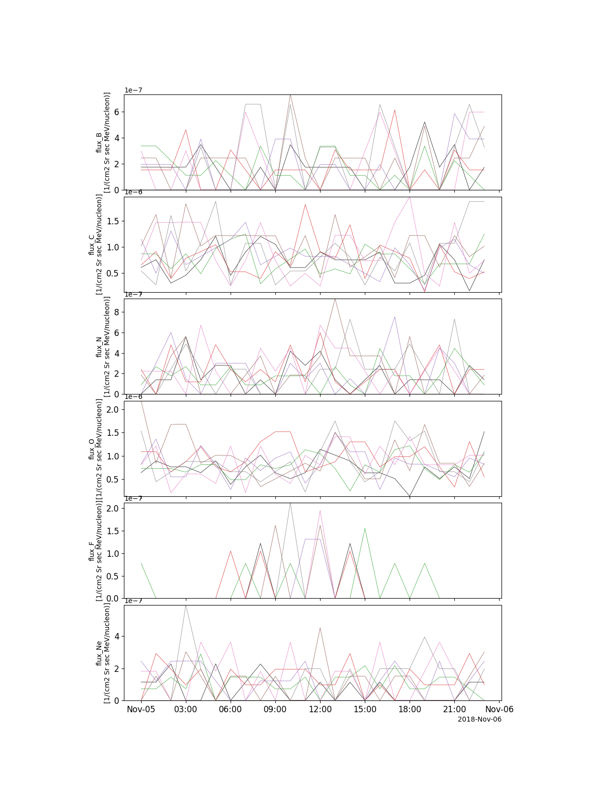
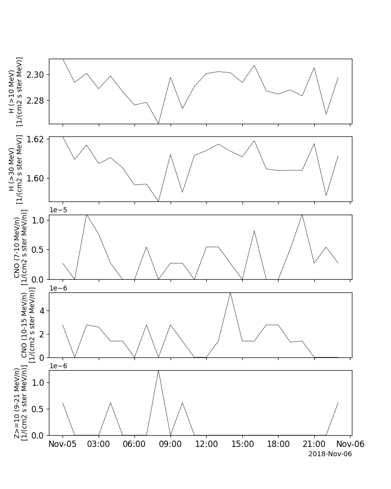
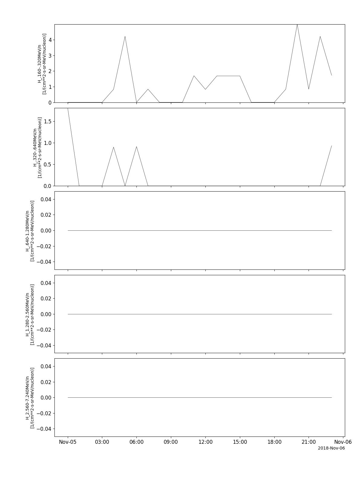
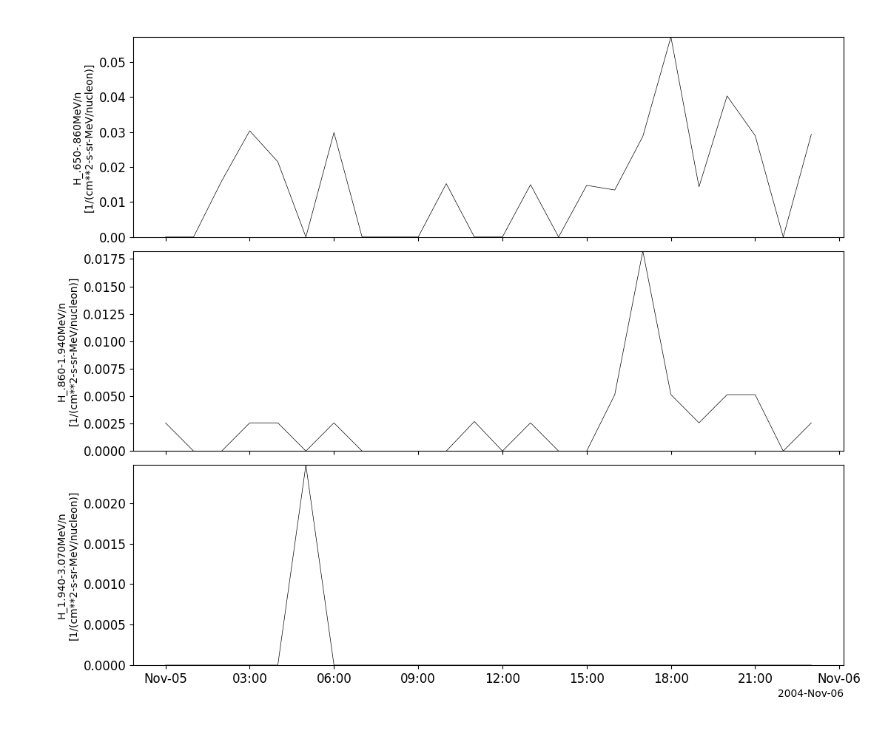
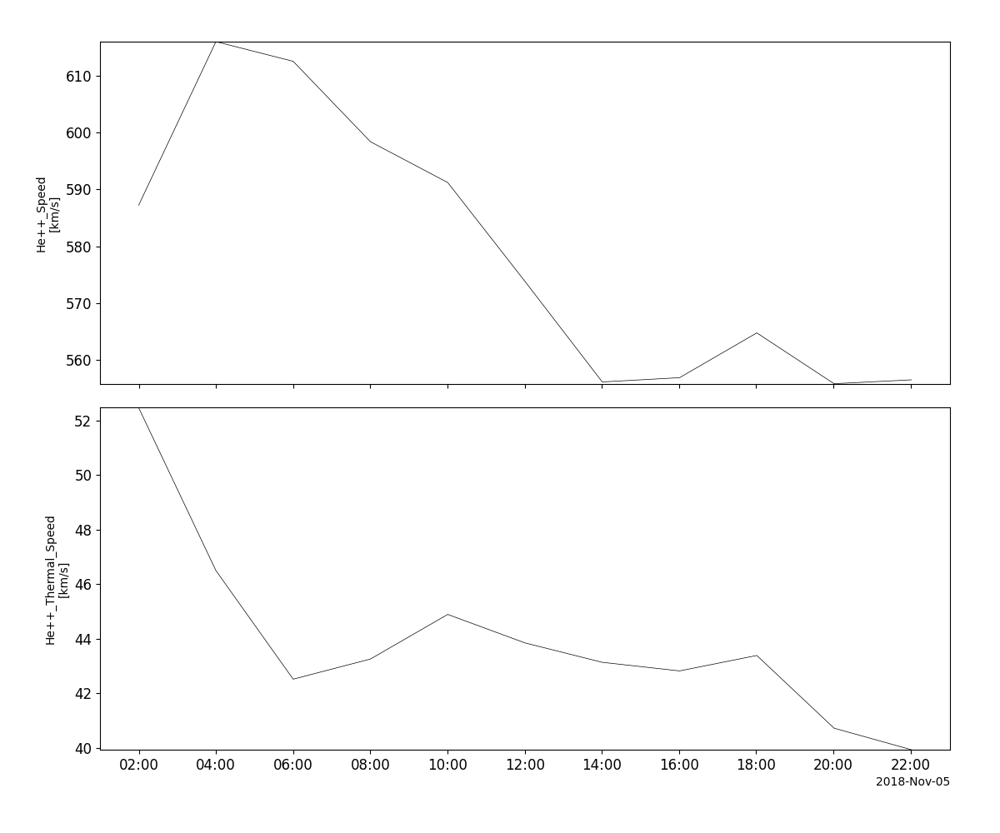

Advanced Composition Explorer (ACE)
========================================================================
The routines in this module can be used to load data from the Advanced Composition Explorer (ACE) mission.

Magnetometer (MFI)
----------------------------------------------------------
.. autofunction:: pyspedas.ace.mfi

Example
^^^^^^^^^

.. code-block:: python
   
   import pyspedas
   from pytplot import tplot
   mfi_vars = pyspedas.ace.mfi(trange=['2018-11-5', '2018-11-6'])
   tplot(['BGSEc', 'Magnitude'])

Solar Wind Electron, Proton and Alpha Monitor (SWEPAM)
----------------------------------------------------------
.. autofunction:: pyspedas.ace.swe

Example
^^^^^^^^^

.. code-block:: python
   
   import pyspedas
   from pytplot import tplot
   swe_vars = pyspedas.ace.swe(trange=['2018-11-5', '2018-11-6'])
   tplot(['Vp', 'Tpr'])

Electron, Proton, and Alpha-particle Monitor (EPAM)
----------------------------------------------------------
.. autofunction:: pyspedas.ace.epam

Example
^^^^^^^^^

.. code-block:: python
   
   import pyspedas
   from pytplot import tplot
   epam_vars = pyspedas.ace.epam(trange=['2018-11-5', '2018-11-6'])
   tplot(['H_lo', 'Ion_very_lo', 'Ion_lo', 'Ion_mid', 'Ion_hi', 'Electron_lo', 'Electron_hi'])

Cosmic Ray Isotope Spectrometer (CRIS)
----------------------------------------------------------
.. autofunction:: pyspedas.ace.cris

Example
^^^^^^^^^

.. code-block:: python
   
   import pyspedas
   from pytplot import tplot
   cris_vars = pyspedas.ace.cris(trange=['2018-11-5', '2018-11-6'])
   tplot(['flux_B', 'flux_C', 'flux_N', 'flux_O', 'flux_F', 'flux_Ne'])

Solar Isotope Spectrometer (SIS)
----------------------------------------------------------
.. autofunction:: pyspedas.ace.sis

Example
^^^^^^^^^

.. code-block:: python
   
   import pyspedas
   from pytplot import tplot
   sis_vars = pyspedas.ace.sis(trange=['2018-11-5', '2018-11-6'])
   tplot(['H_lo', 'H_hi', 'CNO_lo', 'CNO_hi', 'Z_ge_10'])

Ultra Low Energy Isotope Spectrometer (ULEIS)
----------------------------------------------------------
.. autofunction:: pyspedas.ace.uleis

Example
^^^^^^^^^

.. code-block:: python
   
   import pyspedas
   from pytplot import tplot
   uleis_vars = pyspedas.ace.uleis(trange=['2018-11-5', '2018-11-6'])
   tplot(['H_S1', 'H_S2', 'H_S3', 'H_S4', 'H_S5'])

Solar Energetic Particle Ionic Charge Analyzer (SEPICA)
----------------------------------------------------------
.. autofunction:: pyspedas.ace.sepica

Example
^^^^^^^^^

.. code-block:: python
   
   import pyspedas
   from pytplot import tplot
   sepica_vars = pyspedas.ace.sepica(trange=['2004-11-5', '2004-11-6'])
   tplot(['H1', 'H2', 'H3'])

Solar Wind Ion Composition Spectrometer (SWICS)
----------------------------------------------------------
.. autofunction:: pyspedas.ace.swics

Example
^^^^^^^^^

.. code-block:: python
   
   import pyspedas
   from pytplot import tplot
   swi_vars = pyspedas.ace.swics(trange=['2018-11-5', '2018-11-6'])
   tplot(['vHe2', 'vthHe2'])

