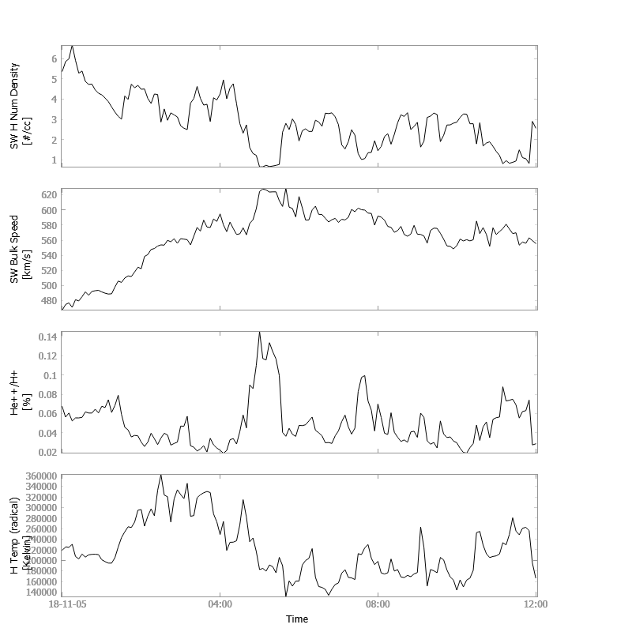

Advanced Composition Explorer (ACE)
====================================
The routines in this module can be used to load data from the Advanced Composition Explorer (ACE) mission.

Magnetometer (MFI)
---------------------------
.. autofunction:: pyspedas.ace.mfi

Example
^^^^^^^^^

.. code-block:: python
   
   import pyspedas
   from pytplot import tplot
   pyspedas.ace.mfi(trange=['2018-11-5', '2018-11-6'])
   tplot(['BGSEc', 'Magnitude'])

.. image:: _static/ace_mfi.png
   :scale: 75 %
   :align: center

Solar Wind Electron, Proton and Alpha Monitor (SWEPAM)
--------------------------------------------------------
.. autofunction:: pyspedas.ace.swe

Example
^^^^^^^^^

.. code-block:: python
   
   import pyspedas
   from pytplot import tplot
   pyspedas.ace.swe(trange=['2018-11-5', '2018-11-5/12:00'], time_clip=True)
   tplot(['Np', 'Vp', 'He_ratio', 'Tpr'])

Electron, Proton, and Alpha-particle Monitor (EPAM)
----------------------------------------------------
.. autofunction:: pyspedas.ace.epam

Cosmic Ray Isotope Spectrometer (CRIS)
----------------------------------------
.. autofunction:: pyspedas.ace.cris

Solar Isotope Spectrometer (SIS)
---------------------------------------
.. autofunction:: pyspedas.ace.sis

Ultra Low Energy Isotope Spectrometer (ULEIS)
-----------------------------------------------
.. autofunction:: pyspedas.ace.uleis

Solar Energetic Particle Ionic Charge Analyzer (SEPICA)
---------------------------------------------------------
.. autofunction:: pyspedas.ace.sepica

Solar Wind Ion Composition Spectrometer (SWICS)
------------------------------------------------
.. autofunction:: pyspedas.ace.swics