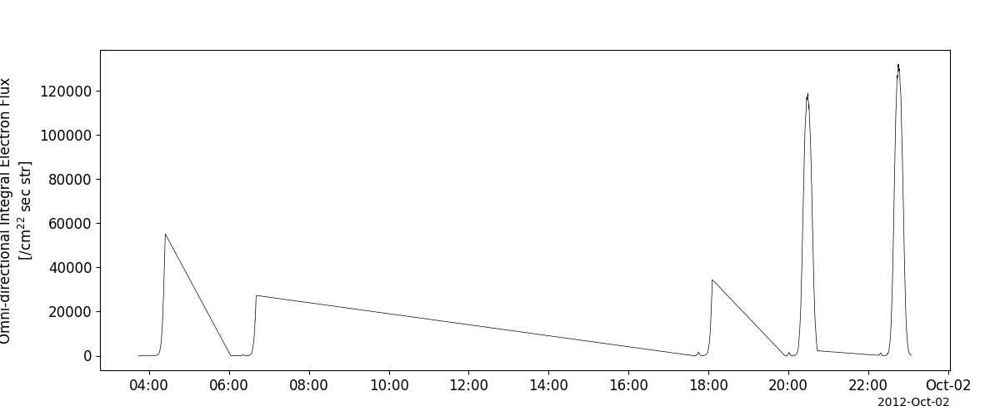
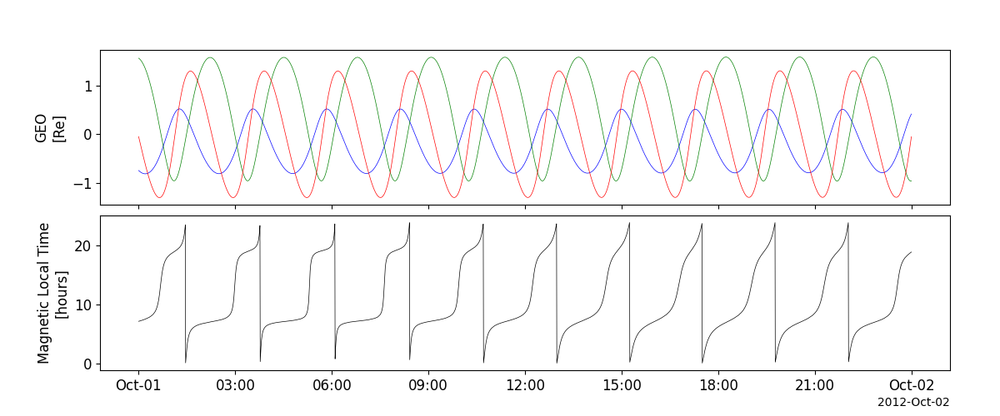

Akebono
========================================================================
The routines in this module can be used to load data from the Akebono mission.

Plasma Waves and Sounder experiment (PWS)
----------------------------------------------------------
.. autofunction:: pyspedas.akebono.pws

Example
^^^^^^^^^

.. code-block:: python
   
   import pyspedas
   from pytplot import tplot
   pws_vars = pyspedas.akebono.pws(trange=['2012-10-01', '2012-10-02'])
   tplot('akb_pws_RX1')

.. image:: _static/akebono_pws.png
   :align: center
   :class: imgborder

Radiation Moniter (RDM)
----------------------------------------------------------
.. autofunction:: pyspedas.akebono.rdm

Example
^^^^^^^^^

.. code-block:: python
   
   import pyspedas
   from pytplot import tplot
   rdm_vars = pyspedas.akebono.rdm(trange=['2012-10-01', '2012-10-02'])
   tplot('akb_rdm_FEIO')

Orbit data (orb)
----------------------------------------------------------
.. autofunction:: pyspedas.akebono.orb

Example
^^^^^^^^^

.. code-block:: python
   
   import pyspedas
   from pytplot import tplot
   orb_vars = pyspedas.akebono.orb(trange=['2012-10-01', '2012-10-02'])
   tplot(['akb_orb_geo', 'akb_orb_MLT'])

    