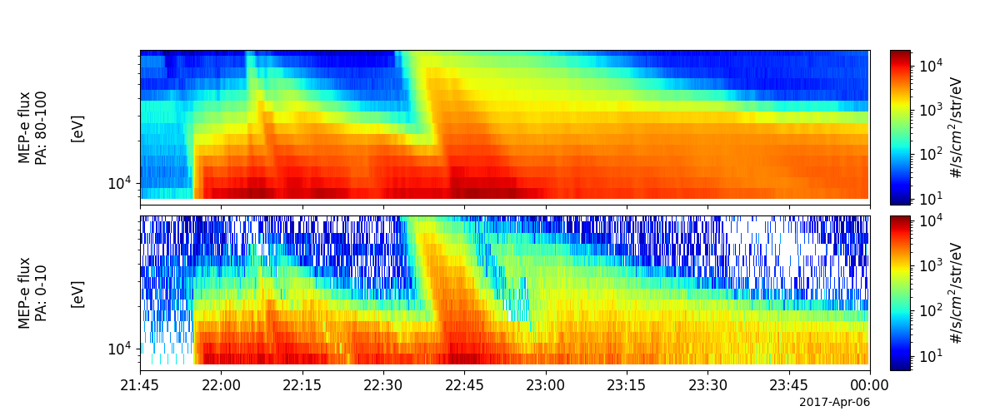

Analysis Tools
==============

Generalized 3-D Particle Distribution Tools
--------------------------------------------

The tools documented in this section are not intended to be called
directly by PySPEDAS users; rather, they are provided as building blocks
for mission-specific 3-D particle distribution tools.  Mission-specific wrappers
will generally be needed to load the particle data to be operated on,
perform any calibration, sanitization, or other preliminary steps, then
populate the data structures used by the general-purpose particle tools.

Plasma Moments
--------------

This group of routines calculates plasma moments (density, velocity, fluxes, pressure tensors, etc.) from
3-D particle distributions (with two dimensions being azimuthal and elevation angles, and the third dimension
representing energy bins).

moments_3d
^^^^^^^^^^

This routine takes a data structure containing the particle distribution function,
and other information like angle and energy bin definitions and sizes, and returns
a dictionary containing plasma moments generated from the particle distributions.

.. autofunction:: pyspedas.moments_3d

spd_pgs_moments
^^^^^^^^^^^^^^^

Basically a wrapper around moments_3d

.. autofunction:: pyspedas.spd_pgs_moments

spd_pgs_moments_tplot
^^^^^^^^^^^^^^^^^^^^^^^^

Converts a dictionary (as returned by moments_3d) to tplot variables

.. autofunction:: pyspedas.spd_pgs_moments_tplot

Other quantities derived from 3-D particle distributions
---------------------------------------------------------

spd_pgs_do_fac
^^^^^^^^^^^^^^

.. autofunction:: pyspedas.particles.spd_part_products.spd_pgs_do_fac.spd_pgs_do_fac

spd_pgs_regrid
^^^^^^^^^^^^^^

.. autofunction:: pyspedas.particles.spd_part_products.spd_pgs_regrid

Slices of 3-D particle distributions
----------------------------------------

This set of routines creates 1-D and 2-D slices through 3-D particle distributions.

slice1d_plot
^^^^^^^^^^^^

This routine plots the values along the x or y axis of a 2-D slice.

.. autofunction:: pyspedas.slice1d_plot

slice2d
^^^^^^^

.. autofunction:: pyspedas.slice2d

slice2d_plot
^^^^^^^^^^^^

.. autofunction:: pyspedas.slice2d_plot

MMS particle distribution tools
-------------------------------

This set of routines operates on MMS 3-D particle distributions to calculate
plasma moments and plot 1D or 2D slices through the distributions.

mms_part_getspec
^^^^^^^^^^^^^^^^

.. autofunction:: pyspedas.mms.mms_part_getspec

mms_part_slice2d
^^^^^^^^^^^^^^^^

.. autofunction:: pyspedas.mms.mms_part_slice2d

ERG (Arase) particle distribution tools
---------------------------------------

These routines operate on Arase 3-D particle distributions.

erg_mep_part_products
^^^^^^^^^^^^^^^^^^^^^

.. autofunction:: pyspedas.erg.erg_mep_part_products

Example
^^^^^^^

.. code-block:: python

        import pytplot
        import pyspedas
        from pyspedas.erg import erg_mep_part_products
        from pytplot import timespan, tplot
        timespan('2017-04-05 21:45:00', 2.25, keyword='hours')
        pyspedas.erg.mepe( trange=[ '2017-04-05 21:45:00', '2017-04-05 23:59:59'], datatype='3dflux' )
        vars = pyspedas.erg.mgf(trange=['2017-04-05 21:45:00', '2017-04-05 23:59:59'])  # Load necessary B-field data
        vars = pyspedas.erg.orb(trange=['2017-04-05 21:45:00', '2017-04-05 23:59:59'])  # Load necessary orbit data
        mag_vn = 'erg_mgf_l2_mag_8sec_dsi'
        pos_vn = 'erg_orb_l2_pos_gse'
        # Calculate energy-time spectra of electron flux for limited pitch-angle (PA) ranges
        ## Here we calculate energy-time spectra for PA = 0-10 deg and PA = 80-100 deg.
        vars = erg_mep_part_products('erg_mepe_l2_3dflux_FEDU', outputs='fac_energy', pitch=[80., 100.],
                                     fac_type='xdsi', mag_name=mag_vn, pos_name=pos_vn,
                                     trange=['2017-04-05 21:45:00', '2017-04-05 23:59:59'], suffix='_pa80-100')
        vars = erg_mep_part_products('erg_mepe_l2_3dflux_FEDU', outputs='fac_energy', pitch=[0., 10.], fac_type='xdsi',
                                     mag_name=mag_vn, pos_name=pos_vn,
                                     trange=['2017-04-05 21:45:00', '2017-04-05 23:59:59'], suffix='_pa0-10')

        ## Decorate the obtained spectrum variables
        pytplot.options('erg_mepe_l2_3dflux_FEDU_energy_mag_pa80-100', 'ytitle', 'MEP-e flux\nPA: 80-100\n\n[eV]')
        pytplot.options('erg_mepe_l2_3dflux_FEDU_energy_mag_pa0-10', 'ytitle', 'MEP-e flux\nPA: 0-10\n\n[eV]')
        tplot(['erg_mepe_l2_3dflux_FEDU_energy_mag_pa80-100', 'erg_mepe_l2_3dflux_FEDU_energy_mag_pa0-10'], save_png='erg_mep_en_pa_limit.png')

Magnetic Null Finding
---------------------

For missions such as MMS or Cluster, with at least four spacecraft in a relatively close tetrahedron-like configuration,
measuring the magnetic field simultaneously at four distinct locations allows the calculation of
field gradients in each field component along the X, Y, and Z directions (in other words, a Jacobian matrix).
This information is sufficient to find the location of magnetic null points (where all three field components
are zero), and infer the topology of the magnetic field at the null point.

.. autofunction:: pyspedas.find_magnetic_nulls_fote

.. autofunction:: pyspedas.classify_null_type

.. autofunction:: pyspedas.lingradest

Other analysis tools
---------------------

The tools in this section perform various operations on tplot variables.

.. toctree::
   :maxdepth: 2

   avg_data
   clean_spikes
   tcrossp
   tdotp 
   tdpwrspc
   interpolation
   tnormalize
   subtract_average
   subtract_median
   twavpol