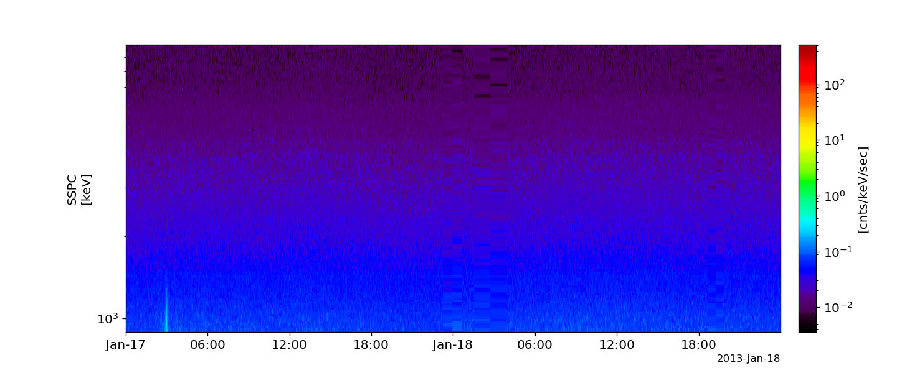

BARREL
========================================================================
The routines in this module can be used to load data from the BARREL mission.

Slow Spectrum (SSPC)
----------------------------------------------------------
.. autofunction:: pyspedas.barrel.sspc

Example
^^^^^^^^^

.. code-block:: python
   
   import pyspedas
   from pytplot import tplot
   fgm_vars = pyspedas.barrel.sspc(probe="1g", trange=['2013-01-14', '2013-01-27'])
   tplot('brl1G_SSPC')

