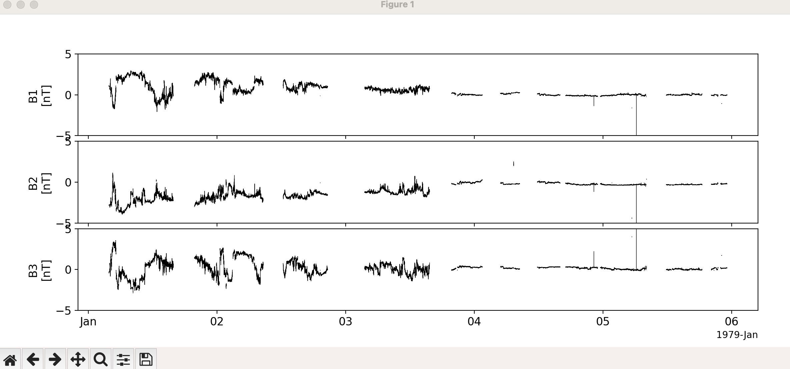

Load Data from NASA's CDAWeb (Coordinated Data Analysis Web) archive
========================================================================
CDAWeb is an archive and web service, operated by NASA, providing a large number of space-based and ground-based
data sets of interest to heliophysics.  The tools in this module can be used to access these datasets in PySPEDAS.

CDAWeb API
-----------

The scriptable CDAWeb interface provided by PySPEDAS can be used to download data. You will need to know
the exact strings CDAWeb uses to represent the missions, instruments, and data sets to be accessed.

All the CDAWeb interface calls are done via the CDAWeb class.  This class has methods get_observatories,
get_instruments, and get_datasets to return the CDAWeb designations available in their archive.

The get_filenames method takes a list of dataset names, a start time, and an end time,
and returns a list of URLs representing the archived data.

The cda_download method takes this list of URLs, a directory to download them to, and some optional
parameters specifying how the variables in the dowloaded data files are to be loaded as tplot variables.

.. autoclass:: pyspedas.CDAWeb
    :members: get_observatories, get_instruments, get_datasets, get_filenames, cda_download

Example
^^^^^^^^^

.. code-block:: python
   
   import pyspedas
   from pytplot import tplot, options, get_data
   # Create the CDAWeb interface object
   cdaweb_obj = pyspedas.CDAWeb()

   # This mission and instrument are selected from the lists returned by
   # the cdaweb_obj.get_observatories() and cdaweb.get_instruments() methods.
   mission_list = ['Voyager']
   instrument_list = ['Magnetic Fields (space)']

   # Get a list of CDAWeb datasets for Voyager magnetometer data
   dataset_list = cdaweb_obj.get_datasets(mission_list, instrument_list)
   print(dataset_list)

   # We'll pick one of available data sets and load it into tplot variables
   dataset = 'VOYAGER2_2S_MAG (1977-08-24 to 1991-01-01)'
   start_time = '1979-01-01 00:00:00'
   end_time = '1979-01-04 00:00:00'

   # Get the URLs for the available data in this time range
   urllist = cdaweb_obj.get_filenames([dataset],start_time, end_time)

   # Download the data and load as tplot variables.  Setting a prefix
   # is useful if you want to work with both Voyager 1 and Voyager 2
   # data; the variable names in the archived data are the same for both
   # spacecraft.

   cdaweb_obj.cda_download(urllist,"cdaweb/",prefix='v2_')

   # The magnetic field vectors are given as a set of 3 scalar variables, B1, B2, and B3
   # Set a nice Y range for plotting these variables (-5 to +5 nT)
   options('v2_B1','yrange',[-5,5])
   options('v2_B2','yrange',[-5,5])
   options('v2_B3','yrange',[-5,5])

   # Plot the data
   tplot(['v2_B1', 'v2_B2', 'v2_B3'])

   # Get the data arrays and metadata dictionary for v2_B1
   b1_dat = get_data('v2_B1')
   b1_md = get_data('b2_B1', metadata=True)
   time_array = b1.times
   data_array = b1.y

Here is what the resulting plot should look like:

Interactive CDAWeb Browser
--------------------------

PySPEDAS also includes an interactive CDAWeb archive browser and downloader, based on the tkinter GUI toolkit.

To start the CDAWeb browser:

.. code-block:: python

  from pyspedas.cdagui.cdagui import cdagui
  cdagui()

This should bring up a screen like this:

.. image:: _static/cdagui.png
   :align: center
   :class: imgborder

Upon loading the browser, the top two panes should automatically populate with the list of CDAWeb
mission names and instrument types.

Select at least one item in each pane, then click the "Find Datasets"
button to see the available data matching your selection in the middle pane.

Make one or more selections
from the available datasets. Below the dataset list are some controls for setting the time range of interest.
Set these to the desired date range, and click the "Get File List" button.  The URLs for the available data
will be displayed in the bottom pane.

Below that are controls for selecting a download directory, and a checkbox allowing
you to simply download the data and skip the conversion to tplot variables.  Set the download parameters as desired, select one
or more URLs from the list of remote files, and click the "Get Data" button. This begins the download process.

When the data is finished downloading,
you should see a pop-up dialog showing how many files were successfully downloaded and loaded into tplot variables.

Upon exiting the browser, the tplot variables you loaded should be available in your interactive
session for further plotting and exploration.

