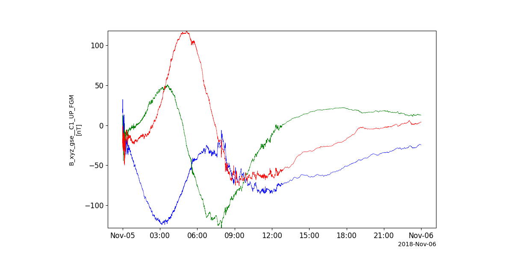
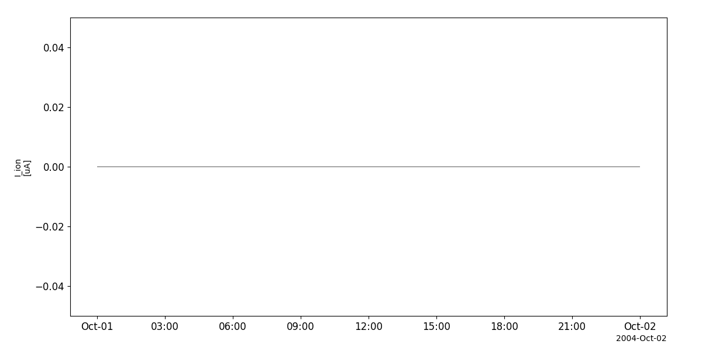
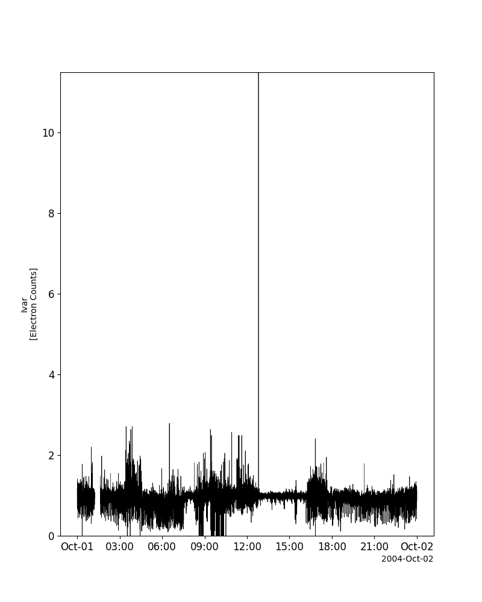
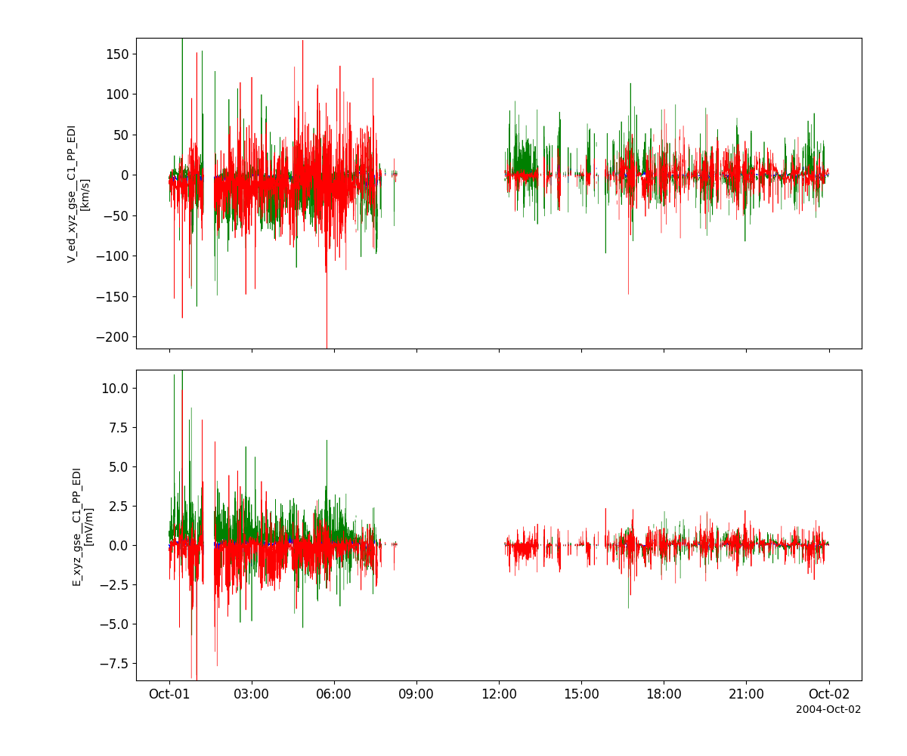
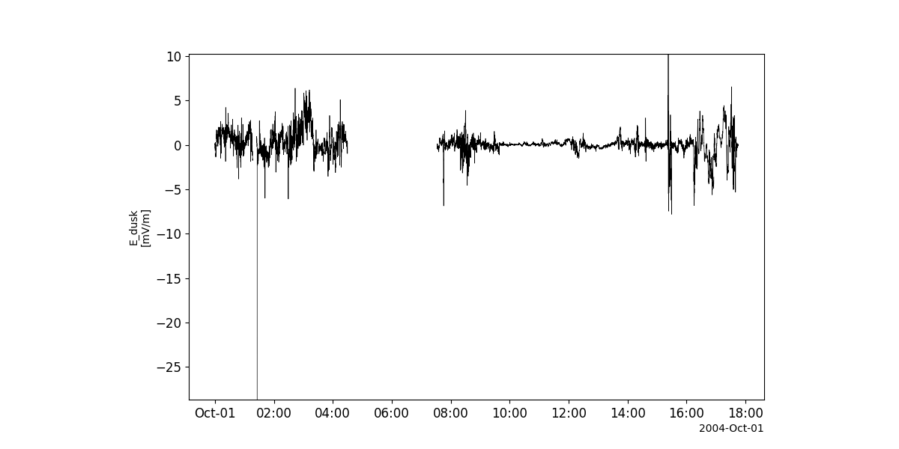
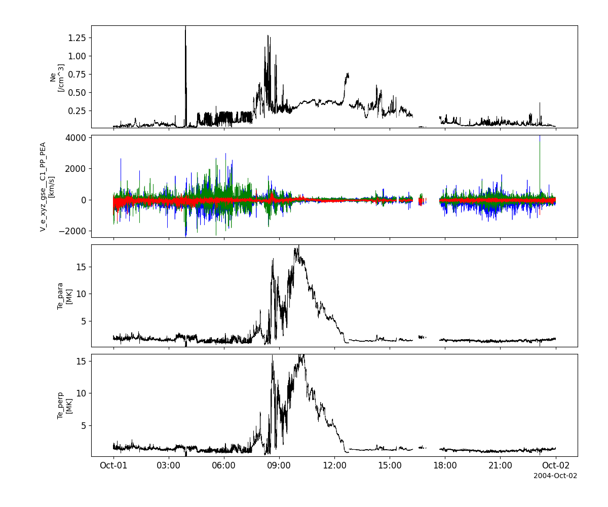
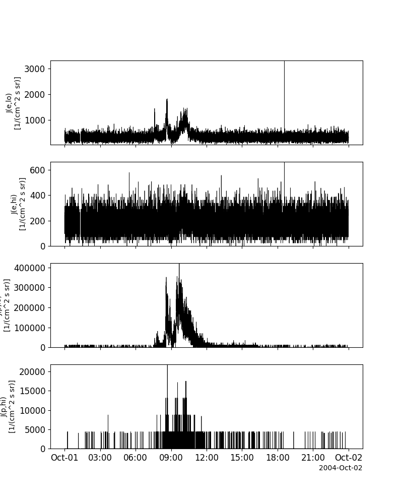
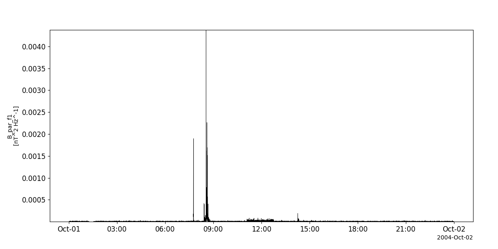
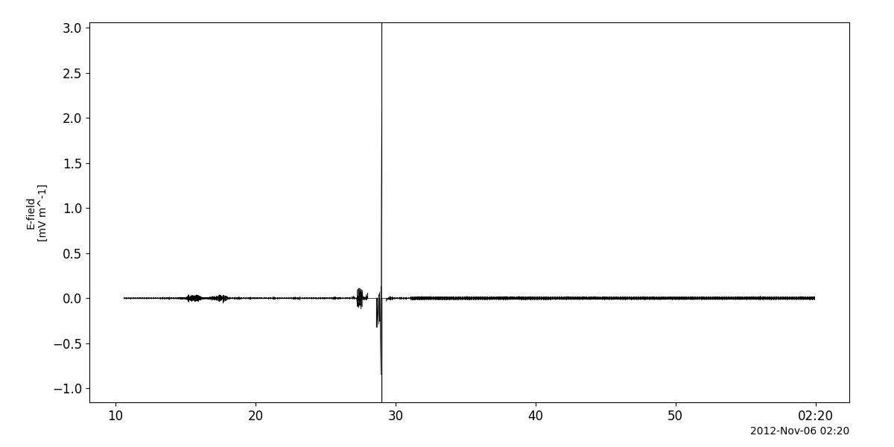
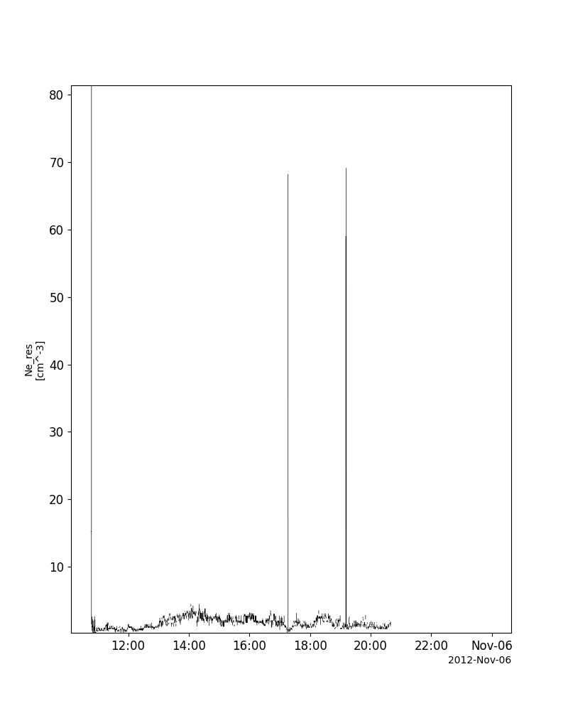

Cluster
========================================================================
The routines in this module can be used to load data from the Cluster mission.

Fluxgate Magnetometer (FGM)
----------------------------------------------------------
.. autofunction:: pyspedas.cluster.fgm

Example
^^^^^^^^^

.. code-block:: python
   
   import pyspedas
   from pytplot import tplot
   fgm_vars = pyspedas.cluster.fgm(trange=['2018-11-5', '2018-11-6'])
   tplot('B_xyz_gse__C1_UP_FGM')

Active Spacecraft Potential Control experiment (ASPOC)
----------------------------------------------------------
.. autofunction:: pyspedas.cluster.aspoc

Example
^^^^^^^^^

.. code-block:: python
   
   import pyspedas
   from pytplot import tplot
   asp_vars = pyspedas.cluster.aspoc(trange=['2004-10-01', '2004-10-2'])
   tplot('I_ion__C1_PP_ASP')

Cluster Ion Spectroscopy experiment (CIS)
----------------------------------------------------------
.. autofunction:: pyspedas.cluster.cis

Example
^^^^^^^^^

.. code-block:: python
   
   import pyspedas
   from pytplot import tplot
   cis_vars = pyspedas.cluster.cis(trange=['2004-10-01', '2004-10-2'])
   tplot(['N_p__C1_PP_CIS', 'V_p_xyz_gse__C1_PP_CIS', 'T_p_par__C1_PP_CIS', 'T_p_perp__C1_PP_CIS'])

.. image:: _static/cluster_cis.png
   :align: center
   :class: imgborder

Digital Wave Processing instrument (DWP)
----------------------------------------------------------
.. autofunction:: pyspedas.cluster.dwp

Example
^^^^^^^^^

.. code-block:: python
   
   import pyspedas
   from pytplot import tplot
   dwp_vars = pyspedas.cluster.dwp(trange=['2004-10-01', '2004-10-2'])
   tplot('Correl_Ivar__C1_PP_DWP')

Electron Drift Instrument (EDI)
----------------------------------------------------------
.. autofunction:: pyspedas.cluster.edi

Example
^^^^^^^^^

.. code-block:: python
   
   import pyspedas
   from pytplot import tplot
   edi_vars = pyspedas.cluster.edi(trange=['2004-10-01', '2004-10-2'])
   tplot(['V_ed_xyz_gse__C1_PP_EDI', 'E_xyz_gse__C1_PP_EDI'])

Electric Field and Wave experiment (EFW)
----------------------------------------------------------
.. autofunction:: pyspedas.cluster.efw

Example
^^^^^^^^^

.. code-block:: python
   
   import pyspedas
   from pytplot import tplot
   efw_vars = pyspedas.cluster.efw(trange=['2004-10-01', '2004-10-2'])
   tplot('E_dusk__C1_PP_EFW')

Plasma Electron and Current Experiment (PEACE)
----------------------------------------------------------
.. autofunction:: pyspedas.cluster.peace

Example
^^^^^^^^^

.. code-block:: python
   
   import pyspedas
   from pytplot import tplot
   peace_vars = pyspedas.cluster.peace(trange=['2004-10-01', '2004-10-2'])
   tplot(['N_e_den__C1_PP_PEA', 'V_e_xyz_gse__C1_PP_PEA', 'T_e_par__C1_PP_PEA', 'T_e_perp__C1_PP_PEA'])

Research with Adaptive Particle Imaging Detectors (RAPID)
----------------------------------------------------------
.. autofunction:: pyspedas.cluster.rapid

Example
^^^^^^^^^

.. code-block:: python
   
   import pyspedas
   from pytplot import tplot
   rap_vars = pyspedas.cluster.rapid(trange=['2004-10-01', '2004-10-2'])
   tplot(['J_e_lo__C1_PP_RAP', 'J_e_hi__C1_PP_RAP', 'J_p_lo__C1_PP_RAP', 'J_p_hi__C1_PP_RAP'])

Spatio-Temporal Analysis of Field Fluctuation experiment (STAFF)
----------------------------------------------------------
.. autofunction:: pyspedas.cluster.staff

Example
^^^^^^^^^

.. code-block:: python
   
   import pyspedas
   from pytplot import tplot
   sta_vars = pyspedas.cluster.staff(trange=['2004-10-01', '2004-10-02'])
   tplot('B_par_f1__C1_PP_STA')

Wide Band Data receiver (WBD)
----------------------------------------------------------
.. autofunction:: pyspedas.cluster.wbd

Example
^^^^^^^^^

.. code-block:: python
   
   import pyspedas
   from pytplot import tplot
   wbd_vars = pyspedas.cluster.wbd(trange=['2012-11-06/02:10', '2012-11-06/02:20'])
   tplot('WBD_Elec')

Waves of High Frequency and Sounder for Probing of Density by Relaxation (WHISPER)
----------------------------------------------------------
.. autofunction:: pyspedas.cluster.whi

Example
^^^^^^^^^

.. code-block:: python
   
   import pyspedas
   from pytplot import tplot
   whi_vars = pyspedas.cluster.whi()
   tplot('N_e_res__C1_PP_WHI')

