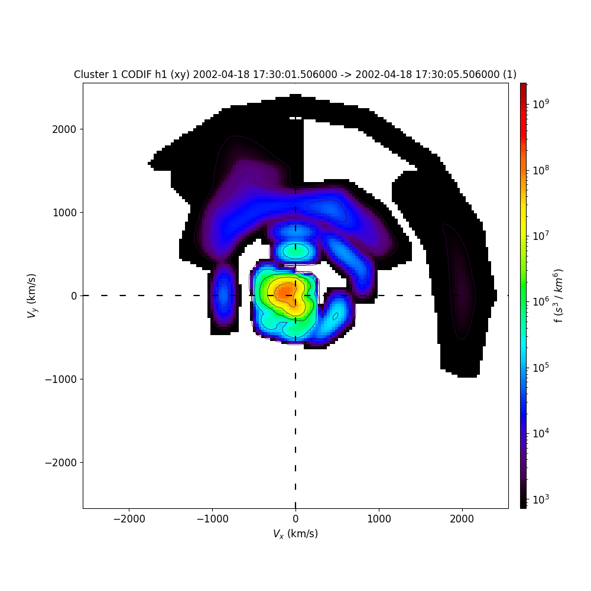

Cluster Analysis Tools
=======================

Particle Tools
--------------

.. autofunction:: pyspedas.projects.cluster.cluster_get_codif_dist

.. autofunction:: pyspedas.projects.cluster.cluster_get_hia_dist

Example
^^^^^^^

.. code-block:: python

        import pyspedas
        trange = ['2002-04-18 12:00:00', '2002-04-18 18:00:00']
        event = '2002-04-18 17:30:03'
        probe = '1'
        pyspedas.projects.cluster.cis(trange, probe=probe, option='psd_h1', get_support_data=True)
        pyspedas.projects.cluster.cis(trange, probe=probe, varformat='V_p_xyz_gse__C1_PP_CIS')
        pyspedas.projects.cluster.fgm(trange, probe=probe, datatype='cp')
        dist = pyspedas.projects.cluster.cluster_get_codif_dist('ions_3d__C1_CP_CIS_CODIF_HS_H1_PSD', probe)

        slice_xy = pyspedas.slice2d(dist, time=event, rotation='xy', interpolation='2d')
        slice_xz = pyspedas.slice2d(dist, time=event, rotation='xz', interpolation='2d')
        slice_yz = pyspedas.slice2d(dist, time=event, rotation='yz', interpolation='2d')

        pyspedas.slice2d_plot(slice_xy, save_png='cluster_codif_slice_xy.png')

