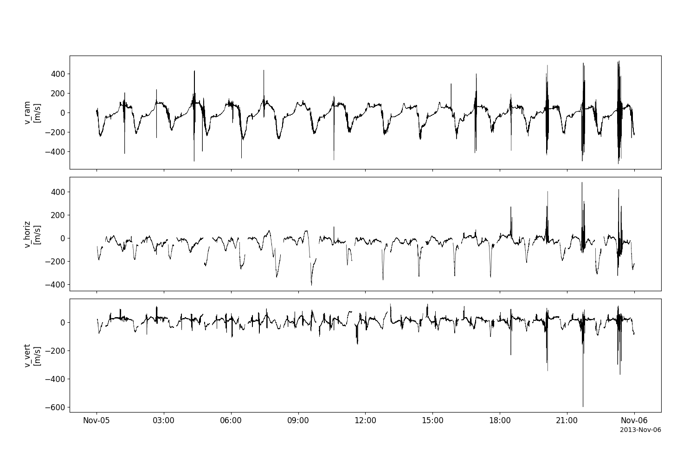
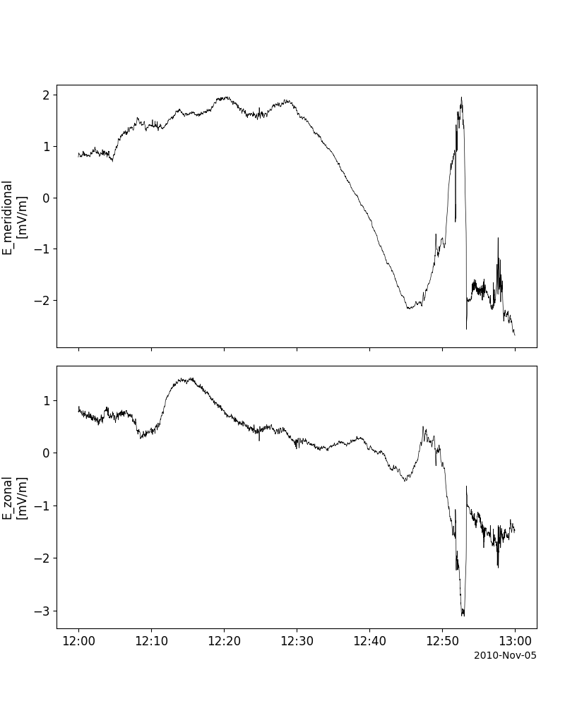
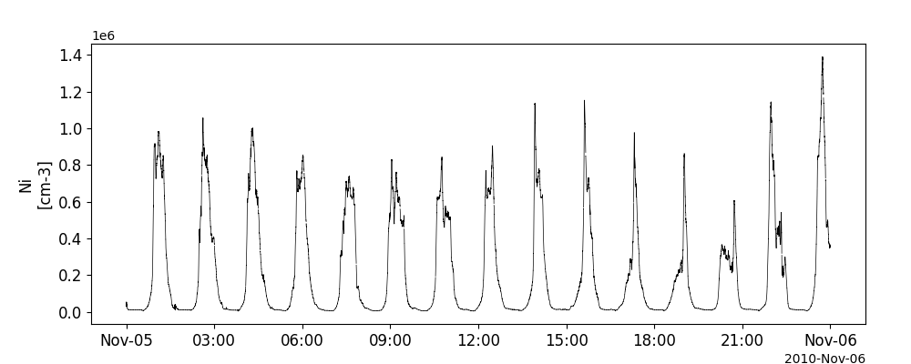

Communications/Navigation Outage Forecasting System (C/NOFS)
========================================================================
The routines in this module can be used to load data from the Communications/Navigation Outage Forecasting System (C/NOFS) mission.

Coupled Ion-Neutral Dynamics Investigation (CINDI)
----------------------------------------------------------
.. autofunction:: pyspedas.cnofs.cindi

Example
^^^^^^^^^

.. code-block:: python
   
   import pyspedas
   from pytplot import tplot
   cindi_vars = pyspedas.cnofs.cindi(trange=['2013-11-5', '2013-11-6'])
   tplot(['ionVelocityX', 'ionVelocityY', 'ionVelocityZ'])

Vector Electric Field Instrument (VEFI)
----------------------------------------------------------
.. autofunction:: pyspedas.cnofs.vefi

Example
^^^^^^^^^

.. code-block:: python

   import pyspedas
   from pytplot import tplot
   vefi_vars = pyspedas.cnofs.vefi(trange=['2010-11-5/12:00', '2010-11-5/13:00'])
   tplot(['E_meridional', 'E_zonal'])

Planar Langmuir Probe (PLP)
----------------------------------------------------------
.. autofunction:: pyspedas.cnofs.plp

Example
^^^^^^^^^

.. code-block:: python

   import pyspedas
   from pytplot import tplot
   plp_vars = pyspedas.cnofs.plp(trange=['2010-11-5', '2010-11-6'])
   tplot('Ni')

