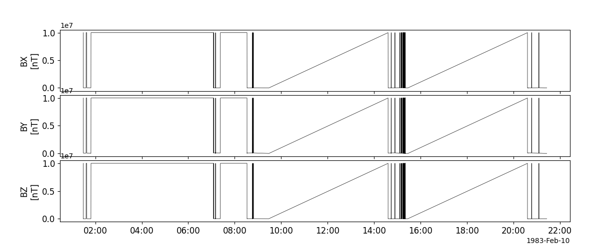
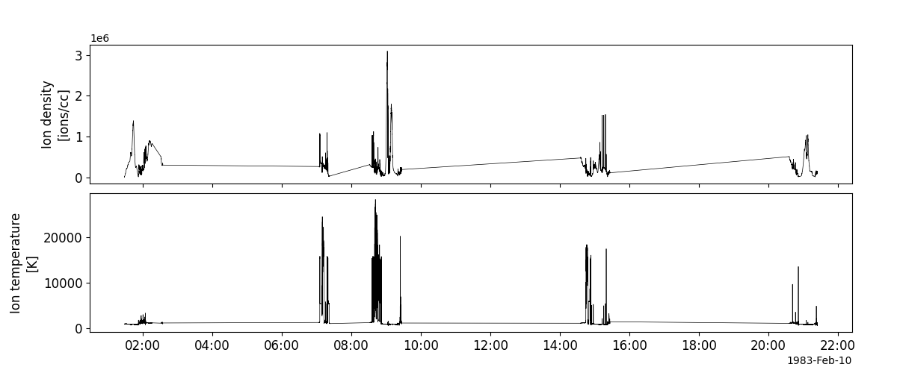
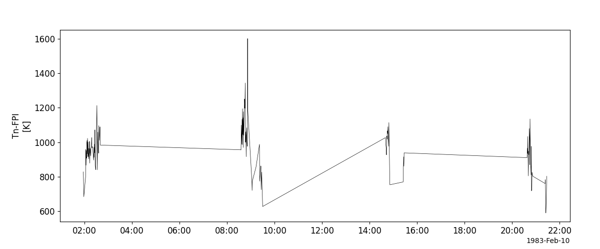
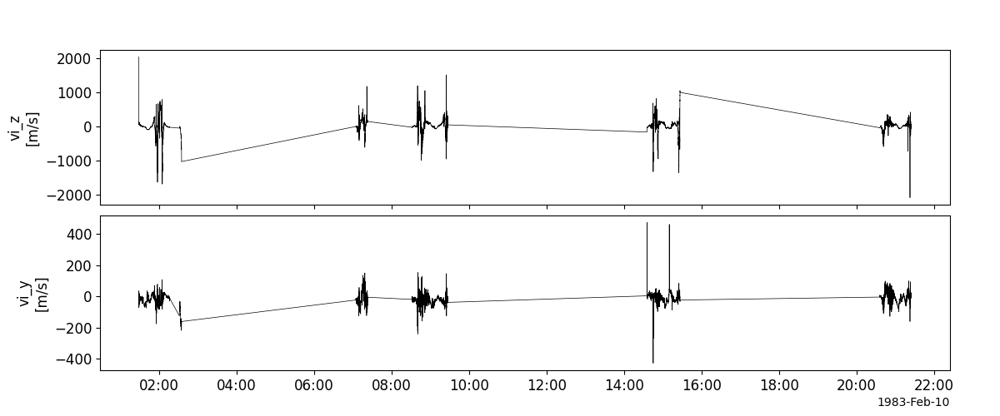
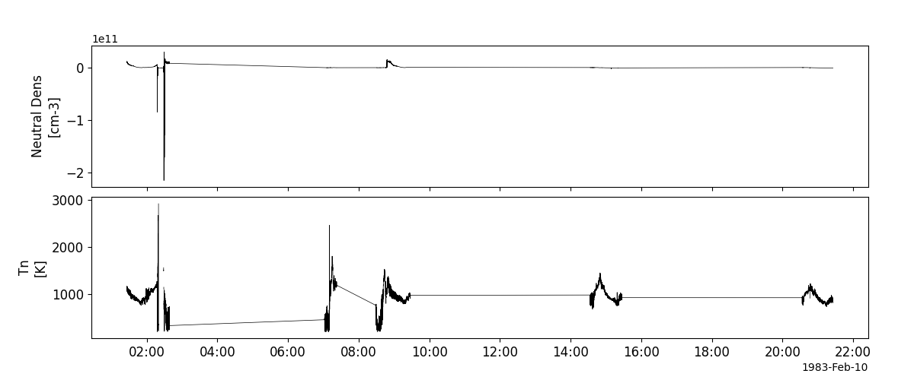
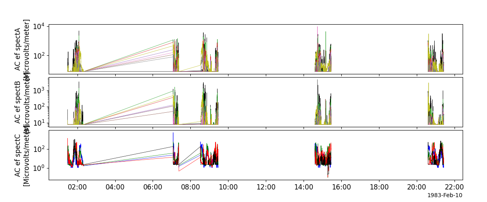
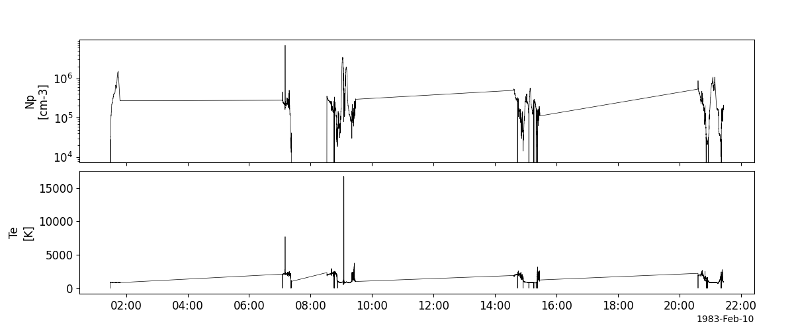

Dynamics Explorer 2 (DE2)
========================================================================
The routines in this module can be used to load data from the Dynamics Explorer 2 (DE2) mission.

Magnetometer (MAG)
----------------------------------------------------------
.. autofunction:: pyspedas.de2.mag

Example
^^^^^^^^^

.. code-block:: python
   
   import pyspedas
   from pytplot import tplot
   mag_vars = pyspedas.de2.mag(trange=['1983-02-10', '1983-02-11'])
   tplot(['bx', 'by', 'bz'])

Neutral Atmosphere Composition Spectrometer (NACS)
----------------------------------------------------------
.. autofunction:: pyspedas.de2.nacs

Example
^^^^^^^^^

.. code-block:: python
   
   import pyspedas
   from pytplot import tplot
   nacs_vars = pyspedas.de2.nacs(trange=['1983-02-10', '1983-02-11'])
   tplot(['O_density', 'N_density'])

.. image:: _static/de2_nacs.png
   :align: center
   :class: imgborder

Retarding Potential Analyzer (RPA)
----------------------------------------------------------
.. autofunction:: pyspedas.de2.rpa

Example
^^^^^^^^^

.. code-block:: python
   
   import pyspedas
   from pytplot import tplot
   rpa_vars = pyspedas.de2.rpa(trange=['1983-02-10', '1983-02-11'])
   tplot(['ionDensity', 'ionTemperature'])

Fabry-Pérot Interferometer (FPI)
----------------------------------------------------------
.. autofunction:: pyspedas.de2.fpi

Example
^^^^^^^^^

.. code-block:: python
   
   import pyspedas
   from pytplot import tplot
   fpi_vars = pyspedas.de2.fpi(trange=['1983-02-10', '1983-02-11'])
   tplot('TnF')

Ion Drift Meter (IDM)
----------------------------------------------------------
.. autofunction:: pyspedas.de2.idm

Example
^^^^^^^^^

.. code-block:: python
   
   import pyspedas
   from pytplot import tplot
   idm_vars = pyspedas.de2.idm(trange=['1983-02-10', '1983-02-11'])
   tplot(['ionVelocityZ', 'ionVelocityY'])

Wind and Temperature Spectrometer (WATS)
----------------------------------------------------------
.. autofunction:: pyspedas.de2.wats

Example
^^^^^^^^^

.. code-block:: python
   
   import pyspedas
   from pytplot import tplot
   wats_vars = pyspedas.de2.wats(trange=['1983-02-10', '1983-02-11'])
   tplot(['density', 'Tn'])

Vector Electric Field Instrument (VEFI)
----------------------------------------------------------
.. autofunction:: pyspedas.de2.vefi

Example
^^^^^^^^^

.. code-block:: python
   
   import pyspedas
   from pytplot import tplot
   vefi_vars = pyspedas.de2.vefi(trange=['1983-02-10', '1983-02-11'])
   tplot(['spectA', 'spectB', 'spectC'])

Langmuir Probe Instrument (LANG)
----------------------------------------------------------
.. autofunction:: pyspedas.de2.lang

Example
^^^^^^^^^

.. code-block:: python
   
   import pyspedas
   from pytplot import tplot
   lang_vars = pyspedas.de2.lang(trange=['1983-02-10', '1983-02-11'])
   tplot(['plasmaDensity', 'electronTemp'])

    