.. _dev-pycharm:

Setting up a PyCharm development environment for PySPEDAS
==========================================================

Install PyCharm
---------------

If you don't already have it, download and install the PyCharm Interactive Development Environment (IDE).  For detailed instructions,
please refer to :ref:`Installing PyCharm <installing-python>` on the :ref:`Getting Started <getting-started>` page, or PyCharm's
own installation guide at https://www.jetbrains.com/help/pycharm/installation-guide.html .

Connect PyCharm to your GitHub account
--------------------------------------

Set up a GitHub access token to give PyCharm access to perform actions using your GitHub account.  Open the PyCharm settings
and navigate to Settings->Version Control->Github:

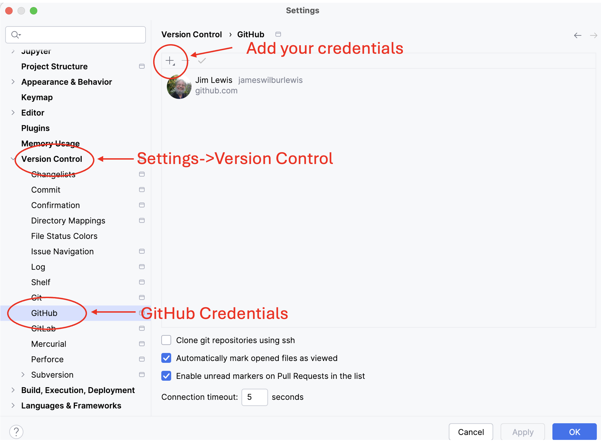

Click on the '+' control to add your Github credentials.

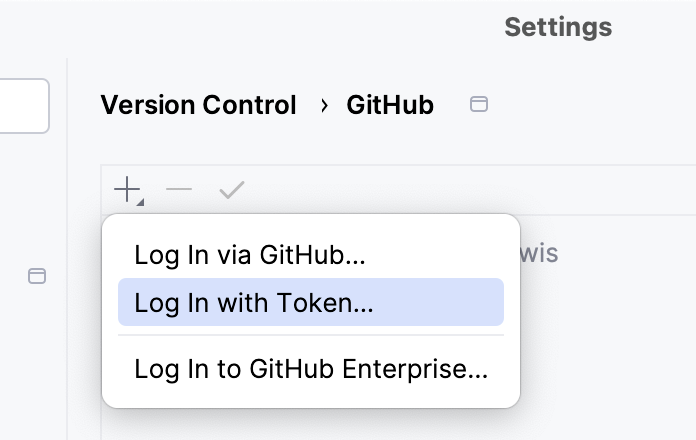

Select the "Log in with Token" option:

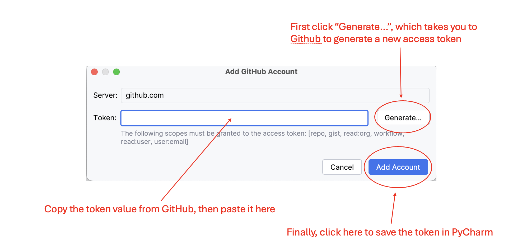

then click "Generate".

This will take you to a GitHub authentication page.  Once you've authenticated yourself, it should automatically
take you to a token generation page, with many options for access privileges associated with this
token.

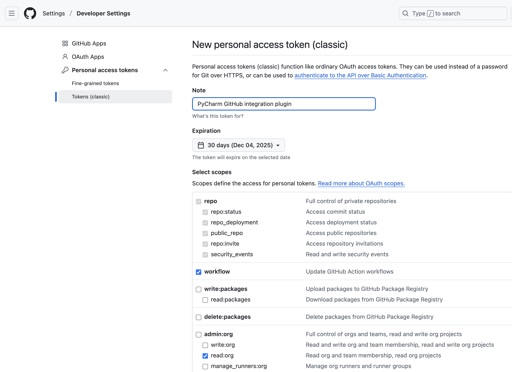

Take the defaults, then scroll down to the bottom of the page and click the "Generate" button.

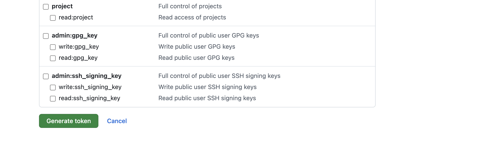

This should bring you to a page showing the token string.   Be sure to copy it to your clipboard here -- once you leave this page, there's
no way to get back to it, and you'll need to start over!

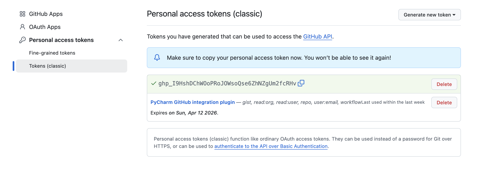

When you've copied the generated token, navigate back to the PyCharm dialog and paste the token value into the control.

Now that you've connected PyCharm to your GitHub account, you can create a PyCharm project from the GitHub repo.

Create a PyCharm project from a git clone of the PySPEDAS repo
---------------------------------------------------------------

Open PyCharm and choose File->Project from Version Control...

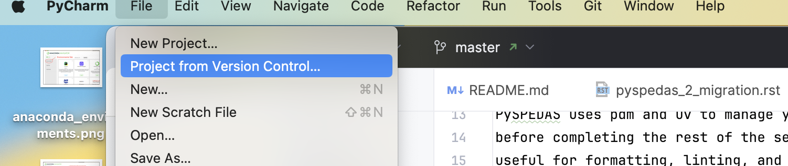

This should bring up a dialog something like this:

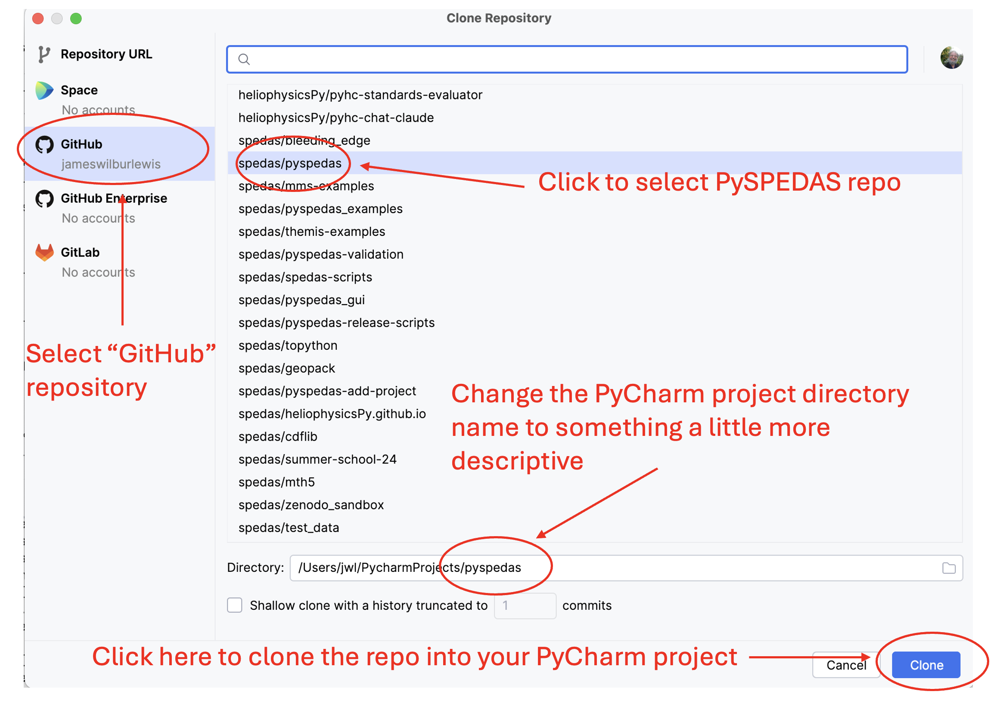

Select GitHub from the left pane, then select the spedas/pyspedas repository (PySPEDAS
team members) or your personal fork of the repo (outside contributors).   PyCharm
will automatically populate the "Directory" control.  You should probably
change the name to match the Conda environment you set up in step 1 (here, 'pyspedas_dev_py310').
See the screenshot above showing where to make these selections.

Click the "Clone" button.  PyCharm will clone the PySPEDAS repo into the directory you specified.

When the clone operation completes, open your new PyCharm project in a new PyCharm window.

Depending on your PyCharm settings, it may have already created a project interpreter for your project.  We
need to replace it with the Conda environment you created in a previous step.  Delete any .venv or venv folder it
might have created for you in the top level project directory.  Near the bottom right corner of the PyCharm window is a control
that will let you set up the project interpeter:

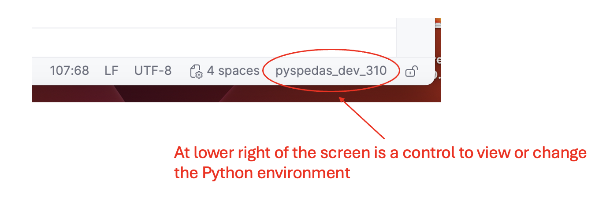

Click on that, then click "Add new interpreter" in the menu that appears, then click "Add local interpreter".

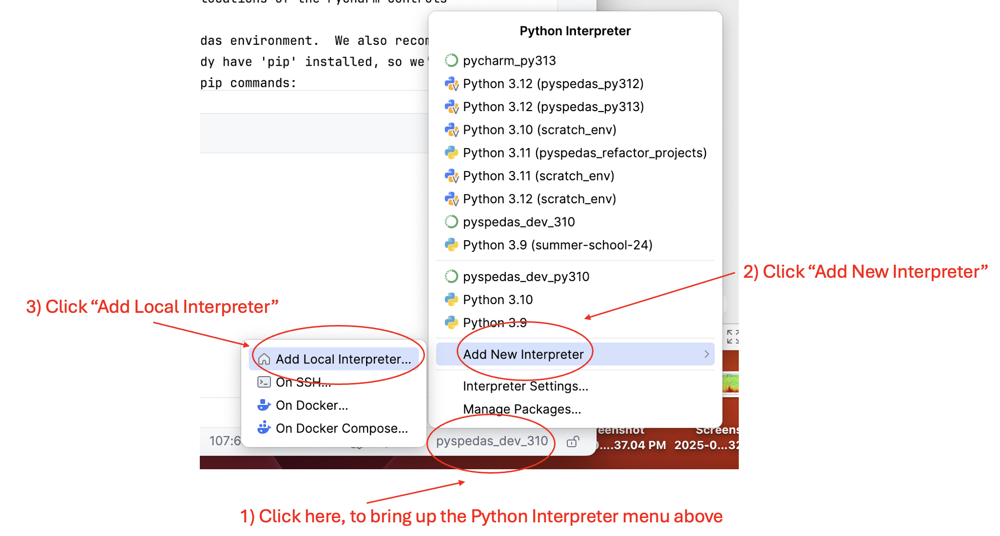

An "Add Python interpreter" dialog will appear.

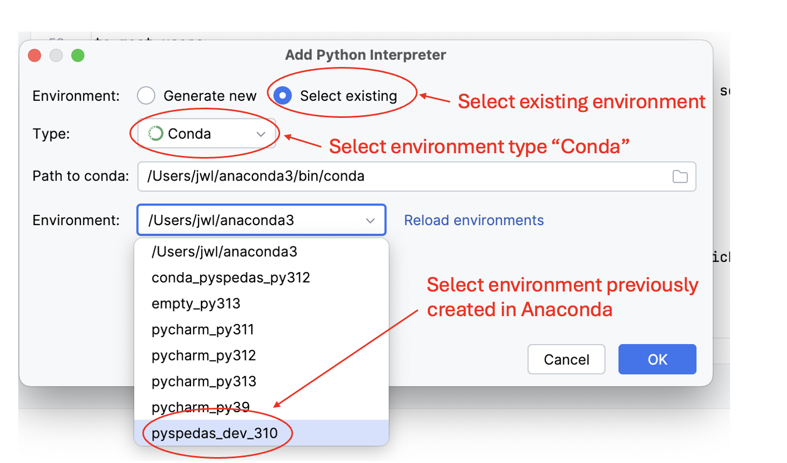

For the "Environment" control, click on "Select existing". In the "Type:" dropdown, select "Conda".
In the "Environment" dropdown, you should see the Conda environment you created in step 1.  Select it,
then click "OK" to create the environment.   See the above screenshot highlighting the locations of the
PyCharm controls.

It may take a few minutes for PyCharm to set up and index the project environment.

Install and configure pdm, pdm-bump, and uv
---------------------------------

Next, you'll need to install some development tools to manage your PySPEDAS project.

PySPEDAS uses the pdm package management tool to manage the pyspedas environment.  We also recommend using 'uv'
to install dependencies.  Your new Conda environment should already have 'pip' installed, so we'll use pip to
install pdm, uv, and pdm-bump (which is a convenient way to do version bumps during the release workflow).

Open a terminal window and run the following pip commands:

.. code-block:: bash

    pip install pdm
    pip install uv
    pip install pdm-bump

Ensure that the PyCharm terminal is using the pdm and uv installations you just created, rather than some installation
in a different, isolated environment.  Closing and reopening the terminal window, or closing and reopening the PyCharm
project should accomplish this.

After successfully installing pdm and uv, configure pdm to use uv:

.. code-block:: bash

    pdm config use_uv true

Install PySPEDAS dependencies and developer tools
-------------------------------------------------

Now you are ready to install the dependencies needed for PySPEDAS.  Do this in the terminal window with:

.. code-block:: bash

    pdm sync

This should install all the runtime, optional, and development dependencies.

If any package dependencies failed to install cleanly with 'pdm sync', you may need to install
them with conda instead.  This is rare on Linux or Windows, but may happen on Mac, depending on what MacOS and
Python versions you're using.  For any packages that failed to install (for this example, let's say it was netcdf4),
try installing them with conda instead:

.. code-block:: bash

    conda install -c conda-forge netcdf4

Repeat for each package that failed to install.  Then try 'pdm sync' again to see if any other installation failures occurred.

Check some PyCharm settings for plot display and docstring format
------------------------------------------------------------------

One last thing: you might want to check your project-specific PyCharm settings
to make sure they're correct.  For example:

In Python->Plots, the "show plots in tool window" option should probably be
unchecked.

In Python->Integrated Tools, the docstring format should be set to "NumPy".

