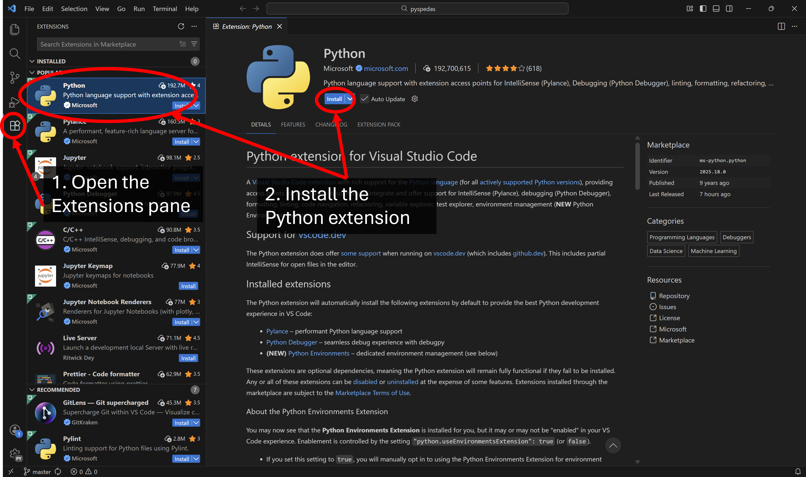
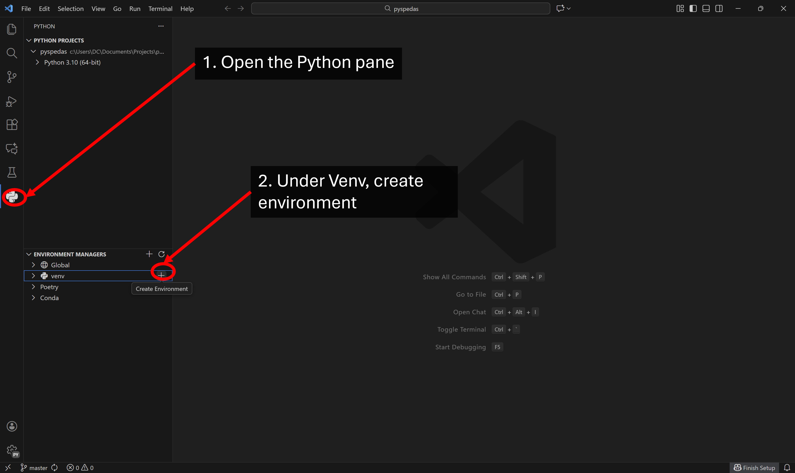
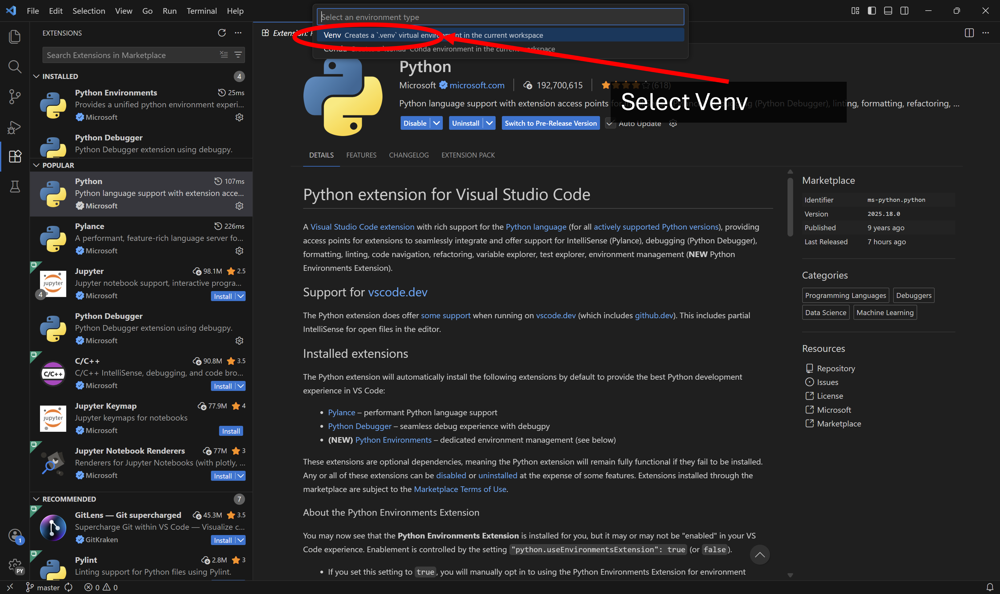
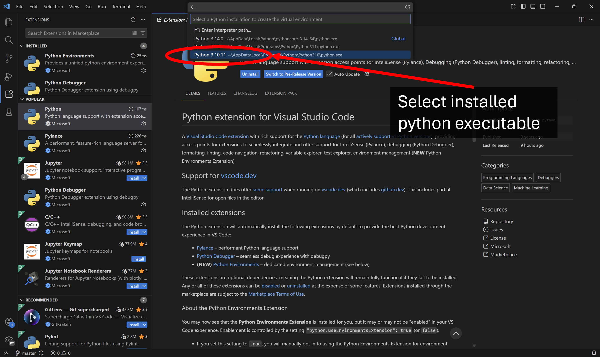
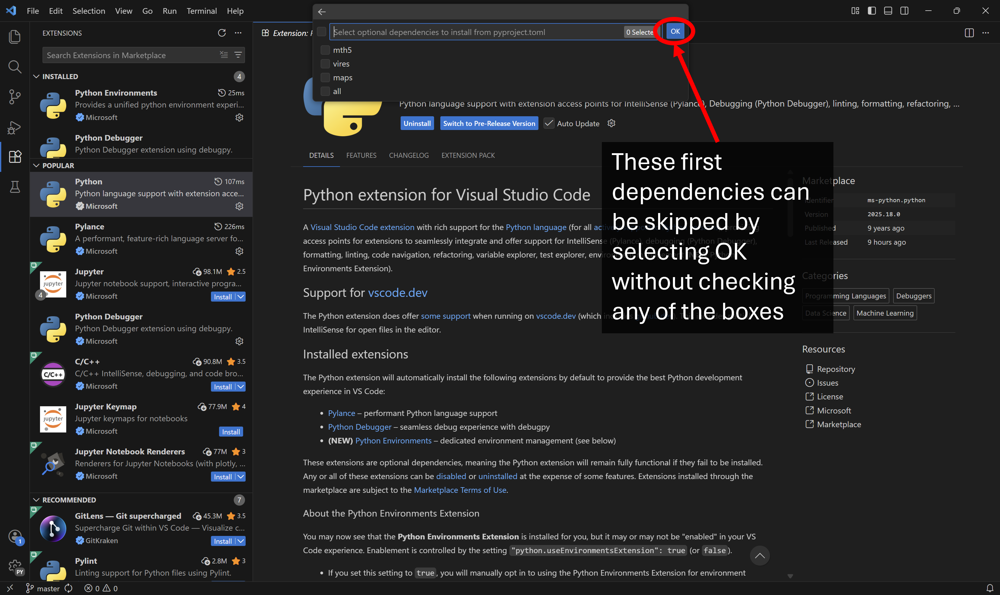

.. _dev-vscode:

Setting up a Visual Studio (VS) Code development environment for PySPEDAS
=========================================================================

This guide will describe the process for setting up VS Code to clone PySPEDAS from GitHub and create a developement environment for it. These instructions assume you're working in a Windows operating system.

Install Python Executable
-------------------------

If a Python executable has not already been installed, the following command can be run on Windows Command Prompt:

.. code-block:: bash

    winget install python.python.3.10

Where the decimals values indicate the Python version desired. If no other arguments are set, the executable can be located at %appdata%, under C:\\Users\\YourUsername\\AppData\\Local\\Programs\\Python\\Python310 (in this case).

Install VS Code
---------------

If you don't already have it, download and install the VS Code Interactive Development Environment (IDE).  It can be downloaded from the VS Code website: https://code.visualstudio.com/download .

Clone PySPEDAS from GitHub
--------------------------

When a VS Code window is opened for the first time under a new profile, the Explorer pane should already be open. Since a folder hasn't been selected yet, there should be an option to Clone Repository. Click this and select Clone from GitHub. Alternatively, this can be done from the Source Control pane (Ctrl+Shift+G), or by typing "Git: Clone" in the Command Pallette (Ctrl+Shift+P).

.. image:: _static/vscode_initiateclone.png
   :align: center
   :class: imgborder

Follow the prompts to sign in, select, and authorize access to a GitHub account where PySPEDAS or a PySPEDAS fork could be accessed from.

After GitHub has been authorized, return to the VS Code window, and search or select the spedas/pyspedas repository (PySPEDAS team members) or your personal fork of the repo (outside contributors). You'll then be prompted with a file explorer window to select a folder to serve as the repository destination.

.. image:: _static/vscode_chooserepo.png
   :align: center
   :class: imgborder

A dialogue box will then ask if you would like to open the repository. Click Open, and a dropdown for the repo folder will be opened in the Explorer pane. Once pyspedas has been selected, you'll be prompted to open the repository in the current window. Click yes, and the Explorer pane will now show a listed view of the pyspedas files. In the bottom left, you should see the Source Control pane icon, accompanied by the name of the branch you're currently working in. Clicking this branch name will open a dropdown menu allowing you to select/create branches, if so desired.

Install VS Code Python Extension
--------------------------------

Open the Extensions pane (Ctrl+Shift+X), and locate the Python extension. It's usually one of the top recommendeed extensions, but it can be located using the search bar at the top of the Extensions pane. Click on its extension entry and click install. 

Create Virtual Environment (Venv) and Set Interpreter
-----------------------------------------------------

In the search bar, select or type Show and Run Commands, or use the keyboard shortcut (Ctrl+Shift+P). 

.. image:: _static/vscode_showandrun.png
   :align: center
   :class: imgborder

Then, search or choose "Python: Select Interpreter".

.. image:: _static/vscode_selectinterpreter.png
   :align: center
   :class: imgborder

A list of interpreters will then be displayed. Select Create Virtual Environment.

A list should then show two options: Venv (virtual environment) or Conda (conda environment). Click Venv.

A list of python.exe paths will then be displayed, along with their full paths to their installations. Select the desired python version (in this case, 3.10.11).

The dropdown menu will then provide options for installing dependancies. For now, skip this first page by clicking OK.

The dropdown menu should then give the option to install docs\requirements.txt from the PySPEDAS project directory. Check this box, then proceed by clicking OK. The Venv will then be created in the project directory, and should be set by the interpreter by default. If restarting the session, the Venv interpreter can be selected by opening the Command Pallette (Ctrl+Shift+P), clicking Python: Select Interpreter, and selecting the Venv in the dropdown list (it should be the recommended interpreter). With the Venv created and the interpreter set, open a the terminal pane by clicking the Terminal tab at the top of the window  and clicking New Terminal. Alternatively, the terminal pane can be opened using the keyboard shortcut (Ctrl+Shift+`). 

.. image:: _static/vscode_openterminal.png
   :align: center
   :class: imgborder

With the terminal pane opened, a powershell terminal should be loaded, and the Venv should be activated automatically. This is where the following packages will be installed.

.. image:: _static/vscode_terminalpane.png
   :align: center
   :class: imgborder

Install Dependencies
--------------------------------

PySPEDAS uses the pdm package management tool to manage the pyspedas environment.  In the terminal pane, us pip to install pdm to the Venv: 

.. code-block:: bash

    pip install pdm
    
Then pdm sync can be used to make sure all the dependencies are downloaded or up to date:

.. code-block:: bash

    pdm sync

This should install all the runtime, optional, and development dependencies.

If any package dependencies failed to install cleanly with 'pdm sync', you may need to install
them directly using pip.

.. code-block:: bash

    pip install astropy

Repeat for each package that failed to install.  Then try 'pdm sync' again to see if any other installation failures occurred.