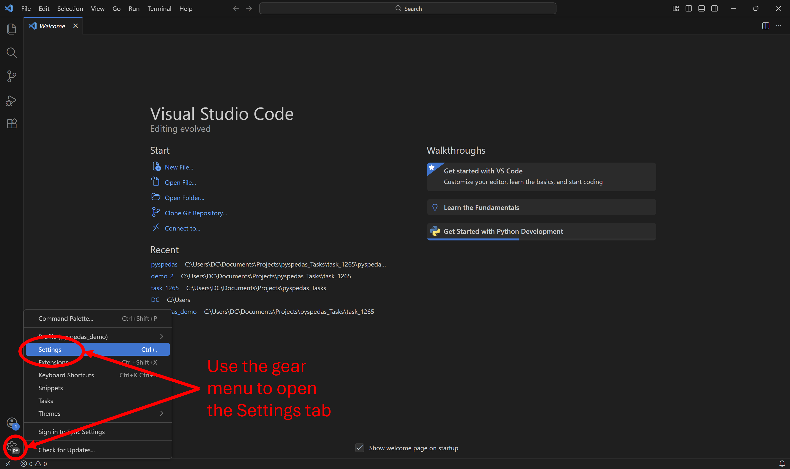
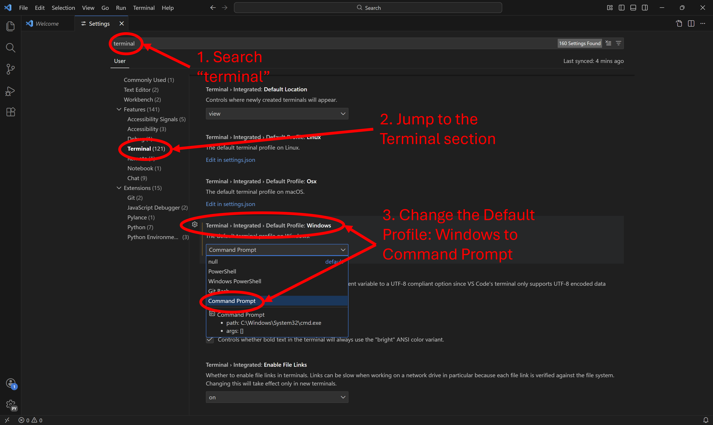
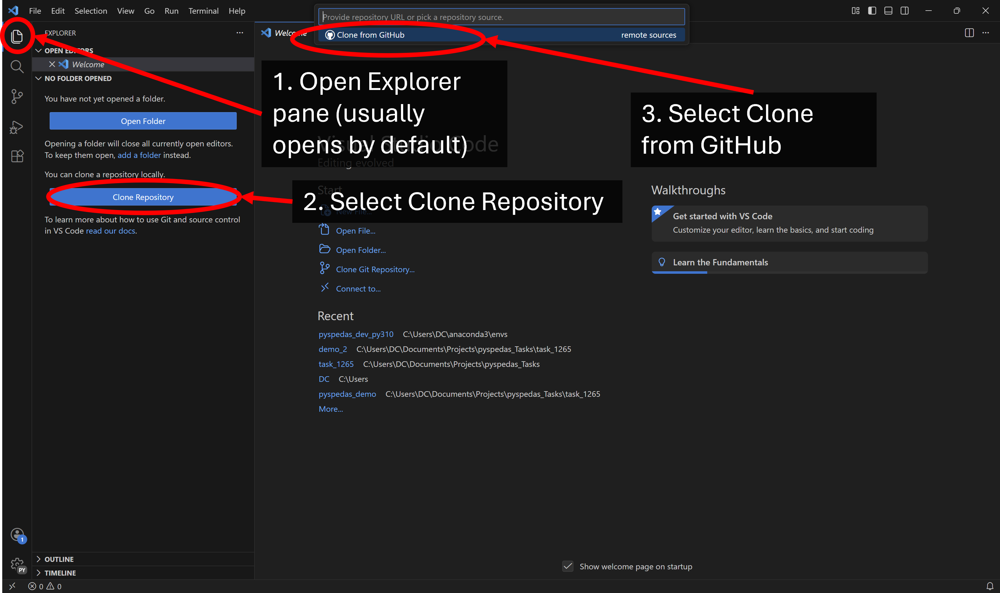
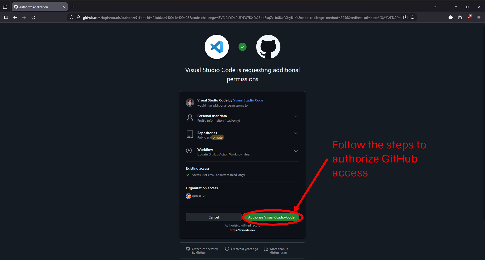
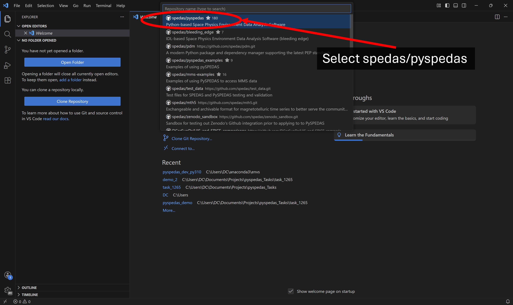
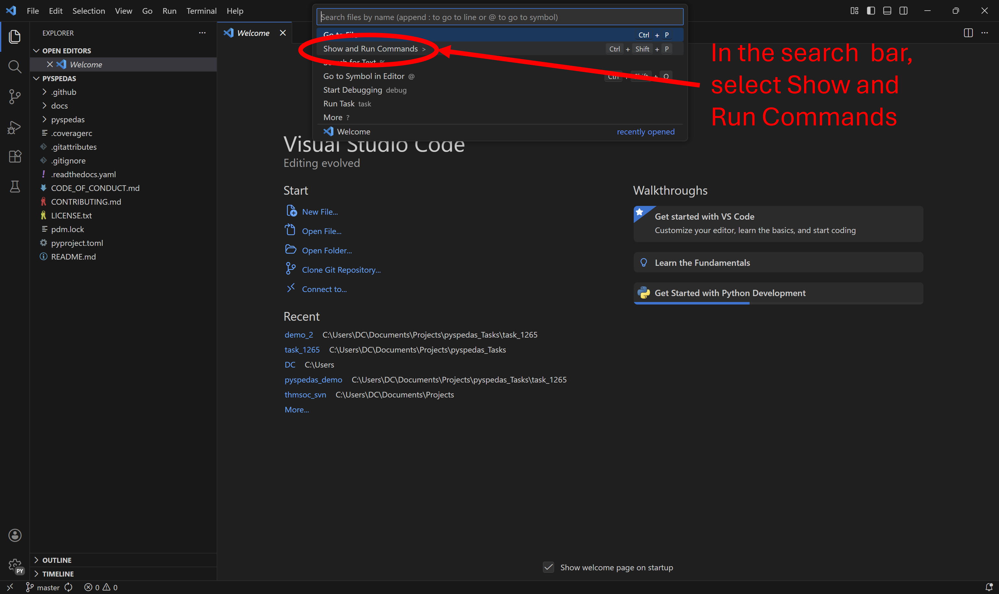
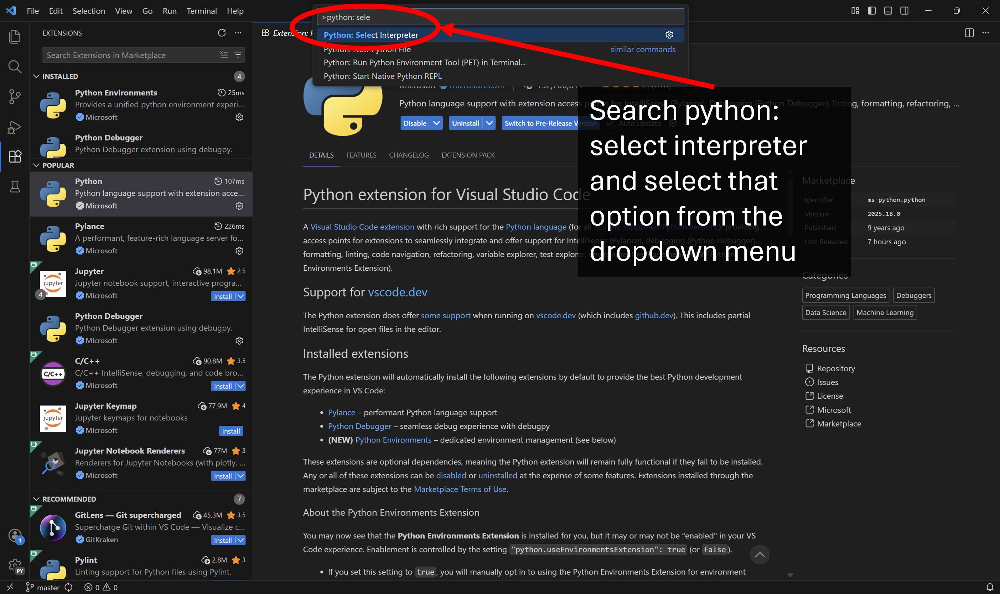
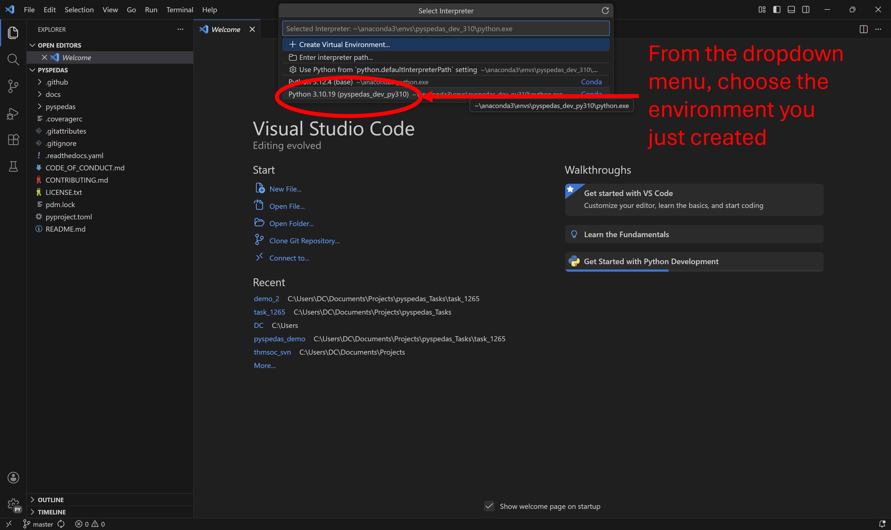
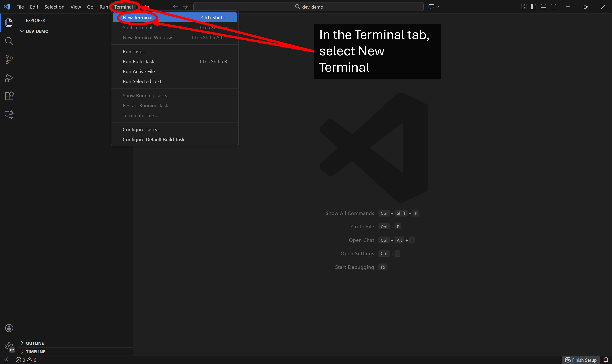
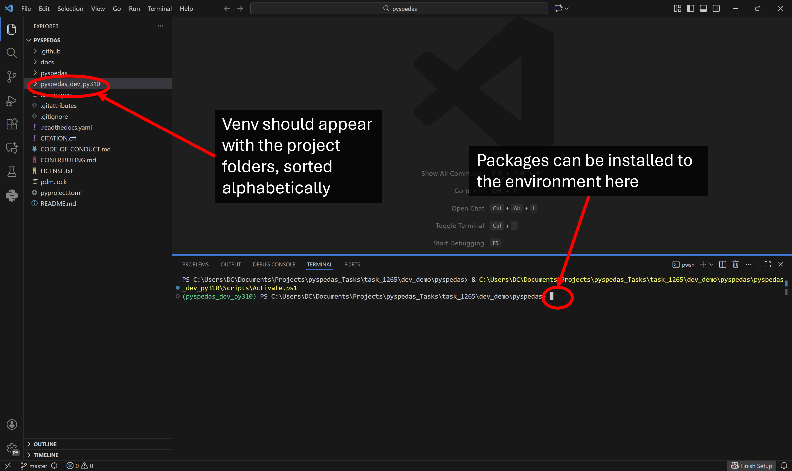

.. _dev-vscode:

Setting up a Visual Studio (VS) Code development environment for PySPEDAS
==========================================================

Install  VS Code
---------------

If you don't already have it, download and install the VS Code Interactive Development Environment (IDE).  It can be downloaded from the VS Code website: https://code.visualstudio.com/download .

Change Default terminal
-----------------------

Open the Settings page by clicking the gear icon in the bottom-left of the window and by choosing Settings from the menu. Alternatively, you can use the keyboard shortcut (Ctrl+,)

In the Settings page, search 'terminal' in the Settings search bar, click to jump to the Terminal section of the settings, and scroll down the setting Terminal > Integrated > Default Profile: Windows. In the dropdown menu, choose Command Prompt.

Connect VS Code to your GitHub Account and Clone PySPEDAS
--------------------------------------

Open the Source Control panel (Ctrl+Shift+G) and select Clone Repository. In the search bar, select "Clone from Github". Alternatively, you could type "Git: Clone" in the Command Pallette (Ctrl+Shift+P). 

A dialogue box will show the prompt: “The extension 'GitHub' wants to sign in using GitHub”. Click Allow to continue. A web browser window will open allowing you to select or sign in to a GitHub account. Follow the prompts to continue with your GitHub account

After GitHub has been authorized, return to the VS Code window, and search/select the spedas/pyspedas repository (PySPEDAS team members) or your personal fork of the repo (outside contributors). You'll then be prompted with a file explorer window to select a folder to serve as the repository destination.

A dialogue box will then ask if you would like to open the repository. Click Open, and a dropdown for the repo folder will be opened in the Explorer pane. In the bottom left, you should see the Source Control pane icon, accompanied by the name of the branch you're currently working in. Clicking this branch name will open a dropdown menu allowing you to select/create branches.

Choose Interpreter and Open Terminal in Conda Environment
---------------------------------------------------------

In the search bar, select or type Show and Run Commands, or use the keyboard shortcut (Ctrl+Shift+P). 

Then, search or choose "Python: Select Interpreter".

A list of environments should appear in the dropdown menu. Virtual Environments could also be created here, or an interpreter path can be selected using a File Explorer window. Choose the conda environment you created previously. 

Install and configure pdm and uv
--------------------------------

In the Terminal tab at the top of the window, select New Terminal, or use the keyboard shortcut (Ctrl+Shift+`).

This will open the Terminal pane, using the Command Prompt terminal due to the setting change made earlier. The conda terminal and the environment made previously will be activated automatically, because the conda env was chosen as the interpreter. Here is where the commnands to install packages to the environment will be used.

Next, you'll need to install some development tools to manage your PySPEDAS project.

PySPEDAS uses the pdm package management tool to manage the pyspedas environment.  We also recommend using 'uv' to install dependencies.  Your new Conda environment should already have 'pip' installed, so we'll use pip to install pdm and uv. Open a terminal window and run the following pip commands:

.. code-block:: bash

    pip install pdm
    pip install uv

Follow any prompts which might appear in the terminal pane, and after successfully installing pdm and uv, configure pdm to use uv:

.. code-block:: bash

    pdm config use_uv true

Install PySPEDAS dependencies and developer tools
-------------------------------------------------

Now you are ready to install the dependencies needed for PySPEDAS.  Do this in the terminal window with:

.. code-block:: bash

    pdm sync

This should install all the runtime, optional, and development dependencies.

If any package dependencies failed to install cleanly with 'pdm sync', you may need to install
them with conda instead.  This is rare on Linux or Windows, but may happen on Mac, depending on what MacOS and
Python versions you're using.  For any packages that failed to install, try installing them with conda instead:

.. code-block:: bash

    conda install -c conda-forge netcdf4

Repeat for each package that failed to install.  Then try 'pdm sync' again to see if any other installation failures occurred.