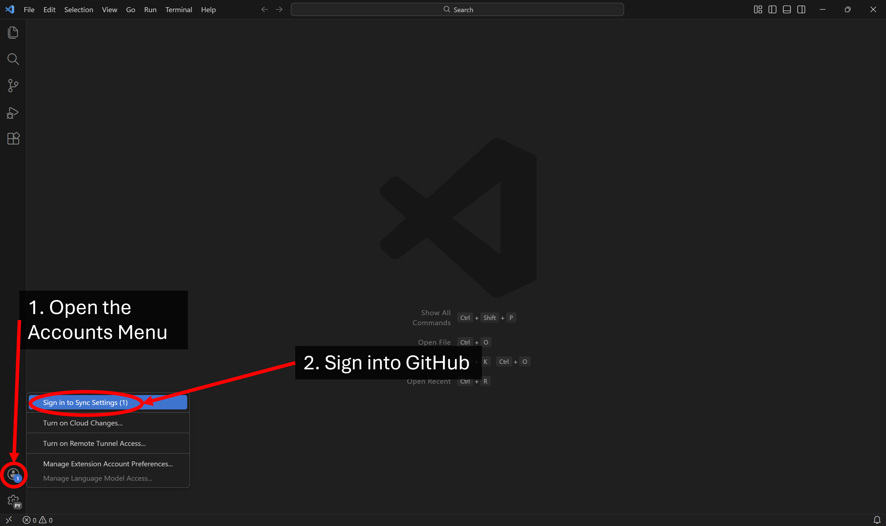
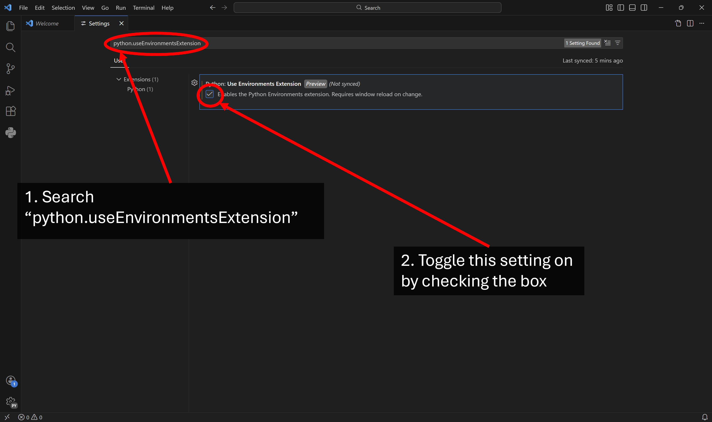
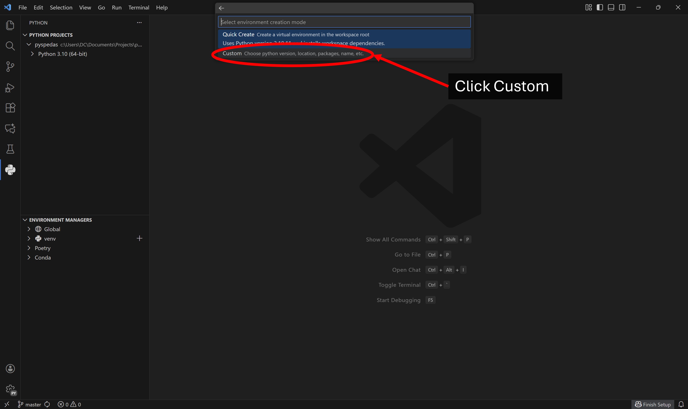
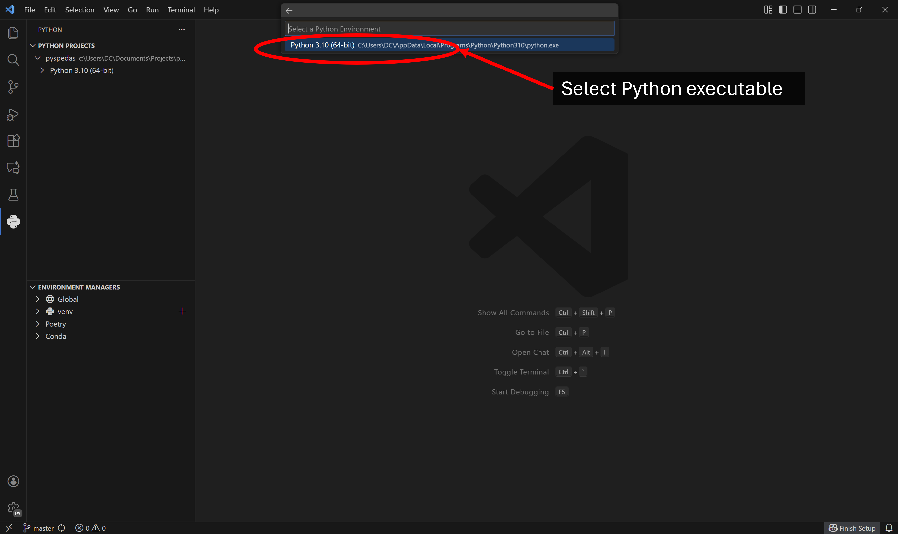
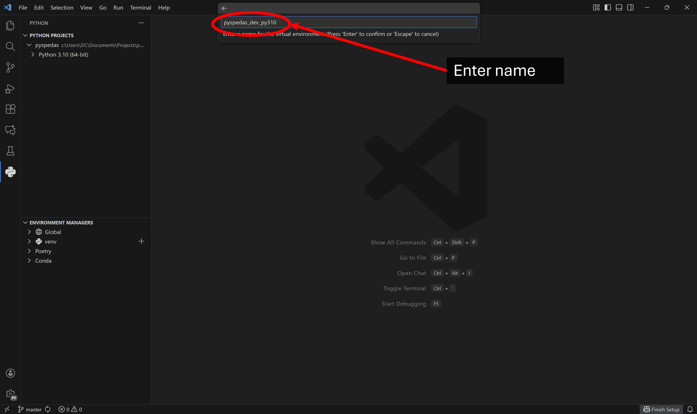
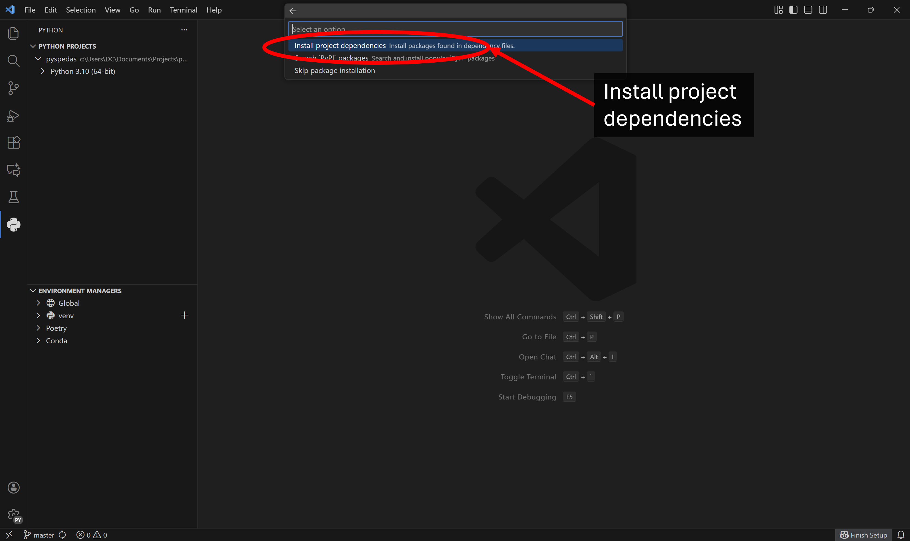
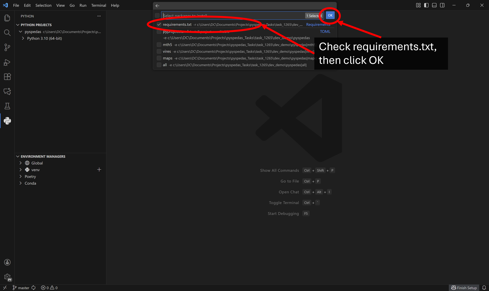

.. _dev-vscode:

Setting up a Visual Studio (VS) Code development environment for PySPEDAS
=========================================================================

This guide will describe the process for setting up VS Code to clone PySPEDAS from GitHub and creating a developement environment for it. These instructions assume you're working in a Windows operating system--VS Code is available for Linux and Mac as well, but the terminal commands may differ.

Install Python Executable
-------------------------

If a Python executable has not already been installed, the following command can be run on Windows Command Prompt:

.. code-block:: bash

    winget install python.python.3.10

Where the decimals values indicate the Python version desired. If no other arguments are set, the executable can be located at %appdata%, under C:\\Users\\YourUsername\\AppData\\Local\\Programs\\Python\\Python310 (in this case).

Install Git
-----------

VS Code does not include Git (although it has integrated git functionality by default); if you do not already have Git installed, it can be downloaded and installed from their website: https://git-scm.com/ .

Install VS Code
---------------

If VS Code has not already been installed, it can be downloaded from the VS Code website: https://code.visualstudio.com/download . Once it is downloaded and installed, open a VS Code window. Since this guide involves adjusting VS Code profile settings, it might be a good idea to create a new VS Code profile for PySPEDAS developement using the guide on the VS Code website: https://code.visualstudio.com/docs/configure/profiles .

Install VS Code Python Extensions
---------------------------------

Open the Extensions pane (Ctrl+Shift+X), and locate the Python extension. It's usually one of the top recommended extensions, but it can be located using the search bar at the top of the Extensions pane. Click on its extension entry and click install. 

.. image:: _static/vscode_installext.png
   :align: center
   :class: imgborder

After it has been installed, there should be 4 extensions in the "Installed" category: Python Environments, Python Debugger, Python, and Pylance. The Python extension page and the extensions pane can now be closed.

Clone PySPEDAS from GitHub
--------------------------

Open the Accounts menu by clicking the account icon, and click "Sign in to Sync Settings". A web browser window will open with a prompt to select or sign-in to a GitHub account. Follow the prompts to authorize permissions and connect your GitHub account, and then switch back to the VS Code window. 

In the File tab, click "Open Folder...", or use the keyboard shortcut (Ctrl+K Ctrl+O). A File Explorer window will open--navigate to where the repository shall be cloned. When the desired folder has been opened, click "Select Folder" at the bottom-right of the File Explorer window. The title of the VS Code workspace should now be the same as that of the selected folder. 

In the Terminal tab at the top, click New Terminal, or use the keyboard shortcut (Ctrl+Shift+`)

.. image:: _static/vscode_openterminal.png
   :align: center
   :class: imgborder

A Terminal pane should open on the bottom of the window as a Powershell (pwsh) terminal. The current path should be to that of the folder which was just opened. Clone the PySPEDAS repository (or the personal fork for outside contributors) by running the following command (for outside contributors, replace the hyperlink to the link to the personal fork):

.. code-block:: bash

    git clone https://github.com/spedas/pyspedas

A "pyspedas" folder will be downloaded into the currently opened folder. Once this has finished, kill the terminal session by clicking the trashcan icon in the terminal pane. 

The current workspace can changed to this new "pyspedas" folder by again opening the File tab at the top and by clicking "Open Folder...", or by using the keyboard shortcut (Ctrl+K Ctrl+O). A File Explorer window will open, and the pyspedas folder can be set as the current workspace by navigating to it and by clicking "Select Folder", like before.

In the bottom left, you should see the Source Control pane icon, accompanied by the name of the branch you're currently working in. Clicking this branch name will open a dropdown menu from the search bar at the top of the window allowing you to select/create branches, if so desired.

Create Virtual Environment (Venv) and Set Interpreter
-----------------------------------------------------
The recommended method of creating and managing environments for PySPEDAS is by using the Python Environments extension; however, it needs to be enabled in the profile settings: open the Settings page using the Manage Profile (gear) icon, or using the keyboard shortcut (Ctrl+,). 

.. image:: _static/vscode_opensettings.png
   :align: center
   :class: imgborder

Use the searchbar in the Settings page to search "python.useEnvironmentsExtension". There should be a single result titled "Python: Use Environments Extension"--check the box, and close the Settings window.

To apply these changes, close and reload VS Code. 

Make sure the PySPEDAS project folder has been set as the workspace, then navigate to the Python pane. The pyspedas project should be listed at the top of the pane, in the Python Projects section (along with the directory where it is saved). It will likely show a global python executable directly underneath it, indicating the currently selected interpreter by default. At the bottom of the pane are the environment managers. In the "venv" section, click the plus icon to create a new Venv.

.. image:: _static/vscode_createenv.png
   :align: center
   :class: imgborder

A dropdown menu will appear from the search bar at the top of the window, with "Quick Create" and "Custom" options. Quick Create functions as if you had chosen to create a Venv via the Python: Select Interpreter command from the Command Palette. In this case, click Custom:

Select a Python interpreter from the dropdown list (in this case, the global Python 3.10 installation):

Enter a name for the new environment (in this case, pyspedas_dev_py310):

Select Install project dependancies:

Select the requirements.txt file, then click OK: 
 

The venv will begin creation, and once complete, VS CODE will open the Explorer pane, showing the new Venv. If you open the Python pane, the new venv should also be listed underneath the pyspedas project, since it should automatically be detected as the interpreter. If it somehow isn't, opening the venv dropdown menu in Environment Managers section of the Python pane should show the venv that was created--clicking on the checkmark (which appears if the cursor hovers over its name) sets that environment as the interpreter.

With the Venv created and the interpreter set, open a new terminal, either through Terminal>New Terminal or the keyboard shortcut (Ctrl+Shift+`). With the terminal pane opened, a Powershell (pwsh) terminal should be loaded, and the Venv should be activated automatically. This is where the following packages will be installed.

.. image:: _static/vscode_terminalpane.png
   :align: center
   :class: imgborder

Install Dependencies
--------------------------------

PySPEDAS uses the pdm package management tool to manage the pyspedas environment, with uv as a resolver.  In the terminal pane, use pip to install pdm to the Venv: 

.. code-block:: bash

    pip install pdm

And then uv:

.. code-block:: bash

    pip install uv

And then pdm-bump (which is useful for doing version bumps during a release workflow):

.. code-block:: bash

    pip install pdm-bump

And configure pdm to use uv:

.. code-block:: bash

    pdm config use_uv true

Then pdm sync can be used to make sure all the dependencies are downloaded or up to date:

.. code-block:: bash

    pdm sync

This should install all the runtime, optional, and development dependencies.

If any package dependencies failed to install cleanly with 'pdm sync', you may need to install
them directly using pip.

.. code-block:: bash

    pip install astropy

Repeat for each package that failed to install.  Then try 'pdm sync' again to see if any other installation failures occurred.