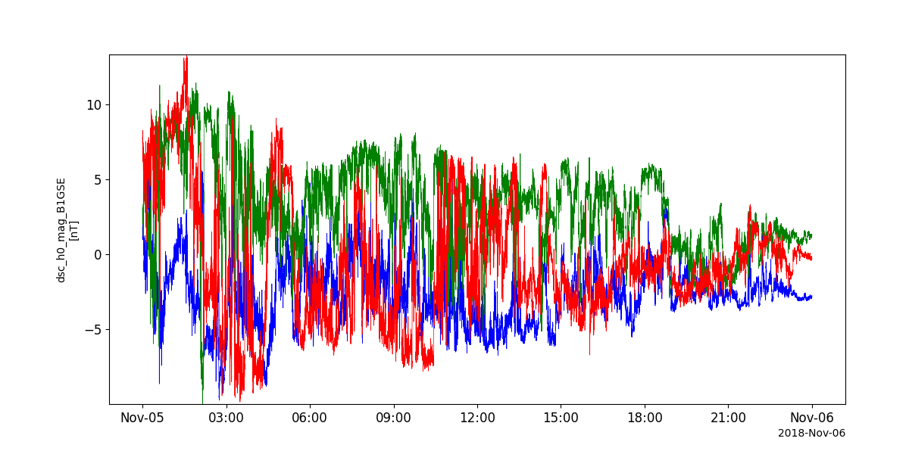
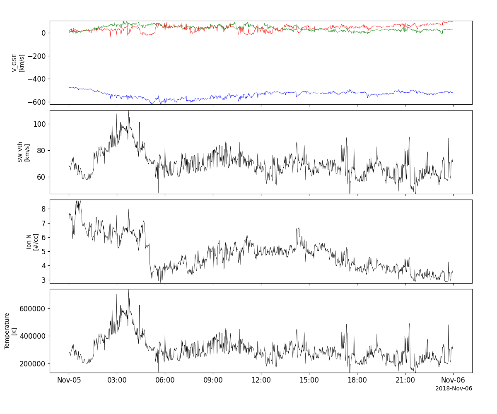
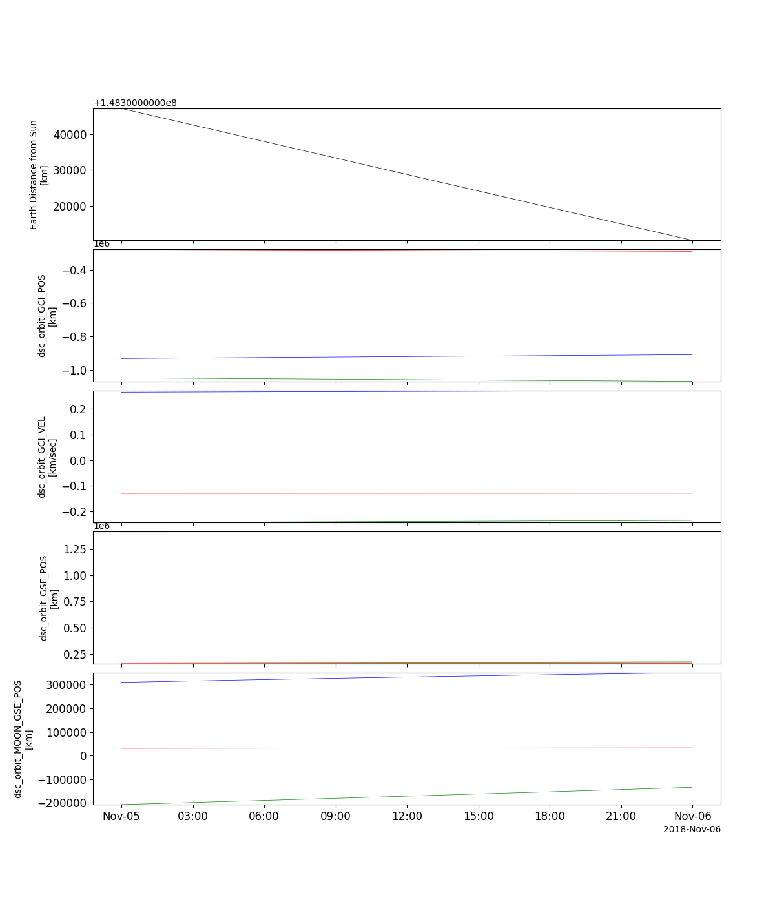
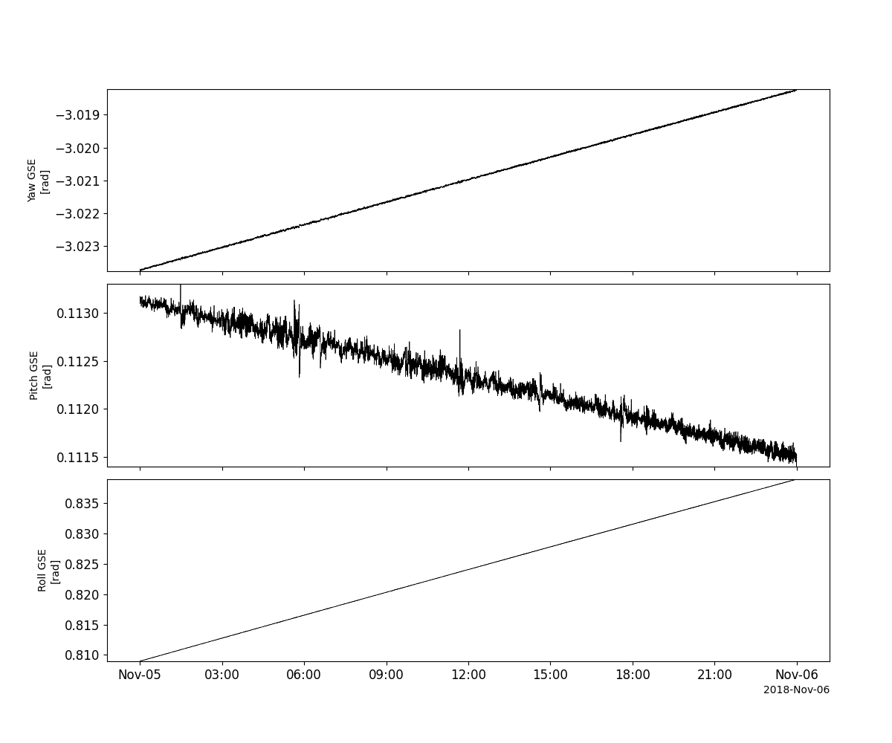
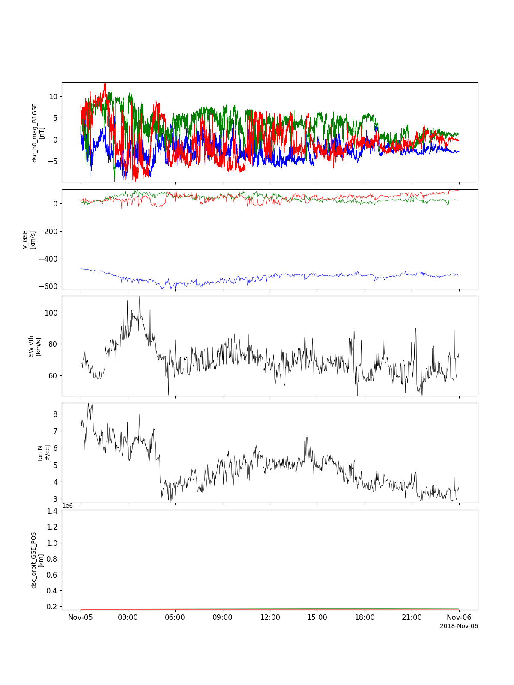

Deep Space Climate Observatory (DSCOVR)
========================================================================
The routines in this module can be used to load data from the Deep Space Climate Observatory (DSCOVR) mission.

Magnetometer (MAG)
----------------------------------------------------------
.. autofunction:: pyspedas.projects.dscovr.mag

Example
^^^^^^^^^

.. code-block:: python
   
   import pyspedas
   from pyspedas import tplot
   mag_vars = pyspedas.projects.dscovr.mag(trange=['2018-11-5', '2018-11-6'])
   tplot('dsc_h0_mag_B1GSE')

Faraday cup (FC)
----------------------------------------------------------
.. autofunction:: pyspedas.projects.dscovr.fc

Example
^^^^^^^^^

.. code-block:: python
   
   import pyspedas
   from pyspedas import tplot
   fc_vars = pyspedas.projects.dscovr.fc(trange=['2018-11-5', '2018-11-6'])
   tplot(['dsc_h1_fc_V_GSE', 'dsc_h1_fc_THERMAL_SPD', 'dsc_h1_fc_Np', 'dsc_h1_fc_THERMAL_TEMP'])

Orbit data
----------------------------------------------------------
.. autofunction:: pyspedas.projects.dscovr.orb

Example
^^^^^^^^^

.. code-block:: python
   
   import pyspedas
   from pyspedas import tplot
   orb_vars = pyspedas.projects.dscovr.orb(trange=['2018-11-5', '2018-11-6'])
   tplot(['dsc_orbit_SUN_R', 'dsc_orbit_GCI_POS', 'dsc_orbit_GCI_VEL', 'dsc_orbit_GSE_POS', 'dsc_orbit_MOON_GSE_POS'])

Attitude data
----------------------------------------------------------
.. autofunction:: pyspedas.projects.dscovr.att

Example
^^^^^^^^^

.. code-block:: python
   
   import pyspedas
   from pyspedas import tplot
   att_vars = pyspedas.projects.dscovr.att(trange=['2018-11-5', '2018-11-6'])
   tplot(['dsc_att_GSE_Yaw', 'dsc_att_GSE_Pitch', 'dsc_att_GSE_Roll'])

Load all data at once
----------------------------------------------------------
.. autofunction:: pyspedas.projects.dscovr.all

Example
^^^^^^^^^

.. code-block:: python
   
   import pyspedas
   from pyspedas import tplot
   all_vars = pyspedas.projects.dscovr.all(trange=['2018-11-5', '2018-11-6'])
   tplot(['dsc_h0_mag_B1GSE', 'dsc_h1_fc_V_GSE', 'dsc_h1_fc_THERMAL_SPD', 'dsc_h1_fc_Np', 'dsc_orbit_GSE_POS'])

