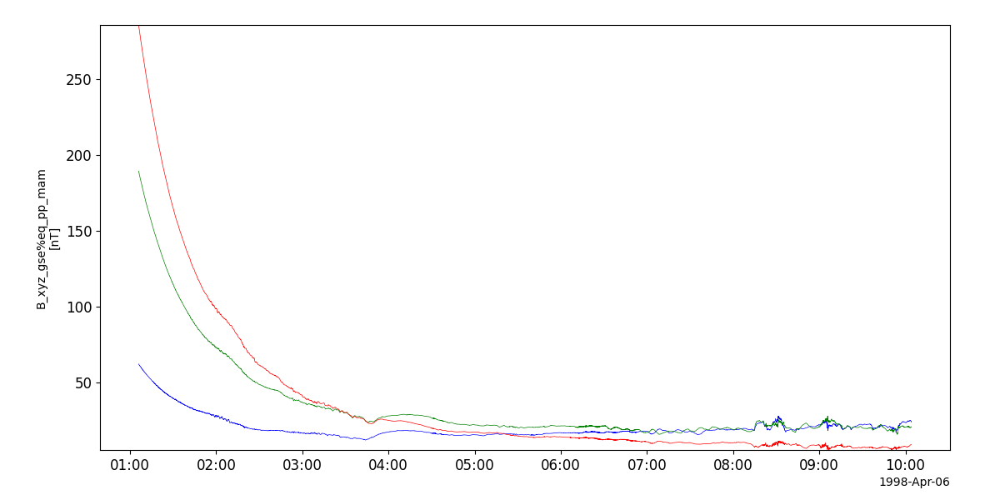
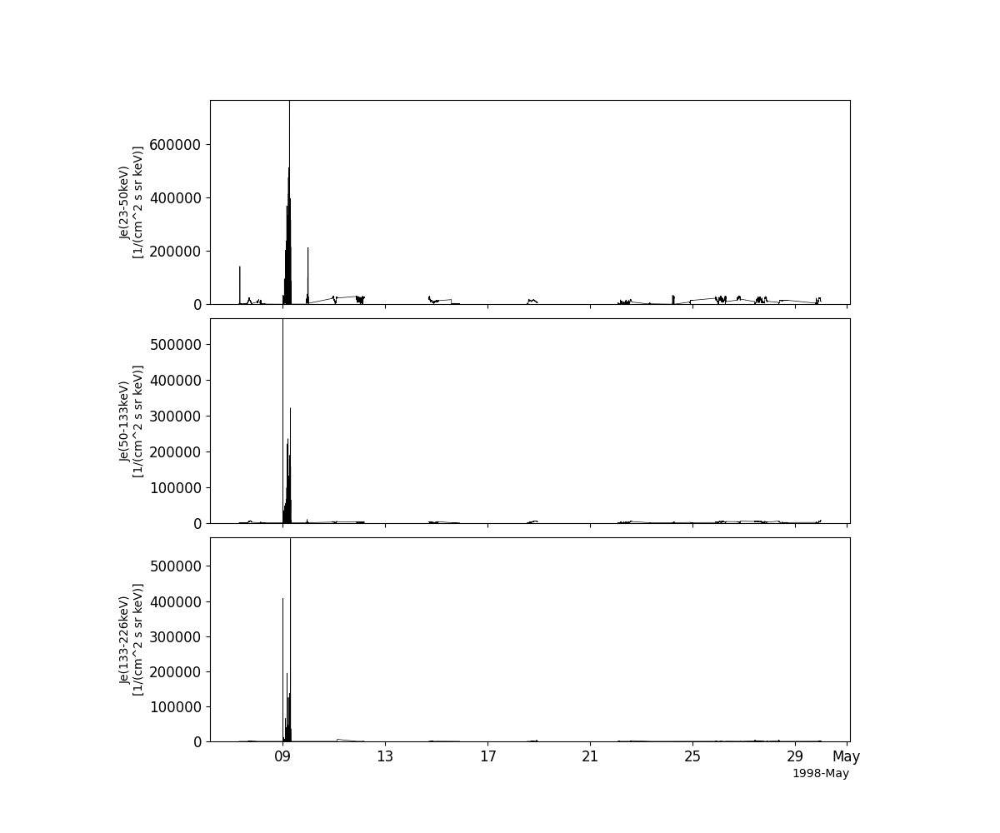
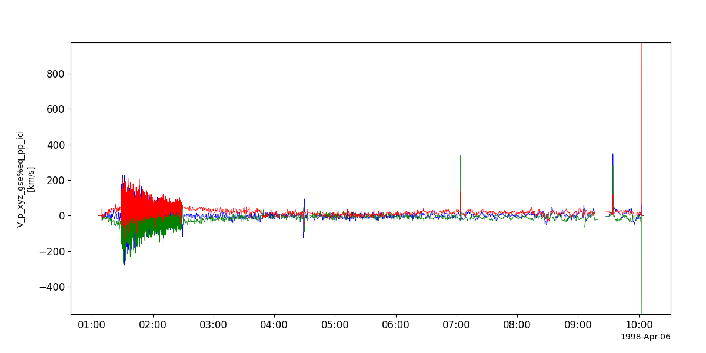
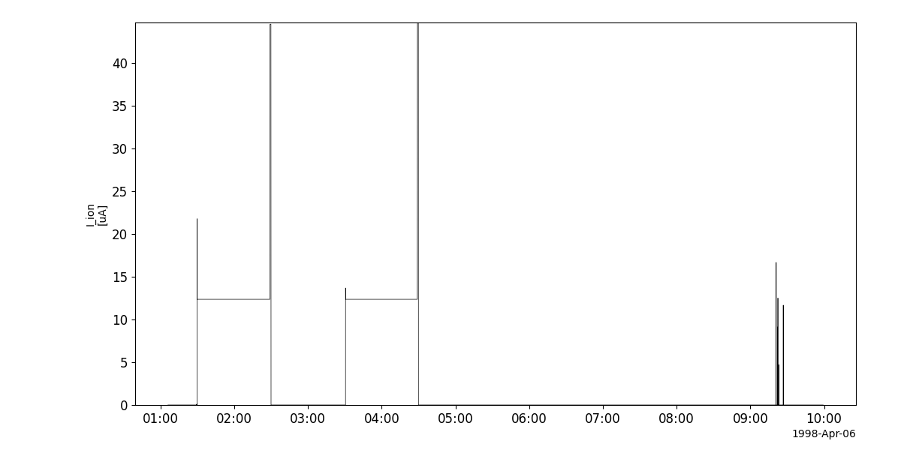
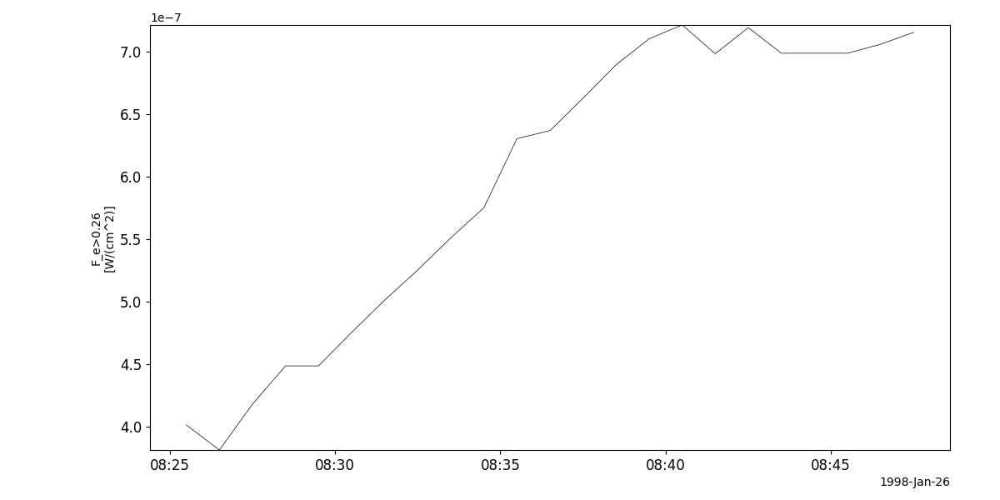

Equator-S
========================================================================
The routines in this module can be used to load data from the Equator-S mission.

Fluxgate magnetometer (MAM)
----------------------------------------------------------
.. autofunction:: pyspedas.equator_s.mam

Example
^^^^^^^^^

.. code-block:: python
   
   import pyspedas
   from pytplot import tplot
   mam_vars = pyspedas.equator_s.mam(trange=['1998-04-06', '1998-04-07'])
   tplot('B_xyz_gse%eq_pp_mam')

Electron beam sensing instrument (EDI)
----------------------------------------------------------
.. autofunction:: pyspedas.equator_s.edi

Example
^^^^^^^^^

.. code-block:: python
   
   import pyspedas
   from pytplot import tplot
   edi_vars = pyspedas.equator_s.edi(trange=['1998-04-06', '1998-04-07'])
   tplot('E_xyz_gse%eq_pp_edi')

.. image:: _static/equator_s_edi.png
   :align: center
   :class: imgborder

Solid state detector (EPI)
----------------------------------------------------------
.. autofunction:: pyspedas.equator_s.epi

Example
^^^^^^^^^

.. code-block:: python
   
   import pyspedas
   from pytplot import tplot
   epi_vars = pyspedas.equator_s.epi(trange=['1998-04-06', '1998-04-07'])
   tplot(['J_e_1%eq_pp_epi', 'J_e_2%eq_pp_epi', 'J_e_3%eq_pp_epi'])

Time-of-fight spectrometer (ICI)
----------------------------------------------------------
.. autofunction:: pyspedas.equator_s.ici

Example
^^^^^^^^^

.. code-block:: python
   
   import pyspedas
   from pytplot import tplot
   ici_vars = pyspedas.equator_s.ici(trange=['1998-04-06', '1998-04-07'])
   tplot('V_p_xyz_gse%eq_pp_ici')

Ion emitter (PCD)
----------------------------------------------------------
.. autofunction:: pyspedas.equator_s.pcd

Example
^^^^^^^^^

.. code-block:: python
   
   import pyspedas
   from pytplot import tplot
   pcd_vars = pyspedas.equator_s.pcd(trange=['1998-04-06', '1998-04-07'])
   tplot('I_ion%eq_pp_pcd')

Scintillating fiber detector (SFD)
----------------------------------------------------------
.. autofunction:: pyspedas.equator_s.sfd

Example
^^^^^^^^^

.. code-block:: python
   
   import pyspedas
   from pytplot import tplot
   sfd_vars = pyspedas.equator_s.sfd()
   tplot('F_e>0.26%eq_sp_sfd')

