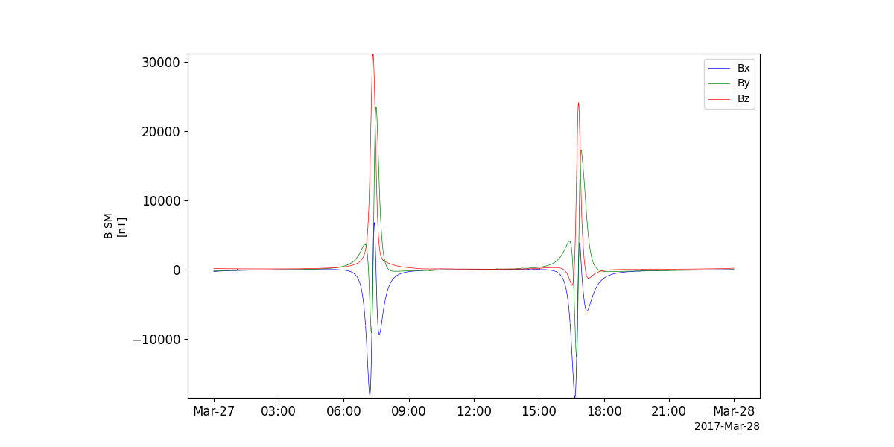
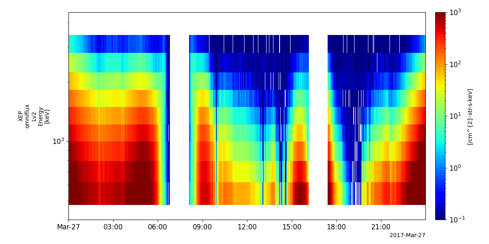
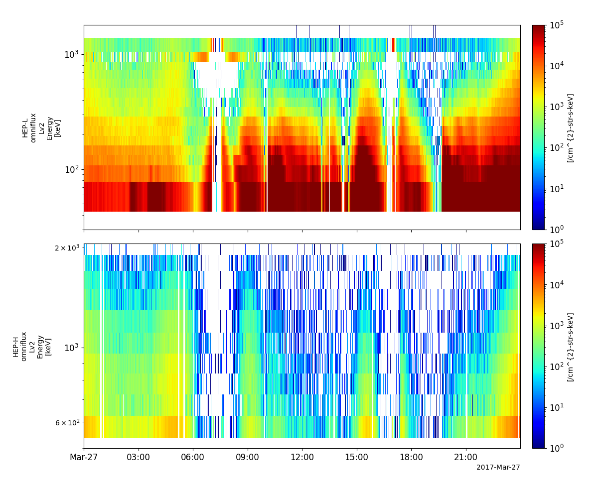
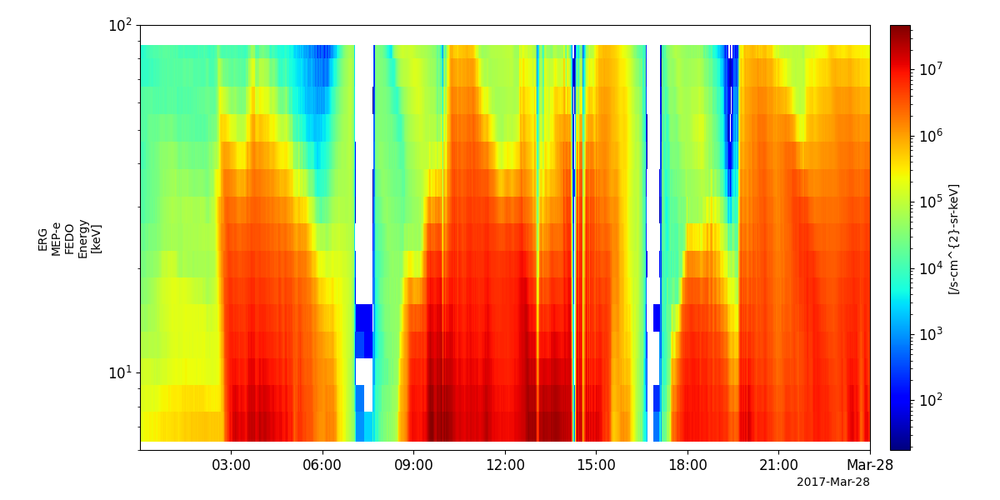
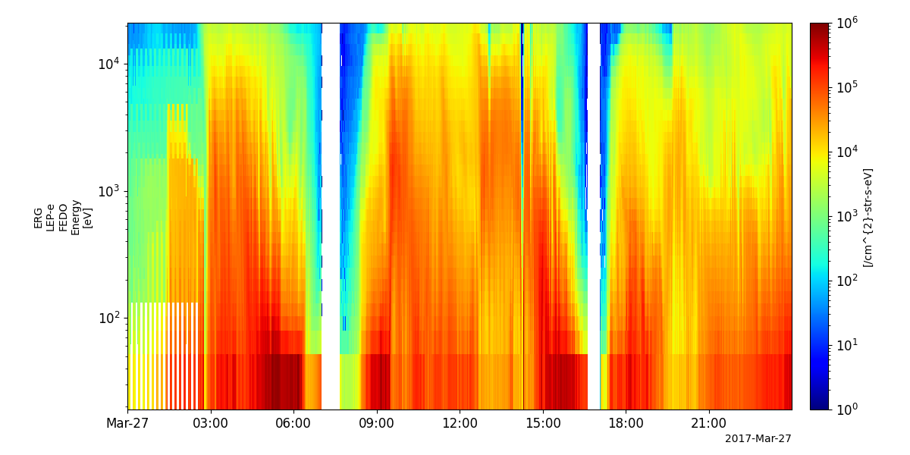
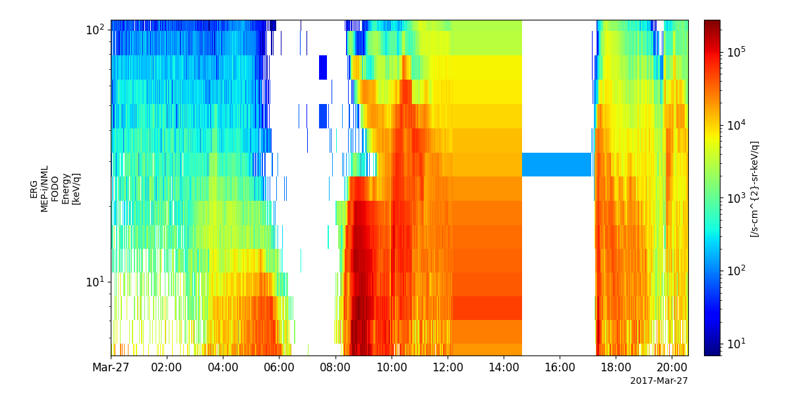
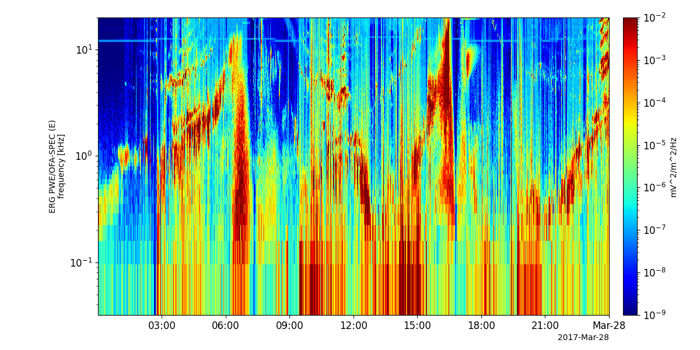
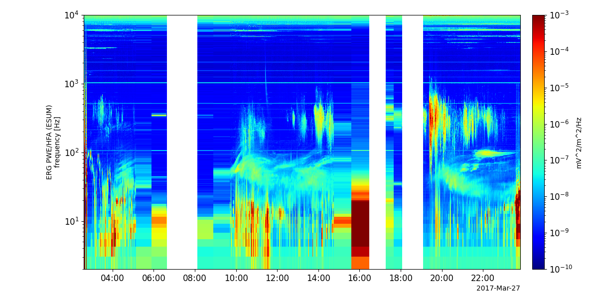
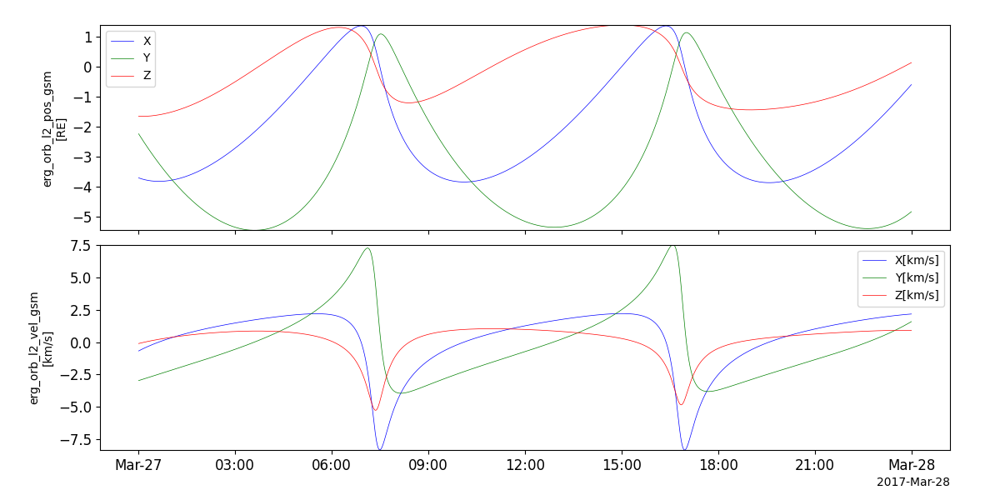

Arase (ERG)
====================================
The routines in this module can be used to load data from the Arase mission.

Magnetic Field Experiment (MGF)
--------------------------------
.. autofunction:: pyspedas.erg.mgf

Example
^^^^^^^^^

.. code-block:: python

    import pyspedas
    from pytplot import tplot
    pyspedas.erg.mgf(trange=['2017-03-27', '2017-03-28'])
    tplot('erg_mgf_l2_mag_8sec_sm')

Extremely High-energy electrons (XEP-e)
------------------------------------------------
.. autofunction:: pyspedas.erg.xep

.. code-block:: python

    import pyspedas
    from pytplot import tplot
    pyspedas.erg.xep(trange=['2017-03-27', '2017-03-28'])
    tplot('erg_xep_l2_FEDO_SSD')

High-energy Particles – electrons (HEP-e)
------------------------------------------------
.. autofunction:: pyspedas.erg.hep

.. code-block:: python

    import pyspedas
    from pytplot import tplot
    pyspedas.erg.xep(trange=['2017-03-27', '2017-03-28'])
    tplot(['erg_hep_l2_FEDO_L', 'erg_hep_l2_FEDO_H'])

Medium-energy Particles - electrons (MEP-e)
------------------------------------------------
.. autofunction:: pyspedas.erg.mepe

.. code-block:: python

    import pyspedas
    from pytplot import tplot
    pyspedas.erg.mepe(trange=['2017-03-27', '2017-03-28'])
    tplot('erg_mepe_l2_omniflux_FEDO')

Low-energy Particles – electrons (LEP-e)
------------------------------------------------
.. autofunction:: pyspedas.erg.lepe

.. code-block:: python

    import pyspedas
    from pytplot import tplot
    pyspedas.erg.lepe(trange=['2017-03-27', '2017-03-28'])
    tplot('erg_lepe_l2_omniflux_FEDO')

Medium-energy Particles – ion (MEP-i)
------------------------------------------------
.. autofunction:: pyspedas.erg.mepi_nml

.. code-block:: python

    import pyspedas
    from pytplot import tplot
    pyspedas.erg.mepi_nml(trange=['2017-03-27', '2017-03-28'])
    tplot('erg_mepi_l2_omniflux_FODO')

.. autofunction:: pyspedas.erg.mepi_tof

Low-energy Particles – ion (LEP-i)
------------------------------------------------
.. autofunction:: pyspedas.erg.lepi

Plasma Wave Experiment (PWE)
------------------------------------------------
.. autofunction:: pyspedas.erg.pwe_ofa

.. code-block:: python

    import pyspedas
    from pytplot import tplot
    pyspedas.erg.pwe_ofa(trange=['2017-03-27', '2017-03-28'])
    tplot('erg_pwe_ofa_l2_spec_E_spectra_132')

.. autofunction:: pyspedas.erg.pwe_hfa

.. code-block:: python

    import pyspedas
    from pytplot import tplot
    pyspedas.erg.pwe_hfa(trange=['2017-03-27', '2017-03-28'])
    tplot('erg_pwe_hfa_l2_low_spectra_esum')

.. autofunction:: pyspedas.erg.pwe_efd

Orbit data
------------------------------------------------
.. autofunction:: pyspedas.erg.orb

.. code-block:: python

    import pyspedas
    from pytplot import tplot
    pyspedas.erg.orb(trange=['2017-03-27', '2017-03-28'])
    tplot(['erg_orb_l2_pos_gsm', 'erg_orb_l2_vel_gsm'])

