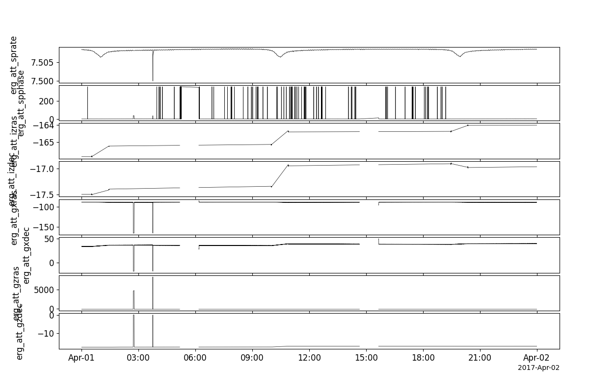
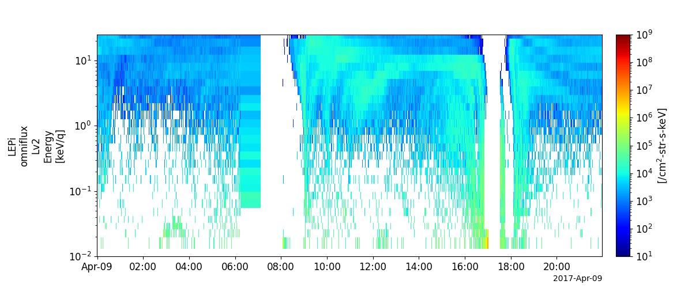
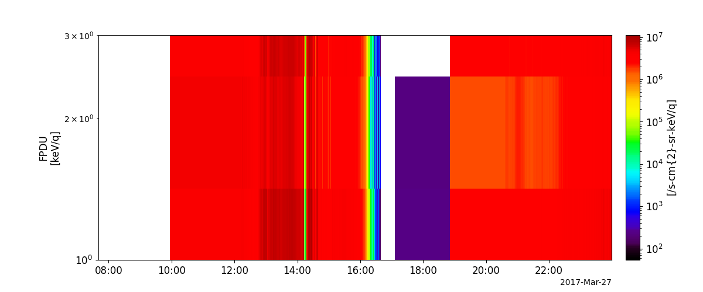
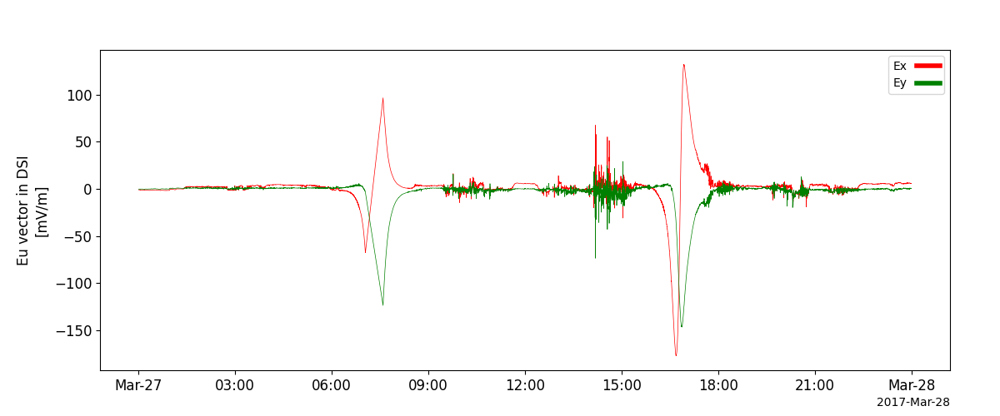
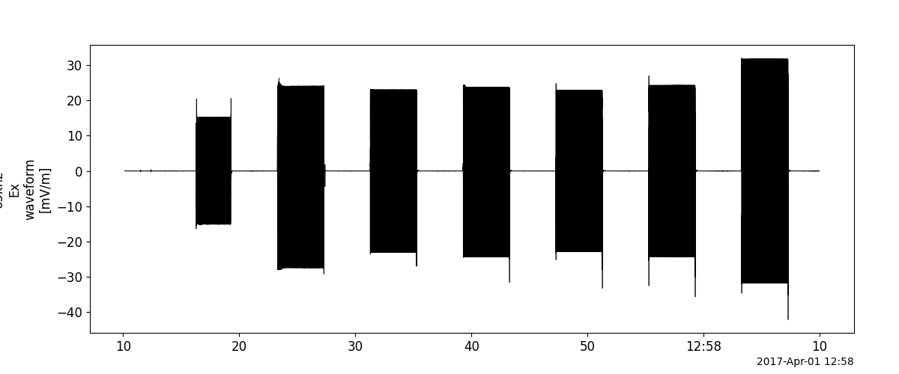

Arase (ERG)
====================================
The routines in this module can be used to load data from the Arase mission, as well as several other ground-based datasets made available by
the ERG Science Center: https://ergsc.isee.nagoya-u.jp

Attitude Data
-------------
.. autofunction:: pyspedas.erg.att
Example
^^^^^^^^^

.. code-block:: python

    import pyspedas
    from pytplot import tplot

    att_vars = pyspedas.erg.att(trange=['2017-04-01', '2017-04-02'])
    tplot(['erg_att_sprate', 'erg_att_spphase', 'erg_att_izras', 'erg_att_izdec', 'erg_att_gxras', 'erg_att_gxdec', 'erg_att_gzras', 'erg_att_gzdec'])

High-energy Particles – electrons (HEP-e)
------------------------------------------------
.. autofunction:: pyspedas.erg.hep

Example
^^^^^^^^^

.. code-block:: python

    import pyspedas
    from pytplot import tplot
    pyspedas.erg.hep(trange=['2017-03-27', '2017-03-28'])
    tplot(['erg_hep_l2_FEDO_L', 'erg_hep_l2_FEDO_H'])

.. image:: _static/erg_hep.png
   :align: center
   :class: imgborder

Low-energy Particles – electrons (LEP-e)
------------------------------------------------
.. autofunction:: pyspedas.erg.lepe

.. code-block:: python

    import pyspedas
    from pytplot import tplot
    pyspedas.erg.lepe(trange=['2017-03-27', '2017-03-28'])
    tplot('erg_lepe_l2_omniflux_FEDO')

.. image:: _static/erg_lepe.png
   :align: center
   :class: imgborder

Low-energy Particles – ion (LEP-i)
------------------------------------------------
.. autofunction:: pyspedas.erg.lepi

Example
^^^^^^^^^
.. code-block:: python

    import pyspedas
    from pytplot import tplot

    lepi_vars = pyspedas.erg.lepi(trange=['2017-03-27', '2017-03-28'])
    tplot('erg_lepi_l2_omniflux_FODO')

Medium-energy Particles - electrons (MEP-e)
------------------------------------------------
.. autofunction:: pyspedas.erg.mepe

.. code-block:: python

    import pyspedas
    from pytplot import tplot
    pyspedas.erg.mepe(trange=['2017-03-27', '2017-03-28'])
    tplot('erg_mepe_l2_omniflux_FEDO')

.. image:: _static/erg_mepe.png
   :align: center
   :class: imgborder

Medium-energy Particles – "normal mode" ion (MEP-i)
------------------------------------------------
.. autofunction:: pyspedas.erg.mepi_nml

.. code-block:: python

    import pyspedas
    from pytplot import tplot
    pyspedas.erg.mepi_nml(trange=['2017-03-27', '2017-03-28'])
    tplot('erg_mepi_l2_omniflux_FODO')

.. image:: _static/erg_mepi_nml.png
   :align: center
   :class: imgborder

Medium-energy Particles - "time of flight mode" ion (MEP-i)
------------------------------------------------------------

.. autofunction:: pyspedas.erg.mepi_tof
.. code-block:: python

    import pyspedas
    from pytplot import tplot
    pyspedas.erg.mepi_nml(trange=['2017-03-27', '2017-03-28'])
    tplot('erg_mepi_l2_omniflux_FODO')

Magnetic Field Experiment (MGF)
--------------------------------
.. autofunction:: pyspedas.erg.mgf

Example
^^^^^^^^^

.. code-block:: python

    import pyspedas
    from pytplot import tplot
    pyspedas.erg.mgf(trange=['2017-03-27', '2017-03-28'])
    tplot('erg_mgf_l2_mag_8sec_sm')

.. image:: _static/erg_mgf.png
   :align: center
   :class: imgborder

Orbit data
------------------------------------------------
.. autofunction:: pyspedas.erg.orb
Example
^^^^^^^^^

.. code-block:: python

    import pyspedas
    from pytplot import tplot
    pyspedas.erg.orb(trange=['2017-03-27', '2017-03-28'])
    tplot(['erg_orb_l2_pos_gsm', 'erg_orb_l2_vel_gsm'])

.. image:: _static/erg_orb.png
   :align: center
   :class: imgborder

Plasma Wave Experiment - Electric Field Detector (PWE-EFD)
--------------------------------------------------------------

.. autofunction:: pyspedas.erg.pwe_efd
Example
^^^^^^^^^

.. code-block:: python

    import pyspedas
    from pytplot import tplot

    pwe_efd_vars = pyspedas.erg.pwe_efd(trange=['2017-03-27', '2017-03-28'])
    tplot('erg_pwe_efd_l2_E_spin_Eu_dsi')

Plasma Wave Experiment - High Frequency Analyzer (PWE-HFA)
--------------------------------------------------------------

.. autofunction:: pyspedas.erg.pwe_hfa
Example
^^^^^^^^^

.. code-block:: python

    import pyspedas
    from pytplot import tplot
    pyspedas.erg.pwe_hfa(trange=['2017-03-27', '2017-03-28'])
    tplot('erg_pwe_hfa_l2_low_spectra_esum')

.. image:: _static/erg_pwe_hfa.png
   :align: center
   :class: imgborder

Plasma Wave Experiment - Onboard Frequency Analyzer (PWE-OFA)
--------------------------------------------------------------
.. autofunction:: pyspedas.erg.pwe_ofa
Example
^^^^^^^^^

.. code-block:: python

    import pyspedas
    from pytplot import tplot
    pyspedas.erg.pwe_ofa(trange=['2017-03-27', '2017-03-28'])
    tplot('erg_pwe_ofa_l2_spec_E_spectra_132')

.. image:: _static/erg_pwe_ofa.png
   :align: center
   :class: imgborder

Plasma Wave Experiment - Waveform Capture (PWE-WFC)
--------------------------------------------------------------
.. autofunction:: pyspedas.erg.pwe_wfc
Example
^^^^^^^^^

.. code-block:: python

    import pyspedas
    from pytplot import tplot

    pwe_wfc_vars = pyspedas.erg.pwe_wfc(trange=['2017-04-01/12:00:00', '2017-04-01/13:00:00'])
    tplot('erg_pwe_wfc_l2_e_65khz_Ex_waveform')

Extremely High-energy electrons (XEP-e)
------------------------------------------------
.. autofunction:: pyspedas.erg.xep

.. code-block:: python

    import pyspedas
    from pytplot import tplot
    pyspedas.erg.xep(trange=['2017-03-27', '2017-03-28'])
    tplot('erg_xep_l2_FEDO_SSD')

.. image:: _static/erg_xep.png
   :align: center
   :class: imgborder
