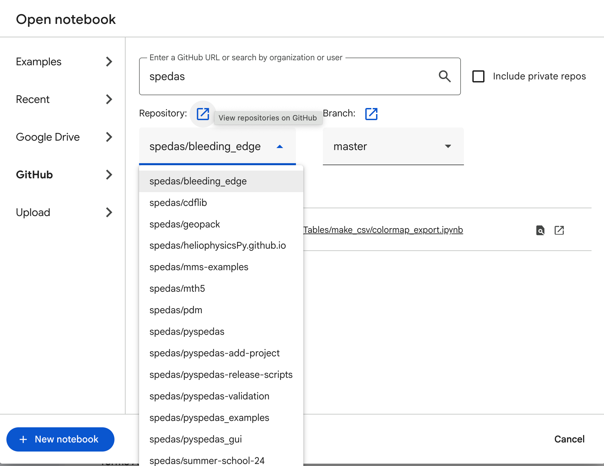
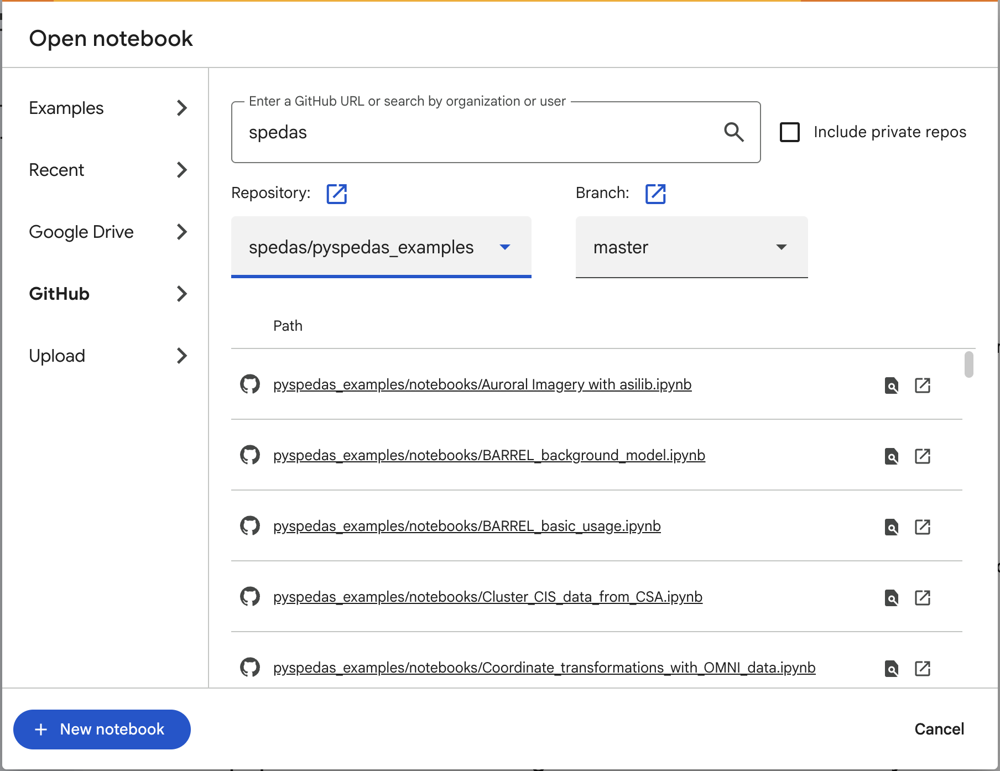
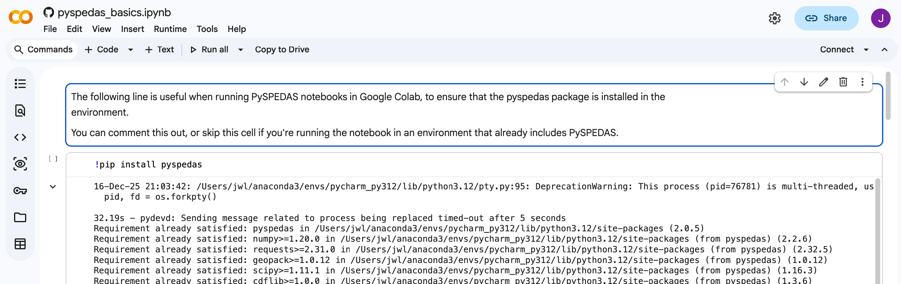

.. _examples_and_tutorials:

PySPEDAS Examples and Tutorials
=========================================

PySPEDAS Example Notebooks
--------------------------

The PySPEDAS team maintains several GitHub repositories containing Jupyter notebooks showing many different
examples of how to use PySPEDAS for loading, analyzing, and plotting heliophysics data.

At this time we offer three repositories of PySPEDAS examples:

Basic PySPEDAS usage and simple workflows: https://github.com/spedas/pyspedas_examples/blob/master/pyspedas_examples/

Simple workflows using THEMIS data: https://github.com/spedas/themis-examples/blob/master/themis-examples/

Workflows (beginning through somewhat advanced) using MMS data: https://github.com/spedas/mms-examples/blob/master/mms-examples

To use them, go to one of the URLs above, find a notebook you're interested it, then use the steps described
in the previous section to download the notebook and run it in your own PySPEDAS environment.

PySPEDAS Examples on Google Colab (PySPEDAS in the cloud: no local installation required!)
-------------------------------------------------------------------------------------------

Google's Colab service offers a cloud environment that is capable of running Jupyter notebooks.
This is a good option if you want to try PySPEDAS without worrying about installing it locally, or
if you want to share a workflow with a colleague who may not have PySPEDAS installed.

Google Colab has a built-in capability to run Jupyter notebooks directly from a GitHub repository.

To run a PySPEDAS notebook from one of our example repositories in Google Colab:

Open your browser to https://colab.research.google.com/ .

From that page, you should be able to select “GitHub” from the left hand pane, then enter the
Github organization ‘spedas’ in the search box. This will bring up a list of repositories associated with
SPEDAS, as shown in the image below:

Scroll through the list of SPEDAS repositories, find the examples you're interested in running (pyspedas_examples, themis-examples,
or mms-examples), and click on that entry.  The screenshot below shows the list of notebooks available if you
select the pyspedas_examples repository:

The next screen will show a list of available notebooks from that repository. Find one that you're interested in, and click on it -- that should bring up
an interactive Jupyter session with that notebook loaded:

All the PySPEDAS example notebooks are designed to be runnable on Google Colab.  In the above image,
you can see that the first code cell in the notebook contains a command to install PySPEDAS:

.. code-block:: bash

   !pip install pyspedas

PySPEDAS wouldn't normally be installed in a fresh Google Colab environment, so this line is included to
let you install pyspedas (in Google's cloud environment) without leaving the notebook.  You may skip this
line if you've downloaded the notebook and are running it in an environment that already has PySPEDAS installed.

