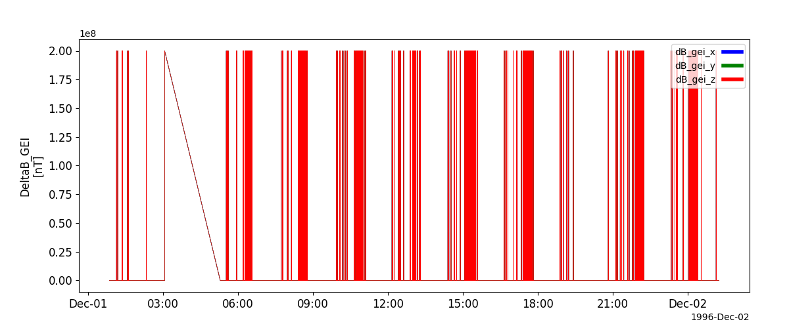
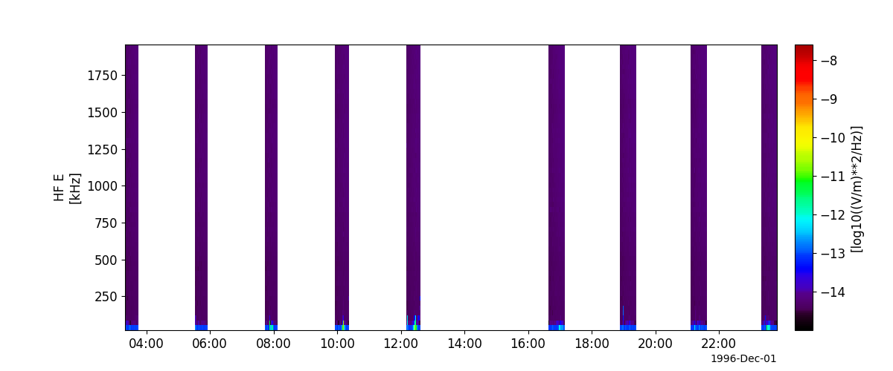
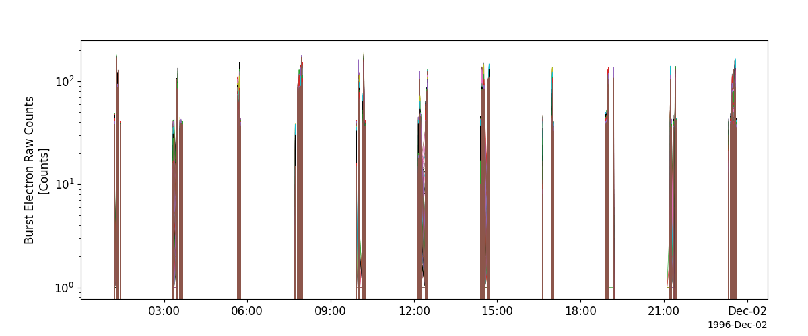

Fast Auroral Snapshot Explorer (FAST)
========================================================================
The routines in this module can be used to load data from the Fast Auroral Snapshot Explorer (FAST) mission.

Fluxgate Magnetometer (DCF)
----------------------------------------------------------
.. autofunction:: pyspedas.projects.fast.dcf

Example
^^^^^^^^^

.. code-block:: python
   
   import pyspedas
   from pytplot import tplot
   dcf_vars = pyspedas.projects.fast.dcf(trange=["1996-12-01", "1996-12-02"])
   tplot(['fast_dcf_DeltaB_GEI'])

Search-coil Magnetometer (ACF)
----------------------------------------------------------
.. autofunction:: pyspedas.projects.fast.acf

Example
^^^^^^^^^

.. code-block:: python
   
   import pyspedas
   from pytplot import tplot
   acf_vars = pyspedas.projects.fast.acf(trange=["1996-12-01", "1996-12-02"])
   tplot('fast_acf_HF_E_SPEC')

Electrostatic Analyzers (ESA)
----------------------------------------------------------
.. autofunction:: pyspedas.projects.fast.esa

Example
^^^^^^^^^

.. code-block:: python
   
   import pyspedas
   from pytplot import tplot
   esa_vars = pyspedas.projects.fast.esa(trange=["1996-12-01", "1996-12-02"])
   tplot('fast_esa_eflux')

Time-of-flight Energy Angle Mass Spectrograph (TEAMS)
----------------------------------------------------------
.. autofunction:: pyspedas.projects.fast.teams

Example
^^^^^^^^^

.. code-block:: python
   
   import pyspedas
   from pytplot import tplot
   teams_vars = pyspedas.projects.fast.teams(trange=["2005-08-01", "2005-08-02"])
   tplot(['fast_teams_helium_omni_flux'])

.. image:: _static/fast_teams.png
   :align: center
   :class: imgborder

