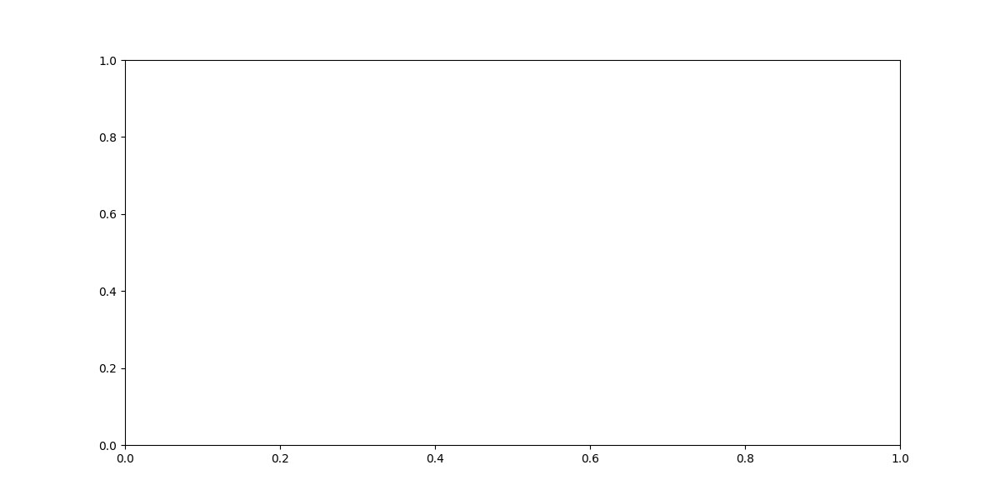
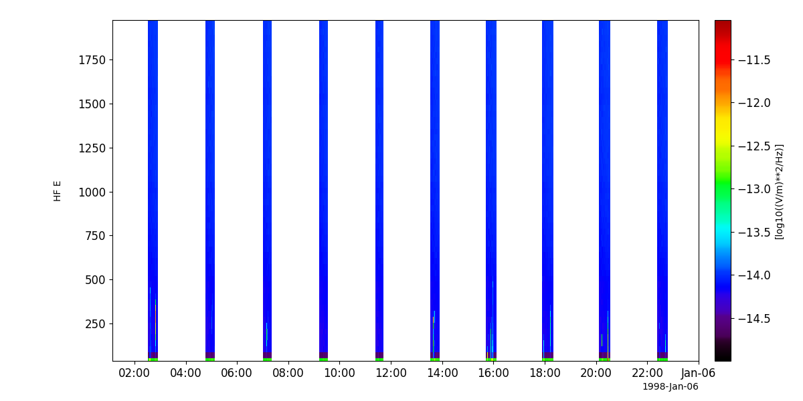
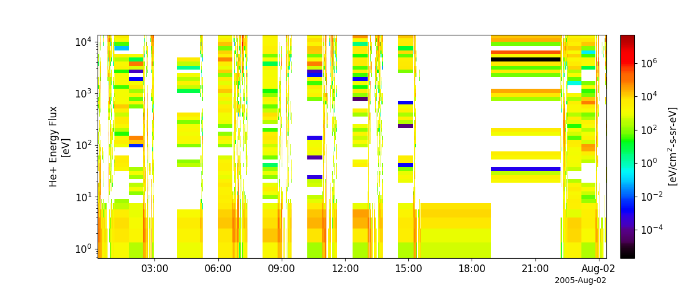

Fast Auroral Snapshot Explorer (FAST)
========================================================================
The routines in this module can be used to load data from the Fast Auroral Snapshot Explorer (FAST) mission.

Fluxgate Magnetometer (DCB)
----------------------------------------------------------
.. autofunction:: pyspedas.fast.dcb

Example
^^^^^^^^^

.. code-block:: python
   
   import pyspedas
   from pytplot import tplot
   dcb_vars = pyspedas.fast.dcb(trange=['1998-09-05', '1998-09-06'])
   tplot('')

Search-coil Magnetometer (ACB)
----------------------------------------------------------
.. autofunction:: pyspedas.fast.acb

Example
^^^^^^^^^

.. code-block:: python
   
   import pyspedas
   from pytplot import tplot
   acb_vars = pyspedas.fast.acb()
   tplot('HF_E_SPEC')

Time-of-flight Energy Angle Mass Spectrograph (TEAMS)
----------------------------------------------------------
.. autofunction:: pyspedas.fast.teams

Example
^^^^^^^^^

.. code-block:: python
   
   import pyspedas
   from pytplot import tplot
   teams_vars = pyspedas.fast.teams(trange=['1998-09-05', '1998-09-06'])
   tplot(['H+', 'H+_low', 'H+_high'])

