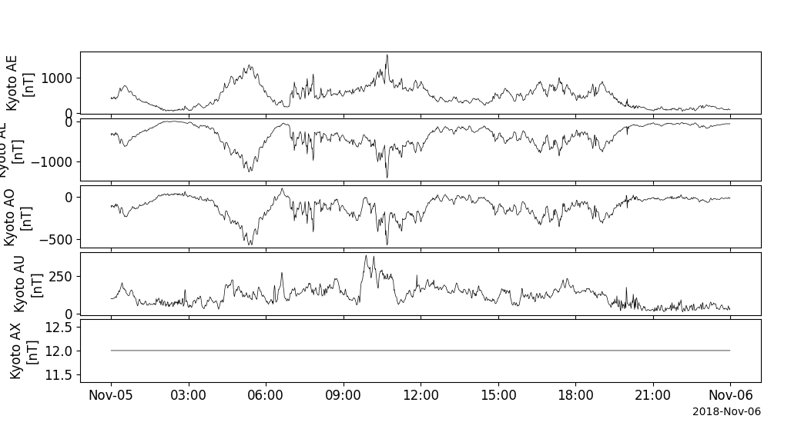

Geomagnetic, Solar Wind, and Magnetospheric Indices (Kp, Dst, OMNIweb, etc)
===========================================================================
The routines described in this section can be used to load several sets of geomagnetic and space weather indices.

Kyoto Dst
---------
.. autofunction:: pyspedas.projects.kyoto.dst
   :no-index:

Example
^^^^^^^

.. code-block:: python
   
   import pyspedas
   from pytplot import tplot
   dst_vars = pyspedas.projects.kyoto.dst(trange=['2018-11-5', '2018-11-6'])
   tplot('kyoto_dst')

.. image:: _static/kyoto_dst.png
   :align: center
   :class: imgborder

Kyoto AE
---------
.. autofunction:: pyspedas.projects.kyoto.load_ae
   :no-index:

Example
^^^^^^^

.. code-block:: python
   
   import pyspedas
   from pytplot import tplot
   ae_vars = pyspedas.projects.kyoto.load_ae(trange=['2018-11-5', '2018-11-6'])
   tplot(ae_vars)

NOAA/GFZ Kp and other geomagnetic Indices
-----------------------------------------
.. autofunction:: pyspedas.projects.noaa.noaa_load_kp
   :no-index:

Example
^^^^^^^

.. code-block:: python

   import pyspedas
   from pytplot import tplot
   geom_ind = pyspedas.projects.noaa.noaa_load_kp(trange=['2018-11-5', '2018-11-6'])
   tplot(geom_ind)

.. image:: _static/kyoto_dst.png
   :align: center

OMNI Solar Wind and magnetospheric indices
-------------------------------------------
The pyspedas.projects.omni.data() routine can be used to load variables from the OMNIweb data set.

.. autofunction:: pyspedas.projects.omni.data
   :no-index:

Example
^^^^^^^^^

.. code-block:: python

   import pyspedas
   from pytplot import tplot
   omni_vars = pyspedas.projects.omni.data(trange=['2013-11-5', '2013-11-6'])
   tplot(['BX_GSE', 'BY_GSE', 'BZ_GSE', 'flow_speed', 'Vx', 'Vy', 'Vz', 'SYM_H'])

.. image:: _static/omni_data.png
   :align: center
   :class: imgborder

