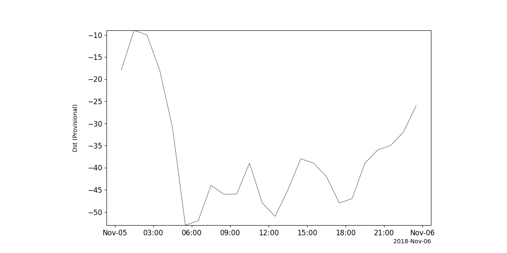

Geomagnetic, Solar Wind, and Magnetospheric Indices
========================================================================
The routines described in this section can be used to load several sets of geomagnetic and space weather indices.

Kyoto Dst
---------
.. autofunction:: pyspedas.kyoto.dst

Example
^^^^^^^

.. code-block:: python
   
   import pyspedas
   from pytplot import tplot
   dst_vars = pyspedas.kyoto.dst(trange=['2018-11-5', '2018-11-6'])
   tplot('kyoto_dst')

NOAA/GFZ Kp and other geomagnetic Indices
-----------------------------------------
.. autofunction:: pyspedas.noaa_load_kp

Example
^^^^^^^

.. code-block:: python

   import pyspedas
   from pytplot import tplot
   geom_ind = pyspedas.noaa.noaa_load_kp(trange=['2018-11-5', '2018-11-6'])
   tplot(geom_ind)

OMNI Solar Wind and magnetospheric data
========================================================================
The routines in this module can be used to load data from the OMNIweb data set.

Load all available OMNI variables
----------------------------------

.. autofunction:: pyspedas.omni.data

Example
^^^^^^^^^

.. code-block:: python

   import pyspedas
   from pytplot import tplot
   omni_vars = pyspedas.omni.data(trange=['2013-11-5', '2013-11-6'])
   tplot(['BX_GSE', 'BY_GSE', 'BZ_GSE', 'flow_speed', 'Vx', 'Vy', 'Vz', 'SYM_H'])

.. image:: _static/omni_data.png
   :align: center
   :class: imgborder

