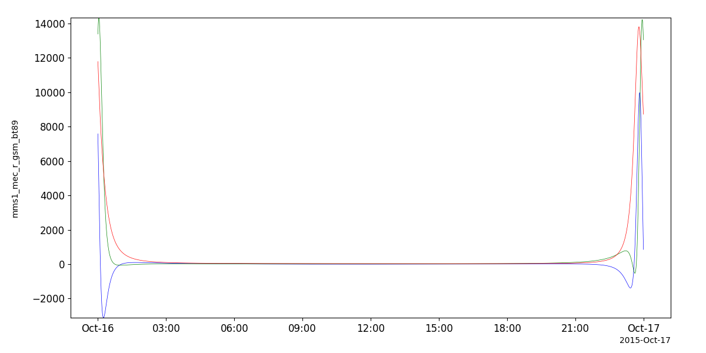
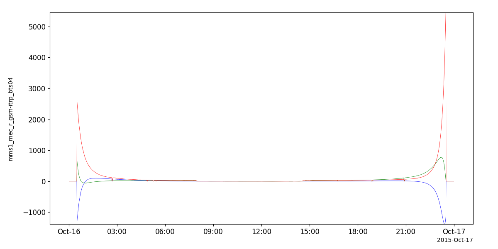

Magnetic Field Models
====================================
The routines in this module can be used to calculate Tsyganenko magnetic field models using Sheng Tian's implementation of the `geopack` library (https://github.com/tsssss/geopack).

Tsyganenko 89 (T89)
-----------------------------

.. autofunction:: pyspedas.tt89

T89 Example
^^^^^^^^^^^^

.. code-block:: python
   
   # load some spacecraft position data
   import pyspedas
   pyspedas.mms.mec(trange=['2015-10-16', '2015-10-17'])

   # calculate the field using the T89 model
   from pyspedas.geopack import tt89
   tt89('mms1_mec_r_gsm')

   from pytplot import tplot
   tplot('mms1_mec_r_gsm_bt89')

Tsyganenko 96 (T96)
-----------------------------

.. autofunction:: pyspedas.tt96

T96 Example
^^^^^^^^^^^^

.. code-block:: python
   
   # load some spacecraft position data
   import pyspedas
   pyspedas.mms.mec(trange=['2015-10-16', '2015-10-17'])

   # calculate the params using the solar wind data; see the "Solar Wind Parameters" section below for an example

   # interpolate the MEC timestamps to the solar wind timestamps
   from pyspedas import tinterpol
   tinterpol('mms1_mec_r_gsm', 'proton_density')

   # calculate the field using the T96 model 
   from pyspedas.geopack import tt96
   tt96('mms1_mec_r_gsm-itrp', parmod=params)

   from pytplot import tplot
   tplot('mms1_mec_r_gsm-itrp_bt96')

.. image:: _static/tt96.png
   :align: center
   :class: imgborder

Tsyganenko 2001 (T01)
-----------------------------

.. autofunction:: pyspedas.tt01

T01 Example
^^^^^^^^^^^^

.. code-block:: python
   
   # load some spacecraft position data
   import pyspedas
   pyspedas.mms.mec(trange=['2015-10-16', '2015-10-17'])

   # calculate the params using the solar wind data; see the "Solar Wind Parameters" section below for an example

   # interpolate the MEC timestamps to the solar wind timestamps
   from pyspedas import tinterpol
   tinterpol('mms1_mec_r_gsm', 'proton_density')

   # calculate the field using the T01 model
   from pyspedas.geopack import tt01
   tt01('mms1_mec_r_gsm-itrp', parmod=params)

   from pytplot import tplot
   tplot('mms1_mec_r_gsm-itrp_bt01')

.. image:: _static/tt01.png
   :align: center
   :class: imgborder

Tsyganenko-Sitnov 2004 (TS04)
-----------------------------

.. autofunction:: pyspedas.tts04

TS04 Example
^^^^^^^^^^^^

.. code-block:: python

   # load some spacecraft position data
   import pyspedas
   pyspedas.mms.mec(trange=['2015-10-16', '2015-10-17'])

   # calculate the params using the solar wind data; see the "Solar Wind Parameters" section below for an example

   # interpolate the MEC timestamps to the solar wind timestamps
   from pyspedas import tinterpol
   tinterpol('mms1_mec_r_gsm', 'proton_density')

   # calculate the field using the TS04 model
   from pyspedas.geopack import tts04
   tts04('mms1_mec_r_gsm-itrp', parmod=params)

   from pytplot import tplot
   tplot('mms1_mec_r_gsm-itrp_bts04')

Solar Wind Parameters
-----------------------------
To generate the "parmod" variable using Dst and solar wind data, use the `get_tsy_params` routine. 

.. autofunction:: pyspedas.get_tsy_params

get_tsy_params Example
^^^^^^^^^^^^

.. code-block:: python
   
   # load Dst and solar wind data
   import pyspedas
   pyspedas.kyoto.dst(trange=['2015-10-16', '2015-10-17'])
   pyspedas.omni.data(trange=['2015-10-16', '2015-10-17'])

   # join the components of B into a single variable
   # BX isn't used
   from pytplot import join_vec
   join_vec(['BX_GSE', 'BY_GSM', 'BZ_GSM'])

   from pyspedas.geopack.get_tsy_params import get_tsy_params
   params = get_tsy_params('kyoto_dst', 
                        'BX_GSE-BY_GSM-BZ_GSM_joined', 
                        'proton_density', 
                        'flow_speed', 
                        't96', # or 't01', 'ts04'
                        pressure_tvar='Pressure',
                        speed=True)
