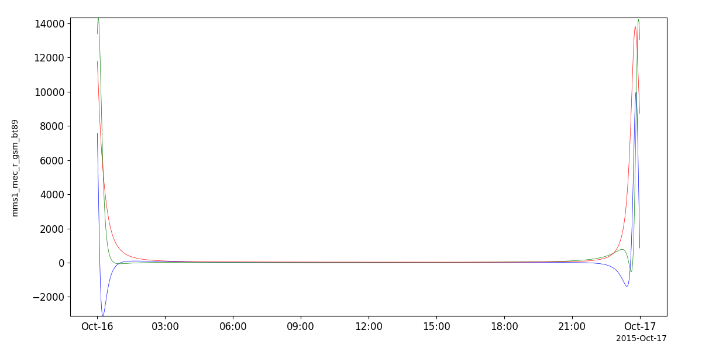
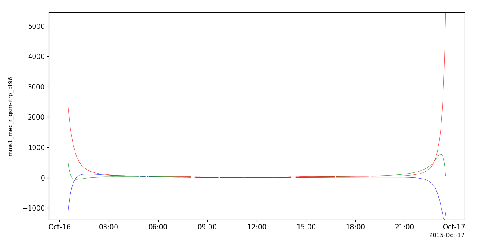
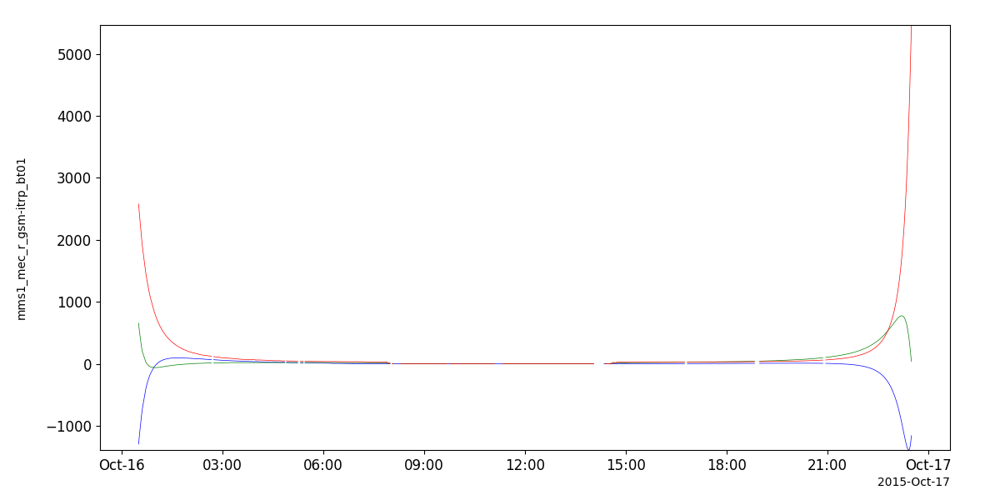
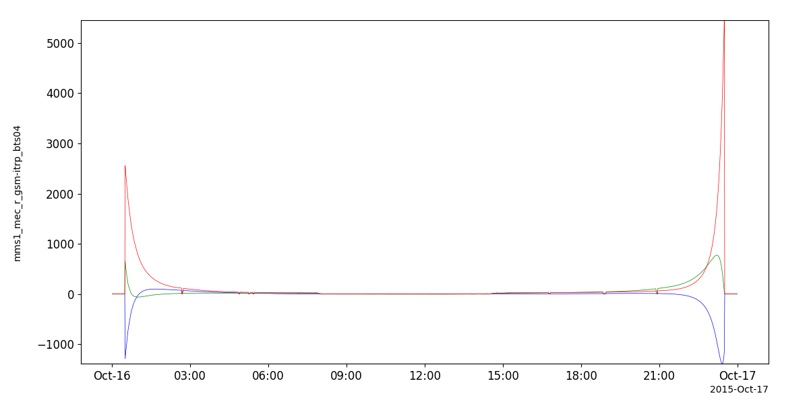
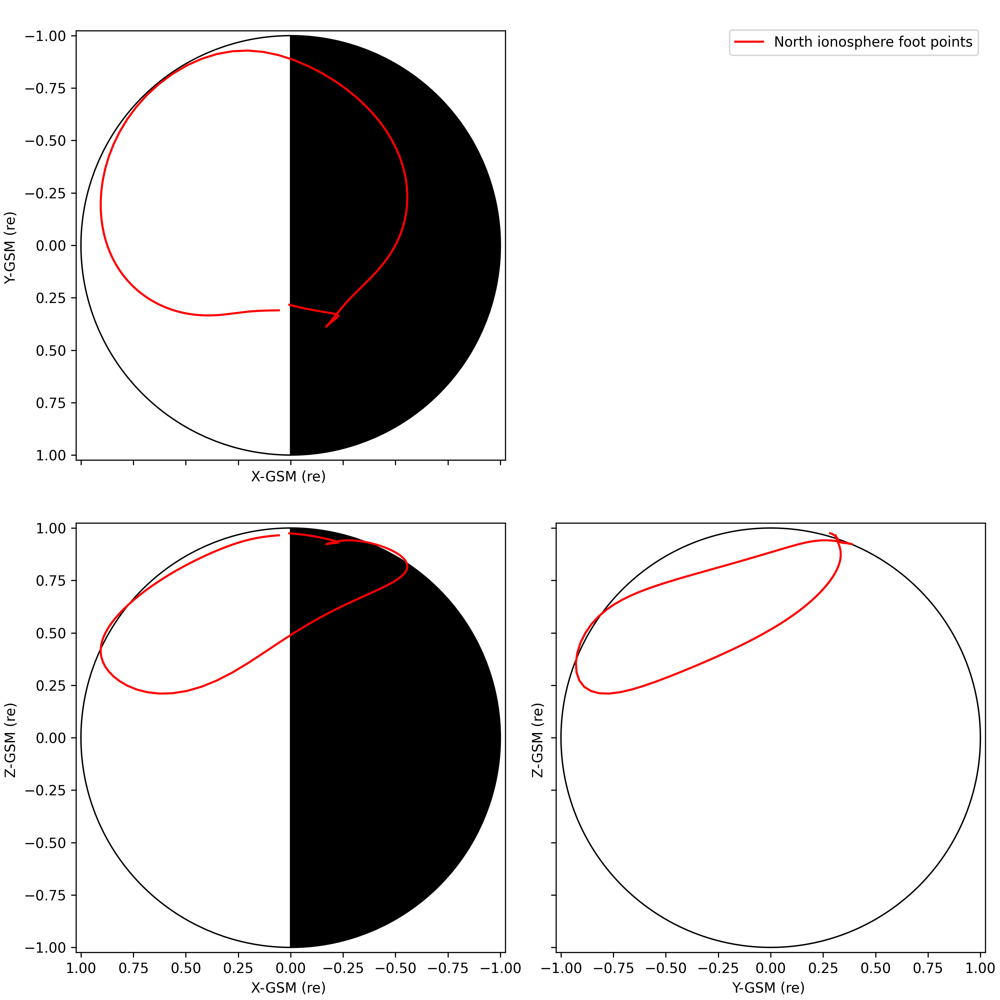
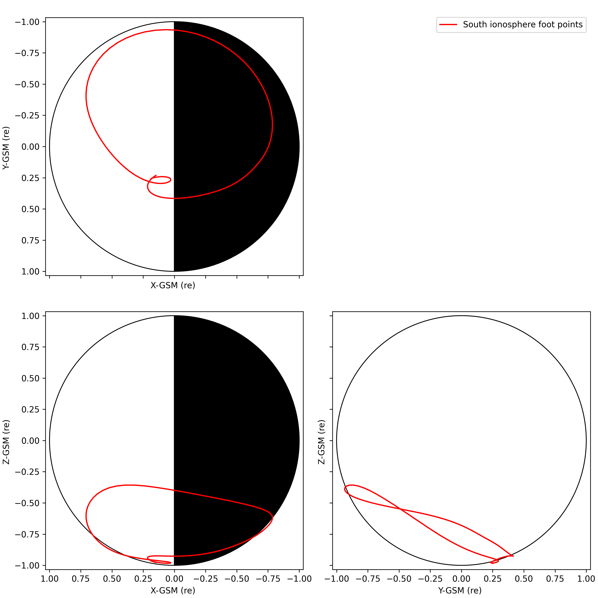
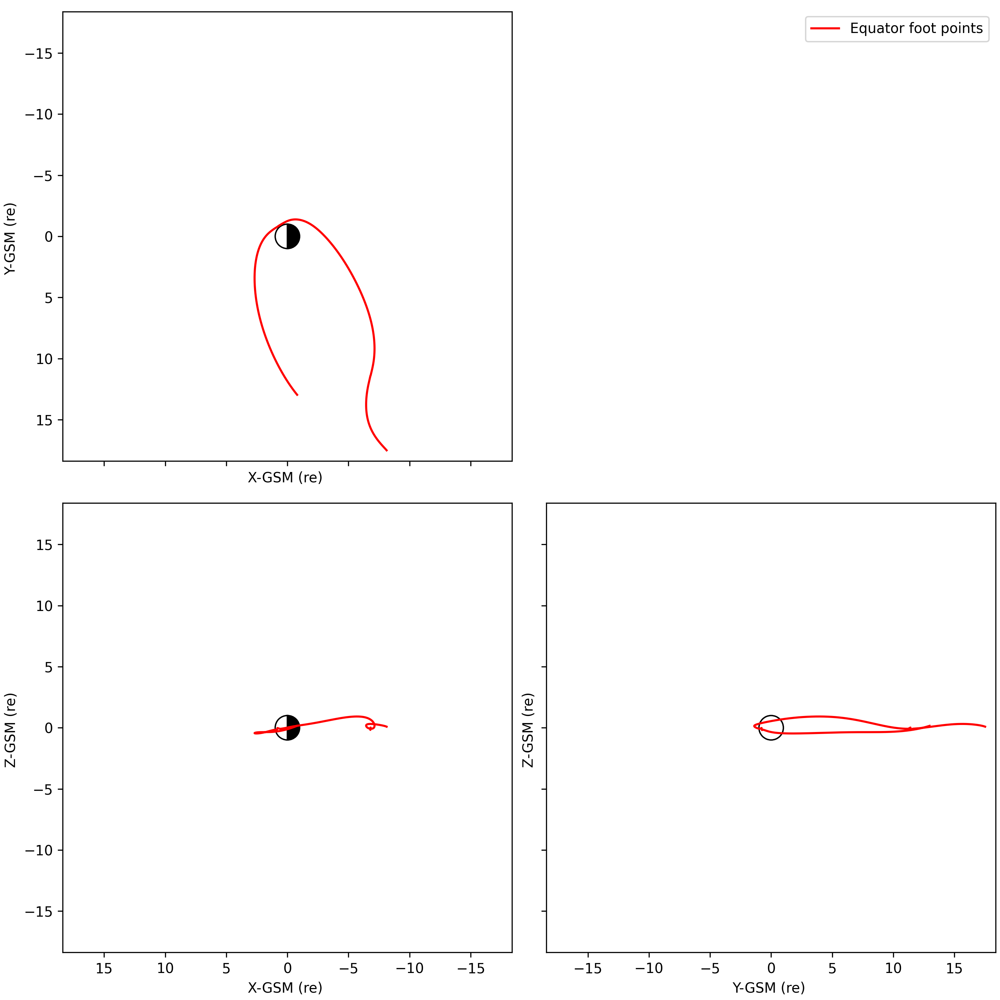
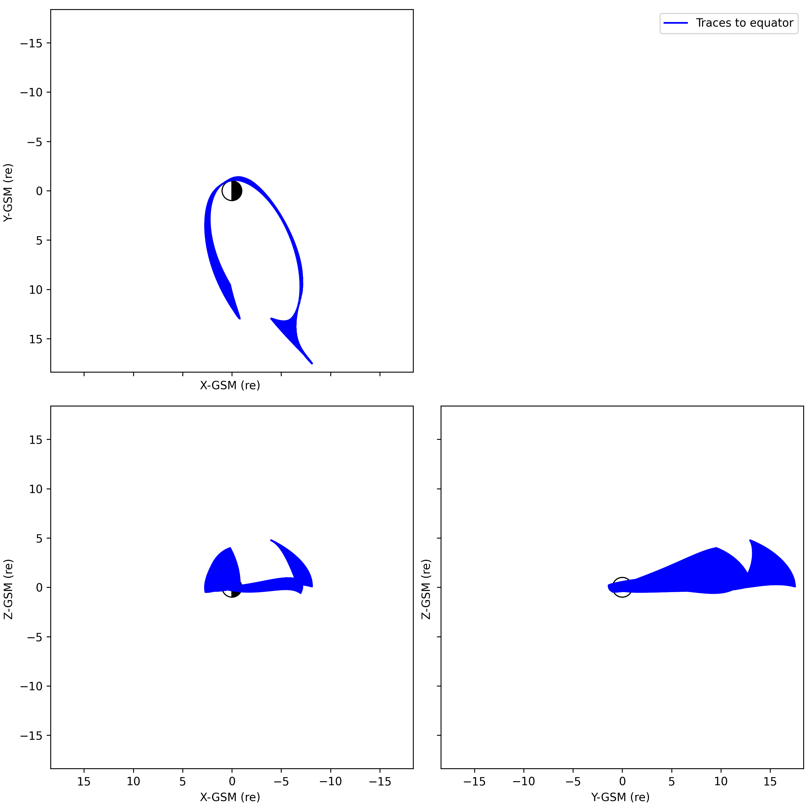
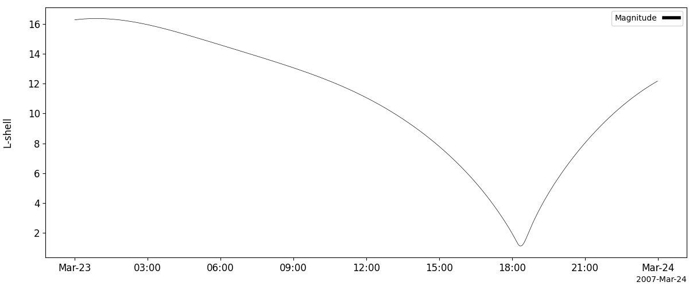

Magnetic Field Models
====================================
This module provides a set of routines that can be used to calculate various magnetic field models,
using Sheng Tian's implementation of the `geopack` library (https://github.com/tsssss/geopack).

The routines documented here each accept an input tplot variable, specifying the times and GSM positions
at which the field models are to be evaluated.

Each field model has its own set of parameters. The parameters may be passed as tplot variables names,
in which case they are interpolated to the times specified in the input position variable.  If a scalar value
is passed, it is used for all input times.  If an n-element array is passed. n is expected to match the
number of input times/positions, and the n-th array element will be used as the parameter value for the
n-th model evaluation.

Most of these routines also accept a boolean 'autoload' parameter.  If True, any provided model parameters
will be ignored, and the parameters will be derived from data loaded from various data sources: Kyoto WDC for Kp/iopt values,
OMNIweb for solar wind parameters, or directly from K. Tysganenko's web site for certain models and parameters.

The modeled B vectors are returned as tplot variables in GSM coordinates, with units of nT.

IGRF (IGRF)
------------
This is the underlying basic field model.  The rest of the Geopack models are implemented as small
corrections to be added to the IGRF field.

.. autofunction:: pyspedas.tigrf

Tsyganenko 89 (T89)
-----------------------------

.. autofunction:: pyspedas.tt89

T89 Example
^^^^^^^^^^^^

.. code-block:: python
   
   # load some spacecraft position data
   import pyspedas
   pyspedas.projects.mms.mec(trange=['2015-10-16', '2015-10-17'])

   # calculate the field using the T89 model
   from pyspedas.geopack import tt89
   tt89('mms1_mec_r_gsm')

   from pyspedas import tplot
   tplot('mms1_mec_r_gsm_bt89')

Tsyganenko 96 (T96)
-----------------------------

.. autofunction:: pyspedas.tt96

T96 Example
^^^^^^^^^^^^

.. code-block:: python
   
   # load some spacecraft position data
   import pyspedas
   pyspedas.projects.mms.mec(trange=['2015-10-16', '2015-10-17'])

   # calculate the params using the solar wind data; see the "Solar Wind Parameters" section below for an example

   # interpolate the MEC timestamps to the solar wind timestamps
   from pyspedas import tinterpol
   tinterpol('mms1_mec_r_gsm', 'proton_density')

   # calculate the field using the T96 model 
   from pyspedas.geopack import tt96
   tt96('mms1_mec_r_gsm-itrp', parmod=params)

   from pyspedas import tplot
   tplot('mms1_mec_r_gsm-itrp_bt96')

Tsyganenko 2001 (T01)
-----------------------------

.. autofunction:: pyspedas.tt01

T01 Example
^^^^^^^^^^^^

.. code-block:: python
   
   # load some spacecraft position data
   import pyspedas
   pyspedas.projects.mms.mec(trange=['2015-10-16', '2015-10-17'])

   # calculate the params using the solar wind data; see the "Solar Wind Parameters" section below for an example

   # interpolate the MEC timestamps to the solar wind timestamps
   from pyspedas import tinterpol
   tinterpol('mms1_mec_r_gsm', 'proton_density')

   # calculate the field using the T01 model
   from pyspedas.geopack import tt01
   tt01('mms1_mec_r_gsm-itrp', parmod=params)

   from pyspedas import tplot
   tplot('mms1_mec_r_gsm-itrp_bt01')

Tsyganenko-Sitnov 2004 (TS04)
-----------------------------

.. autofunction:: pyspedas.tts04

TS04 Example
^^^^^^^^^^^^

.. code-block:: python

   # load some spacecraft position data
   import pyspedas
   pyspedas.projects.mms.mec(trange=['2015-10-16', '2015-10-17'])

   # calculate the params using the solar wind data; see the "Solar Wind Parameters" section below for an example

   # interpolate the MEC timestamps to the solar wind timestamps
   from pyspedas import tinterpol
   tinterpol('mms1_mec_r_gsm', 'proton_density')

   # calculate the field using the TS04 model
   from pyspedas.geopack import tts04
   tts04('mms1_mec_r_gsm-itrp', parmod=params)

   from pyspedas import tplot
   tplot('mms1_mec_r_gsm-itrp_bts04')

Solar Wind Parameters
-----------------------------
To generate the "parmod" variable using Dst and solar wind data, use the `get_tsy_params` routine. 

.. autofunction:: pyspedas.get_tsy_params

get_tsy_params Example
^^^^^^^^^^^^^^^^^^^^^^^

.. code-block:: python
   
   # load Dst and solar wind data
   import pyspedas
   pyspedas.projects.kyoto.dst(trange=['2015-10-16', '2015-10-17'])
   pyspedas.projects.omni.data(trange=['2015-10-16', '2015-10-17'])

   # join the components of B into a single variable
   # BX isn't used
   from pyspedas import join_vec
   join_vec(['BX_GSE', 'BY_GSM', 'BZ_GSM'])

   from pyspedas.get_tsy_params import get_tsy_params
   params = get_tsy_params('kyoto_dst', 
                        'BX_GSE-BY_GSM-BZ_GSM_joined', 
                        'proton_density', 
                        'flow_speed', 
                        't96', # or 't01', 'ts04'
                        pressure_tvar='Pressure',
                        speed=True)

Field line tracing
-------------------

PySPEDAS can perform field line tracing for any of the available models.  Options include tracing
to the north ionosphere, the south ionosphere, or the field line "apex" or "equator" (the point where
the radial component switches sign toward or away from Earth).

The field line traces are implemented as solutions to a differential equation initial value problem,
using the solve_ivp method from the scipy library, with a Runge-Kutte order 4/5 solver.  There is a single tracing routine
ttrace2endpoint, where an 'endpoint' parameter ('ionoshere-north', 'ionosphere-south', or 'equator') determines
which of the three endpoints to trace to.  endpoint='ionosphere-north' or 'ionosphere-south' correspond to the IDL SPEDAS routine
ttrace2iono, and endpoint='equator' corresponds to IDL SPEDAS 'ttrace2equator' routine.

.. autofunction:: pyspedas.ttrace2endpoint

Field line tracing examples
^^^^^^^^^^^^^^^^^^^^^^^^^^^^

.. code-block:: python

   from pyspedas.projects.themis import state
   from pyspedas import ttrace2endpoint, tplotxy3
   state(trange=['2007-03-23', '2007-03-23'], probe='a')
   # Trace to north ionosphere with T89 model
   ttrace2endpoint('tha_pos_gsm','t89','ionosphere-north',foot_name='ifoot89_n', trace_name='tha_trace_iono_n_t89',km=True)
   tplotxy3('ifoot89_n',legend_names=['North ionosphere foot points',], colors='red', reverse_x=True, show_centerbody=True,save_png='tha_iono_n_foot.png')

   # Trace to south ionosphere with T89 model
   ttrace2endpoint('tha_pos_gsm','t89','ionosphere-south',foot_name='ifoot89_s', trace_name='tha_trace_iono_s_t89',km=True)
   tplotxy3('ifoot89_s',legend_names=['South ionosphere foot points',], colors='red', reverse_x=True, show_centerbody=True,save_png='tha_iono_s_foot.png')

   # Trace to equator with T89 model
   ttrace2endpoint('tha_pos_gsm','t89','equator',foot_name='eq_foot89', trace_name='tha_trace_equ_t89',km=True)
   tplotxy3('eq_foot89',legend_names=['Equator foot points'], colors='red', reverse_x=True, show_centerbody=True,save_png='tha_equ_foot.png')
   tplotxy3('tha_trace_equ_t89',legend_names=['Traces to equator'], colors='blue', reverse_x=True, show_centerbody=True, save_png='tha_equ_traces.png')

Calculating L-shell values
---------------------------

The L-shell of a given time and position is defined as the distance from Earth of the apex or equator
of the field line passing through that point, in units of Earth radii (Re).  This can be calculated
with the PySPEDAS calculate_lshell routine.

.. autofunction:: pyspedas.calculate_lshell

L-shell example
^^^^^^^^^^^^^^^^^

.. code-block:: python

   from pyspedas.projects.themis import state
   from pyspedas import calculate_lshell, tplot
   state(trange=['2007-03-23', '2007-03-23'], probe='a')
   calculate_lshell('tha_pos_gsm','tha_pos_lshell')
   tplot('tha_pos_lshell')

