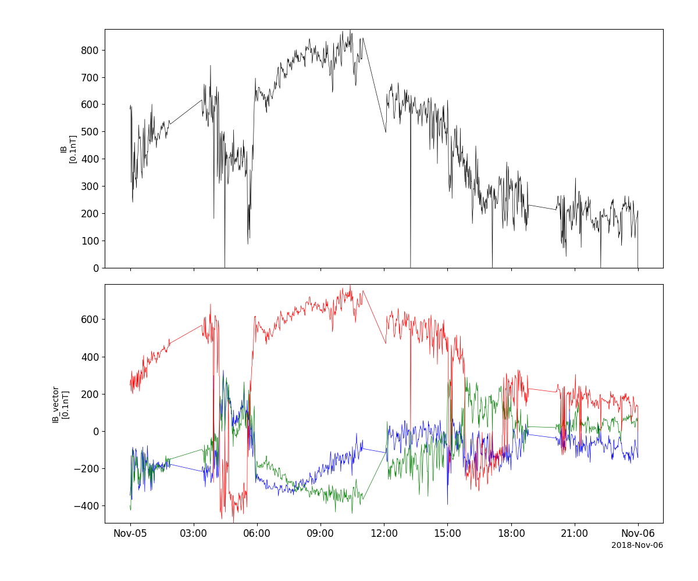
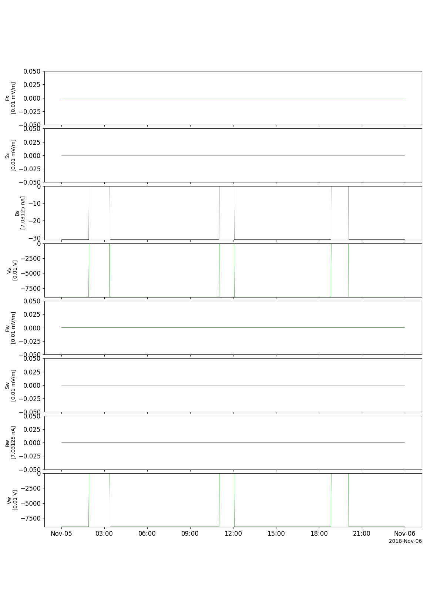
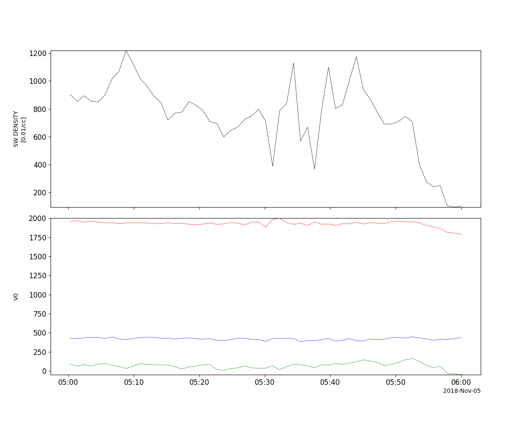
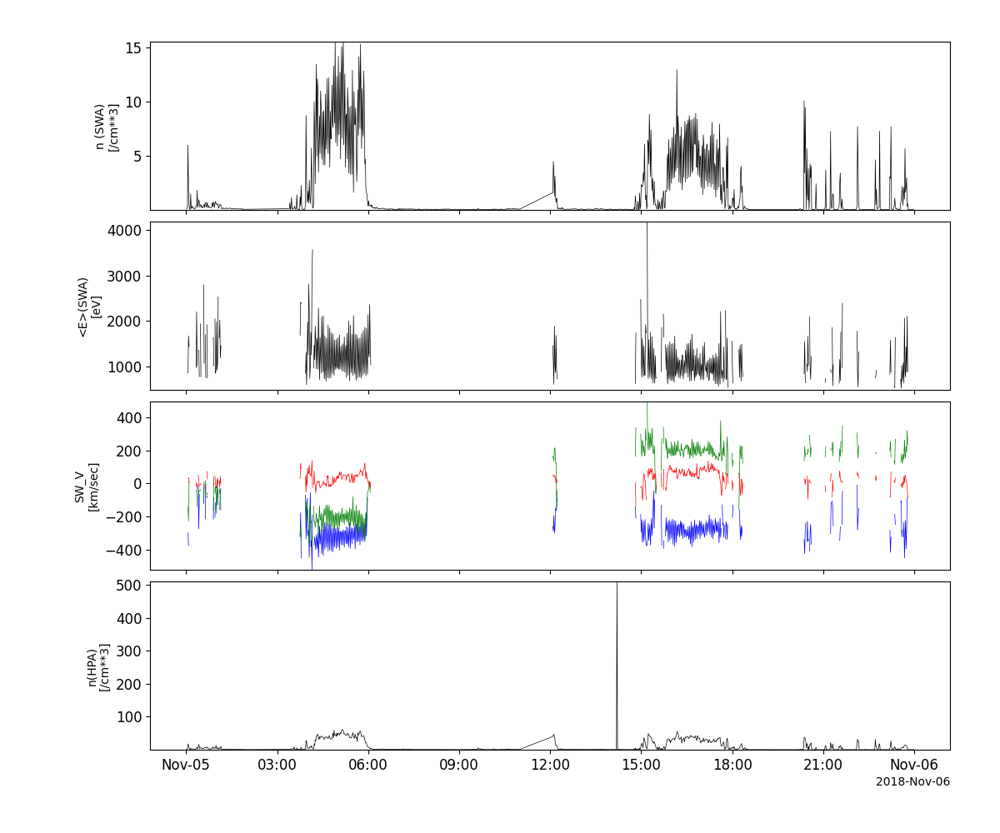
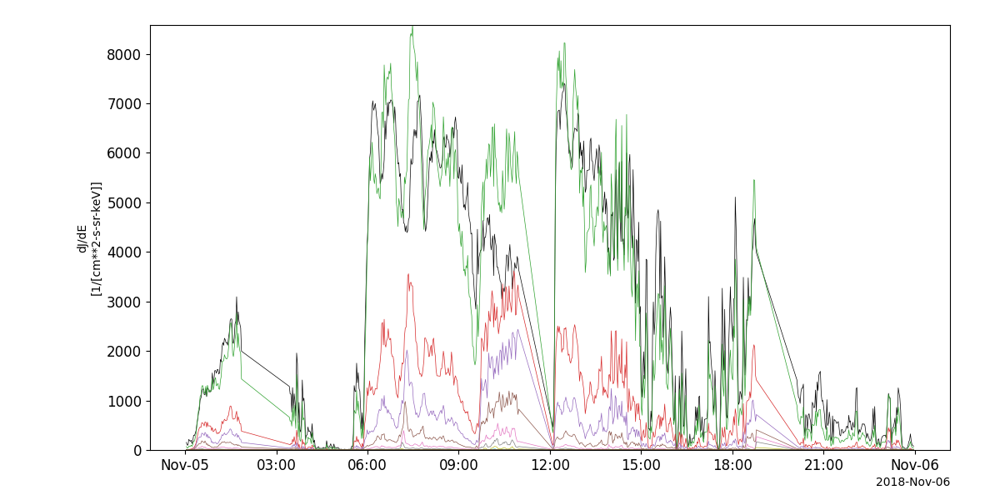
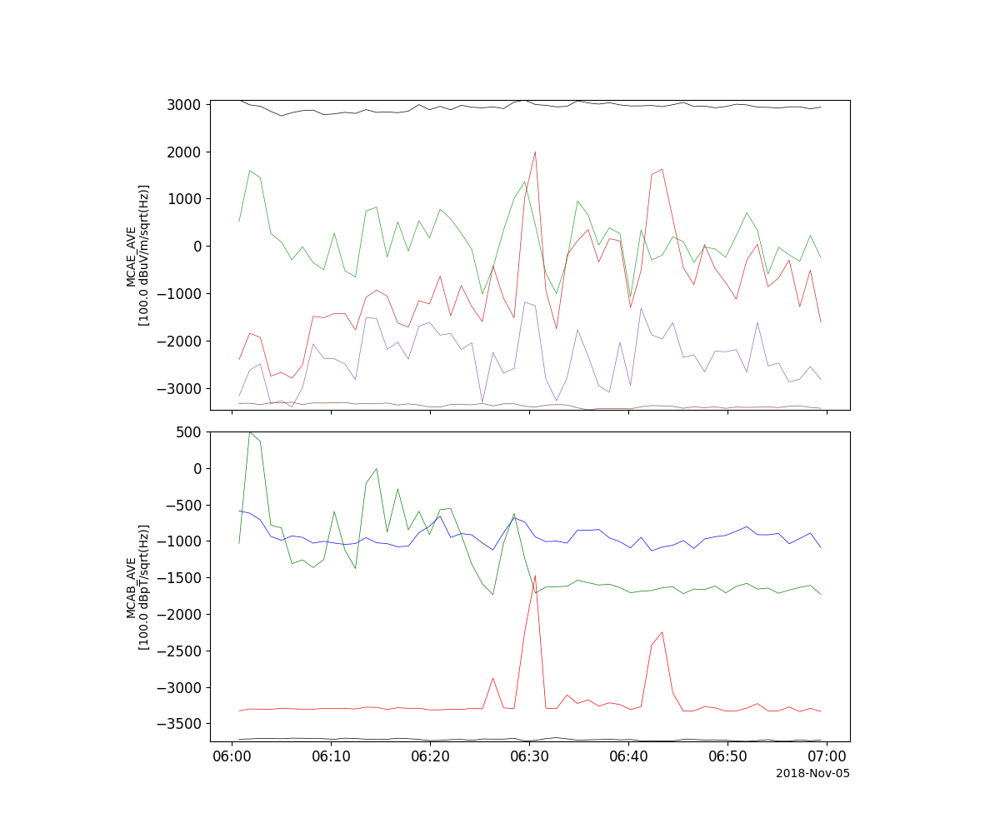

Geotail
========================================================================
The routines in this module can be used to load data from the Geotail mission.

Magnetic Field Experiment (MGF)
----------------------------------------------------------
.. autofunction:: pyspedas.projects.geotail.mgf

Example
^^^^^^^^^

.. code-block:: python
   
   import pyspedas
   from pytplot import tplot
   mgf_vars = pyspedas.projects.geotail.mgf(trange=['2018-11-5', '2018-11-6'])
   tplot(['IB', 'IB_vector'])

Electric Field Detector (EFD)
----------------------------------------------------------
.. autofunction:: pyspedas.projects.geotail.efd

Example
^^^^^^^^^

.. code-block:: python
   
   import pyspedas
   from pytplot import tplot
   efd_vars = pyspedas.projects.geotail.efd(trange=['2018-11-5', '2018-11-6'])
   tplot(['Es', 'Ss', 'Bs', 'Vs', 'Ew', 'Sw', 'Bw', 'Vw'])

Low Energy Particle experiment (LEP)
----------------------------------------------------------
.. autofunction:: pyspedas.projects.geotail.lep

Example
^^^^^^^^^

.. code-block:: python
   
   import pyspedas
   from pytplot import tplot
   lep_vars = pyspedas.projects.geotail.lep(trange=['2018-11-5/05:00', '2018-11-5/06:00'], time_clip=True)
   tplot(['N0', 'V0'])

Comprehensive Plasma Instrumentation (CPI)
----------------------------------------------------------
.. autofunction:: pyspedas.projects.geotail.cpi

Example
^^^^^^^^^

.. code-block:: python
   
   import pyspedas
   from pytplot import tplot
   cpi_vars = pyspedas.projects.geotail.cpi(trange=['2018-11-5/15:00', '2018-11-5/18:00'], time_clip=True)
   tplot(['SW_P_Den', 'SW_P_AVGE', 'SW_V', 'HP_P_Den'])

Energetic Particles and Ion Composition Instrument (EPIC)
----------------------------------------------------------
.. autofunction:: pyspedas.projects.geotail.epic

Example
^^^^^^^^^

.. code-block:: python
   
   import pyspedas
   from pytplot import tplot
   epic_vars = pyspedas.projects.geotail.epic(trange=['2018-11-5', '2018-11-6'])
   tplot('IDiffI_I')

Plasma Wave Instrument (PWI)
----------------------------------------------------------
.. autofunction:: pyspedas.projects.geotail.pwi

Example
^^^^^^^^^

.. code-block:: python
   
   import pyspedas
   from pytplot import tplot
   pwi_vars = pyspedas.projects.geotail.pwi(trange=['2018-11-5/06:00', '2018-11-5/07:00'], time_clip=True)
   tplot(['MCAE_AVE', 'MCAB_AVE'])

