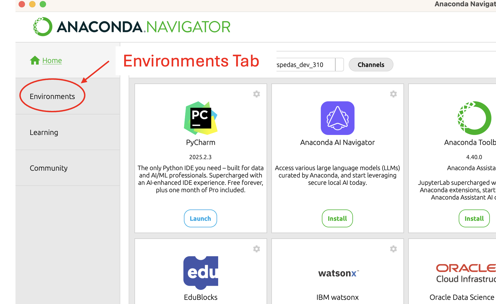
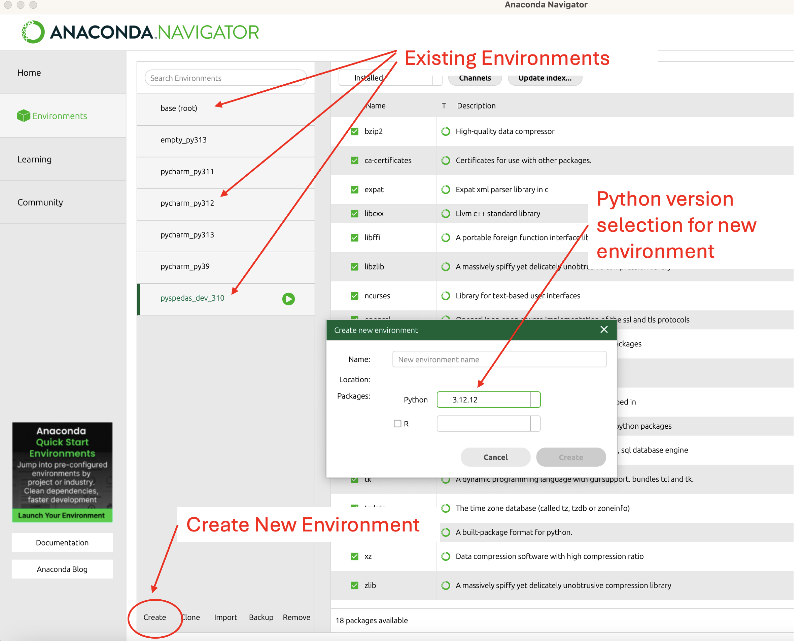
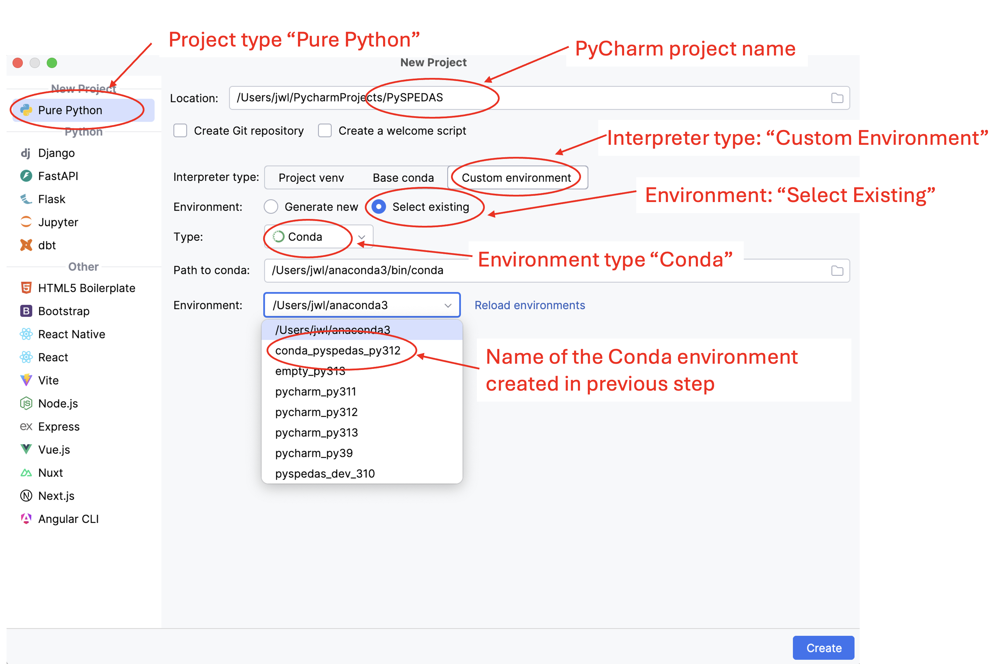
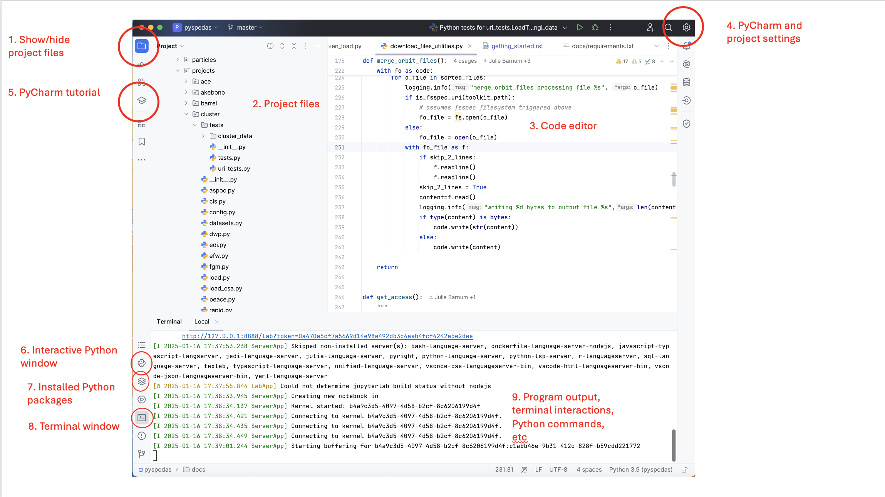
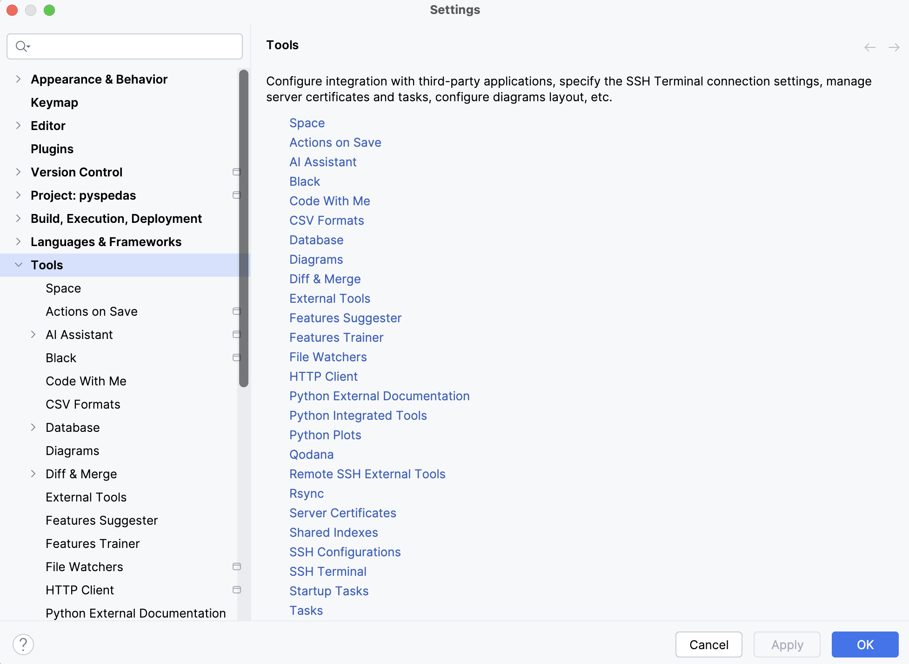
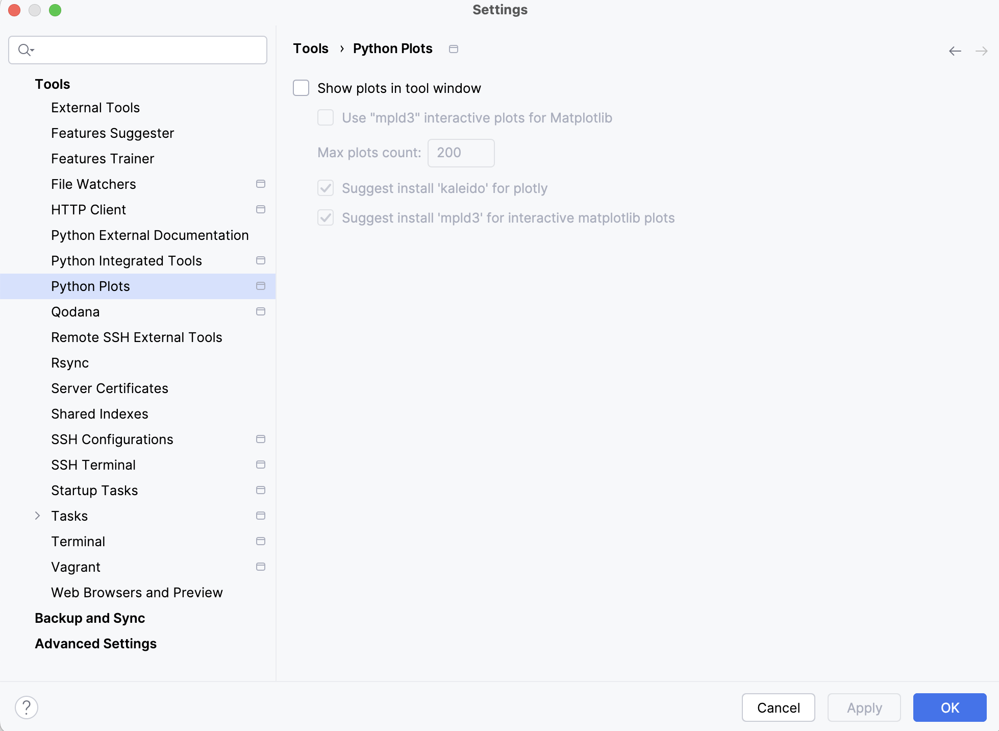
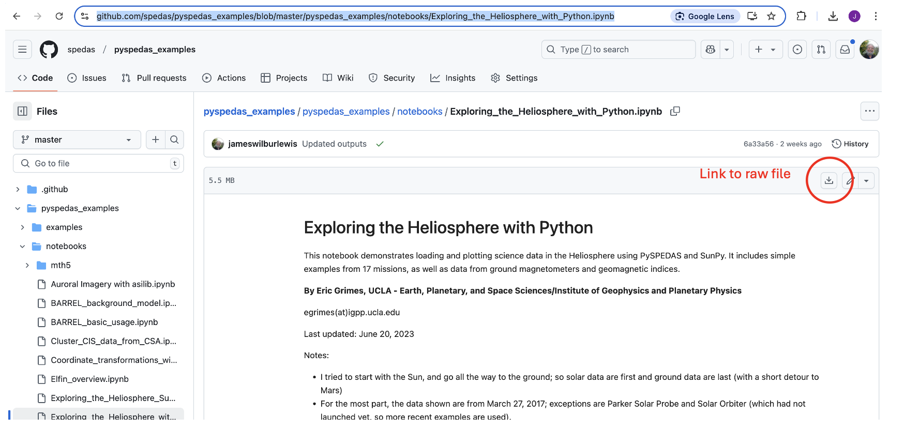
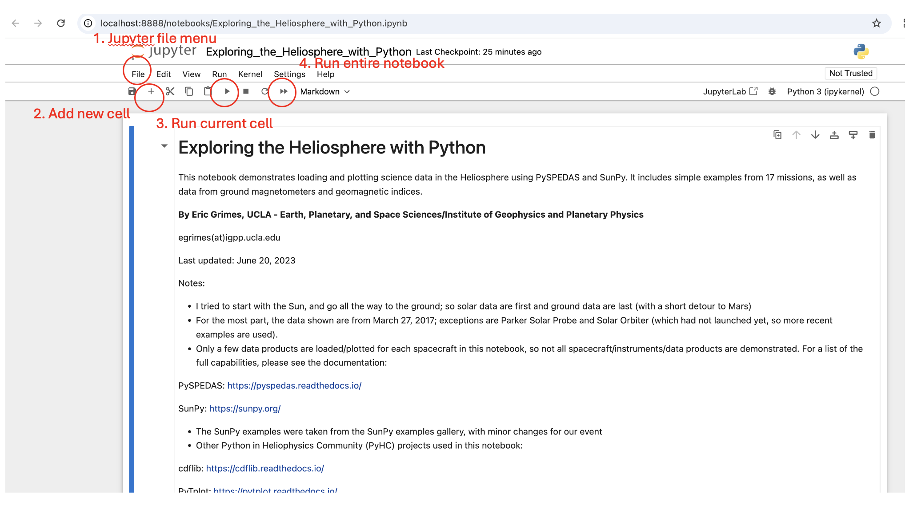

Getting Started
====================================

Requirements
--------------
PySPEDAS supports Windows, macOS and Linux.

At this writing (October 2025), PySPEDAS is compatible with Python versions 3.10 through 3.14.

The following installation guide represents a somewhat minimal approach to getting a working PySPEDAS
installation.   It assumes you are starting from scratch, with no pre-existing Python version or developer tools installed.
More advanced users might wish to make different choices of Python distributions (e.g. python.org rather than
Anaconda), or use a different development environment (e.g Spyder, Visual Studio Code, or some other
environment rather than PyCharm).  The installation details might differ slightly for
various operating systems or choices of Python distribution or development environment, but the general
order of operations should be simple and straightforward.

Installing Python
-----------------

You will need to install a compatible version of Python on your system (even if one is pre-installed with the
operating system, it is not recommended to use it for PySPEDAS.  There is no issue having multiple Python
versions or installations on the same machine).

For managing Python environments to be used with PySPEDAS, we recommend [Anaconda](https://www.continuum.io/downloads/), Anaconda
gives you a relatively easy way to install and manage Python environments, and comes with a suite of packages useful for scientific data
analysis. Step-by-step instructions for installing Anaconda can be found at:
[Windows](https://docs.anaconda.com/anaconda/install/windows/), [macOS](https://docs.anaconda.com/anaconda/install/mac-os/), [Linux](https://docs.anaconda.com/anaconda/install/linux/)

Anaconda is not a requirement -- PySPEDAS will run just fine in a Python installation downloaded from python.org.
However, Anaconda may make it easier to install some of the other Python packages PySPEDAS depends on.
Some PySPEDAS dependencies are not always available as pre-compiled wheels, depending on the OS and CPU architecture
you're using.  (Older releases of MacOS seem to be particularly prone to package installation issues).
While a full Anaconda installation is larger and more complicated than downloading directly from python.org, it does have the advantage of allowing a user to "conda install" a dependency if "pip install" doesn't work.
Anaconda also has the advantage of bundling many other tools that are useful to scientific programmers.

As of October 2025, Python 3.14 is the latest available Python release.  The core PySPEDAS
features are all compatible with Python 3.14, but there are still compatibility issues with a few dependencies,
particularly the basemap package used to create plots from SECS/EICS data.  Since Python 3.14 has only been released
a few weeks ago, it's possible that the rest of the dependencies will catch up soon.

Python 3.13 is well-tested and fully compatible with PySPEDAS, but some users may want to avoid it because of poor performance for some workloads.
Python 3.12 is a solid choice, performs better than Python 3.13, and is therefore the one we would recommend
to most users.

To install Python using Anaconda, start "Anaconda Navigator".  You should see something like this:

Locate the "Environments" tab highlighted in the above screenshot, and click on it.  The Environments screen
should look something like this:

The center pane shows any Python environments that have already been created by Anaconda.  To create a new Python environment,
locate the 'Create' control highlighted in the above screenshot, and click it to bring up the "New Environment" dialog.
Make sure the "Python" option is selected, and use the dropdown control to select the version of Python to be used in the new environment.
Finally, enter the name you want to use for the new environment (perhaps something like 'pyspedas_conda_py312'), and click "Create".  This should set up
Anaconda will then start setting up a new Python environment for you to use with PySPEDAS.

Installing PyCharm
-------------------

PyCharm is a free-to-use interactive development environment for Python.
This (or whatever other IDE you prefer) is the main tool you will use to interact with Python and PySPEDAS.

The software can be downloaded and installed from https://www.jetbrains.com/pycharm/download/ .

After completing the download, click on the installer and
follow the prompts.  Near the end of the installation (depending on your operating system), you may come to a screen with some
options: "64-bit launcher", "Open folder as project", ".py file associations", "Add launchers dir to the PATH".
We recommend selecting all these options.

You may need to restart your machine to finalize the installation.

More PyCharm installation instructions are available at https://www.jetbrains.com/help/pycharm/installation-guide.html

Set PySPEDAS environment variables
----------------------------------

By default, the data is stored in your pyspedas directory in a folder named 'pydata'. This is probably not what you want.

The recommended way of setting your local data directory is to set the **SPEDAS_DATA_DIR** environment variable. **SPEDAS_DATA_DIR** acts as a root data directory for all missions,
and will also be used by IDL (if you’re running a recent copy of the bleeding edge).  If you already use IDL SPEDAS, and have
**SPEDAS_DATA_DIR** set in your environment, no further action is needed.

You should set **SPEDAS_DATA_DIR** to a folder where you have write access, preferably on your hard drive rather than
a network drive or mount point, on a filesystem which has enough free space to accomodate many gigabytes of
downloaded data.  It's probably best to create that top-level folder by hand, if it doesn't already exist. (Any needed subdirectories
will be created automatically by SPEDAS or PySPEDAS).  For example, you might use "C:\\spedas_data" on Windows to put it
at the root of your hard drive, or "/Users/your_userid/spedas_data" on a Mac to put it under your home directory.

Once you've decided where to put your data directory, you need to ensure that the **SPEDAS_DATA_DIR** environment
variable is set whenever you log in. On Mac or Linux, this can be done by adding a line to your
shell startup files (e.g. .cshrc, .zshrc, .bashrc or whatever shell you use):

.. code-block:: bash

   setenv SPEDAS_DATA_DIR /path/to/data/directory

On Windows, you can open the Windows settings, search for "environment variables",
go to the appropriate control panel, and add the SPEDAS_DATA_DIR environment variable to your
user environment variable settings.

You may need to log out of your account and log back in so these changes take effect.

Create a Python project in PyCharm
----------------------------------

You will need to create a Python project within PyCharm, and connect it to the Python environment you previously set up with Conda.

You should have an icon for PyCharm on your desktop or start menu.  Use it to open PyCharm.

Instructions for creating a new PyCharm project and environment can be found here:
https://www.jetbrains.com/help/pycharm/creating-and-running-your-first-python-project.html

In PyCharm, use the File->New Project... menu to bring up a dialog that should look something like this:

The above screenshot highlights the choices you should make in the "New Project" dialog:  it should be created
as a "Pure Python" project.  Choose an appopriate name for your project (here, "PySPEDAS").   For "Interpreter Type",
select "Custom Environment".   For "Environment:" select "Select existing".  Use the "Type:" dropdown to select "Conda".
Use the "Environment:" dropdown menu to select the name of the Anaconda environment you set up in a previous step (here,
we're using "conda_pyspedas_py312).

When you've made all the necessary selections, click on the "Create" button in the lower right.  PyCharm
will set up your new PySPEDAS project, and connect it to the Python environment you created in Anaconda.
This step may take several minutes, as it sets up a new Python virtual environment, copies the
necessary files into it, and indexes them.  At the bottom of your PyCharm window, there
should be a status area and progress bar showing what it's doing.

Location of PyCharm tools and menus
-----------------------------------

Here are the locations of a few controls and settings you'll frequently use in PyCharm:

#. Show/Hide project files: This toggles whether the project files pane is displayed.
#. Project files: This pane shows the file and folder structure of your project.
#. Code editor: This is where you edit Python code.  Each file is displayed in its own tab.
#. PyCharm and project settings: This is a way to change the settings for PyCharm generally, or specifically within a PyCharm project.
#. PyCharm tutorials: Opens a demo project and guides you through some common Pycharm tasks like editing and running code. Highly recommended!
#. Interactive Python window: This is where you can enter Python code line by line to see what it does.
#. Installed Python packages: This shows a list of Python packages installed in the project's virtual environment, and indicates whether any updates are available.
#. Terminal window: This is an interactive command shell.  The execution path will include files in the current project.  This where you would run commands like "pip install" or "jupyter notebook".
#. Program input/output area:  When you select one of the tool windows from the lower left group of icons, this pane changes to show the input/output of that tool.

Install PySPEDAS and some related packages
------------------------------------------

You will now need to install PySPEDAS in the environment you've just created.
This will be done in the PyCharm terminal window.  On the left side of the PyCharm window,
there should be a stack of icons near the bottom.  Hover over them until you find the one
labeled "Terminal", and open it.  (See annotated screen shot in previous section.)
You can also get to this with View->Tool Windows->Terminal

PySPEDAS core install, versus optional extra dependencies
^^^^^^^^^^^^^^^^^^^^^^^^^^^^^^^^^^^^^^^^^^^^^^^^^^^^^^^^^^

On certain platforms and Python versions, a few of the libraries required by certain PySPEDAS features
are difficult to install.  They may need to be compiled from source code rather than being provided as binary wheels,
and may depend on certain other libraries or compilers being installed on your system, otherwise installing these packages
will fail.  Or they might have very restricted version requirements for other tools like matplotlib, possibly leading to version
conflicts that prevent installation.

Prior to PySPEDAS 2.0, ``pip install pyspedas`` unconditionally installed all dependencies, even though
many users may not be interested in those features.  PySPEDAS 2.0 moves some of these
troublesome dependencies into 'extras', so they are no longer installed by default.
The corresponding PySPEDAS features are::

    1. SECS and EICS plots required the basemap package in order to plot data on a map of North America
    2. Loading data via the VIRES service (SWARM and a few other ESA missions) requires the viresclient package
    3. Loading seismographic magentometer data requires the mth5 package.

If you don't think you'll use those features, you can just install the core PySPEDAS tools, without the extras, with:

.. code-block:: bash

    pip install pyspedas

If you do want to use any of those features, you can install them with pip like this:

(The square brackets are special characters in some shells, so be sure to use quotes around the argument
if you're installing pyspedas with extras.)

.. code-block:: bash

    # Install all the extras
    pip install 'pyspedas[all]'

    # Install basemap only, to support EICS and SECS maps
    pip install 'pyspedas[maps]'

    # Install maps and mth5 extras, but not vires
    pip install 'pyspedas[maps,mth5]'

Trouble installing PySPEDAS or its dependencies?
^^^^^^^^^^^^^^^^^^^^^^^^^^^^^^^^^^^^^^^^^^^^^^^^^

If you're one of the unlucky users who are having difficulty installing these dependencies on your
platform, there is a workaround that might let you use those features anyway: you can try
using 'conda' rather than 'pip' to install the dependencies.  (This is why we recommend installing Python
via Anaconda rather than python.org:  the latter option does not give you the option to install packages
via 'conda'.)

.. code-block:: bash

    # Install basemap for SECS/EICS maps
    conda install -c conda-forge basemap

    # Install mth5 for loading magnetotelluric/seismographical data
    conda install -c conda-forge mth5

    # Install virecslient, for downloading SWARM or other ESA data from the VIRES service:
    conda install -c conda-forge viresclient

After installing the dependencies via `conda`, try `pip install 'pyspedas[all]'` again (or some combination of `mth5`,
`maps`, or `vires` depending on what you were trying to install) to complete the installation.  Repeat as necessary for each
dependency that doesn't install cleanly via `pip`.

Install support for Jupyter notebooks
^^^^^^^^^^^^^^^^^^^^^^^^^^^^^^^^^^^^^^

Many PySPEDAS examples are distributed as jupyter notebooks, so you will probably
want the "jupyter" package:

.. code-block:: bash

   pip install jupyter

Check PyCharm setting for Python plots
--------------------------------------

By default, PyCharm may display plots in its own interface.  This is not what you want,
because it doesn't allow interactive usage like panning or zooming into a plot. Select
the "Settings..." menu, then find "Tools" in the left hand pane and expand it.
You should see something like this:

Scroll down until you find the "Python Plots" option and click on it.

You should see something like this:

The "Show plots in tool window" checkbox should be unchecked and the rest grayed out,
as it appears in the above screen shot.  If the box is checked, click on it to disable the option, then
click "OK" to update the settings.

Try a simple PySPEDAS workflow
------------------------------

You should now be ready to run some code using PySPEDAS!  Here's a quick demo to try.

In the upper left pane of the PyCharm window, there should be a file tree showing
the PyCharm project you've created (let's say it was "pyspedas_project".  If it's not
showing, look for a "folder" icon in the upper left, and click on it.

Click on the "pyspedas_project" entry in the directory tree to select it.
Then click on "File->New..." and choose "Python File" from the list of options.
Name it "pyspedas_demo.py".   It should open in an editing pane in the upper left of the
PyCharm window.

Now copy and paste this demo code into the editing pane:

.. code-block:: python

    # Load and plot THEMIS FGM data
    def pyspedas_demo():
        # Import pyspedas routines to be used
        from pyspedas import tplot
        from pyspedas.projects.themis import fgm

        # Set the time range: 2007-03-23, complete day
        trange=['2007-03-23' , '2007-03-24']
        # Load THEMIS FGM data for probe A
        fgm_vars = fgm(probe='a',trange=trange)
        # Print the list of tplot variables just loaded
        print(fgm_vars)
        # Plot the 'tha_fgl_dsl' variable
        tplot('tha_fgl_dsl')

    # Run the example code
    if __name__ == '__main__':
        pyspedas_demo()

If all goes well you should see a green triangle just to the left of the "if __name__ == '__main' line
of code.  (If not, look for any red squiggles indicating syntax errors or other issues in the
demo program).

Click on the green triangle and select "Run pyspedas_demo".  This should
run the example program,  In the "Run" pane on the bottom half of the PyCharm window,
you should see some output as pyspedas downloads THEMIS data, and prints the tplot
variables loaded.  A plot should appear, showing a plot for "tha_fgl_dsl".

If you got this far, congratulations! You are now ready to write your own programs
using PySPEDAS!

Working with Jupyter notebooks
------------------------------

PySPEDAS tutorial examples and sample workflows are often shared as Jupyter notebooks.
This is a convenient format for sharing and teaching, because it allows intermingled rich text (explanations,
sample plots, etc) and executable code cells.  By breaking the workflow up into discrete
steps, it's easy to make changes and rerun a single cells to see updated output, or
add additional Python commands to print or plot values of intermediate results.

Jupyter notebooks are stored as files with extension ".ipynb" (for Interactive PYthon
NoteBook). They run in a browser window, which allows you to run the entire notebook at once,
or step through cell by cell, inspecting intermediate results, or modifying the code to see what happens.

The Google Colab service allows you to run a Jupyter notebook completely in their
cloud environment, with no local Python or PySPEDAS installation required.  However,
for this guide, we will show how to run a notebook within your PyCharm project.

Let's say someone has sent you a notebook as an email attachment (with file extension .ipynb),
or as a web link.  Since we have several GitHub repositories full of PySPEDAS example notebooks, we'll
show how to download and run one of those.  Try opening this URL:

https://github.com/spedas/pyspedas_examples/blob/master/pyspedas_examples/notebooks/Exploring_the_Heliosphere_with_Python.ipynb

You should see something like this:

You would not want to "Save as..." this page in your browser, because that would
save the HTML rendering, and not the actual notebook code.  Instead, find the control
highighted in the above image, and click it to download the raw ipynb file.  Then find the file
you just downloaded, and copy it into the top level "PySPEDAS"
directory that contains your PyCharm project.

Next, you'll want to open the "Terminal" window (not the interactive
Python window....see the earlier PyCharm screen shot to locate
the correct control).   You should have previously installed the "jupyter"
Python package when you set up the project.  You can open the notebook
with the command

.. code-block:: bash

   jupyter notebook Exploring_the_Heliosphere_with_Python.ipynb

(If you omit the filename and just do "jupyter notebook", you will get a list of whatever
notebooks are in your project, and you can click on the one you want to run).

This will open a browser window (or open a new tab in your existing browser) which should look something like this:

A few frequently-used controls are highlighed in red:

#. File menu: Save changes to your notebook, open a new notebook, etc
#. Add new cell: Add a new Markdown or code cell below your current location in the notebook
#. Run current cell: Renders the Markdown code, or runs the Python code in the current cell, and advances to the next cell.
#. Run all cells in notebook: Run the entire notebook from start to finish.

To get started with the notebook you've just opened, I'd suggest clicking the "Run current cell" control to
step through the notebook cell-by-cell and see what happens at each step.

For more information, you might want to check out the official documentation: https://jupyter-notebook.readthedocs.io/en/latest/notebook.html

Creating Jupyter notebooks
--------------------------

TBD