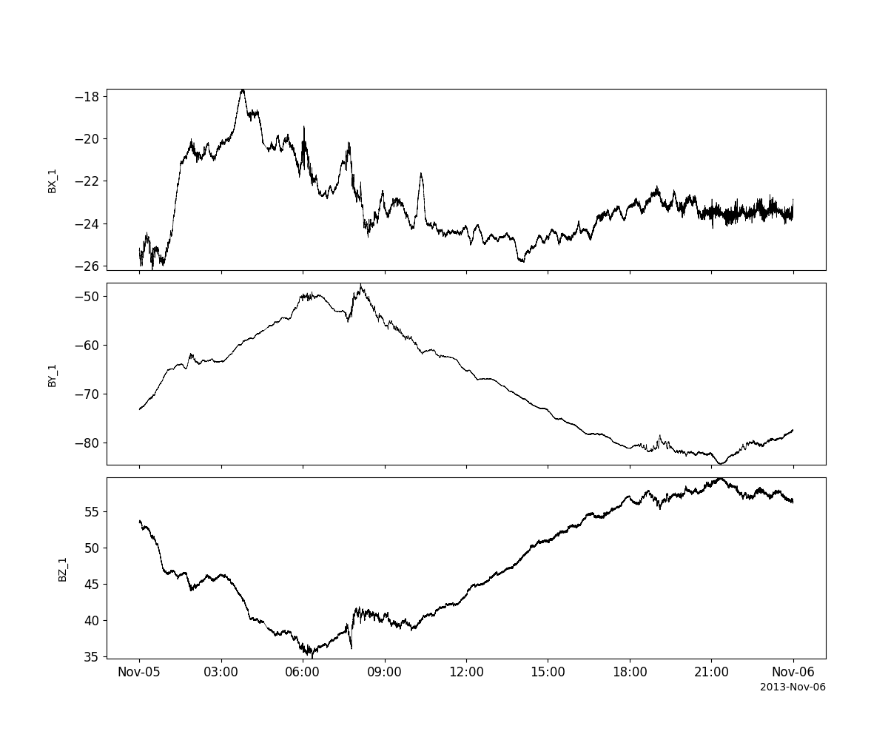

Geostationary Operational Environmental Satellite (GOES)
========================================================================
The routines in this module can be used to load data from the Geostationary Operational Environmental Satellite (GOES) mission.

Magnetometer (FGM)
----------------------------------------------------------
.. autofunction:: pyspedas.goes.fgm

Example
^^^^^^^^^

.. code-block:: python
   
   import pyspedas
   from pytplot import tplot
   mag_vars = pyspedas.goes.fgm(trange=['2013-11-5', '2013-11-6'], datatype='512ms')
   tplot(['BX_1', 'BY_1', 'BZ_1'])

