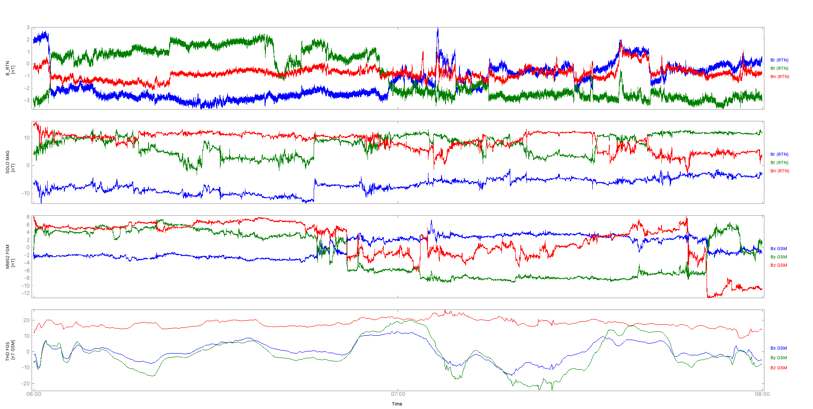

.. PySPEDAS documentation master file, created by
   sphinx-quickstart on Fri Sep 10 21:11:38 2021.
   You can adapt this file completely to your liking, but it should at least
   contain the root `toctree` directive.
:tocdepth: 3

pySPEDAS Documentation
====================================
|build| |coverage| |version| |quality| |status| |license|

pySPEDAS is an implementation of the SPEDAS framework for Python.

The Space Physics Environment Data Analysis Software (SPEDAS) framework is written in IDL and contains data loading, data analysis and data plotting tools for various scientific missions (NASA, NOAA, etc.) and ground magnetometers.

pySPEDAS and pytplot make creating multi-mission, multi-instrument figures simple, e.g., to create a figure showing magnetometer data from Solar Orbiter, Parker Solar Probe, MMS, and THEMIS,

.. code-block:: python
   
   import pyspedas
   from pytplot import tplot

   time_range = ['2020-04-20/06:00', '2020-04-20/08:00']

   pyspedas.solo.mag(trange=time_range, time_clip=True)
   pyspedas.psp.fields(trange=time_range, time_clip=True)
   pyspedas.mms.fgm(trange=time_range, time_clip=True, probe=2)
   pyspedas.themis.fgm(trange=time_range, time_clip=True, probe='d')

   tplot(['B_RTN', 'psp_fld_l2_mag_RTN', 'mms2_fgm_b_gsm_srvy_l2_bvec', 'thd_fgs_gsm'])

.. toctree::
   :caption: First Steps
   :maxdepth: 1

   getting_started

.. toctree::
   :maxdepth: 1
   :caption: Features

   projects
   analysis
   coords
   utilities

.. |build| image:: https://github.com/spedas/pyspedas/workflows/build/badge.svg
.. |coverage| image:: https://coveralls.io/repos/github/spedas/pyspedas/badge.svg
.. |version| image:: https://img.shields.io/pypi/v/pyspedas.svg
.. |quality| image:: https://img.shields.io/lgtm/grade/python/g/spedas/pyspedas.svg?logo=lgtm&logoWidth=18
.. |status| image:: https://img.shields.io/pypi/status/pyspedas.svg
.. |license| image:: https://img.shields.io/pypi/l/pyspedas.svg