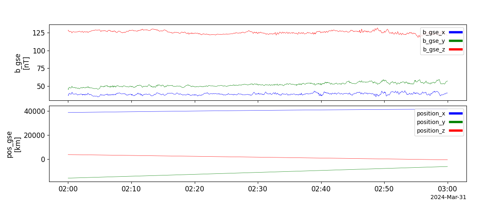
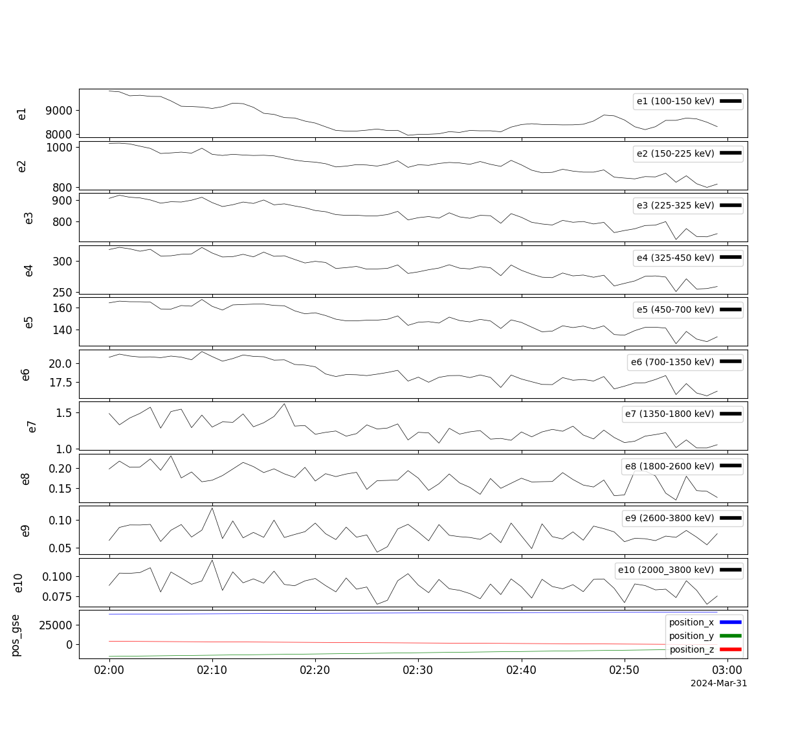
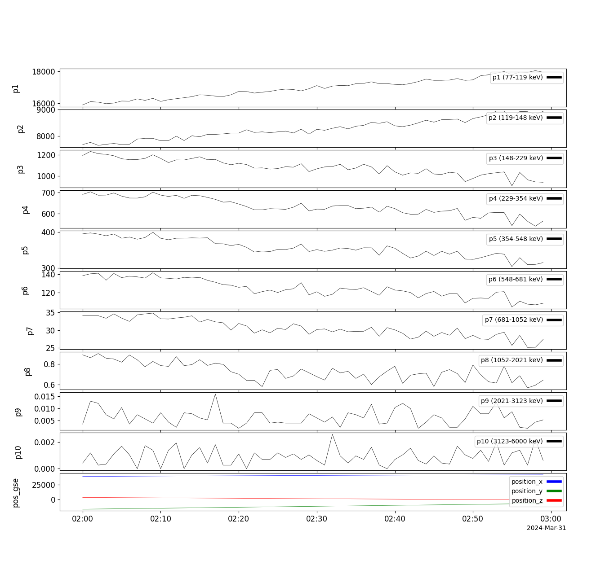

Korean Multi-Purpose Satellite (KOMPSAT)
========================================================================
The routines in this module (kompsat) can be used to load data from the GEO-KOMPSAT-2A satellite.

Server authentication
----------------------------------------------------------
Data resides in the ESA HAPI server. This server requires authentication. The user should register at:

- [ESA registration](https://swe.ssa.esa.int/registration/)

Once registered, the user should should have a username and password. These should be used in the file:

- file: pyspedas/compsat/load.py 
- variable: esa_hapi_parameters

After doing this, the user should be able to download data from the ESA HAPI server.

To download data, use either the function kompsat.kompsat_load or the synonymous function kompsat.load.

Instruments
----------------------------------------------------------
The load() variable "instrument" can take three values:

- 'sosmag' or 'mag', for magnetometer data (default, it is optional for 'sosmag')

Magnetic Field Data with 1-16Hz from SOSMAG on GEO-KOMPSAT-2A in geostationary orbit at 128.2E.

- 'e' or 'electrons', for electron flux

1-minute averaging electron flux data from the particle detector on GEO-KOMPSAT-2A in geostationary orbit at 128.2E.

- 'p' or 'protons', for proton flux

1-minute averaging proton flux data from the particle detector on GEO-KOMPSAT-2A in geostationary orbit at 128.2E.

Example
----------------------------------------------------------
.. code-block:: python

    # Import from pyspedas and pytplot
    import pyspedas
    from pytplot import tplot, options

    # Load L2 magnetometer data and plot it
    var_names = pyspedas.kompsat.load(trange=["2024-03-31 02:00:00", "2024-03-31 03:00:00"], datatype="1m")
    tplot(var_names)

.. code-block:: python

    # Load electron data and plot it
    var_names = pyspedas.kompsat.load(trange=["2024-03-31 02:00:00", "2024-03-31 03:00:00"], instrument="e")
    options(var_names, 'ysubtitle', '')  # remove subtitles (units) 
    tplot(var_names)

.. code-block:: python

    # Load proton data and plot it
    var_names = pyspedas.kompsat.load(trange=["2024-03-31 02:00:00", "2024-03-31 03:00:00"], instrument="p")
    options(var_names, 'ysubtitle', '')  # remove subtitles (units) 
    tplot(var_names)

Load function (SOSMAG and particle )
----------------------------------------------------------
.. autofunction:: pyspedas.kompsat.load

