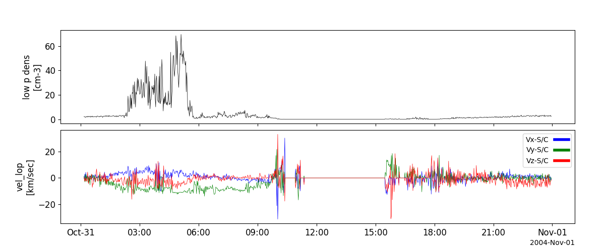
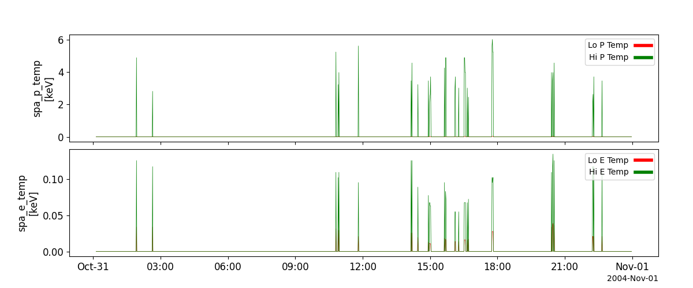

LANL
========================================================================
The routines in this module can be used to load data from the LANL plasma analyzers.

Magnetospheric Plasma Analyzer (MPA)
----------------------------------------------------------
.. autofunction:: pyspedas.lanl.mpa

Example
^^^^^^^^^

.. code-block:: python
   
   import pyspedas
   from pytplot import tplot
   mpa_vars = pyspedas.lanl.mpa(trange=['2004-10-31', '2004-11-01'])
   tplot(['dens_lop', 'vel_lop'])

Synchronous Orbit Particle Analyzer (SPA)
----------------------------------------------------------
.. autofunction:: pyspedas.lanl.spa

Example
^^^^^^^^^

.. code-block:: python
   
   import pyspedas
   from pytplot import tplot
   spa_vars = pyspedas.lanl.spa(trange=['2004-10-31', '2004-11-01'])
   tplot(['spa_p_temp', 'spa_e_temp'])

    