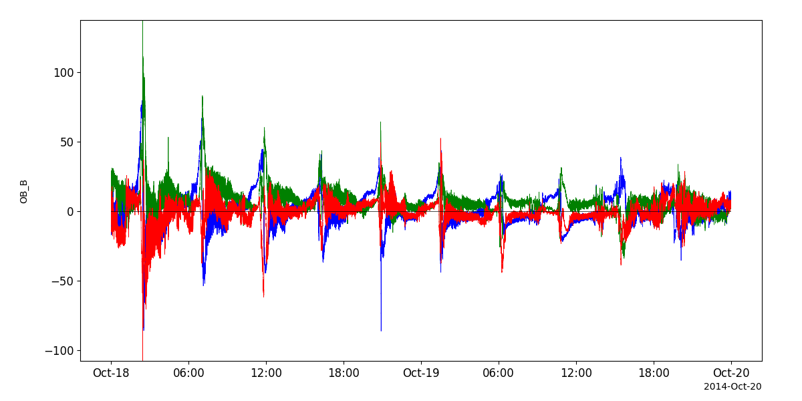
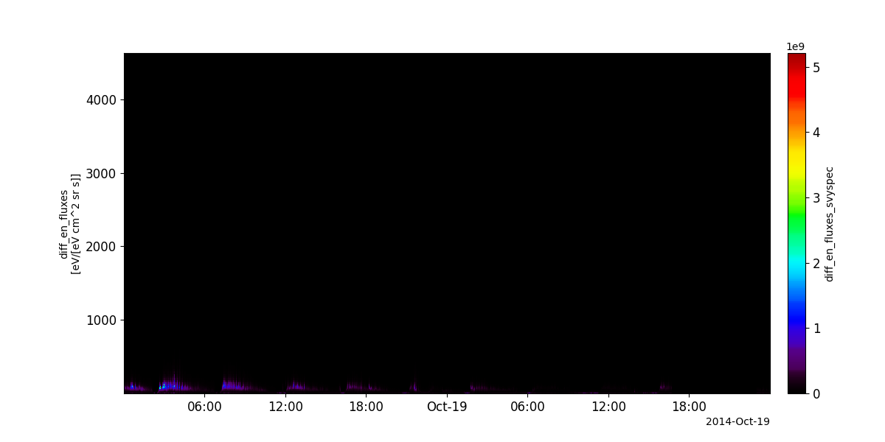
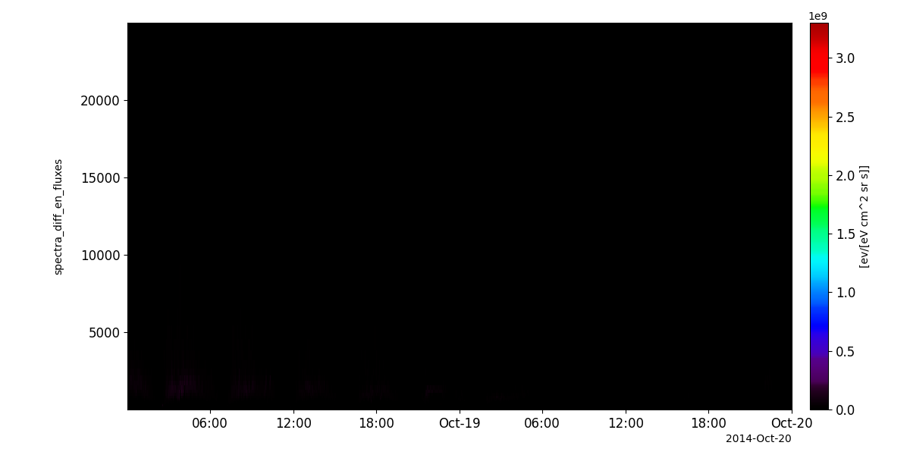
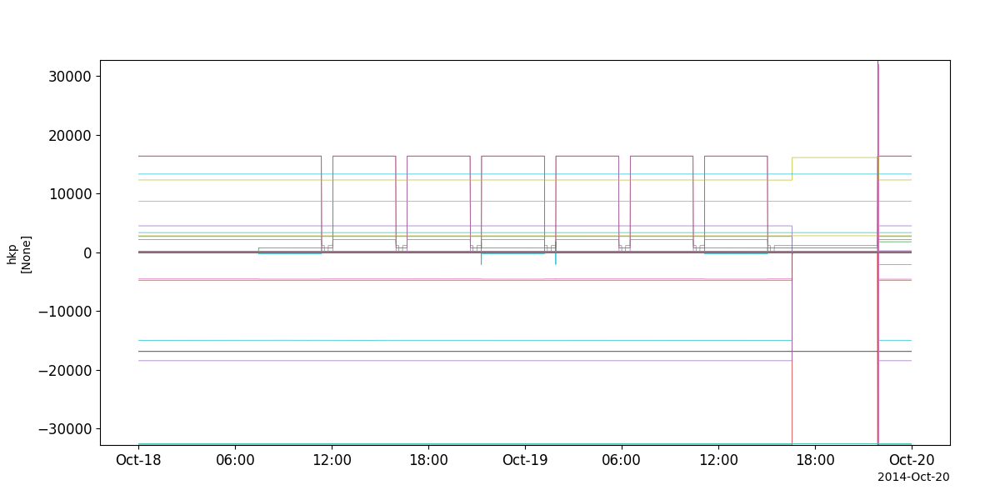
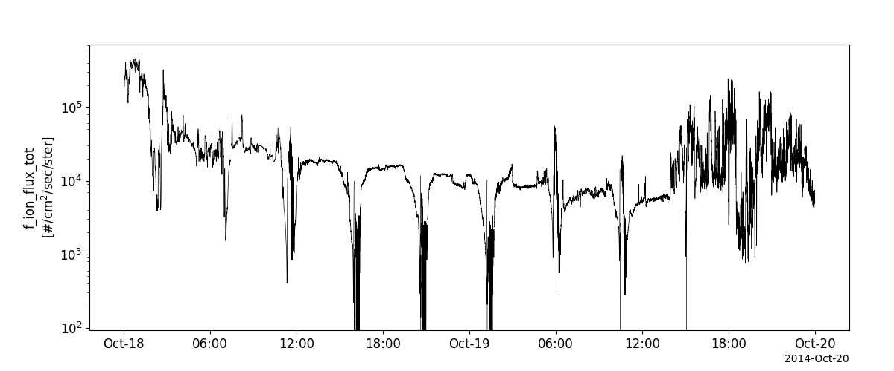
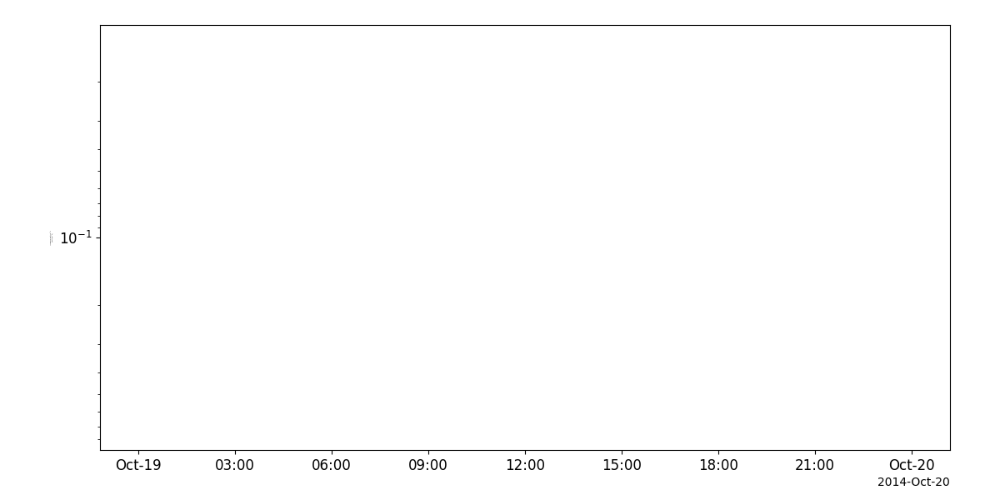

Mars Atmosphere and Volatile Evolution (MAVEN)
========================================================================
The routines in this module can be used to load data from the Mars Atmosphere and Volatile Evolution (MAVEN) mission.

Magnetometer (MAG)
----------------------------------------------------------
.. autofunction:: pyspedas.maven.mag

Example
^^^^^^^^^

.. code-block:: python
   
   import pyspedas
   from pytplot import tplot
   mag_vars = pyspedas.maven.mag(trange=['2014-10-18', '2014-10-19'])
   tplot('OB_B')

Solar Wind Electron Analyzer (SWEA)
----------------------------------------------------------
.. autofunction:: pyspedas.maven.swea

Example
^^^^^^^^^

.. code-block:: python
   
   import pyspedas
   from pytplot import tplot
   swe_vars = pyspedas.maven.swea(trange=['2014-10-18', '2014-10-19'])
   tplot('diff_en_fluxes_svyspec')

Solar Wind Ion Analyzer (SWIA)
----------------------------------------------------------
.. autofunction:: pyspedas.maven.swia

Example
^^^^^^^^^

.. code-block:: python
   
   import pyspedas
   from pytplot import tplot
   swi_vars = pyspedas.maven.swia(trange=['2014-10-18', '2014-10-19'])
   tplot('spectra_diff_en_fluxes_onboardsvyspec')

SupraThermal And Thermal Ion Composition (STATIC)
----------------------------------------------------------
.. autofunction:: pyspedas.maven.sta

Example
^^^^^^^^^

.. code-block:: python
   
   import pyspedas
   from pytplot import tplot
   sta_vars = pyspedas.maven.sta(trange=['2014-10-18', '2014-10-19'])
   tplot('hkp_2a-hkp')

Solar Energetic Particle (SEP)
----------------------------------------------------------
.. autofunction:: pyspedas.maven.sep

Example
^^^^^^^^^

.. code-block:: python
   
   import pyspedas
   from pytplot import tplot
   sep_vars = pyspedas.maven.sep(trange=['2014-10-18', '2014-10-19'])
   tplot('f_ion_flux_tot_s2-cal-svy-full')

Langmuir Probe and Waves (LPW)
----------------------------------------------------------
.. autofunction:: pyspedas.maven.lpw

Example
^^^^^^^^^

.. code-block:: python
   
   import pyspedas
   from pytplot import tplot
   lpw_vars = pyspedas.maven.lpw(trange=['2014-10-18', '2014-10-19'])
   tplot('mvn_lpw_lp_iv_l2_lpiv')

.. image:: _static/maven_lpw.png
   :align: center
   :class: imgborder

Extreme Ultraviolet Monitor (EUV)
----------------------------------------------------------
.. autofunction:: pyspedas.maven.euv

Example
^^^^^^^^^

.. code-block:: python
   
   import pyspedas
   from pytplot import tplot
   euv_vars = pyspedas.maven.euv(trange=['2014-10-18', '2014-10-19'])
   tplot('mvn_euv_calib_bands_bands')

