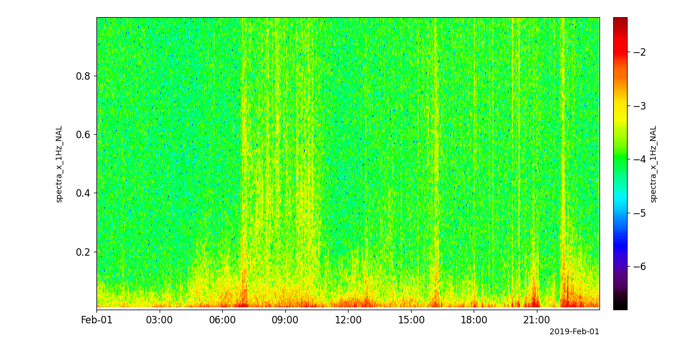

Magnetic Induction Coil Array (MICA)
========================================================================
The routines in this module can be used to load data from the Magnetic Induction Coil Array (MICA) mission.

Induction data
----------------------------------------------------------
.. autofunction:: pyspedas.projects.mica.induction

Example
^^^^^^^^^

.. code-block:: python
   
   import pyspedas
   from pyspedas import tplot
   nal_vars = pyspedas.projects.mica.induction(site='NAL', trange=['2019-02-01','2019-02-02'])
   tplot('spectra_x_1Hz_NAL')

