.. PySPEDAS documentation master file, created by
   sphinx-quickstart on Fri Sep 10 21:11:38 2021.
   You can adapt this file completely to your liking, but it should at least
   contain the root `toctree` directive.

Magnetospheric Multiscale (MMS)
====================================
The routines in this module can be used to load data from the Magnetospheric Multiscale (MMS) mission.

Each of the MMS load routines has a short name, which is just the instrument name without the mms_load prefix.

Fluxgate Magnetometer (FGM)
-----------------------------
Short name: pyspedas.mms.fgm
^^^^^^^^^^^^^^^^^^^^^^^^^^^^^

.. autofunction:: pyspedas.mms.mms_load_fgm

FGM Example
^^^^^^^^^^^^

.. code-block:: python
   
   import pyspedas
   from pytplot import tplot
   pyspedas.mms.fgm(trange=['2015-10-16/12:45', '2015-10-16/13:00'], time_clip=True)
   tplot(['mms1_fgm_b_gsm_srvy_l2_btot', 'mms1_fgm_b_gsm_srvy_l2_bvec'])

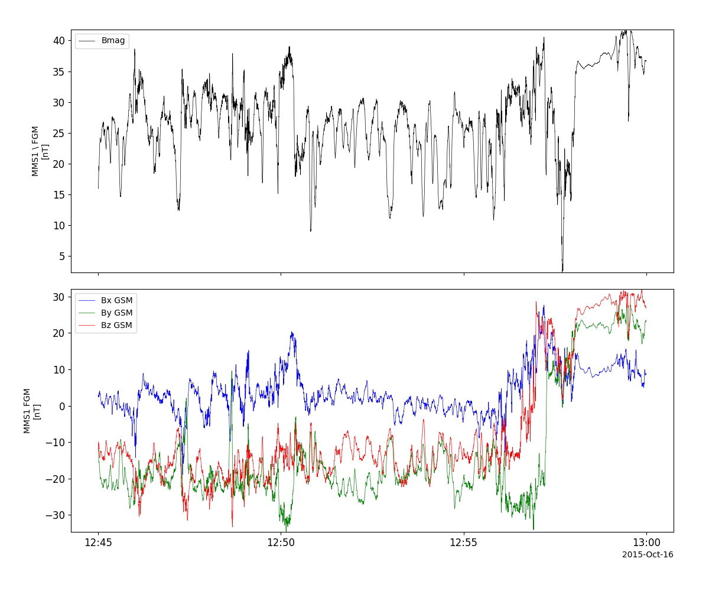

Search-coil Magnetometer (SCM)
--------------------------------
Short name: pyspedas.mms.scm
^^^^^^^^^^^^^^^^^^^^^^^^^^^^^

.. autofunction:: pyspedas.mms.mms_load_scm

SCM Example
^^^^^^^^^^^^

.. code-block:: python
   
   import pyspedas
   from pytplot import tplot
   pyspedas.mms.scm(trange=['2015-10-16/13:06', '2015-10-16/13:07'], time_clip=True)
   tplot('mms1_scm_acb_gse_scsrvy_srvy_l2')

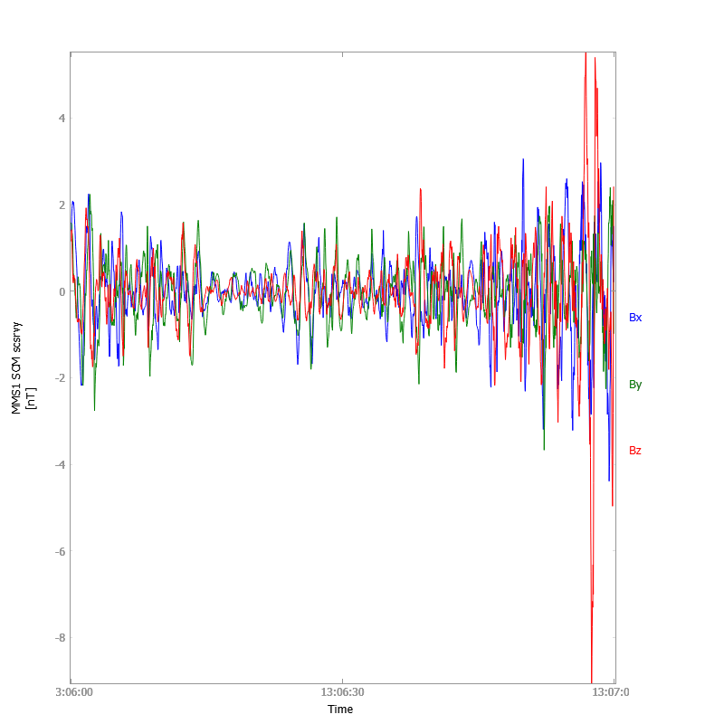

Level 3 FGM+SCM Data (FSM)
-----------------------------
Short name: pyspedas.mms.fsm
^^^^^^^^^^^^^^^^^^^^^^^^^^^^

.. autofunction:: pyspedas.mms.mms_load_fsm

FSM Example
^^^^^^^^^^^^^^^

.. code-block:: python
   
   import pyspedas
   from pytplot import tplot
   pyspedas.mms.fsm(trange=['2015-10-16/13:06', '2015-10-16/13:07'], time_clip=True)
   tplot(['mms1_fsm_b_mag_brst_l3', 'mms1_fsm_b_gse_brst_l3'])

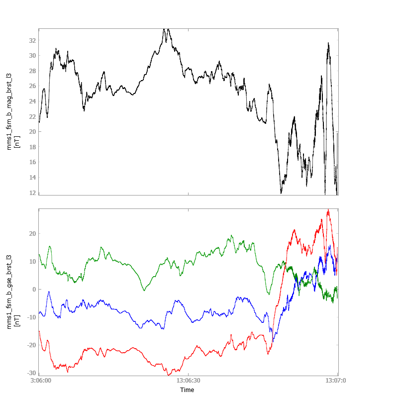

Electric field Double Probe (EDP)
-----------------------------------
Short name: pyspedas.mms.edp
^^^^^^^^^^^^^^^^^^^^^^^^^^^^^

.. autofunction:: pyspedas.mms.edp

EDP Example
^^^^^^^^^^^^^^^

.. code-block:: python
   
   import pyspedas
   from pytplot import tplot
   pyspedas.mms.edp(trange=['2015-10-16/13:06', '2015-10-16/13:07'], time_clip=True)
   tplot('mms1_edp_dce_gse_fast_l2')

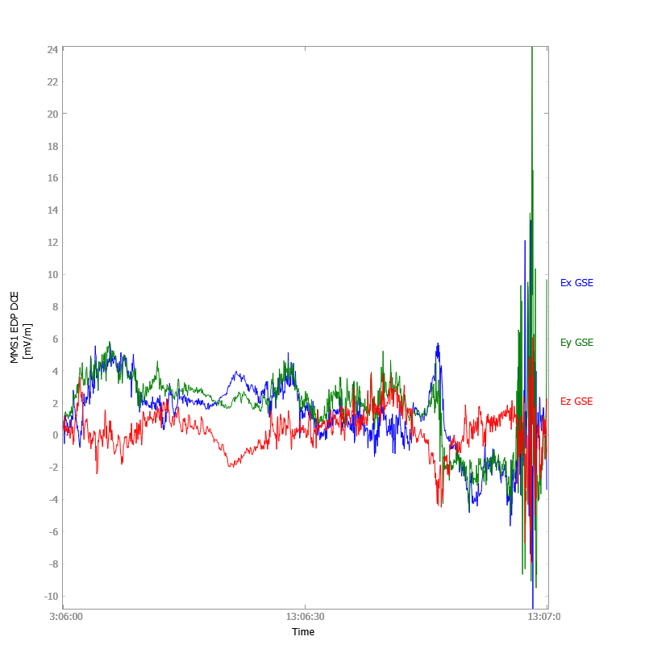

Electron Drift Instrument (EDI)
---------------------------------
Short name: pyspedas.mms.edi
^^^^^^^^^^^^^^^^^^^^^^^^^^^^^

.. autofunction:: pyspedas.mms.mms_load_edi

EDI Example
^^^^^^^^^^^^^^^

.. code-block:: python
   
   import pyspedas
   from pytplot import tplot
   pyspedas.mms.edi(trange=['2016-10-16/21:00', '2016-10-16/22:00'], time_clip=True)
   tplot(['mms1_edi_vdrift_gse_srvy_l2', 'mms1_edi_e_gse_srvy_l2'])

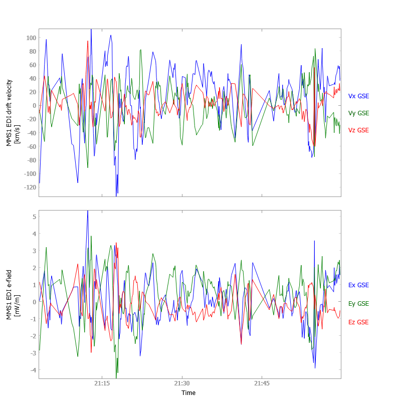

Fly's Eye Energetic Particle Sensor (FEEPS)
--------------------------------------------
Short name: pyspedas.mms.feeps
^^^^^^^^^^^^^^^^^^^^^^^^^^^^^^^

.. autofunction:: pyspedas.mms.mms_load_feeps

FEEPS Example
^^^^^^^^^^^^^^^

.. code-block:: python
   
   import pyspedas
   from pytplot import tplot
   pyspedas.mms.feeps(trange=['2015-10-16', '2015-10-17'])
   tplot('mms1_epd_feeps_srvy_l2_electron_intensity_omni_spin')

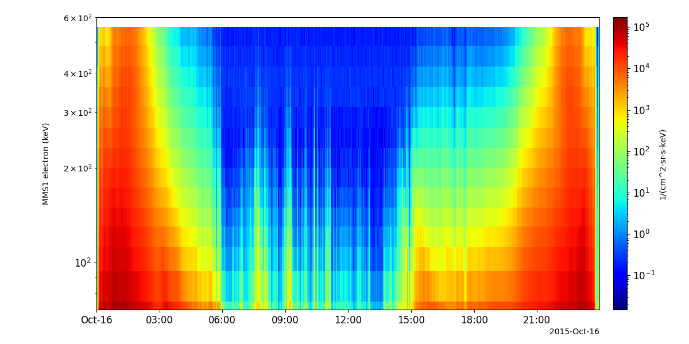

Energetic Ion Spectrometer (EIS)
-----------------------------------
Short name: pyspedas.mms.eis
^^^^^^^^^^^^^^^^^^^^^^^^^^^^

.. autofunction:: pyspedas.mms.mms_load_eis

EIS Example
^^^^^^^^^^^^^^^

.. code-block:: python
   
   import pyspedas
   from pytplot import tplot
   pyspedas.mms.eis(trange=['2015-10-16', '2015-10-17'])
   tplot(['mms1_epd_eis_srvy_l2_extof_proton_flux_omni', 'mms1_epd_eis_srvy_l2_extof_proton_flux_omni_spin'])

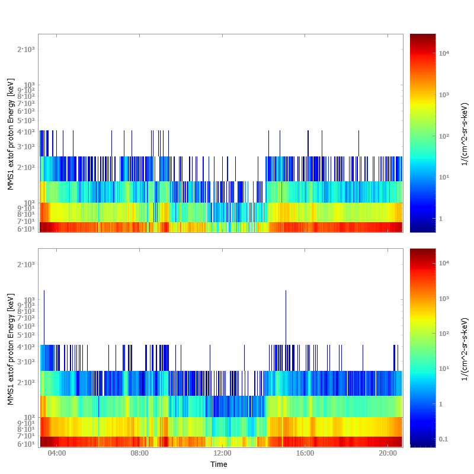

Active Spacecraft Potential Control (ASPOC)
--------------------------------------------
Short name: pyspedas.mms.aspoc
^^^^^^^^^^^^^^^^^^^^^^^^^^^^^^^

.. autofunction:: pyspedas.mms.mms_load_aspoc

ASPOC Example
^^^^^^^^^^^^^^^

.. code-block:: python
   
   import pyspedas
   from pytplot import tplot
   pyspedas.mms.aspoc(trange=['2015-10-16', '2015-10-17'])
   tplot(['mms1_aspoc_ionc_l2', 'mms1_asp1_ionc_l2', 'mms1_asp2_ionc_l2'])

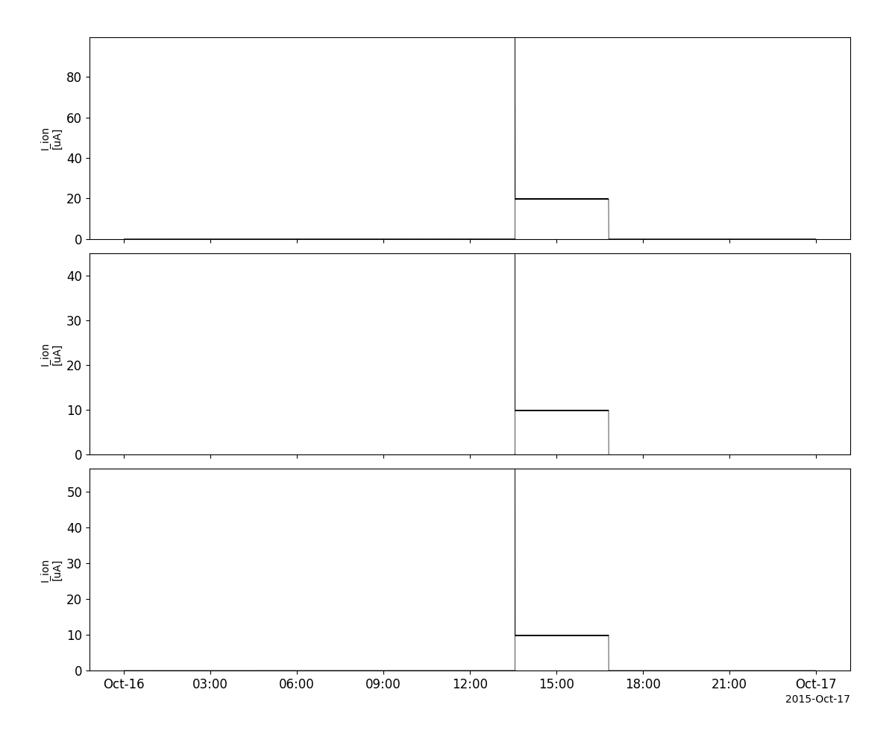

Fast Plasma Investigation (FPI)
--------------------------------
Short name: pyspedas.mms.fpi
^^^^^^^^^^^^^^^^^^^^^^^^^^^^

.. autofunction:: pyspedas.mms.mms_load_fpi

FPI Example
^^^^^^^^^^^^^^^

.. code-block:: python
   
   import pyspedas
   from pytplot import tplot
   pyspedas.mms.fpi(trange=['2015-10-16', '2015-10-17'], datatype='des-moms')
   tplot(['mms1_des_energyspectr_omni_fast', 'mms1_des_bulkv_gse_fast', 'mms1_des_numberdensity_fast'])

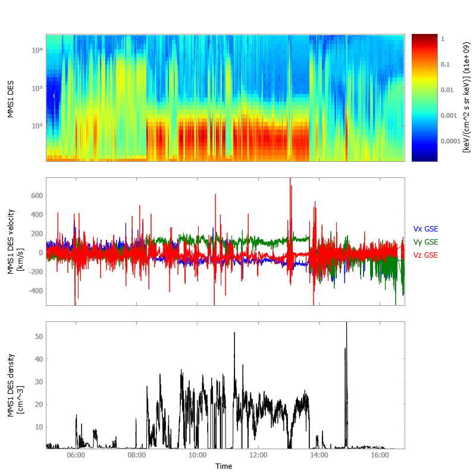

Hot Plasma Composition Analyzer (HPCA)
---------------------------------------
Short name: pyspedas.mms.hpca
^^^^^^^^^^^^^^^^^^^^^^^^^^^^^^

.. autofunction:: pyspedas.mms.mms_load_hpca

Short name: pyspedas.mms.hpca

HPCA Example
^^^^^^^^^^^^^^^

.. code-block:: python
   
   import pyspedas
   from pytplot import tplot
   pyspedas.mms.hpca(trange=['2015-10-16', '2015-10-17'], datatype='moments')
   tplot(['mms1_hpca_hplus_number_density', 'mms1_hpca_hplus_ion_bulk_velocity', 'mms1_hpca_hplus_scalar_temperature'])

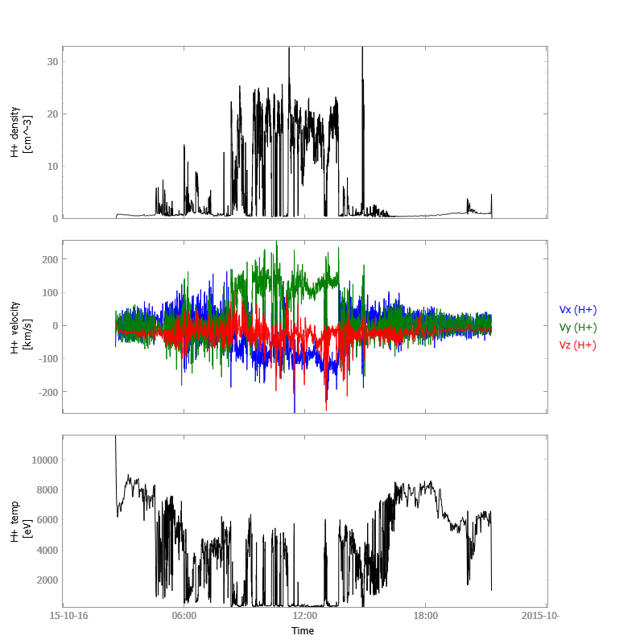

Mission Ephemeris Coordinates (MEC)
-------------------------------------
Short name: pyspedas.mms.mec
^^^^^^^^^^^^^^^^^^^^^^^^^^^^

.. autofunction:: pyspedas.mms.mms_load_mec

MEC Example
^^^^^^^^^^^^^^^

.. code-block:: python
   
   import pyspedas
   from pytplot import tplot
   pyspedas.mms.mec(trange=['2015-10-16', '2015-10-17'])
   tplot(['mms1_mec_r_gsm', 'mms1_mec_v_gsm'])

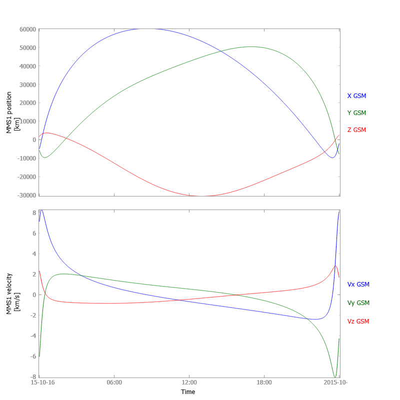

Attitude and Ephemeris (STATE)
-------------------------------
Short name: pyspedas.mms.state
^^^^^^^^^^^^^^^^^^^^^^^^^^^^^^^

.. autofunction:: pyspedas.mms.mms_load_state

State Example
^^^^^^^^^^^^^^^

.. code-block:: python
   
   import pyspedas
   from pytplot import tplot
   pyspedas.mms.state(trange=['2020-12-16', '2020-12-17'])
   tplot(['mms1_defeph_pos', 'mms1_defeph_vel'])

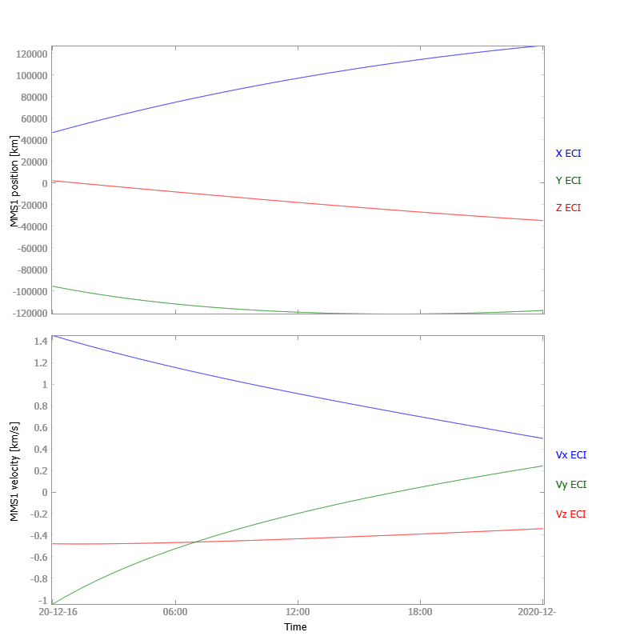

Tetrahedron Quality Factor
--------------------------------
Short name: pyspedas.mms.tetrahedron_qf
^^^^^^^^^^^^^^^^^^^^^^^^^^^^^^^^^^^^^^^

.. autofunction:: pyspedas.mms.mms_load_tetrahedron_qf

Tetrahedron QF Example
^^^^^^^^^^^^^^^^^^^^^^

.. code-block:: python

   import pyspedas
   from pytplot import tplot
   pyspedas.mms.tetrahedron_qf(trange=['2020-12-16', '2020-12-17'])
   tplot(['mms_tetrahedron_qf'])

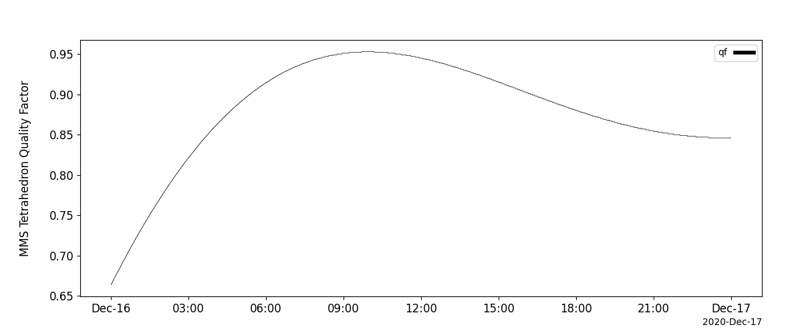
