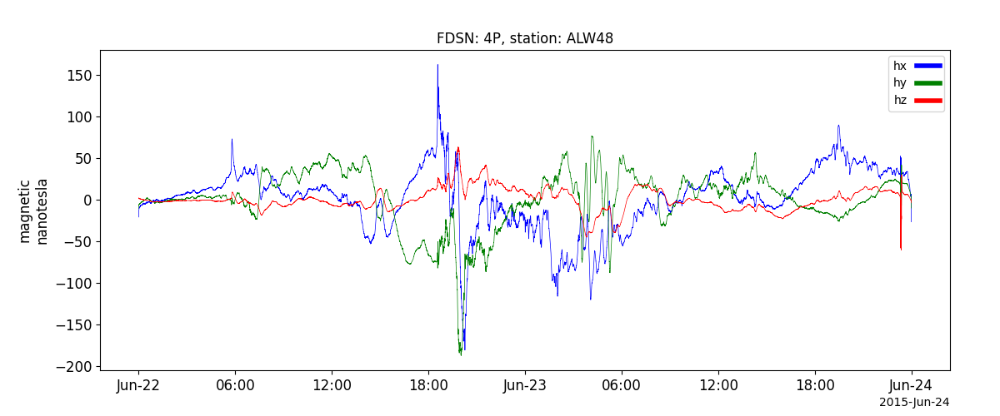

Magnetometer Data from Seismological Networks (mth5)
====================================================
This module aimed to convert the magnetometer data using the International Federation of Digital Seismographic Networks (FDSN) standards into high-level
data products and to provide access to the data via PySPEDAS. It utilize MTH5 and mt_metadata packages that were
developed at the USGS (U.S. Geological Survey).

Installation requirements
----------------------------------------------------------
MTH5 package is not included as a default dependency in PySPEDAS. To use this module (`pyspedas.mth5`), please install mth5:

.. code-block:: bash

   pip install mth5

Load FDSN data
----------------------------------------------------------
.. autofunction:: pyspedas.mth5.load_fdsn

Example
^^^^^^^^^

.. code-block:: python

    from pyspedas.mth5.load_fdsn import load_fdsn
    import pytplot
    load_fdsn(network="4P", station="ALW48", trange=['2015-06-22', '2015-06-24'])
    pytplot.tplot('fdsn_4P_ALW48')

Datasets availability
----------------------------------------------------------
.. autofunction:: pyspedas.mth5.utilities.datasets

.. code-block:: python

   from pyspedas.mth5.utilities import datasets
   valid_dataset = datasets(trange=["2015-06-22", "2015-06-23"])
   print(valid_dataset)

.. code-block:: python
    {'4P': {'ALW48': {('2015-06-18T15:00:36.0000', '2015-07-09T13:45:10.0000'): ['LFE', 'LFN', 'LFZ']},  ...
    # More entries