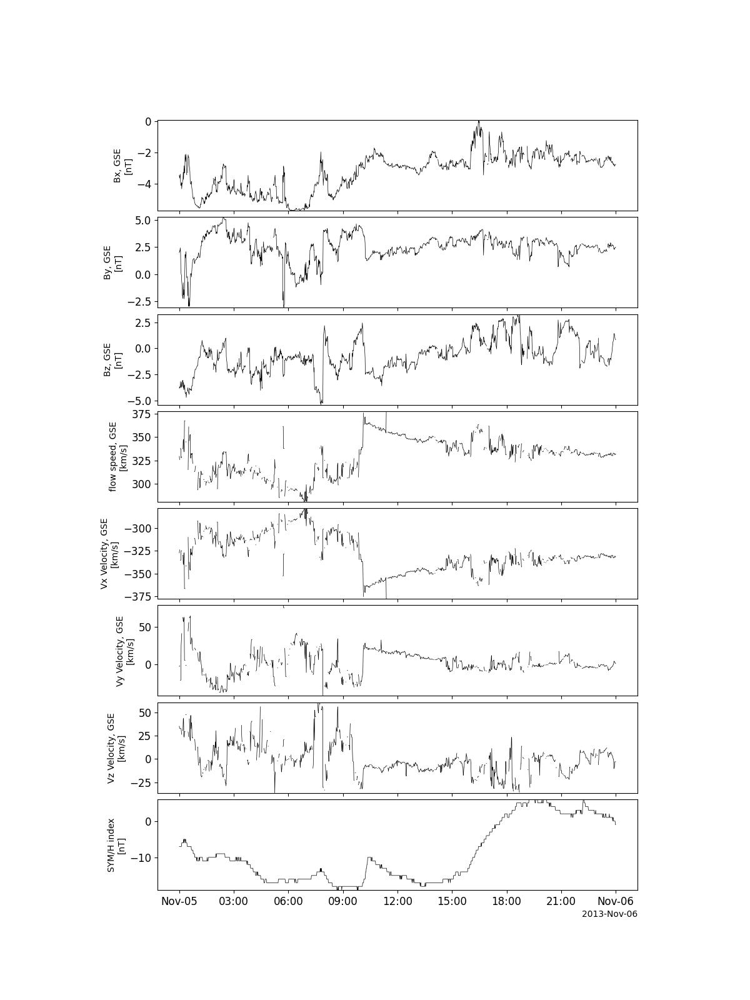

OMNI data
========================================================================
The routines in this module can be used to load data from the OMNI data mission.

Load all available OMNI variables
----------------------------------

.. autofunction:: pyspedas.omni.data

Example
^^^^^^^^^

.. code-block:: python
   
   import pyspedas
   from pytplot import tplot
   omni_vars = pyspedas.omni.data(trange=['2013-11-5', '2013-11-6'])
   tplot(['BX_GSE', 'BY_GSE', 'BZ_GSE', 'flow_speed', 'Vx', 'Vy', 'Vz', 'SYM_H'])

