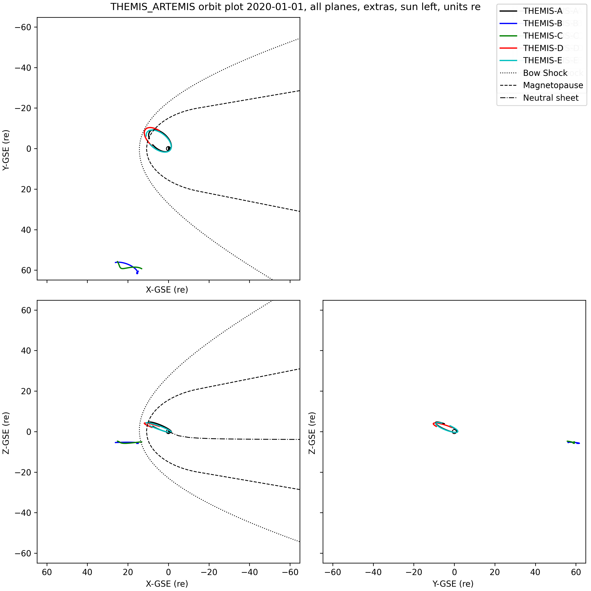

Plotting routines
=================

In past releases of PySPEDAS, plotting utilities, and many other tools that work with tplot variables, were
imported from the external pytplot-mpl-temp package.  As of PySPEDAS 2.0, they are now bundled with PySPEDAS.

Plotting
--------

tplot is the top level plotting routine.  It uses the matplotlib plotting library to render plots of tplot variables.

.. autofunction:: pyspedas.tplot

lineplot is a line plotting routine called by tplot. It is not usually called by users,
but is documented here for completeness.

.. autofunction:: pyspedas.lineplot

specplot is a spectrogram plotting routine called by tplot. It is not usually called by users,
but is docuemented here for completeness.

.. autofunction:: pyspedas.specplot

Time Windowing and Plot Limits
-------------------------------

.. autofunction:: pyspedas.tlimit
.. autofunction:: pyspedas.timespan
.. autofunction:: pyspedas.xlim
.. autofunction:: pyspedas.ylim
.. autofunction:: pyspedas.zlim

Interactive Time Selection from Plots
--------------------------------------

The ctime routine is a close analogue of the IDL SPEDAS tool.  A call to tplot()
with return_plot_objects=True will return Matplotlib figure and axis objects that can
be passed to ctime.  During a call to ctime, a vertical time bar will track the cursor
location within the plot. Left-clicking will save that timestamp to the output list; after
selecting the desired number of points, the user can right-click to quit.  ctime will
then return the list of timestamps selected.

At the moment, ctime does not work reliably in a Jupyter notebook when the matplotlib 'ipympl'
backend is used, or with the default 'inline' non-interactive back end.  If you are developing a notebook which
calls ctime, we recommend specifying the 'auto' backend (via the 'magic' command "%matplotlib auto") before importing
or calling any pyspedas or matplotlib routines.

.. autofunction:: pyspedas.ctime

Non-time-series plots
----------------------

PySPEDAS now has the ability to generate certain kinds of non-time-series plots which involve projecting 3-D
position or field data onto one or more of the coordinate system planes.  Examples include orbit plots, field line traces,
or hodograms.

The tplotxy routine projects one or more 3-d input variables onto one of the 2D coordinate system planes:
xy, xz, or yz.

The tplotxy3 routine projects and plots the input data onto all three coordinate planes in a single figure.
It also includes several features that are useful for orbit plots: once the initial figure is created,
one can add traces for bow shock, magnetopause boundaries, or neutral sheet locations by passing the
boundary data and the Matplotlib figure object to a helper routine to add the new traces.

.. autofunction:: pyspedas.tplotxy

.. autofunction:: pyspedas.tplotxy3

.. autofunction:: pyspedas.tplotxy3_add_mpause

.. autofunction:: pyspedas.tplotxy3_add_neutral_sheet

Example
^^^^^^^^^

This example displays THEMIS and ARTEMIS orbits using tplotxy3, then adds the bow shock, magnetopause, and AEN neutral sheet
location to the plots.

.. code-block:: python

        import pyspedas
        from pyspedas import tplotxy3, tplotxy3_add_mpause, tplotxy3_add_neutral_sheet
        from pyspedas.analysis.neutral_sheet import neutral_sheet
        from pyspedas import bshock_2, mpause_2, get_data, store_data, set_coords, set_units, cotrans
        import numpy as np

        # Load THEMIS state data
        default_trange = ["2020-01-01", "2020-01-02"]
        pyspedas.projects.themis.state(trange=default_trange, probe=['a','b','c','d','e'])
        # Calculate bow shock and magnetopause boundaries
        bs = bshock_2()
        mp = mpause_2()
        # The neutral sheet is a little more complicated, since it's time-dependent. We'll pick the midpoint
        # of the time interval
        d=get_data('tha_pos_gse')
        mid_time = (d.times[-1] - d.times[0])/2.0
        # Generate a set of points along the -X axis (night side of Earth), units of Re
        ns_x_re = -1.0*np.arange(0.0,375.0, 5.0)
        # We need replicate the timestamps to make a proper tplot variable
        times=np.zeros(len(ns_x_re))
        times[:] = mid_time
        ns_gsm_pos=np.zeros((len(ns_x_re),3))
        ns_gsm_pos[:,0] = ns_x_re
        # Generate the neutral sheet Z-axis values corresponding to the inputs
        ns = neutral_sheet(times, ns_gsm_pos, model="aen", sc2NS=False)
        # Add the Z component to the input positions, store it as a tplot variable
        ns_gsm_pos[:,2] = ns
        store_data('ns_gsm_pos', data={'x':times, 'y':ns_gsm_pos})
        # We're making a GSE plot, but the neutral sheet is generated in GSM, so we do a cotrans
        set_coords('ns_gsm_pos','GSM')
        set_units('ns_gsm_pos', 're')
        cotrans('ns_gsm_pos', 'ns_gse_pos',coord_in='gsm', coord_out='gse')
        # Finally, we have the neutral sheet Z positions along the X axis on the night side.
        gse_dat = get_data('ns_gse_pos')

        # Plot the orbits and capture the resulting figure
        fig = tplotxy3('th?_pos_gse',title='THEMIS_ARTEMIS orbit plot 2020-01-01, all planes, extras, sun left, units re', legend_names=['THEMIS-A','THEMIS-B', 'THEMIS-C', 'THEMIS-D', 'THEMIS-E'], reverse_x=True, plot_units='re', display=False)
        # Add bow shock to figure
        tplotxy3_add_mpause(bs[0],bs[1],fig=fig,legend_name="Bow Shock",color='k',linestyle='dotted',linewidth=1,display=False)
        # Add magnetopause to figure
        tplotxy3_add_mpause(mp[0],mp[1],fig=fig,legend_name="Magnetopause",color='k',linestyle='dashed',linewidth=1,display=False)
        # Add neutral sheet to figure, then display the plot, and save it to a file
        tplotxy3_add_neutral_sheet(gse_dat.y[:,0],gse_dat.y[:,2],fig=fig, legend_name="Neutral sheet",color='k',linestyle='dashdot',linewidth=1,display=True,save_png='orbits_thm_art_re_legends_extras_3planes.png')

Per-Variable Plot Options
-------------------------

.. autofunction:: pyspedas.options

.. autofunction:: pyspedas.timebar

.. autofunction:: pyspedas.databar

"Global" plot options
---------------------

.. autofunction:: pyspedas.tplot_options