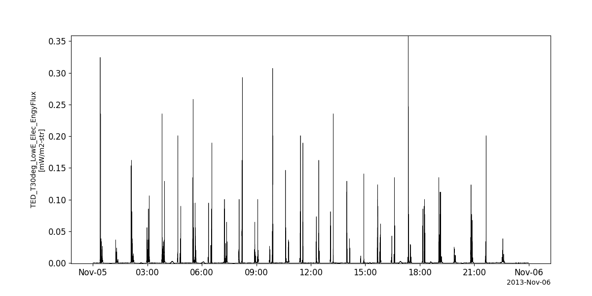

Polar Orbiting Environmental Satellites (POES) Mission
========================================================================
The routines in this module can be used to load data from the Polar Orbiting Environmental Satellites (POES) Mission mission.

Space Environment Monitor (SEM)
----------------------------------------------------------
.. autofunction:: pyspedas.poes.sem

Example
^^^^^^^^^

.. code-block:: python
   
   import pyspedas
   from pytplot import tplot
   sem_vars = pyspedas.poes.sem(trange=['2013-11-5', '2013-11-6'])
   tplot('ted_ele_tel30_low_eflux')

