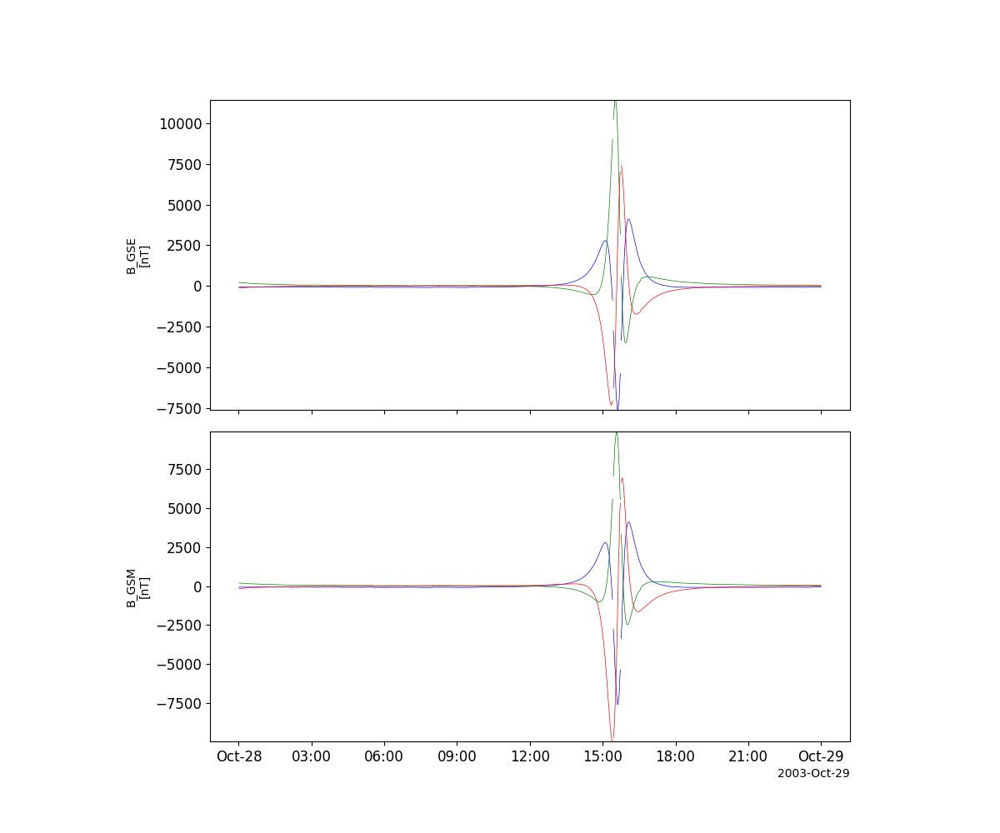
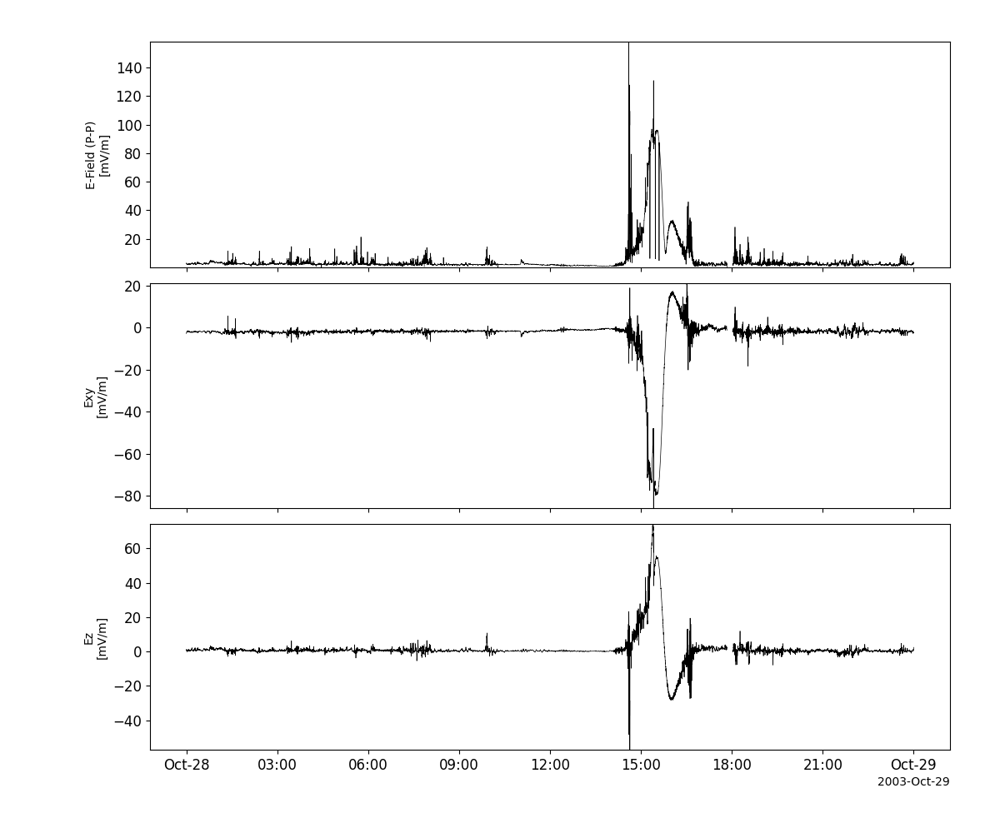
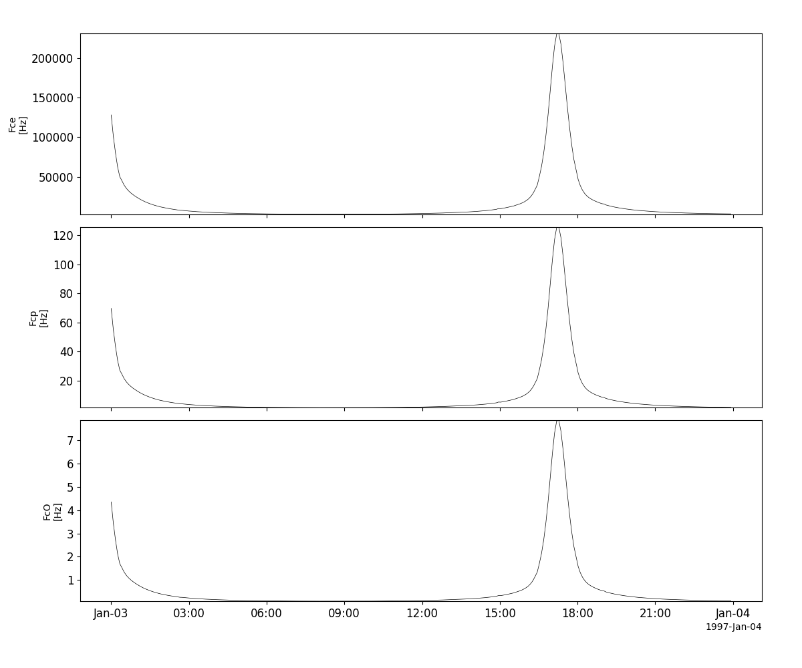
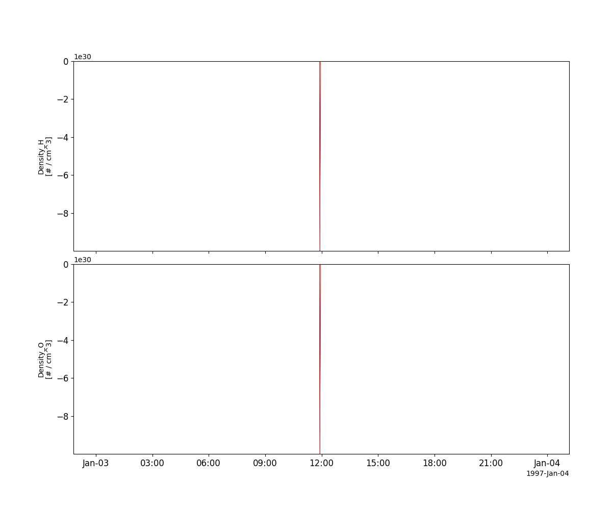
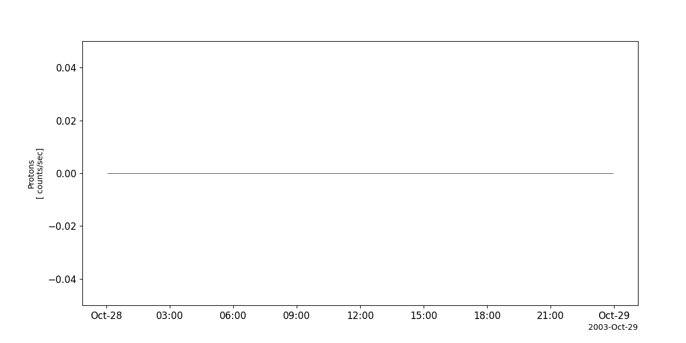
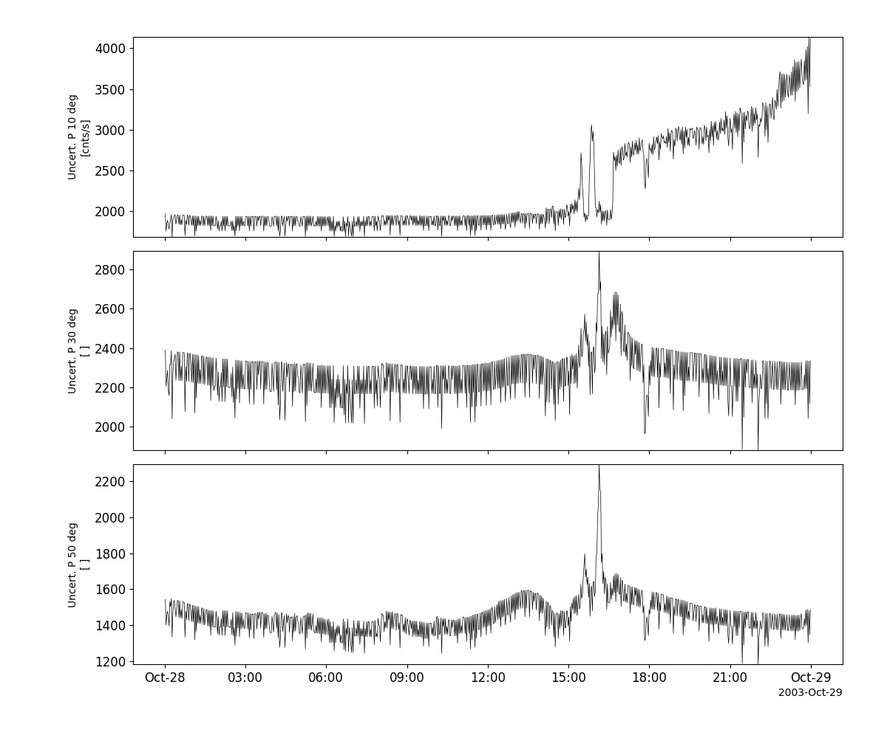
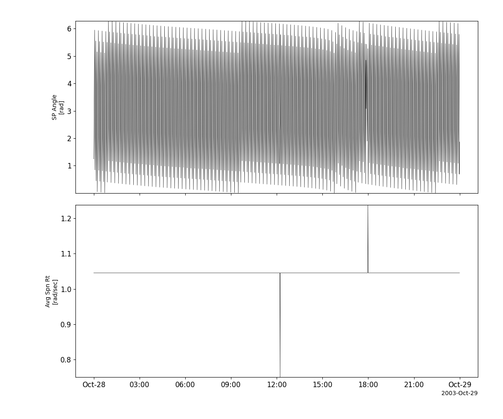

Polar
========================================================================
The routines in this module can be used to load data from the Polar mission.

Magnetic Field Experiment (MFE)
----------------------------------------------------------
.. autofunction:: pyspedas.projects.polar.mfe

Example
^^^^^^^^^

.. code-block:: python
   
   import pyspedas
   from pytplot import tplot
   mfe_vars = pyspedas.projects.polar.mfe(trange=['2003-10-28', '2003-10-29'])
   tplot(['B_GSE', 'B_GSM'])

Electric Fields Instrument (EFI)
----------------------------------------------------------
.. autofunction:: pyspedas.projects.polar.efi

Example
^^^^^^^^^

.. code-block:: python
   
   import pyspedas
   from pytplot import tplot
   efi_vars = pyspedas.projects.polar.efi(trange=['2003-10-28', '2003-10-29'])
   tplot(['ESPIN', 'EXY12G', 'EZ12G'])

Plasma Wave Instrument (PWI)
----------------------------------------------------------
.. autofunction:: pyspedas.projects.polar.pwi

Example
^^^^^^^^^

.. code-block:: python
   
   import pyspedas
   from pytplot import tplot
   pwi_vars = pyspedas.projects.polar.pwi()
   tplot(['Fce', 'Fcp', 'FcO'])

Hot Plasma Analyzer Experiment (HYDRA)
----------------------------------------------------------
.. autofunction:: pyspedas.projects.polar.hydra

Example
^^^^^^^^^

.. code-block:: python
   
   import pyspedas
   from pytplot import tplot
   hydra_vars = pyspedas.projects.polar.hydra(trange=['2003-10-28', '2003-10-29'])
   tplot('ELE_DENSITY')

.. image:: _static/polar_hydra.png
   :align: center
   :class: imgborder

Thermal Ion Dynamics Experiment (TIDE)
----------------------------------------------------------
.. autofunction:: pyspedas.projects.polar.tide

Example
^^^^^^^^^

.. code-block:: python
   
   import pyspedas
   from pytplot import tplot
   tide_vars = pyspedas.projects.polar.tide()
   tplot(['total_den', 'total_v', 'total_t'])

.. image:: _static/polar_tide.png
   :align: center
   :class: imgborder

Toroidal Imaging Mass Angle Spectrograph (TIMAS)
----------------------------------------------------------
.. autofunction:: pyspedas.projects.polar.timas

Example
^^^^^^^^^

.. code-block:: python
   
   import pyspedas
   from pytplot import tplot
   timas_vars = pyspedas.projects.polar.timas(trange=['1997-01-03/6:00', '1997-01-03/7:00'], time_clip=True)
   tplot(['Density_H', 'Density_O'])

Charge and Mass Magnetospheric Ion Composition Experiment (CAMMICE)
---------------------------------------------------------------------
.. autofunction:: pyspedas.projects.polar.cammice

Example
^^^^^^^^^

.. code-block:: python
   
   import pyspedas
   from pytplot import tplot
   cammice_vars = pyspedas.projects.polar.cammice(trange=['2003-10-28', '2003-10-29'])
   tplot('Protons')

Comprehensive Energetic Particle-Pitch Angle Distribution (CEPPAD)
--------------------------------------------------------------------
.. autofunction:: pyspedas.projects.polar.ceppad

Example
^^^^^^^^^

.. code-block:: python
   
   import pyspedas
   from pytplot import tplot
   cep_vars = pyspedas.projects.polar.ceppad(trange=['2003-10-28', '2003-10-29'])
   tplot(['IPS_10_ERR', 'IPS_30_ERR', 'IPS_50_ERR'])

Orbit data
----------------------------------------------------------
.. autofunction:: pyspedas.projects.polar.orbit

Example
^^^^^^^^^

.. code-block:: python
   
   import pyspedas
   from pytplot import tplot
   orb_vars = pyspedas.projects.polar.orbit(trange=['2003-10-28', '2003-10-29'])
   tplot(['SPIN_PHASE', 'AVG_SPIN_RATE'])

