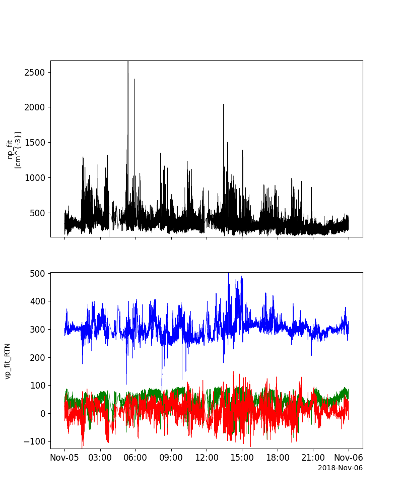
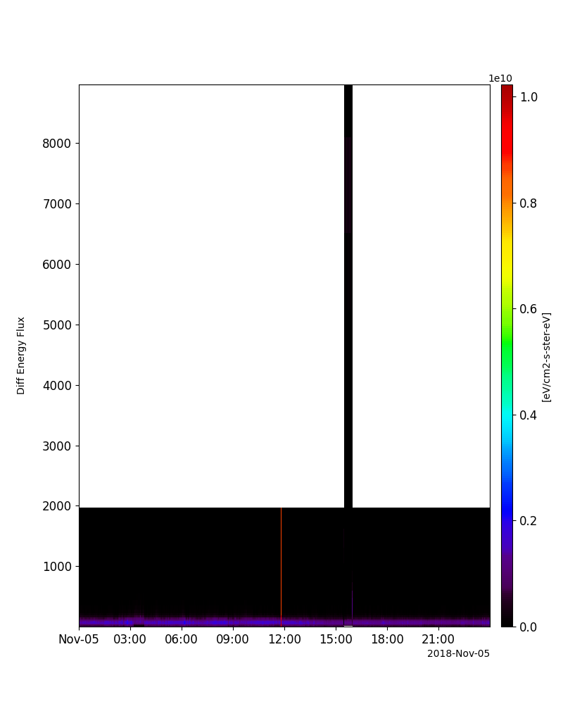
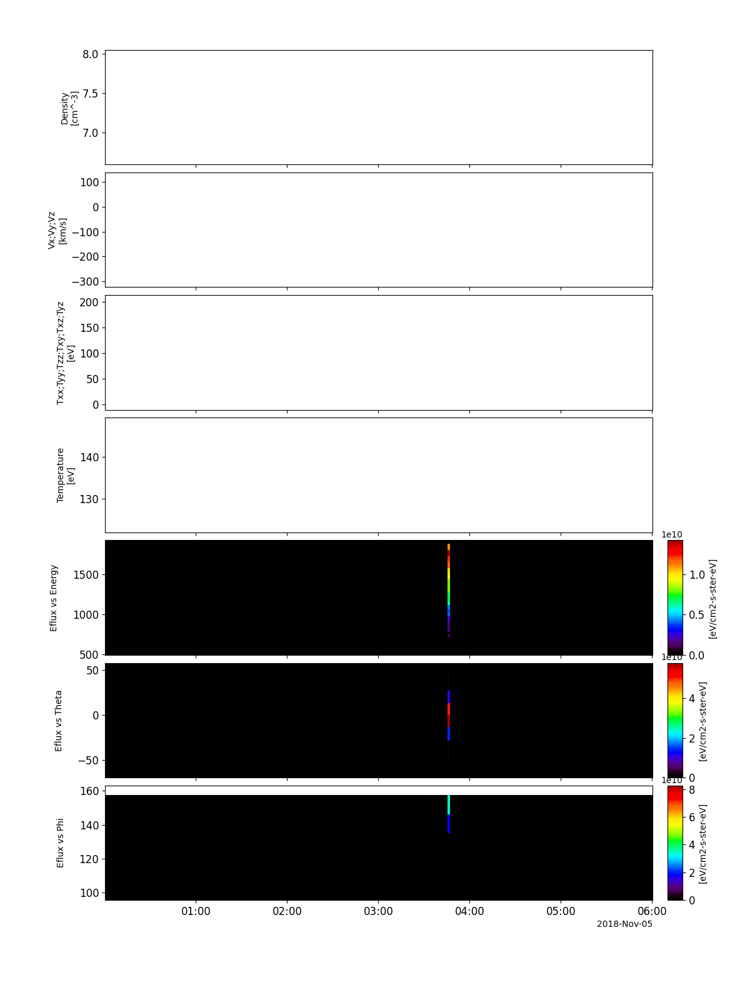
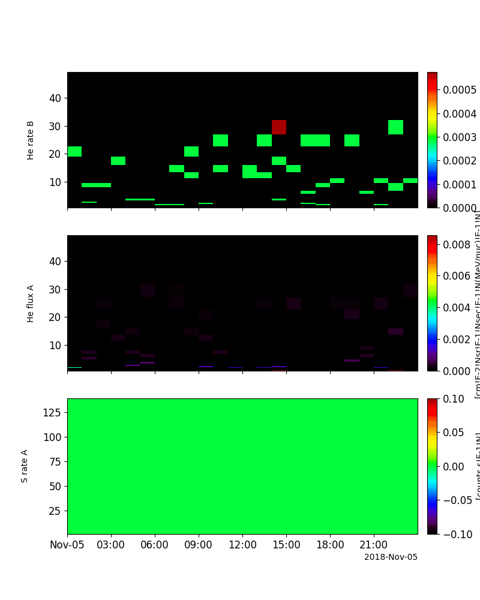
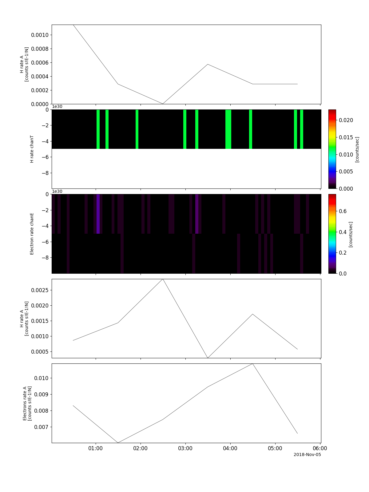

Parker Solar Probe (PSP)
========================================================================
The routines in this module can be used to load data from the Parker Solar Probe (PSP) mission.

Electromagnetic Fields Investigation (FIELDS)
----------------------------------------------------------
.. autofunction:: pyspedas.projects.psp.fields

Example
^^^^^^^^^

.. code-block:: python
   
   import pyspedas
   from pytplot import tplot
   fields_vars = pyspedas.projects.psp.fields(trange=['2018-11-5', '2018-11-5/06:00'], datatype='mag_rtn', level='l2', time_clip=True)
   tplot('psp_fld_l2_mag_RTN')

.. image:: _static/psp_fields.png
   :align: center
   :class: imgborder

Solar Probe Cup
----------------------------------------------------------
.. autofunction:: pyspedas.projects.psp.spc

Example
^^^^^^^^^

.. code-block:: python
   
   import pyspedas
   from pytplot import tplot
   spc_vars = pyspedas.projects.psp.spc(trange=['2018-11-5', '2018-11-6'], datatype='l3i', level='l3')
   tplot(['np_fit', 'vp_fit_RTN'])

SWEAP/SPAN-e
----------------------------------------------------------
.. autofunction:: pyspedas.projects.psp.spe

Example
^^^^^^^^^

.. code-block:: python
   
   import pyspedas
   from pytplot import tplot
   spe_vars = pyspedas.projects.psp.spe(trange=['2018-11-5', '2018-11-5/06:00'], datatype='spa_sf1_32e', level='l2', time_clip=True)
   tplot('EFLUX')

SWEAP/SPAN-i
----------------------------------------------------------
.. autofunction:: pyspedas.projects.psp.spi

Example
^^^^^^^^^

.. code-block:: python
   
   import pyspedas
   from pytplot import tplot
   spi_vars = pyspedas.projects.psp.spi(trange=['2018-11-5', '2018-11-5/06:00'], datatype='spi_sf0a_mom_inst', level='l3', time_clip=True)
   tplot(['DENS', 'VEL', 'T_TENSOR', 'TEMP', 'EFLUX_VS_ENERGY', 'EFLUX_VS_THETA', 'EFLUX_VS_PHI'])

IS☉IS/EPI-Hi
----------------------------------------------------------
.. autofunction:: pyspedas.projects.psp.epihi

Example
^^^^^^^^^

.. code-block:: python
   
   import pyspedas
   from pytplot import tplot
   epihi_vars = pyspedas.projects.psp.epihi(trange=['2018-11-5', '2018-11-5/06:00'], datatype='let1_rates1h', level='l2', time_clip=True)
   tplot(['B_He_Rate', 'A_He_Flux', 'A_S_Rate'])

IS☉IS/EPI (merged summary data)
----------------------------------------------------------
.. autofunction:: pyspedas.projects.psp.epi

Example
^^^^^^^^^

.. code-block:: python
   
   import pyspedas
   from pytplot import tplot
   epi_vars = pyspedas.projects.psp.epi(trange=['2018-11-5', '2018-11-5/06:00'], datatype='summary', level='l2', time_clip=True)
   tplot(['A_H_Rate_TS', 'H_CountRate_ChanT_SP', 'Electron_CountRate_ChanE', 'HET_A_H_Rate_TS', 'HET_A_Electrons_Rate_TS'])

