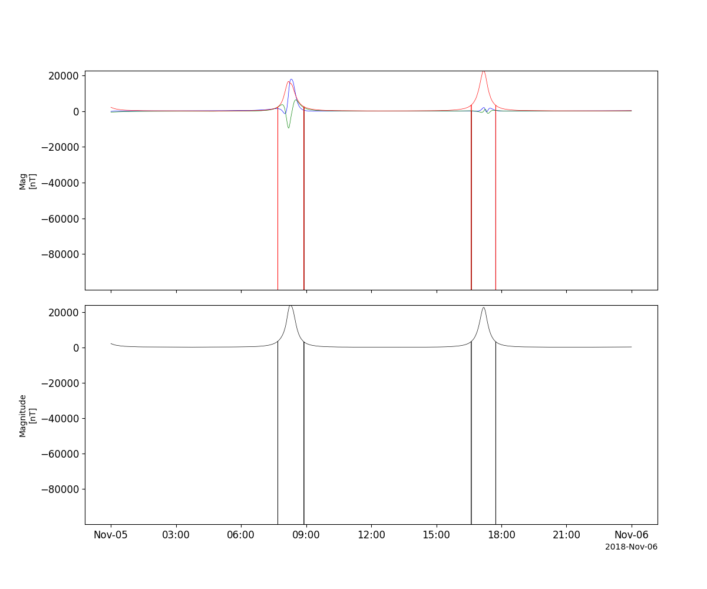
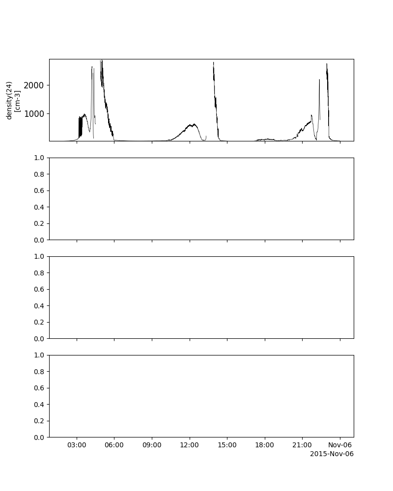
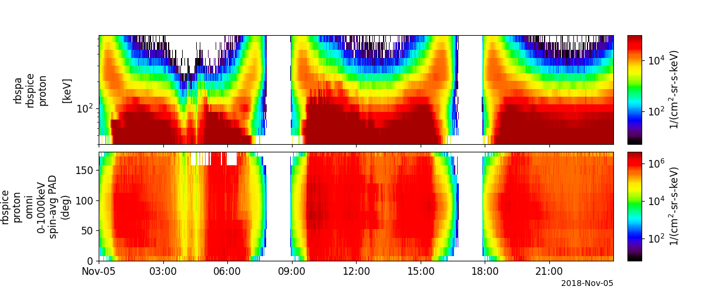
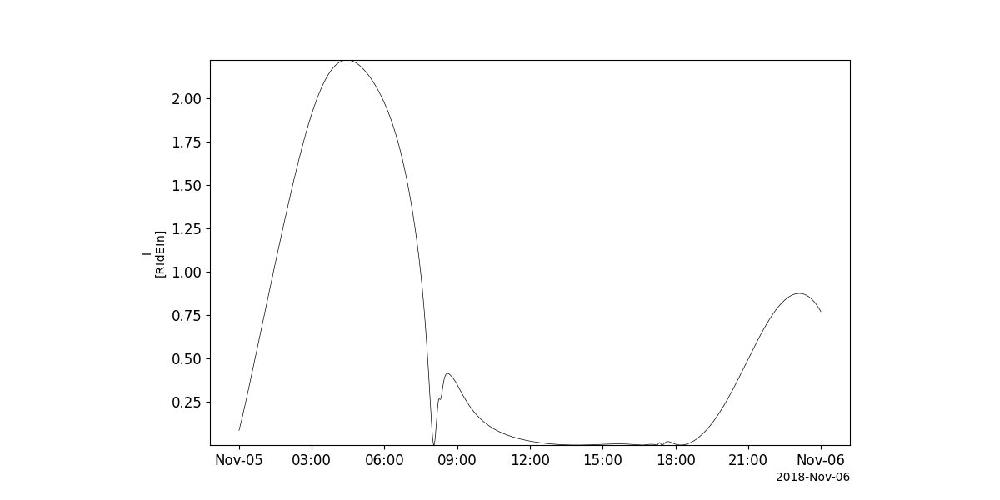
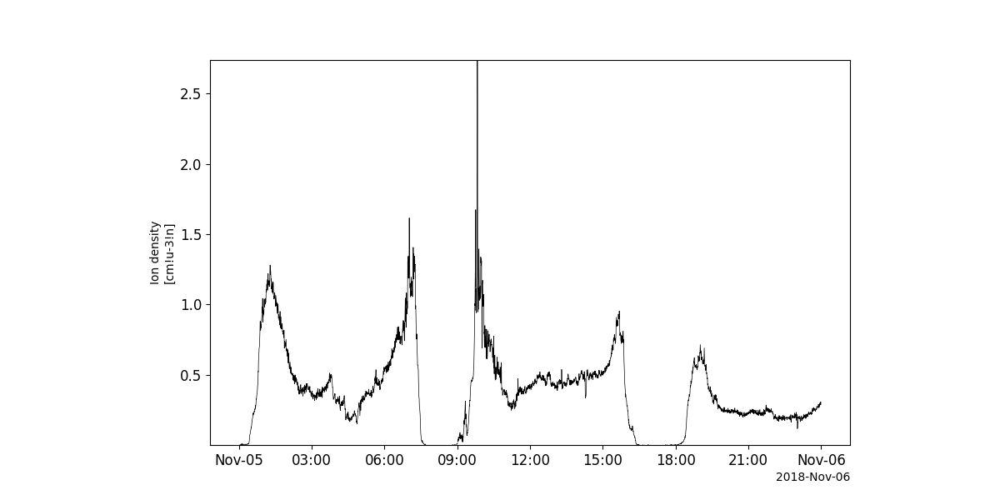
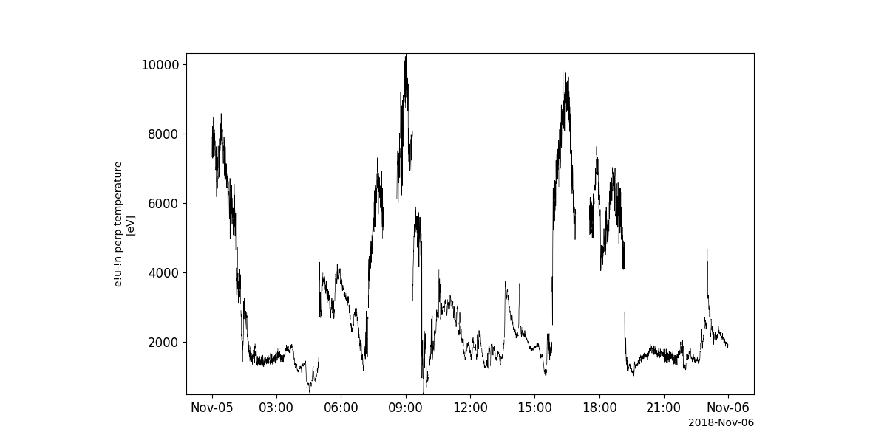
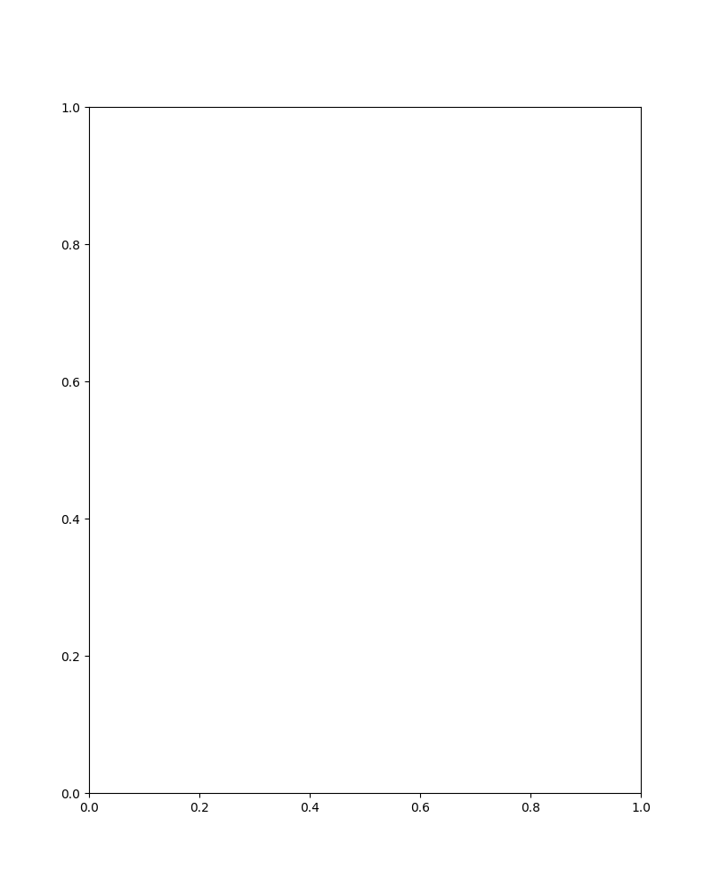

Van Allen Probes (RBSP)
========================================================================
The routines in this module can be used to load data from the Van Allen Probes (RBSP) mission.

Electric and Magnetic Field Instrument Suite and Integrated Science (EMFISIS)
----------------------------------------------------------
.. autofunction:: pyspedas.rbsp.emfisis

Example
^^^^^^^^^

.. code-block:: python
   
   import pyspedas
   from pytplot import tplot
   emfisis_vars = pyspedas.rbsp.emfisis(trange=['2018-11-5', '2018-11-6'], datatype='magnetometer', level='l3')
   tplot(['Mag', 'Magnitude'])

Electric Field and Waves Suite (EFW)
----------------------------------------------------------
.. autofunction:: pyspedas.rbsp.efw

Example
^^^^^^^^^

.. code-block:: python
   
   import pyspedas
   from pytplot import tplot
   efw_vars = pyspedas.rbsp.efw(trange=['2015-11-5', '2015-11-6'], level='l3')
   tplot(['density', 'Vavg', 'vel_gse', 'pos_gse'])

Radiation Belt Storm Probes Ion Composition Experiment (RBSPICE)
----------------------------------------------------------
.. autofunction:: pyspedas.rbsp.rbspice

Example
^^^^^^^^^

.. code-block:: python
   
   import pyspedas
   from pytplot import tplot
   rbspice_vars = pyspedas.rbsp.rbspice(trange=['2018-11-5', '2018-11-6'], datatype='tofxeh', level='l3')
   tplot('Alpha')

Energetic Particle, Composition, and Thermal Plasma Suite (ECT)
----------------------------------------------------------
.. autofunction:: pyspedas.rbsp.mageis

Example
^^^^^^^^^

.. code-block:: python
   
   import pyspedas
   from pytplot import tplot
   mageis_vars = pyspedas.rbsp.mageis(trange=['2018-11-5', '2018-11-6'], level='l3', rel='rel04')
   tplot('I')

----------------------------------------------------------
.. autofunction:: pyspedas.rbsp.hope

Example
^^^^^^^^^

.. code-block:: python
   
   import pyspedas
   from pytplot import tplot
   hope_vars = pyspedas.rbsp.hope(trange=['2018-11-5', '2018-11-6'], datatype='moments', level='l3', rel='rel04')
   tplot('Ion_density')

----------------------------------------------------------
.. autofunction:: pyspedas.rbsp.rept

Example
^^^^^^^^^

.. code-block:: python
   
   import pyspedas
   from pytplot import tplot
   rept_vars = pyspedas.rbsp.rept(trange=['2018-11-5', '2018-11-6'], level='l3', rel='rel03')
   tplot('Tperp_e_200')

Relativistic Proton Spectrometer (RPS)
----------------------------------------------------------
.. autofunction:: pyspedas.rbsp.rps

Example
^^^^^^^^^

.. code-block:: python
   
   import pyspedas
   from pytplot import tplot
   rps_vars = pyspedas.rbsp.rps(trange=['2018-11-5', '2018-11-6'], datatype='rps', level='l2')
   tplot('Alpha')

