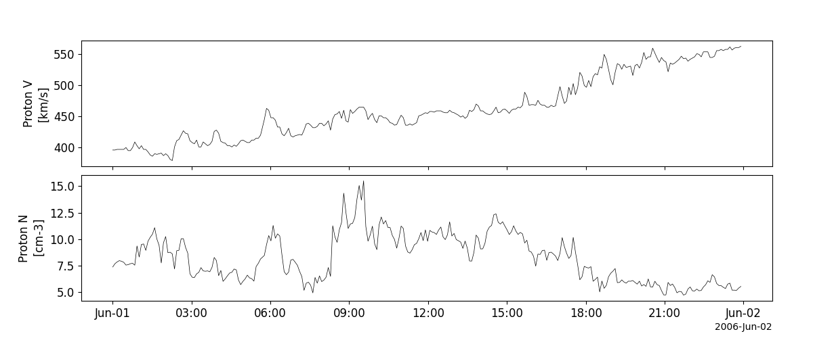
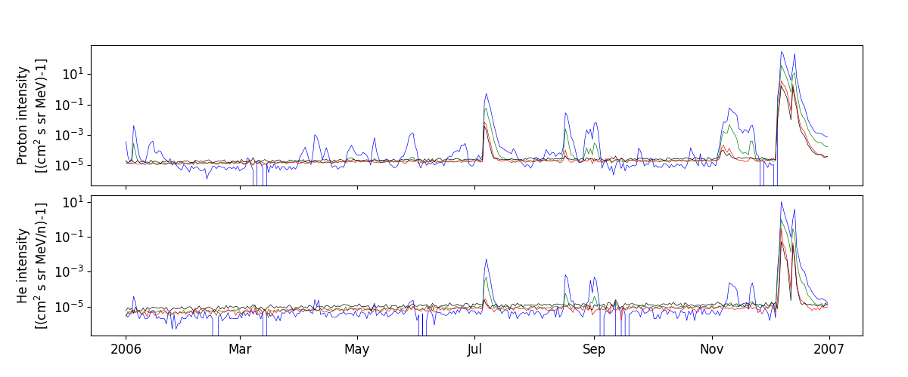
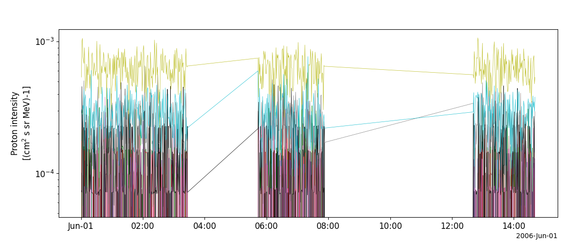
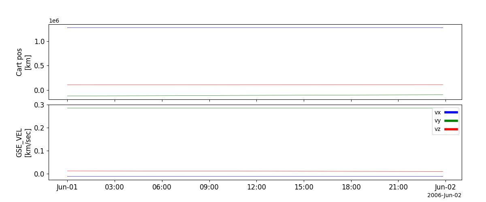

Solar & Heliospheric Observatory (SOHO)
========================================================================
The routines in this module can be used to load data from the Solar & Heliospheric Observatory (SOHO) mission.

Charge, Element, and Isotope Analysis System (CELIAS)
----------------------------------------------------------
.. autofunction:: pyspedas.projects.soho.celias

Example
^^^^^^^^^

.. code-block:: python
   
   import pyspedas
   from pyspedas import tplot
   celias_vars = pyspedas.projects.soho.celias(trange=['2006-06-01', '2006-06-02'])
   tplot(['V_p', 'N_p'])

Comprehensive Suprathermal and Energetic Particle Analyzer (COSTEP)
--------------------------------------------------------------------
.. autofunction:: pyspedas.projects.soho.costep

Example
^^^^^^^^^

.. code-block:: python
   
   import pyspedas
   from pyspedas import tplot
   costep_vars = pyspedas.projects.soho.costep(trange=['2006-06-01', '2006-06-02'])
   tplot(['P_int', 'He_int'])

Energetic and Relativistic Nuclei and Electron experiment (ERNE)
-----------------------------------------------------------------
.. autofunction:: pyspedas.projects.soho.erne

Example
^^^^^^^^^

.. code-block:: python
   
   import pyspedas
   from pyspedas import tplot
   erne_vars = pyspedas.projects.soho.erne(trange=['2006-06-01', '2006-06-02'])
   tplot('PH')

Orbit (ephemeris and attitude) data (ORBIT)
----------------------------------------------------------
.. autofunction:: pyspedas.projects.soho.orbit

Example
^^^^^^^^^

.. code-block:: python
   
   import pyspedas
   from pyspedas import tplot
   orbit_vars = pyspedas.projects.soho.orbit(trange=['2006-06-01', '2006-06-02'])
   tplot(['GSE_POS', 'GSE_VEL'])

    