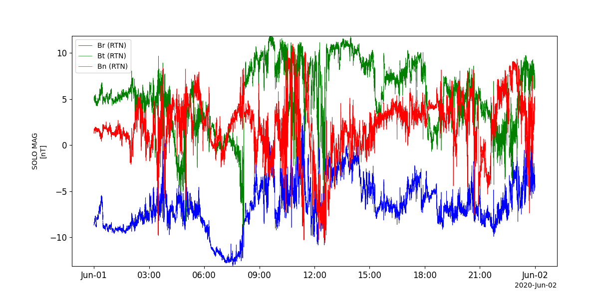
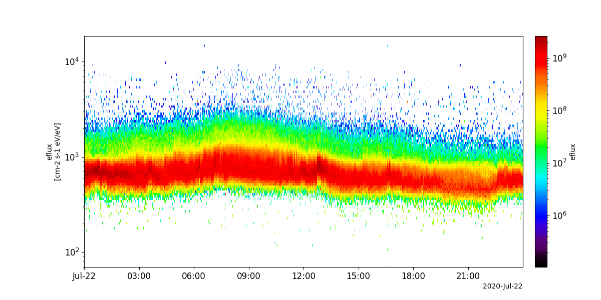
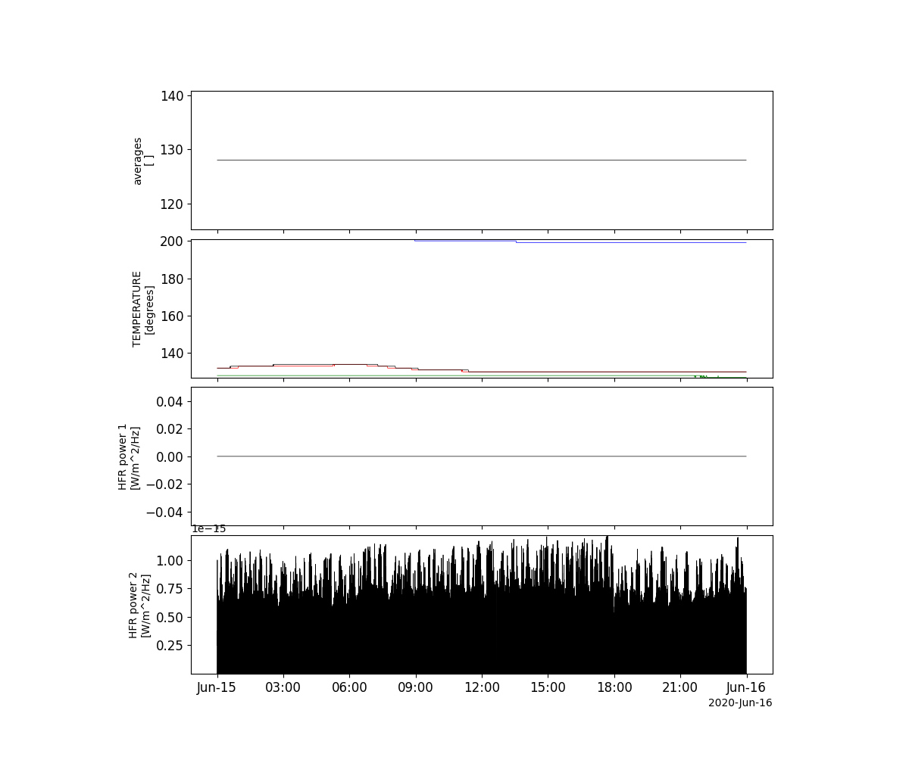

Solar Orbiter (SOLO)
========================================================================
The routines in this module can be used to load data from the Solar Orbiter (SOLO) mission.

Magnetometer (MAG)
----------------------------------------------------------
.. autofunction:: pyspedas.solo.mag

Example
^^^^^^^^^

.. code-block:: python
   
   import pyspedas
   from pytplot import tplot
   mag_vars = pyspedas.solo.mag(trange=['2020-06-01', '2020-06-02'], datatype='rtn-normal')
   tplot('B_RTN')

Solar Wind Plasma Analyser (SWA)
----------------------------------------------------------
.. autofunction:: pyspedas.solo.swa

Example
^^^^^^^^^

.. code-block:: python
   
   import pyspedas
   from pytplot import tplot
   swa_vars = pyspedas.solo.swa(trange=['2020-07-22', '2020-07-23'], datatype='pas-eflux')
   tplot('eflux')

Radio and Plasma Waves (RPW)
----------------------------------------------------------
.. autofunction:: pyspedas.solo.rpw

Example
^^^^^^^^^

.. code-block:: python
   
   import pyspedas
   from pytplot import tplot
   rpw_vars = pyspedas.solo.rpw(trange=['2020-06-15', '2020-06-16'], datatype='hfr-surv')
   tplot(['AVERAGE_NR', 'TEMPERATURE', 'FLUX_DENSITY1', 'FLUX_DENSITY2'])

