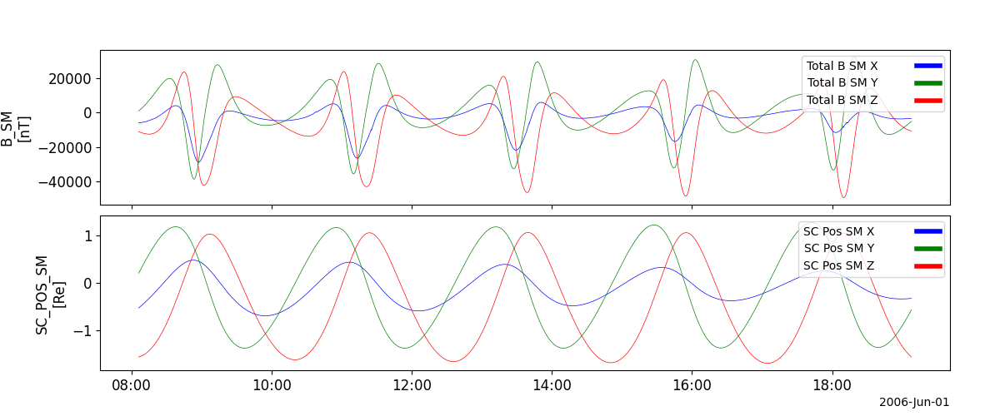

Space Technology 5 (ST5)
========================================================================
The routines in this module can be used to load data from the Space Technology 5 (ST5) mission.

Magnetometer (MAG)
----------------------------------------------------------
.. autofunction:: pyspedas.st5.mag

Example
^^^^^^^^^

.. code-block:: python
   
   import pyspedas
   from pytplot import tplot
   st5_vars = pyspedas.st5.mag(trange=['2006-06-01', '2006-06-02'])
   tplot(['B_SM', 'SC_POS_SM'])

    