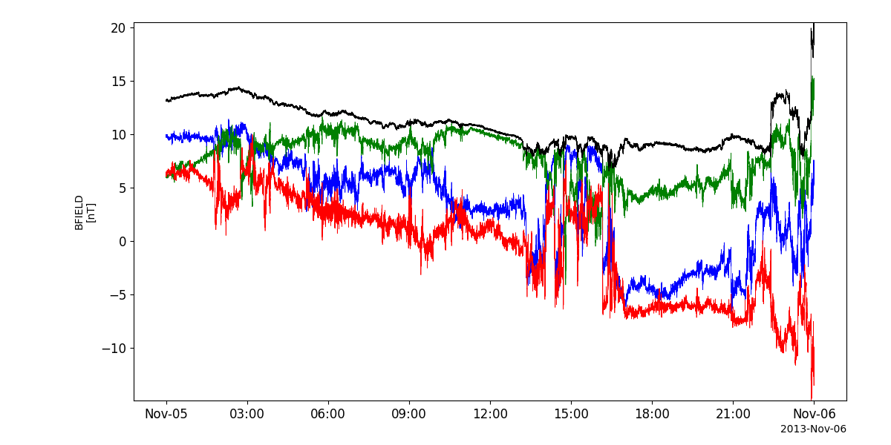
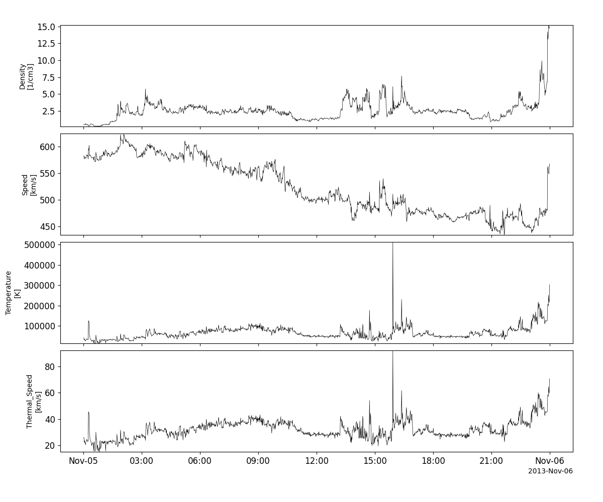

Solar Terrestrial Relations Observatory (STEREO)
========================================================================
The routines in this module can be used to load data from the Solar Terrestrial Relations Observatory (STEREO) mission.

Magnetometer (MAG)
----------------------------------------------------------
.. autofunction:: pyspedas.stereo.mag

Example
^^^^^^^^^

.. code-block:: python
   
   import pyspedas
   from pytplot import tplot
   mag_vars = pyspedas.stereo.mag(trange=['2013-11-5', '2013-11-6'])
   tplot('BFIELD')

PLAsma and SupraThermal Ion Composition (PLASTIC)
----------------------------------------------------------
.. autofunction:: pyspedas.stereo.plastic

Example
^^^^^^^^^

.. code-block:: python
   
   import pyspedas
   from pytplot import tplot
   plastic_vars = pyspedas.stereo.plastic(trange=['2013-11-5', '2013-11-6'])
   tplot(['proton_number_density', 'proton_bulk_speed', 'proton_temperature', 'proton_thermal_speed'])

