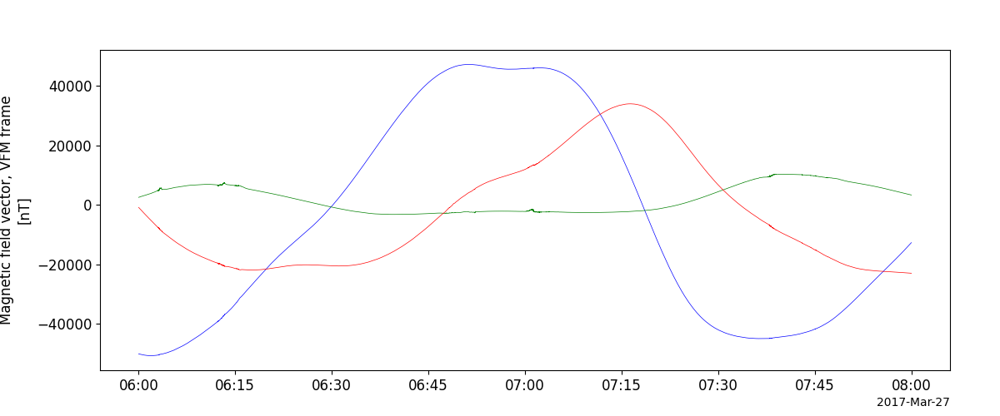

Swarm
========================================================================
The routines in this module can be used to load data from the Swarm mission.

Vector Field Magnetometer (VFM)
----------------------------------------------------------
.. autofunction:: pyspedas.swarm.mag

Example
^^^^^^^^^

.. code-block:: python

   import pyspedas
   from pytplot import tplot
   mag_vars = pyspedas.swarm.mag(probe='c', trange=['2017-03-27/06:00', '2017-03-27/08:00'], datatype='hr')
   tplot('swarmc_B_VFM')

