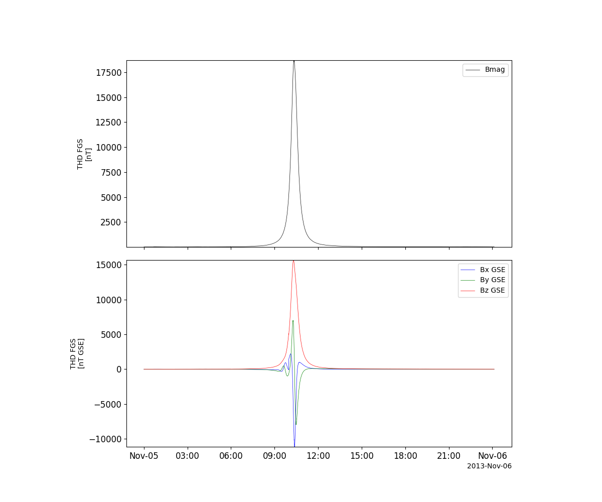
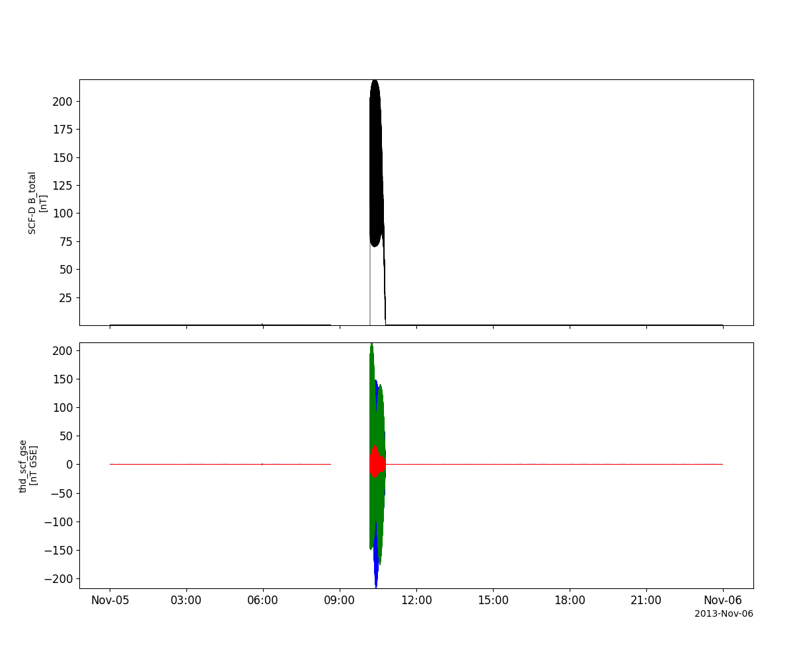
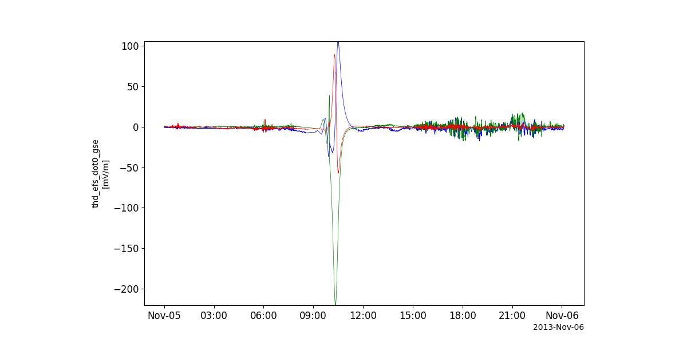
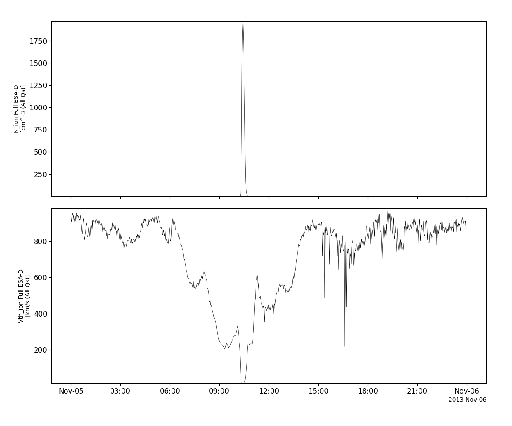
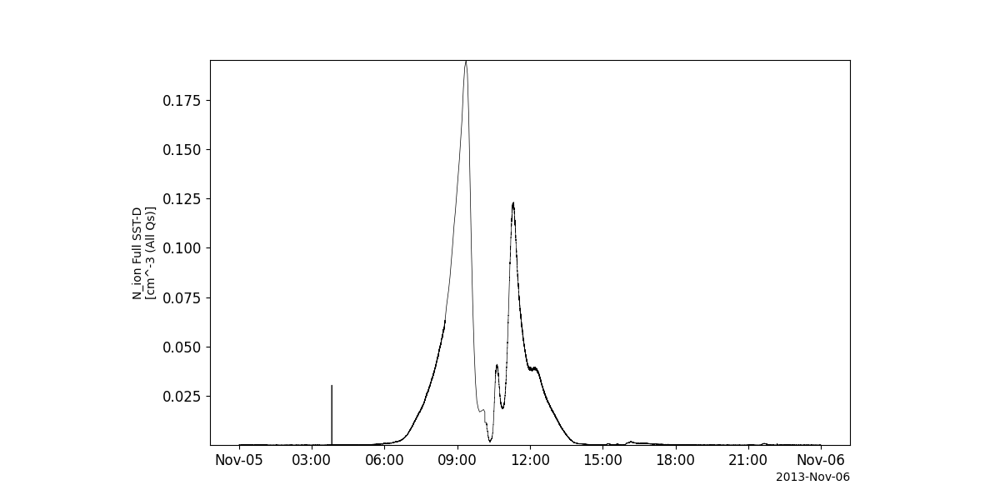
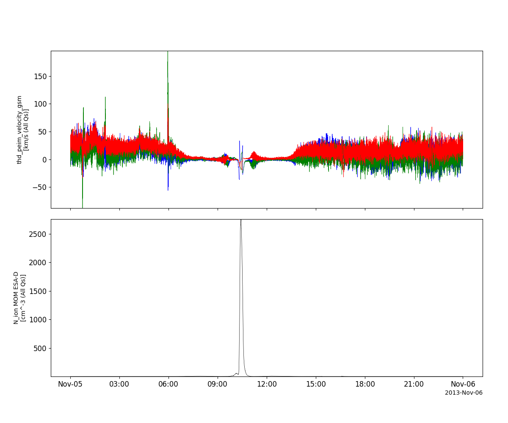
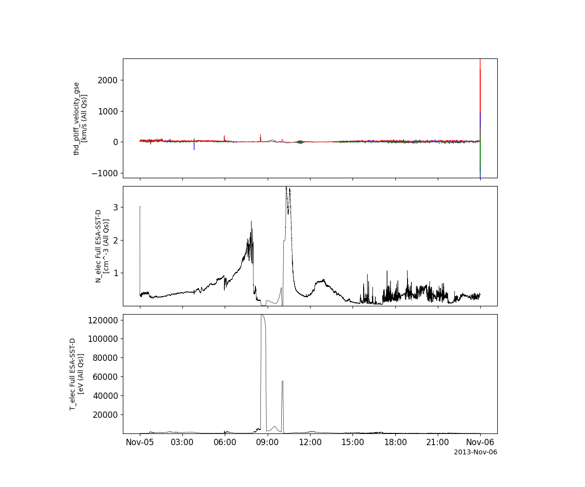
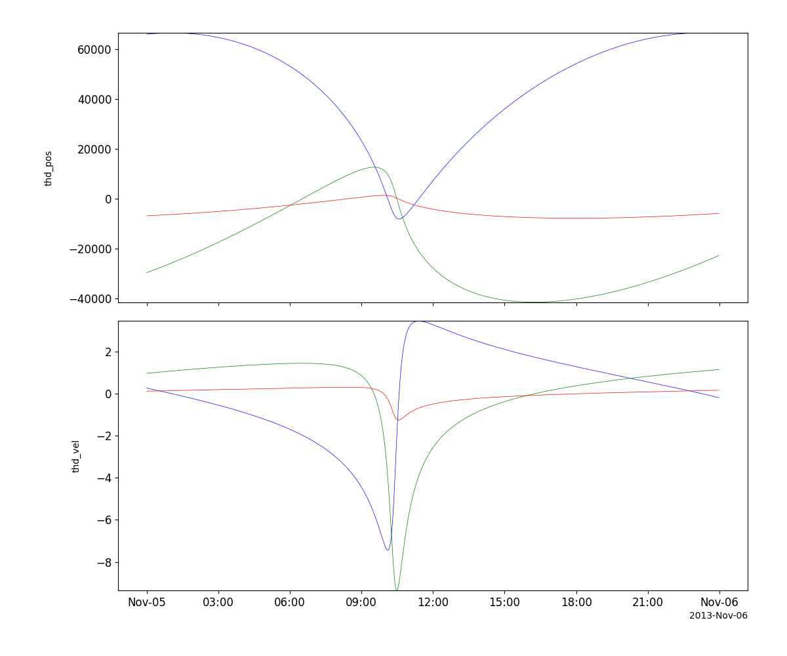
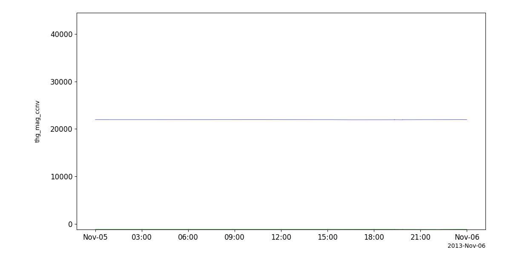

Time History of Events and Macroscale Interactions during Substorms (THEMIS)
==============================================================================
The routines in this module can be used to load data from the Time History of Events and Macroscale Interactions during Substorms (THEMIS) mission.

Fluxgate magnetometer (FGM)
----------------------------------------------------------
.. autofunction:: pyspedas.themis.fgm

Example
^^^^^^^^^

.. code-block:: python
   
   import pyspedas
   from pytplot import tplot
   fgm_vars = pyspedas.themis.fgm(probe='d', trange=['2013-11-5', '2013-11-6'])
   tplot(['thd_fgs_btotal', 'thd_fgs_gse'])

Search-coil magnetometer (SCM)
----------------------------------------------------------
.. autofunction:: pyspedas.themis.scm

Example
^^^^^^^^^

.. code-block:: python
   
   import pyspedas
   from pytplot import tplot
   scm_vars = pyspedas.themis.scm(probe='d', trange=['2013-11-5', '2013-11-6'])
   tplot(['thd_scf_btotal', 'thd_scf_gse'])

Electric Field Instrument (EFI)
----------------------------------------------------------
.. autofunction:: pyspedas.themis.efi

Example
^^^^^^^^^

.. code-block:: python
   
   import pyspedas
   from pytplot import tplot
   efi_vars = pyspedas.themis.efi(probe='d', trange=['2013-11-5', '2013-11-6'])
   tplot('thd_efs_dot0_gse')

Electrostatic Analyzer (ESA)
----------------------------------------------------------
.. autofunction:: pyspedas.themis.esa

Example
^^^^^^^^^

.. code-block:: python
   
   import pyspedas
   from pytplot import tplot
   esa_vars = pyspedas.themis.esa(probe='d', trange=['2013-11-5', '2013-11-6'])
   tplot(['thd_peif_density', 'thd_peif_vthermal'])

Solid State Telescope (SST)
----------------------------------------------------------
.. autofunction:: pyspedas.themis.sst

Example
^^^^^^^^^

.. code-block:: python
   
   import pyspedas
   from pytplot import tplot
   sst_vars = pyspedas.themis.sst(probe='d', trange=['2013-11-5', '2013-11-6'])
   tplot('thd_psif_density')

Moments data
----------------------------------------------------------
.. autofunction:: pyspedas.themis.mom

Example
^^^^^^^^^

.. code-block:: python
   
   import pyspedas
   from pytplot import tplot
   mom_vars = pyspedas.themis.mom(probe='d', trange=['2013-11-5', '2013-11-6'])
   tplot(['thd_peim_velocity_gsm', 'thd_peim_density'])

Ground computed moments data
----------------------------------------------------------
.. autofunction:: pyspedas.themis.gmom

Example
^^^^^^^^^

.. code-block:: python
   
   import pyspedas
   from pytplot import tplot
   gmom_vars = pyspedas.themis.gmom(probe='d', trange=['2013-11-5', '2013-11-6'])
   tplot(['thd_ptiff_velocity_gse', 'thd_pteff_density', 'thd_pteff_avgtemp'])

State data
----------------------------------------------------------
.. autofunction:: pyspedas.themis.state

Example
^^^^^^^^^

.. code-block:: python
   
   import pyspedas
   from pytplot import tplot
   state_vars = pyspedas.themis.state(probe='d', trange=['2013-11-5', '2013-11-6'])
   tplot(['thd_pos', 'thd_vel'])

Ground magnetometer data
----------------------------------------------------------
.. autofunction:: pyspedas.themis.gmag

Example
^^^^^^^^^

.. code-block:: python
   
   import pyspedas
   from pytplot import tplot
   gmag_vars = pyspedas.themis.gmag(sites='ccnv', trange=['2013-11-5', '2013-11-6'])
   tplot('thg_mag_ccnv')

