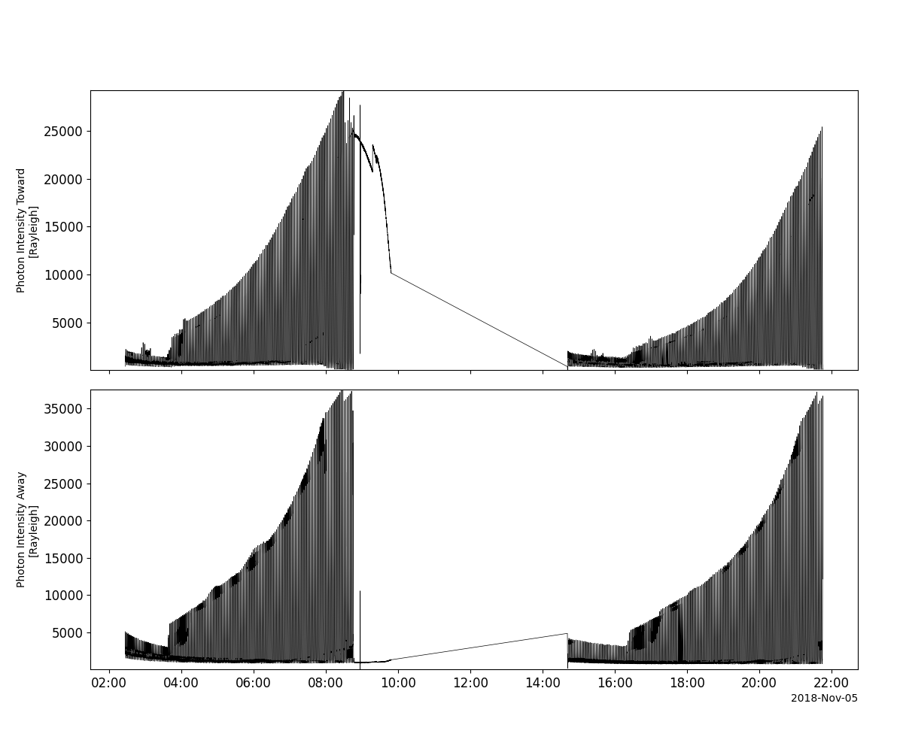
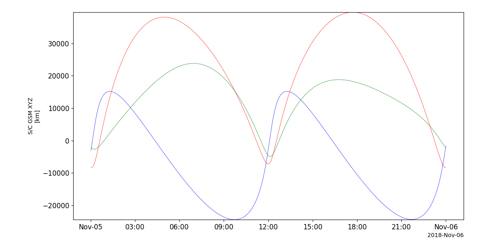

Two Wide-Angle Imaging Neutral-Atom Spectrometers (TWINS) Mission
========================================================================
The routines in this module can be used to load data from the Two Wide-Angle Imaging Neutral-Atom Spectrometers (TWINS) Mission mission.

Energetic Neutral Atom (ENA) imager
----------------------------------------------------------
.. autofunction:: pyspedas.projects.twins.imager

Lyman-alpha Detector (LAD)
----------------------------------------------------------
.. autofunction:: pyspedas.projects.twins.lad

Example
^^^^^^^^^

.. code-block:: python
   
   import pyspedas
   from pyspedas import tplot
   lad_vars = pyspedas.projects.twins.lad(trange=['2018-11-5/6:00', '2018-11-5/6:20'], time_clip=True)
   tplot(['lad1_data', 'lad2_data'])

Ephemeris
----------------------------------------------------------
.. autofunction:: pyspedas.projects.twins.ephemeris

Example
^^^^^^^^^

.. code-block:: python
   
   import pyspedas
   from pyspedas import tplot
   ephem_vars = pyspedas.projects.twins.ephemeris(trange=['2018-11-5', '2018-11-6'])
   tplot('FSCGSM')

